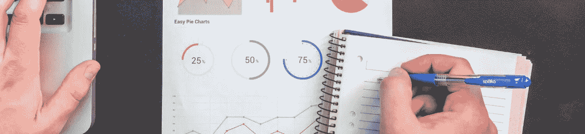
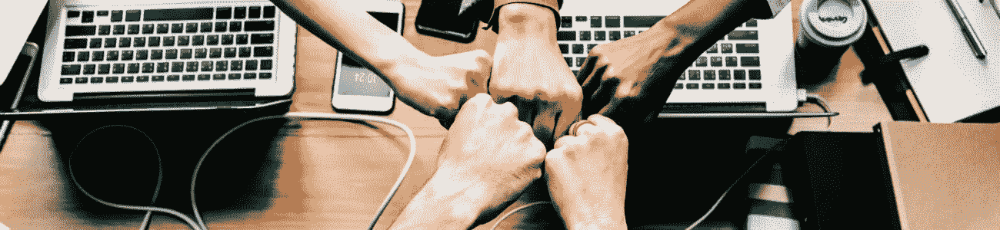
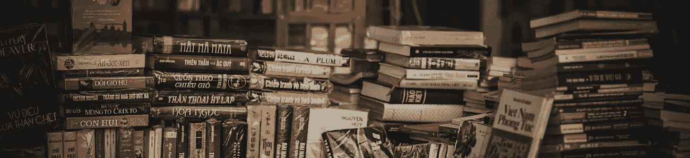

# 成功人士共有的几个习惯

> 原文：<https://medium.datadriveninvestor.com/a-few-habits-that-successful-people-share-51c728e8657d?source=collection_archive---------14----------------------->

## 成功的人可以有不同的分类方式，就看你怎么解读“成功”了。

*最初发表于*[*【millennialmoderator.com】*](http://millennialmoderator.com/a-few-habits-that-successful-people-share)*。*

现在，虽然每个人的成功之旅肯定是不同的，但成功**确实以趋势和模式的形式留下了线索，可以研究和复制。所以让我们来看看大多数成功人士都有的几个习惯。**

# 建立工作关系网

这是迄今为止所有成功人士共有的最重要的习惯。古老的谚语“*你的关系网就是你的净资产*”在所有行业都适用。你的创业需要天使投资人吗？你最好有一些有钱的朋友。努力成为一名[艺术家或音乐家](http://millennialmoderator.com/how-to-create-a-google-knowledge-panel)？与环球电影公司的总裁保持私人关系会有所帮助。

人际关系不是你的强项？别担心，你并不孤单——因为如果你不会交谈，你就不会坐在世界上最伟大的人中间。我这么说并不是要打击你，我是以一种严厉的爱的方式来说的，让你走进这个世界，学会如何社交。许多成功人士，如阿里安娜·赫芬顿和托尼·罗宾斯说，社交时最重要的技能是保持在场和专注于 T21。养成与你周围的每个人交往的习惯，你会对出现的机会感到惊讶。

# 多读书

沃伦·巴菲特曾经说过一句名言:成功的秘诀在于热爱阅读。巴菲特和许多其他成功的领导者一样，每天阅读[3-6 个小时](https://www.cnbc.com/2017/11/15/warren-buffett-and-mark-cuban-agree-reading-is-key-to-success.html)，通常每周阅读 1-2 本书。为什么读书这么重要？用马克·库班的话说——“*大多数人不会投入时间来获得知识优势*”。

缺乏自我完善是阻碍人们取得成功的原因。有一种叫做**无知**的东西，如果你从未[听说过它](http://millennialmoderator.com/what-is-nescience)，这个词可以概括所有我们甚至想都没想过的事情(这不是打字错误)。外面的世界很大，你不可能什么都知道，所以你要尽职尽责，每天学点新东西**。**

****

# **有一个导师**

**这是所有成功人士最常见的细节之一。托尼·罗宾斯有齐格·齐格勒，扎克伯格有史蒂夫·乔布斯，比尔·盖茨有沃伦·巴菲特，卢克有克诺比。导师不仅帮助指导他们的学徒在正确的方向，他们有多年的宝贵经验，加速个人成长就像草坪上的肥料。**

**没有导师？寻找在你的行业或领域中已经成功的人。想办法联系他们，或者通过他们找到比你走得更远的人，并向他们学习。然而，不要觉得有资格拥有一个导师。有句话说得好:*当学生准备好了，老师就会出现*。**

****

# **痴迷地工作**

**我本来打算写这一节关于成功人士如何**冥想**来理清思路，但现实是成功人士很少休息。要想成功，你必须比其他任何人更努力、更聪明。我知道你已经听过很多次了，但是如果是这样的话，那你为什么不去做呢？**

**与其在下班后大吃大喝网飞，为什么不熬夜完成一个项目或者计划个人商业冒险的下一步？埃隆·马斯克是这种不懈努力的一个很好的例子。“如果有办法让我不吃东西，这样我就可以多工作，我就不会吃东西了。我希望有一种不用坐下来吃饭就能获得营养的方法”。马斯克认为，如果你想改变世界，**否定肉体**是你每天必须做出的选择。这个世界是一个高度竞争的地方，而且它继续在所有行业中加大赌注。为了参与游戏，你必须变得更好。**

**这个列表并不详尽，成功人士做的很多事情我们都可以借鉴。还有什么对成功至关重要的东西我忘了包括在内吗？在 [Twitter](https://twitter.com/alekseyweyman) 上告诉我！**

**标签输入:[生活小贴士](http://millennialmoderator.com/a-few-habits-that-successful-people-share#)**

**【millennialmoderator.com】最初发表于**。****