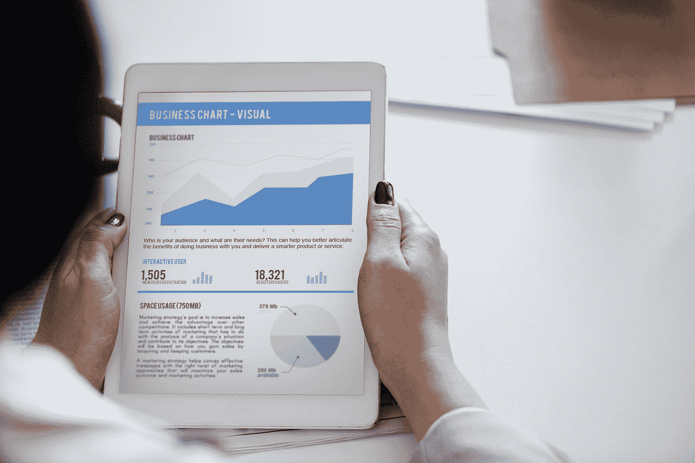

# 简单谈谈周期和长期上涨

> 原文：<https://medium.datadriveninvestor.com/a-few-words-on-cycles-and-the-long-term-upside-66127d8126b?source=collection_archive---------15----------------------->

“woman holding turned on white tablet computrer” by [rawpixel](https://unsplash.com/@rawpixel?utm_source=medium&utm_medium=referral) on [Unsplash](https://unsplash.com?utm_source=medium&utm_medium=referral)

距离我退休后在 LinkedIn 上发表第一篇文章已经整整四年了。今天是我父亲的 85 岁生日。我还是想你，爸爸！你是我一生的灵感来源。我现在的样子，以及我做的每一件事(包括关于我自己的孩子)的动力，仍然是你和妈妈印在我身上的价值观的直接结果。

但现在转到我目前正在思考的，以及我最近能够学到的(仍然是我父母教给我的大部分东西的直接结果)是我们所看到的大部分事物中普遍存在的周期，以及我们如何——如果我们把时间范围设定得足够长的话——通过这些周期看到一个更加光明的未来。

现在我更专注于投资，最近我学会了稍微改变我的参考框架。当被要求说出我的武器库中最能描述我投资竞争优势的单一工具时，我会想到*反向投资。*同样，如果假设我不得不放弃我所有的投资工具，除了一个，我会保持逆向投资的态度。

我最近的思维转变让我把答案简单地转向了一个*长期投资领域。*因此，如果让我放弃投资的所有方面，除了一个，我会保留专注于长期投资的能力。这绝对是迄今为止帮助我成为成功投资者的最大因素。

如果你能够看透经济周期，你就更容易成为反向投资者。也许更重要的是，如果时间跨度足够长，可以从市场的总体上涨趋势中受益，你就能有效地降低股票投资的负面风险。

时间跨度越短，回报的波动性就越高。例如，如果你问我一个月后市场会从今天的水平上涨还是下跌，我完全不知道。如果你给我一个 20 年期的奢侈品，我可以(很有信心，但显然没有把握)回答，它应该上涨，至少名义上应该上涨。这种程度的信心是有实证依据的。

在我的投资库中，最佳单一工具候选人中的第二名是一个并非无关的概念，即低风险厌恶/对未实现损失的痛苦的高门槛。尽管如此，这一特点也得益于长期投资视野，因此我仍然决定将后者作为我自己投资成功的最重要的决定因素。

我过去曾用过“历史不会重演，但会重演”这句老话。我现在要补充的是，历史确实押韵，但有点“高八度”在我看来，历史的教训的确很重要。因此，我最近在历史书上花了更多的时间。然而，我仍然相信，历史的教训也应该放在当代的背景下。

我觉得太多的专家喜欢将当前的情况与过去的一些危机相提并论。本质上不是历史书，但我最近非常喜欢读雷伊·达里奥的《大债务危机》。在这部著作中——这是达利奥在人生的这个阶段尽可能广泛地分享他在非常成功的一生中学到的东西的高尚努力的一部分——雷告诉我们，在过去几十年的债务危机中，确实会出现非常清晰的模式。尽管如此，我们还应该看看当前事件与以往危机中所见有何不同。

就连戴利奥也没有说，我们目前正处于另一场重大债务危机的风口浪尖。他确实谈了很多关于周期的问题(更大的、长期的周期和在更大的周期中发生的更小的周期)。我要补充以下几点。经济有其较短的周期，这是较长的长期周期的一部分，但在一个非常长期的*上升趋势的背景下。*

因此，从长期来看，经济就像股票市场一样，有一个普遍的 T4 增长趋势。这就是我所说的“高八度”因此，我想在我父亲生日那天以积极的方式结束这篇文章。无论遇到什么样的挫折，从长远来看，未来总会比以往任何时候都好。