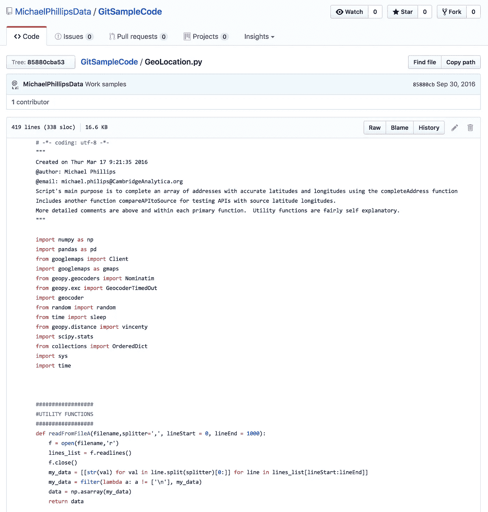
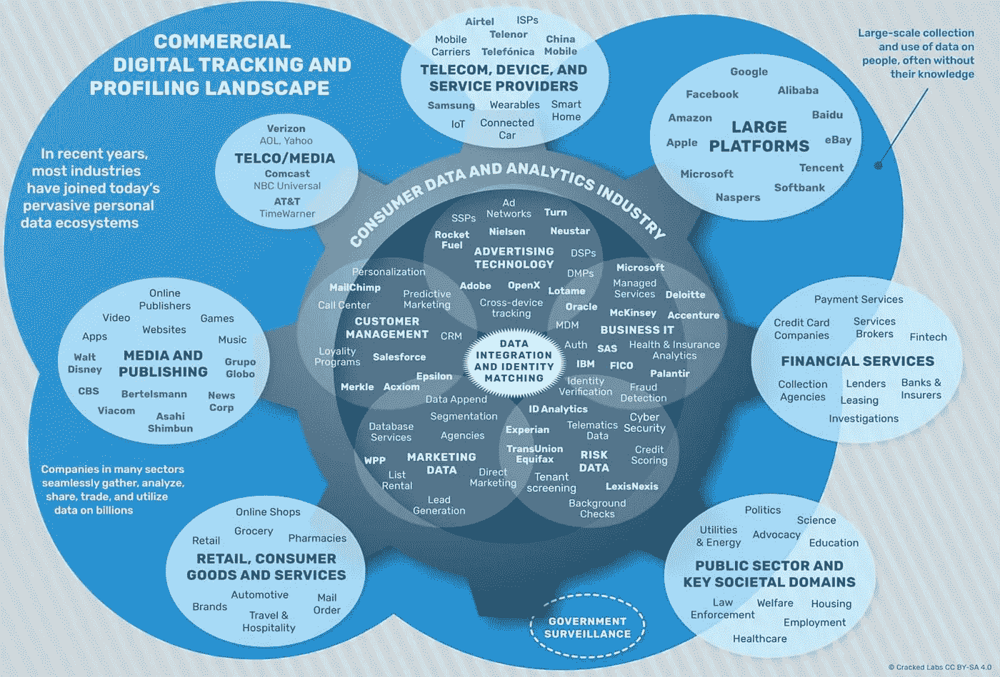
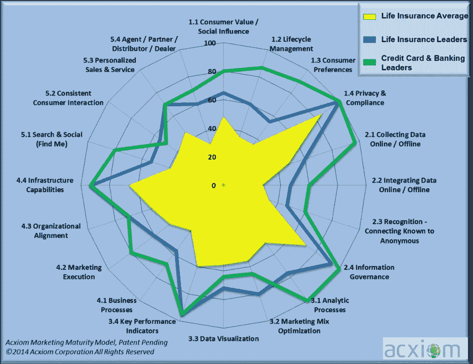
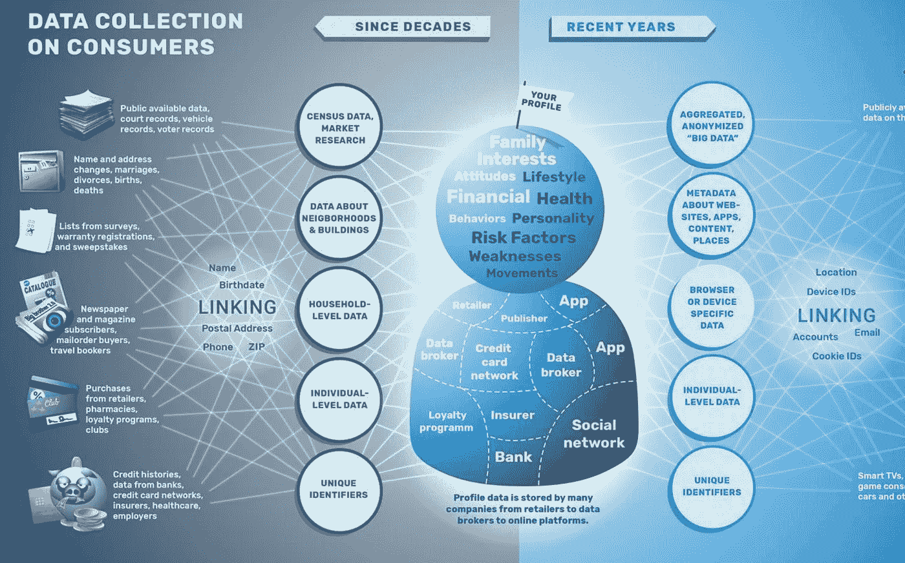

# 保护数字身份和数据收集的框架

> 原文：<https://medium.datadriveninvestor.com/a-framework-to-protect-digital-identity-and-data-harvesting-f895ff54b6cd?source=collection_archive---------0----------------------->

近十年来，大数据在零售业、制造业、银行业、电信业和在线零售业中崭露头角。企业意识到他们所坐拥的数据金矿，产品的购买信息记录和交易提供了关于为社交媒体营销活动创造*宣传*的见解，并提高了客户服务质量，增加了更多受众，提高了他们目前在行业中的企业排名。大数据提供了处理数万亿个数据点的能力，为定性和定量研究提供了重要的信息，从而通过针对消费者做出明智的决策和智能的产品发布决策。剽窃企业创意和窃取个人发明和设计并非始于大数据。1890 年，当特斯拉为无线电通信做以相同频率传输信息的原型时，他没有预料到另一个发明家会追求同样的想法。他在 1900 年注册了专利。年轻的发明家马可尼试图注册一项类似的专利。然而，直到 1904 年，专利局一直拒绝马可尼的发明。随着特斯拉的实验室被大火烧毁，他的大部分科学发现和研究论文丢失，这些专利在后来的几年里被归还给了特斯拉。随着大数据的出现，企业领域的抄袭行为已经进入了一个默默无闻的阶段。

剑桥分析公司收集了 2.2 亿美国人的大约 5000 个数据点，以建立心理分析，并瞄准特定的受众群体。Cambridge Analytica 的一些 Github 代码库显示 Python 代码执行数据挖掘和地理空间分析来构造多个属性。剑桥分析公司声称使用海洋方法论来理解人格特质。亚历山大·科岗教授表示，利用来自脸书的大数据是为了学术研究目的。由 Cambridge Analytica 开发的应用程序仅收集了参与一项测验的 27 万人的数据。然而，这一数据挖掘的最大争议来自脸书的朋友网络的 27 万人中的一部分，他们不同意向剑桥分析公司提供数据。这项研究的前沿研究员凯文·格兰维尔(Kevin Granville)表示，这些数据是从脸书网络的 5000 万份原始资料中收集的，这些资料是 27 万人的朋友，他们最初同意通过机器学习、图表数据、关联数据和数据挖掘技术提供这些信息。

在社交媒体的世界里，一切都是开放的，你可能会收到一个不知名的脸书朋友的请求或者一个 LinkedIn 连接。2017 年 2 月和 3 月的某个时候，我有过一次个人经历，在我在 Twitter 上发布之前，我曾经发布过一些关于脸书的研究文章。在我公布数据之前，这些数据奇迹般地在 Twitter 上重现。我没有同意任何朋友将数据从脸书转移到 Twitter 或任何其他数据中介机构。然而，我想，这是一个朋友的恶作剧。然而，是一个跟踪者在一年多的时间里不断跟踪我，利用我的数据实现数据货币化。仅仅因为这些数据在脸书是公开的，这并不意味着有人可以通过提供给其他人用于超个性化和数据货币化的目的来获取数据，从而实现商业化。此外，使用脸书数据也有一些风险，例如 a)创建您的数字身份的伪年龄，并用伪造的年龄信息向受众进行宣传 b)收集数据以领先于您的数据科学家同事，从而在社交媒体中获得更多的人气和排名 c)这种类型的数据收集是剽窃您的想法和创新思想的非常隐蔽的方式 d) 脸书的一些看起来聪明的朋友仍然盲目地听从数据经纪人的指示，他们挖掘了我的数据，包括登录和注销的时间戳、地理位置、活动、脸书上的帖子、脸书的文本以及脸书的研究文章，以帮助人们在 Twitter 上获得受欢迎程度。e)我在脸书发布的与设计工程相关的帖子导致一些人一夜之间重新设计了他们的网站和徽标，与我在脸书发布的帖子非常相似。 这些帖子仍然保留在我的脸书日程表上。除此之外，指导我的朋友的人也开始为我的每条推文发送一两个工作，从而导致这些数据经纪人每天都有大量的工作。从 2017 年 2 月到 2018 年 5 月，这些人花费了大约 2016 个小时(一个月 21 天 x 每天 8 个小时 x 12 个月)，他们在全年的某个时候与各种招聘公司协调给我发送工作，并且他们每天都继续发送这些工作。显然，他们目前无法访问我的脸书数据，因为我不经常发帖或登录。现在，我把推文发到脸书，而不是从脸书发到推特上。为了在社交媒体上获得受欢迎程度排名，他们收集了我的数据，这通过超个性化活动为他们带来了额外的收入流。我就是看不出专利小偷和专利巨魔有什么区别。如果你已经是财富 500 强企业和发明家；从别人那里窃取一个想法，你还能得到什么？你只会偷，因为你缺乏专业知识。

使用网络安全工具可能无法停止数据收集。这表明，在你的发明、科学发现或想法在专利局注册之前，不要在脸书上发布，以避免数据被他人获取和挖掘。

Figure 1\. Adapted from Michael Phillips, Cambridge Analytica Github repository.

这是 2013 年 2 月 25 日我与加州大学欧文分校发表的研究论文的扩展版。位于阿肯色州的 Acxiom 公司正在解构和重建政府数据库中的个人数据。它为企业提供消费者定性研究数据，2011 年销售额达 11.3 亿美元，2011 年利润超过 7700 万美元。Acxiom 维护着超过 1.2 亿个美国家庭的 7500 亿条消费者大数据和大约 1500 个事实(全球约 5 亿)。《财富》100 强公司中大约有 47 家公司是 Acxiom 的直接客户，他们获取消费者研究数据，这些数据可用作 Acxiom 多个数据中心托管的定性原始数据。

Acxiom 收集的数据主要来自 a)政府记录和公共记录 b)自我报告的数据 c)来自商业实体的数据 d)车辆识别号。Acxiom 在全球范围内收集与消费者生活方式选择和产品购买决策相关的信息。Acxiom 通过问卷调查或购买杂志订阅从任何注册在线服务的消费者那里收集此类大数据。Acxiom 收集了 3.75 亿消费者的数据，这些数据分为 12000 多个营销活动和每月 150000 次背景调查，并通过在美国的调查处理了 17%的邮件。Acxiom 迅速将市场扩展到全球 60 个国家。

Acxiom 通过将传统市场研究与客户情报数据相结合的首款解决方案，将大数据转化为可操作的见解，从而为企业提供关于谁是最佳客户、基于消费者行为的下一次合理购买以及下一次销售机会的数据。Acxiom 从全球领先的公司收集大数据，包括 15 家信用卡发行商中的 12 家、15 家零售银行公司中的 12 家、10 家最大零售商中的 7 家、10 家汽车制造商中的 9 家、8 家最大经纪公司中的 6 家、3 家最大制药商、2 家最大人寿/健康保险提供商以及 10 家最大财产和意外伤害保险公司中的 8 家。

Figure 2\. Adapted from Acxiom Commercial digital tracking and digital identity tracking.

Figure 3\. Adapted from Acxiom Maturity Model.

Figure 4\. Adapted from Acxiom data collection on consumers

参考

亚当斯，b .，克拉克，a .，&克雷文，J. (2018)。它是免费的，并将永远是免费的——用个人信息和隐私来换取在线服务的便利。2018 年 5 月 5 日检索，来自[https://arxiv.org/abs/1804.08491](https://arxiv.org/abs/1804.08491)

剑桥分析(2018)。我们理解数据。检索自[https://web . archive . org/web/20160216023554/https://cambridgeanalytica . org/about](https://web.archive.org/web/20160216023554/https://cambridgeanalytica.org/about)

Christl，w .，Kopp，k .，& Riechert，P. U. (2017)。破解实验室的报告。2018 . 5 . 5 检索自[http://cracked labs . org/dl/cracked labs _ Christl _ corporate surveillance . pdf](http://crackedlabs.org/dl/CrackedLabs_Christl_CorporateSurveillance.pdf)

j . condliffe(2012 年)。知道你一切的匿名组织。检索于 2013 年 2 月 21 日，来自[https://gizmodo . com/5919498/那个知道你一切的匿名组织](https://gizmodo.com/5919498/the-faceless-organization-that-knows-everything-about-you)

加州哈尔金斯(2008 年)。特斯拉、马可尼和伟大的无线电争议:在不打击被告创新动机的情况下判给专利损害赔偿金。检索自[https://www . research gate . net/publication/228719424 _ Tesla _ Marconi _ and _ the _ Great _ Radio _ contention _ Awarding _ Patent _ Damages _ Without _ Chilling _ a _ Defendant % 27s _ Incentive _ to _ innovation](https://www.researchgate.net/publication/228719424_Tesla_Marconi_and_the_Great_Radio_Controversy_Awarding_Patent_Damages_Without_Chilling_a_Defendant%27s_Incentive_to_Innovate)

马纳特，S. (2014 年)。技术采用推动寿险业务转型。来自 Acxiom 成熟度模型的见解。2018 年 5 月 5 日检索自[https://www . acxiom . com/blog/technology-adoption-driving-business-transformation-life-insights-acxiom-maturity-model/](https://www.acxiom.com/blog/technology-adoption-driving-business-transformation-life-insurance-insights-acxiom-maturity-model/)

菲利普斯，M. (2016)。地理定位。从 http://archive.is/pR9pj[取回](http://archive.is/pR9pj)