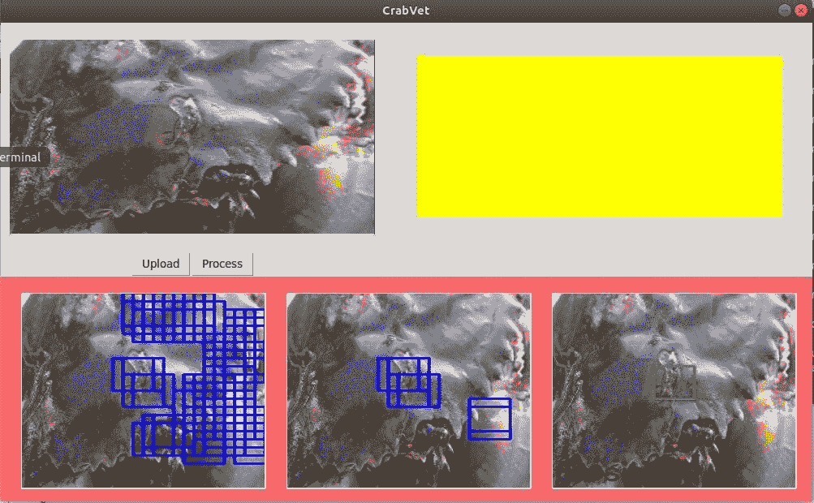

# 从初学者的角度看人工智能投资的范式转变

> 原文：<https://medium.datadriveninvestor.com/a-fresh-grads-perspective-about-a-paradigm-shift-on-ai-investment-5df2e2d623c1?source=collection_archive---------4----------------------->

哈利·戴维森·雷加

透过创新者的视角看现实的表面，就是更接近未来——探索进步的必然性，紧紧抓住借助技术解决世界问题。在这一代，我们正朝着数字和高科技系统创新的方向发展。做到这一点的先决条件是拥抱人工智能领域，并接受这一事实，即它是一个组织竞争力的重要工具(微软和 IDC 调查的商业领袖一致同意的 T2)。)

人工智能源于古典思想家的观点，即人类的认知过程既可以复制，也可以机械化。随着历史的每一次新的发展，以前被认为不可信的想法现在都变成了现实。AI 不是最近刚进入均衡的短语，也是有既定结论的 not 阶段。

 [## 值得购买的 4 大人工智能股票及其原因|数据驱动型投资者

### 人工智能(AI)在 2019 年继续进入大众意识。通过应用程序…

www.datadriveninvestor.com](https://www.datadriveninvestor.com/2019/03/06/top-4-artificial-intelligence-stocks-to-buy-and-why/) 

在人工智能无限的创新和发现之外，还有无限的不确定性。人工智能社区处于不断研究和发展的状态。2017 年，一些组织对自动化的需求已经开始上升。随着深度学习的发展，人工智能已经走向光明的未来。但在最近的发展中，*是否有机会给那些对技术创新充满激情的* ***应届毕业生？***

将人工智能进步融入市场的趋势引发了雇主和雇员之间的两难境地。一方面，雇主需要有相关经验的有能力的个人，他们将利用最近的人工智能创新来帮助改善他们的业务。另一方面是那些尚未获得该领域相关经验的应届毕业生。

我最近获得了计算机科学学士学位，很荣幸目前在 [Monstar Lab](https://www.monstarlab.ph/) 的 AI 开发团队工作。作为一个初学者，我可以证明，激情是不够的，大学教育的能力将会缺乏。我想让我得到这份工作的原因是我倾向于超越自己的舒适区。一个例子是当我和我的团队写我们的本科研究时。它的灵感来自当前计算机视觉的进步，重点是最先进的深度学习。

我们的研究专注于为**泥蟹锈斑病检测**创建深度学习模型。在没有太多机器学习和计算机视觉知识和基础的情况下，我们从零开始建立我们的研究——从培训、对所用技术的熟悉到查阅相关文献。

**Mud crab rust-spot disease detection**

在人工智能领域进行研究不是开玩笑，尤其是当你开始学习与之相关的技术时。幸运的是，在我们开始研究的那个学期，我们系开设了一门计算机视觉课程，帮助我们继续并及时完成了我们的研究。本课程还讨论了计算机视觉的基础和当前趋势。

正如我前面所说的，我想我们的研究给了我目前从事人工智能开发工作的入场券。理解人工智能的理论很重要。*但是，如果人工智能理论不在他们的学校教授，应届毕业生怎么可能足够博学？*

使我们在人工智能领域有市场的东西超越了我们作为程序员、软件工程师和计算机科学家的能力。基础必不可少。投资人工智能意味着投资重新提高人的技能。开设科技课程的大学也必须对当前的市场需求做出反应。

我在人工智能领域获得一份工作的小小成功并不意味着本科生需要做的就是超越他们的舒适区，进行一项人工智能相关的研究。虽然这样做真的很重要，但它不能像在学校里了解它的基础和理论那样保证在人工智能领域找到工作。如果我们能制造出能与人类思维相媲美的智能机器，为什么不能让未来的技术工人掌握人工智能当前趋势的知识呢？

立即获得您的**免费机器人流程自动化**工具！
[下载这里](https://www.raxsuite.com/freedownload?utm_source=Medium%20Post&utm_medium=medium&utm_campaign=medium_footer)

参考资料:

 [## AI、机器学习、深度学习的区别？NVIDIA 博客

### 这是由长期技术记者解释深度学习基础的多部分系列的第一部分…

blogs.nvidia.com](https://blogs.nvidia.com/blog/2016/07/29/whats-difference-artificial-intelligence-machine-learning-deep-learning-ai/)  [## 人工智能的完整历史

### 对于不精通的人来说，人工智能的历史可能感觉像是一个密集而难以理解的主题…

learn.g2.com](https://learn.g2.com/history-of-artificial-intelligence#ai-8)