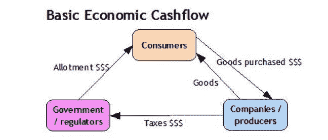

# 一个全自动的经济-它如何运作？

> 原文：<https://medium.datadriveninvestor.com/a-fully-automated-economy-how-can-it-work-382d9fce90c5?source=collection_archive---------2----------------------->

想象一下，我们正在经历一个破坏性的转变，从一个需要工作来谋生的经济体转变为一个不需要工作来谋生的经济体。这很难想象，因为在北美；自殖民时代以来，我们从未遇到过这种情况。早在殖民时代，大多数人是农民，家庭必须建造自己的家园。邻居们互相交换，并与最近的城镇交换他们所拥有的东西，以获得他们需要的其他东西。那些日子很艰难，在北美建立的供应链很少。我们不想回到那个时代，但我们可以向我们的祖先学习，为即将到来的事情做好准备。

毫不奇怪，在这个自动化有可能取代所有员工的时代，我们担心当自动化将接管大多数工作时，我们如何仍能作为一个社会运转。幸运的是，威胁我们生计的同样的系统可以把我们带到文明的黄金时代，在那里人们过着自由、幸福的生活，不用担心生存问题。我在今年早些时候发表的一篇文章中谈到了工作的未来。简而言之，就本文的目的而言，我将得出结论:在未来 20 年内，将不会有足够的就业需求来维持就业税收型经济。

 [## 不管准备好了没有，革命就在我们面前|数据驱动的投资者

### “对于技术如何影响我们的生活和重塑经济，我们必须形成全面的全球共识……

www.datadriveninvestor.com](https://www.datadriveninvestor.com/2019/02/12/ready-or-not-the-revolution-is-upon-us/) 

我们需要将我们的经济转变为一个符合我们的愿望和现有技术的经济。

因此，我们需要一个新的经济概念，在这个概念中，人们忙于自己的生活，只有很少的时间(如果有的话)用于谋生。在不久的将来，机器可以比任何人类更好地生产和管理生产。他们可以生产我们生活所需的所有商品和服务，甚至更多，而不需要一个人的参与。然后，他们会变得更好。[人工智能](https://www.datadriveninvestor.com/glossary/artificial-intelligence/) ( [AI](https://www.datadriveninvestor.com/glossary/artificial-intelligence/) )和智能软件在收集、分析和合成大型数据集方面比任何人类都要优秀。我们只擅长消费。

我们将很快被人工智能机器和机器人远远超过，无法创造我们需要的基本商品，我们将成为生产力的障碍。为了优化生产率，我们将使整个供应链自动化。转变已经开始了。我们在经济中的角色将只转向消费。我们有供应链的原因是为了确保我们有效地将自然资源转化为消费品。

在接下来的 20-30 年里，自动化将影响每一个行业，包括创意行业。人工智能将完成我们通常付钱给人类去做的所有任务。这并不意味着人类不会再为金钱而工作。对人类提供的服务总会有需求，只要有需求，自由市场就会出现供应和竞争。在一个完美的未来经济中，人们提供服务不是因为他们需要这样做来生存，而是因为他们喜欢这样做。我敢肯定，如果人们喜欢做某些事情来满足需求，没有人会妨碍他们。因此，工作将成为一种选择，而不是必需品。

# 先有鸡还是先有蛋？

想象这个世界里，机器高效地完成所有不必要的工作，我们面临的最大问题是谁拥有这些机器。如果大多数人不工作挣钱，人们将如何支付商品？

我们可以想象公司和政府将拥有我们所依赖的自动化供应链。他们将要求对他们提供的产品和服务以及他们为使其正常工作而建立的基础设施进行补偿。同样，如果我们不挣钱，我们怎么能买东西呢？如果我们不花钱，为什么公司首先要建立自动化供应链？

要解决先有鸡还是先有蛋的困境，我们需要问一个更基本的问题:为什么我们认为工作是获得交易资金的唯一途径？

我们没有。然而，为了保持平衡和公平，金钱仍然是一个有价值的工具。但是我们怎么有钱买东西呢？

最简单的答案是除了工作什么都行。

令人欣慰的是，经济中还有其他获得现金流的方式。我们现在需要决定的是如何公平地分配生产出来的产品。公司会想要补偿，即使他们可能不再有员工。所有者希望看到利润，他们想把他们收到的任何钱花掉，作为让我们的生活变得更轻松的奖励。

如果人们有钱花，他们就会花掉，钱就会像现在一样在经济中流动。如果我们的人口有钱消费，只有这样他们才能购买他们需要的东西。

# 基于消费者的经济如何运作？

一个破碎的经济体系的伟大之处在于，我们可以决定修复它的最佳方式。

因此，大多数人需要工作的经济在我们的未来是不存在的。既然努力工作不再是我们生存和繁荣的回报，我们可以选择什么是回报。

我们可以选择根据我们作为一个国家将从地球上开采的自然资源数量(国内开采和进口开采资源的总和)向一个人口提供资金。我们可以计算所有消费对环境的影响，并因此给这个国家的公民足够的钱来避免越过那个临界点。给每个人的钱可以根据年龄、特殊需要和我们认为合适的任何其他方式而变化。我们从历史中知道，预防问题比事后试图解决问题花费的资源更少，所以我们可以制定一个计划，通过给每个人他们需要的东西来尽量减少问题。反过来，公民将花这笔钱购买他们所需要的东西，最多不超过分配的数量。自由市场中的公司将像现在一样竞争、创新和发展，利用自动化作为劳动力，相互竞争分配的资金。因此，世界将继续在多个方面进行改进，包括生产效率、环境足迹等，以获取有限的流通资金。这与我们今天的经济状况没有太大的不同。

随着公司改进其流程并能更有效地转化自然资源，公民可以用可用资金做更多事情。或许，中央政府在计算分配量时，会根据私营部门的生产率状况增加或减少分配量。

既然我们希望这笔钱成为一个循环的一部分，它必须来自某个地方。不仅仅是每年印刷。如果这种经济的基础是出于对地球资源的关注，那么这些钱来自于从那些提取、转化和分配我们消费的商品的公司那里征收的税收，我们将这些税收公平地重新分配给人们，这样他们就可以把钱花回来。请记住，在我们的场景中，这些公司没有员工可言，因此，少量的利润就能满足少数负责人的需求。公司支出不包括工资，在大多数行业，工资占所有业务成本的 80%以上。

另一个想法是宣布国家人口是国家所有土地的集体所有者。在这种情况下，个人和公司需要从居民手中租用土地(由政府部门管理),并获得租金收入，用于经济发展。就我个人而言，我喜欢第二种选择，因为它让人们对公司和个人如何使用土地有发言权，从而规范什么是好的使用或不好的使用。

无论我们最终选择哪种模式，人们自然会先用他们拥有的数量购买他们需要的东西，然后用剩下的购买奢侈品。作为一个集体，我们还可以在保持环境健康的同时，就我们希望消耗多少自然资源达成一致。

如果人们想提供服务以赚取更多的钱来购买更多的东西，他们仍然可以这样做，玩供求游戏，就像我们今天做的一样。这将是主要现金流系统之上的纯粹交易。一个人付给另一个人的额外报酬。这将是主供应链之外的另一层贸易，也将与主供应链整合在一起。

这将是一个简单的任务，将一个免费的基本医疗保健和教育系统纳入这一模式，以及可选的私人服务的人口。

我们需要做的是决定什么是最重要的。为了工作而工作？或者最重要的事情是确保人们的基本需求得到满足，我们所有人无一例外，并确保经济支持这一点？

我们可以消除无家可归、贫困和强迫劳动。它需要重组，鼓励自动化，改变赋予人类生存权利的标准。

我想我们大多数人都会同意，我们希望每个人的基本需求都得到满足。

挑战在于，在以就业为中心的经济因自动化中断而崩溃之前，就下一步该做什么达成共识。我准备好尽我的一份力量了。是吗？

Sylvain 是一位国际主题演讲人、未来学家、企业家，也是非虚构书籍《工程天堂:你准备好了吗？。作为一名企业家，他与来自世界各地的多个合作伙伴一起支持和经营娱乐技术、数字媒体和国际基础设施融资业务。他拥有加拿大渥太华大学的生物化学、化学工程和教育学士学位，从高中到大学教了 20 多年书，公开演讲超过 12 年。此外，他目前是世界未来协会的代表，加拿大大众传播研究所的负责人，也是蔻驰认证的企业家培训师。他现在热衷于通过文章、其他出版物和其他媒体格式(如视频和播客)撰写和讲述人工智能将如何彻底改变我们的社会和经济。

*原载于 2019 年 7 月 20 日*[*【https://www.datadriveninvestor.com】*](https://www.datadriveninvestor.com/2019/07/20/a-fully-automated-economy-how-can-it-work/)*。*