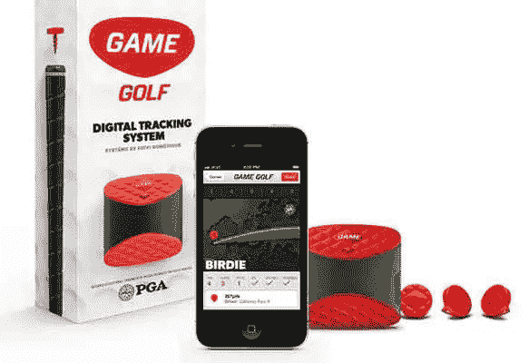

# 改变游戏规则的人

> 原文：<https://medium.datadriveninvestor.com/a-game-changer-6783581d21ab?source=collection_archive---------20----------------------->

在高尔夫球运动中，知道何时使用 8 号铁杆或 3 号木杆可能是一杆进洞和降落在沙坑中的区别。

一个名为 [Game Golf](https://www.amazon.com/Game-Digital-Tracking-System-Black/dp/B00JDZWQZK) 的“数字跟踪系统”有望帮助球员做出明智的决定，并有望在此过程中改善他们的差点。

使用 GPS 跟踪，Game Golf 计算每次击球的准确距离，记录一个人的球杆选择，以及球杆在球场上的使用位置。

为什么通过高尔夫球手插入每个球杆顶部的小塑料盘和夹在腰带上的包含 GPS 和芯片记录器的小设备之间的通信。

每次击球前，球员用球杆手柄轻击盒子，盒子上记录了位置和球杆选择。Game Golf 随后会建立一个该轮比赛的数据库，然后将其转换为记分卡、统计图和图表。

这些数据可以与其他高尔夫球员以及脸书和推特上的朋友分享。沮丧的高尔夫球手可以花 249 美元买下它。

***这篇文章最早发表在 2014 年的《金融家》上。***