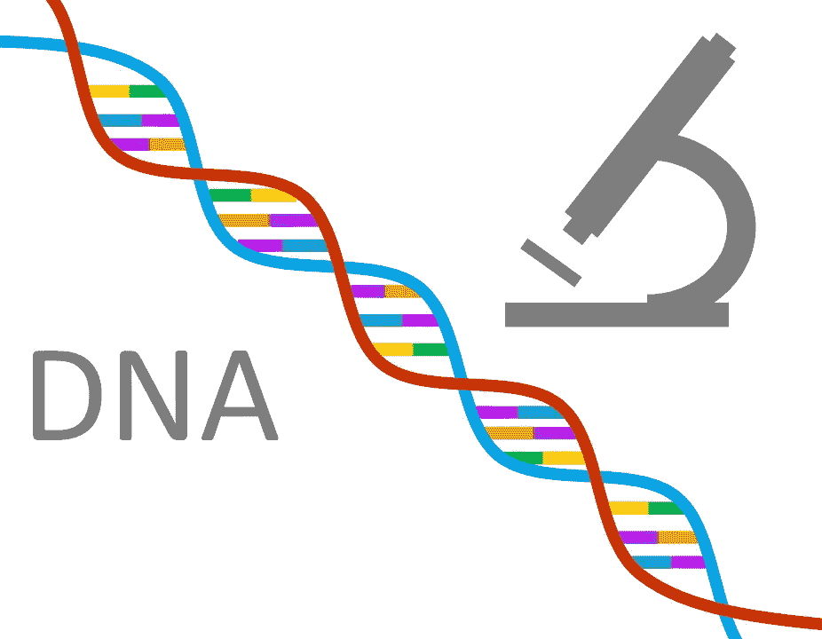
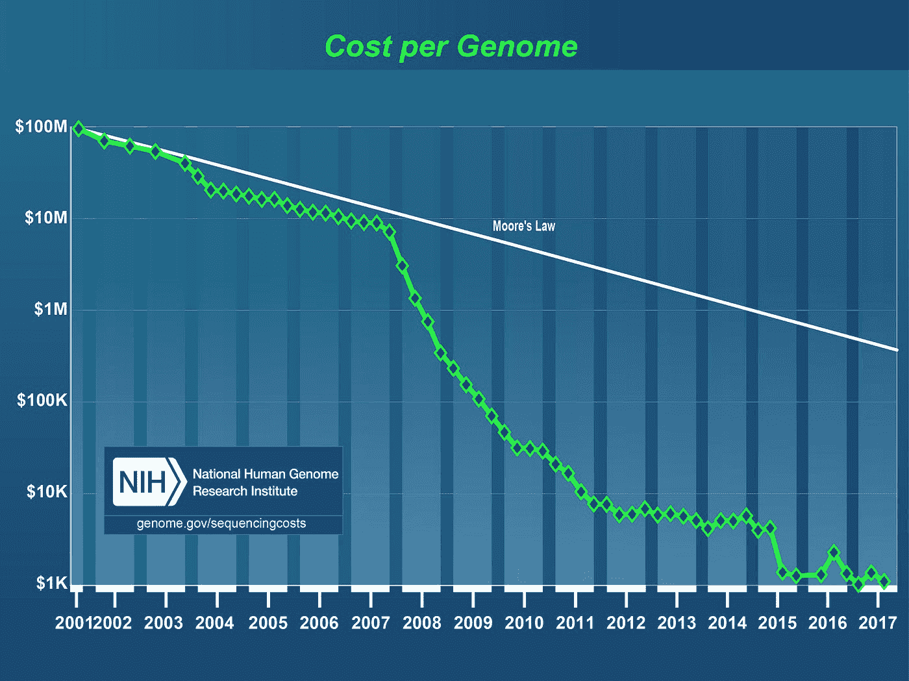
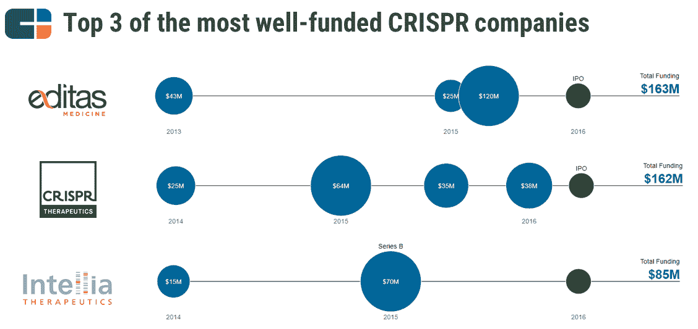

# 基因的游戏——创业公司如何推进遗传学的前沿

> 原文：<https://medium.datadriveninvestor.com/a-game-of-genes-how-startups-are-pushing-the-frontier-of-genetics-401282866718?source=collection_archive---------17----------------------->

遗传学是目前尚未探索的主要前沿领域之一，有大量正在进行的工作，前面还有很多工作要做。这篇文章将试图简明扼要地阐明在这个蓬勃发展的领域创业的三个主要趋势。

**1)成本**

众所周知，基因组测序的成本下降速度甚至超过了摩尔定律:

显而易见的好处是——我们可以越来越多地从测序(遗传学)转向真正理解基因编码(基因组学和所有相关的组学，如蛋白质组学和微生物组学)。

**2)90–10 市场**

我们在许多领域看到 90-10 个市场——在搜索领域是谷歌和必应，在叫车软件领域是优步和 Lyft。遗传学似乎在宏观和微观上都遵循着相似的模式。在全球层面上，美国和中国现在占据了 90%的市场份额。

在美国，Illumina 是一家独立公司的光辉典范，它破解了围绕遗传学的商业模式。2017 年 27.5 亿美元收入的大部分是销售各种高通量 DNA 测序仪。该公司于 2000 年上市，进行了多次收购——最著名的是 Spyder、Solexa 和 Epicenter——使其拥有强大的产品组合，并在 2012 年拒绝了罗氏对其估值为 570 亿美元的收购企图(其目前的市值是其 10 倍)。问题依然存在——怎样才能打破这种主导地位？

在中国，可以说中国的 BGI 正在试图复制它。它们于 2017 年上市，当年实现营收 3.1 亿美元，如今市值略高于 50 亿美元。它的大竞争对手 Berry Genomics 进行了反向合并，目前规模小 10 倍，再次成为 90-10 市场。政府的大力支持和基因数据隐私的较低门槛确实意味着，在这些成功故事之后，中国总体上正在经历一场创业热潮。

就美国初创公司而言，我们看到了类似的融资故事，有两家公司利用了大部分资金。Illumina spinout GRAIL 在产品方面仍然是一个开放的问题，但他们肯定已经筹集了足够多的资金来维持一段时间，有 16 亿美元的风险投资资金。美国遗传学创业公司中的另一只独角兽是 23AndMe，它总共筹集了 7.92 亿美元。

**3)商业模式的具体进展**

卖给人们一个没有能力治疗的诊断是一个灾难的处方。这就是为什么很少有基因公司能够单独利用测试。Color 专注于 BRCA 癌症，特别是 2017 年花费 149 美元的家庭测试。Counsyl 检测罕见疾病，因此夫妇在寻求怀孕时可以有更明智的选择。但是这些例外确实证明了这个规律——如果没有某种形式的干预(基因编辑、治疗等),诊断公司就无法大规模成功。围绕 CRISPR 和 CAR-T 等技术的快速发展是一个领先指标。

另一个经常被谈论的选择是关于数据。鉴于我们对基因测序之外的事情知之甚少，这无疑是一个成熟的研究领域，甚至可能是短期内的临床应用案例。例如，DNANexus 提供基因数据的云管理和分析。他们有太多的竞争对手，从像谷歌(Google Genomics)这样的大公司到像 Seven Bridges 这样的初创公司。新进入者可能能够通过提供更多特定领域的工具，赢得已经拥有技术规模优势的现有者。

这些是专注于实践见解的短文(我称之为 GL；dr —良好的长度；确实读过)。如果它们能让人们对某个话题产生足够的兴趣，从而进行更深入的探索，我会感到非常兴奋。我在三星的创新部门 [*NEXT*](http://samsungnext.com/) *工作，专注于深度科技领域软件和服务的早期风险投资，这里表达的所有观点都是我自己的。*