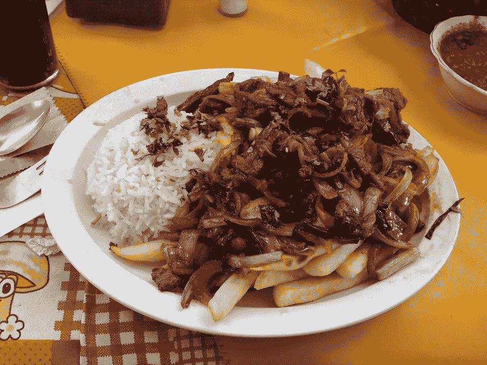

# 美食革命:烹饪如何成为秘鲁最大的国际出口？

> 原文：<https://medium.datadriveninvestor.com/a-gastronomic-revolution-how-cuisine-has-become-perus-biggest-international-export-5990f0c65ce?source=collection_archive---------6----------------------->

在过去十年中，秘鲁政府战略性地将秘鲁美食置于其社会的核心，使其成为人民的骄傲。以及在国际上将其作为一种独特的美食进行营销，这种美食具有感官风味，能够满足最敏感的味蕾。这是后起之秀；从美食到外卖，它正迅速成为世界各地许多餐馆老板和企业家的美食。

利马本身已经成为一个美食之都，与纽约、伦敦和巴黎等城市竞争。它是世界著名餐厅 Astrid & Gaston 的所在地。专注于驱逐当前安第斯山脉和土著美食的标签，他们努力重新定义土著美食可以带到餐桌上的概念。他们一直被评为世界十大餐厅之一，并将拉丁美洲，尤其是秘鲁，放在了全球美食地图上。拥有自己的传统，拒绝当今以欧洲为中心的美食餐饮业，引领了秘鲁美食和秘鲁美食旅游的发展。

随着对美食态度的积极转变，秘鲁人普遍认为美食是社会变革的一种手段。美食已经成为年轻人的一个鼓舞和激励因素，许多人渴望成为厨师。像维尔吉利奥·马丁内斯这样的烹饪先驱已经成为年轻人和大众的英雄。秘鲁人所表现出的热情以及他们让食物成为他们民族身份一部分的开放态度是非同寻常的。这与游客接受秘鲁美食异国魅力的程度相结合，已被证明是一个赚钱的机会；秘鲁的美食旅游业估计价值 50 亿美元。这个行业确实有它的障碍；初露头角的餐馆老板面临着缺乏前台员工的问题，但这并没有阻止秘鲁美食业的发展。

未来几年，秘鲁的年均 GDP 增长率预计在 4%左右，是拉美增长最快的经济体之一(根据世界银行的数据，秘鲁很快将成为该地区增长第二快的经济体，仅次于巴拉圭)。秘鲁的商业领袖们正在利用这一进步，随着国内生产总值的高速增长和外国投资的增加，生活水平正在提高，贫困率和失业率的下降起到了巨大的帮助作用。在过去十年左右的时间里，秘鲁调整了其 T2 的经济结构和政策，使其更加以商业为中心。由于有利于采矿的法律和税收制度，大多数外国投资被蓬勃发展的采矿业所吸引。秘鲁是全球第三大铜和锌生产国，也是黄金和白银生产大国；这些自然资源构成了该国出口的大部分。中小型公司也为国家的出口经济做出了贡献，越来越多的组织向国外提供他们的产品；他们占所有出口组织的 82%。尽管[从秘鲁](https://www.bizlatinhub.com/international-trade-peru-import-export-permits-taxes/)进口和出口仍然具有挑战性，这取决于公司的贸易需求程度，但这部分经济正在蓬勃发展。

对服务业的高度重视，尤其是金融和电信行业，为这个国家的成功做出了贡献。以及旅游业的急剧增长，秘鲁每年接待大约 400 万游客。这些游客中有很大一部分来到秘鲁寻求神秘的美食体验。秘鲁美食的未来非常乐观，秘鲁和世界各地对秘鲁美食体验的需求不断增长，这将确保该行业持续增长。

尽管采取了所有这些积极措施，但国际企业在秘鲁开展业务仍有困难。例如，开办一家高级餐厅可能需要数年时间，这是一个及时且非常复杂的过程。聘请像 Biz Latin Hub 这样的本地专家可能是最好的选择。前进的道路上可能会有一些障碍，首先是完成[秘鲁公司的组建过程](https://www.bizlatinhub.com/company-formation/)。但是，有一个当地的合作伙伴将确保你完全遵守当地有关公司成立的法规和法律。