# 朴素贝叶斯分类器简介

> 原文：<https://medium.datadriveninvestor.com/a-gentle-introduction-to-naive-bayes-classifier-9d7c4256c999?source=collection_archive---------0----------------------->

## 理解朴素贝叶斯分类器的基本概念


Source : Scienceprog.com

在本文中，我们将讨论与**朴素贝叶斯分类器**相关的几件事情，包括:
1。朴素贝叶斯简介。
2。朴素贝叶斯出自**之手**。
3。朴素贝叶斯与 **Scikit-Learn。**

# 1.朴素贝叶斯简介。

朴素贝叶斯分类器是机器学习中的**分类**算法，包含在**监督学习**中。这种算法在自然语言处理或自然语言处理中非常流行。该算法基于托马斯·贝叶斯创立的**贝叶斯定理**。因此，在使用朴素贝叶斯分类器之前，我们必须先了解贝叶斯定理。

> 贝叶斯定理的本质是**条件概率**其中条件概率是在其他事情已经发生的情况下，某件事情将会发生的概率。通过使用条件概率，我们可以在已知前一事件的情况下找出该事件发生的概率。

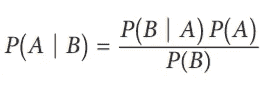

Bayes Theorem

*   P(A|B) = **后验概率，**给定 B 值的概率
*   P (B|A) = **给定 A，B 的可能性**为真。
*   P (A) = **先验概率，**事件 A 的概率。
*   P (B) = **边际概率，**事件 B 的概率。

[](https://www.datadriveninvestor.com/2019/02/07/8-skills-you-need-to-become-a-data-scientist/) [## 成为数据科学家所需的 8 项技能|数据驱动型投资者

### 数字吓不倒你？没有什么比一张漂亮的 excel 表更令人满意的了？你会说几种语言…

www.datadriveninvestor.com](https://www.datadriveninvestor.com/2019/02/07/8-skills-you-need-to-become-a-data-scientist/) 

通过使用贝叶斯定理的基础，朴素贝叶斯分类器公式可以写成如下:

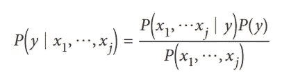

Formula Naive Bayes Classifier

*   P (y | x1，…，xj) =后验概率，在给定特征 x1 到 xj 的情况下，包含在 y 类中的数据的概率。
*   P (x1，…，xj | y) =给定类为 y 的要素值的似然性。
*   P (y) =先验概率。
*   P (x1，…，xj) =边际概率。

因为在朴素贝叶斯分类器的计算中，边际概率总是保持不变的，那么我们可以忽略边际概率的计算。在朴素贝叶斯分类器中，我们根据最大**后验概率的值来确定数据点的类别。**

> 朴素贝叶斯分类器中使用的一些**假设**是数据中的每个特征可能不相关或者相互**独立**。那么第二个可能性 P (x | y)必须遵循其中一个统计分布，即**高斯**、**多项式**或**伯努利**。

# 2.手工朴素贝叶斯

假设我们在表 1 中有以下数据，我们想用以下标准对新数据进行分类:

*   年龄=**21–30**
*   收入= **中等**
*   身份= **已婚**

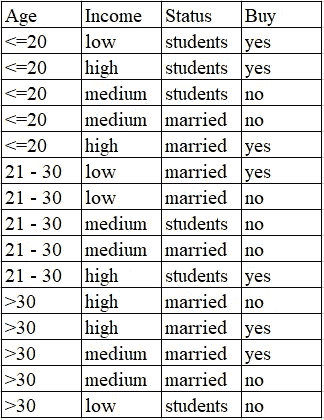

Table 1\. Data Training

```
1\. First, Calculate **Prior Probability** P(y):
*- P (Buy=yes) → 7/15 → 0,467*
- P (Buy=no) → 8/15 → 0,5332\. Second, Calculate the **Likelihood** each features P (x | y):
*- P (Age = 21–30 | Buy=yes) → 2/7 → 0,285*
- P (Age = 21–30 | Buy=no) → 3/8 → 0,375
*- P (Income= Medium | Buy=yes) → 1/7 → 0,143*
- P (Income= Medium | Buy=no) → 5/8 → 0,625
*- P (Status= Married | Buy=yes) → 4/7 → 0,571*
- P (Status= Married | Buy=no) → 5/8 → 0,6253\. Calculate Total **Likelihood**
*- P (x | Buy=yes) → 0,285 * 0,143 * 0,571 = 0,0233*
- P (x | Buy=no) → 0,375 * 0,625 * 0,625 = 0,14644\. Calculate **Posterior Probability** P(y | x):
- P (x | Buy=yes) * P (Buy=yes) → 0,0233 * 0,467 = 0,0108
**- P (x | Buy=no) * P (Buy=no) → 0,1464 * 0,533 = 0,0781**
```

从上面的计算中发现，新数据属于没有**不买的那一类。**

# 3.带有 Scikit-Learn 的朴素贝叶斯

现在我们知道了如何手动计算朴素贝叶斯分类器算法，我们可以轻松地使用 **Scikit-learn。Scikit-learn 是 Python 中用于实现机器学习的库之一。我在这里使用高斯朴素贝叶斯分类器，我使用的**数据集**是玻璃分类，其细节可以在 [Kaggle](https://www.kaggle.com/uciml/glass/download) 中看到。**

> 代码和数据集可以在我的 [Github](https://github.com/adiptamartulandi/Naive-Bayes-Classifier) 下载。

> 要了解这篇文章，你至少应该了解:
> 1。 [**Python**](https://www.python.org/) 中的基本编程。
> 2。 [**熊猫**](https://pandas.pydata.org/) 和 [**Numpy**](https://numpy.org/) 库为数据分析工具。
> 3。 [**Matplotlib**](https://matplotlib.org/) 和 [**Seaborn**](https://seaborn.pydata.org/) 库进行数据可视化。
> 4。 [**Scikit-Learn**](https://scikit-learn.org/stable/) 机器学习库。
> 5。**Jupyter**[](http://jupyter.org)****笔记本。****

**使用朴素贝叶斯分类器解决分类问题的步骤如下:
1 .加载库
2。加载数据集
3。先睹为快数据
4。处理缺失值
5。
探索性数据分析(EDA)6。建模**

**加载几个 python 库，这些库将用于处理这个案例。**

```
**import pandas as pd
import numpy as np****import matplotlib.pyplot as plt
import seaborn as sns****from sklearn.naive_bayes import GaussianNB
from sklearn.metrics import accuracy_score
from sklearn.model_selection import train_test_split****import warnings
warnings.filterwarnings('ignore')**
```

**2 加载将用于处理该案例的数据集。使用的数据集是玻璃数据集。**

```
**df = pd.read_csv('glass.csv')**
```

**3 从数据中看一些大概的信息，从总体上找出数据的特点。**

```
#Top 5 our data
**df.head()**
```

**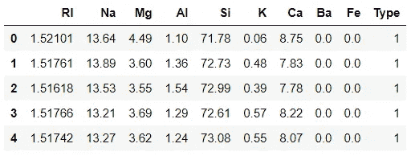**

**Top 5 Data**

```
#Top 5 data from bottom
**df.tail()**
```

**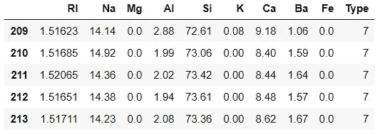**

**Top Bottom 5 Data**

```
#Viewing the number of rows (214) and number of columns / features (10)
**df.shape**
```

**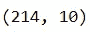**

**Shape of Data**

```
#General information of data
**df.info()**
```

**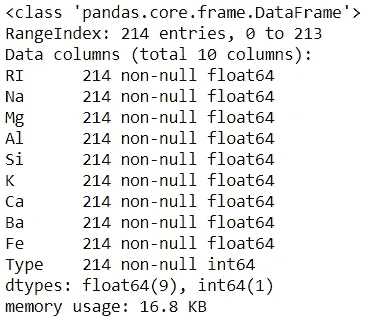**

**Information of Data**

```
#Look at Descriptive Statistic of Data.
**df.describe()**
```

**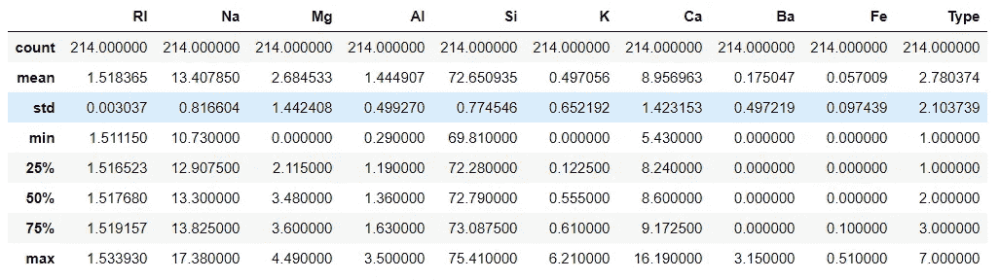**

**Descriptive Statistics**

**4 如果数据中有缺失值，则进行处理，如果没有，则进入下一阶段。**

```
#Data is clean and can continue to the Explorary Data Analysis stage
**df.isnull().sum()**
```

**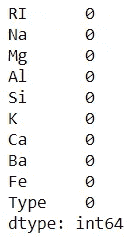**

**Sum of Missing Values**

**5 探索性数据分析找出更多关于数据的特征。**

```
#Univariate analysis Type (Target features).
**sns.countplot(df['Type'], color='red')**
```

**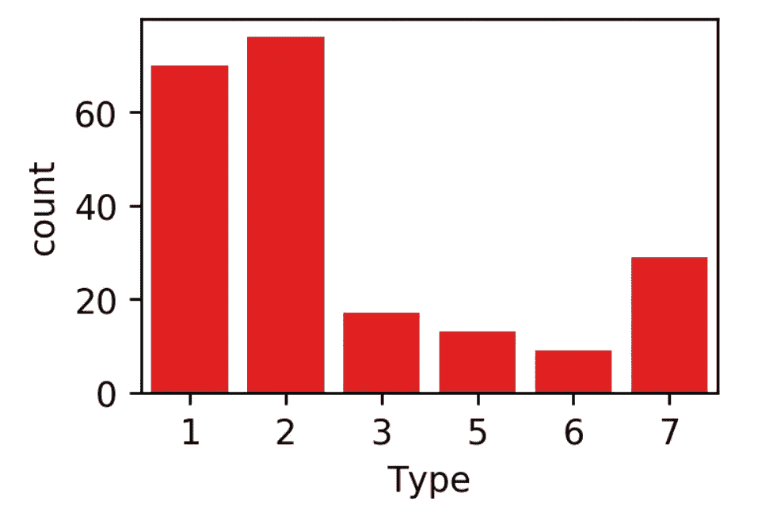**

**Count of Target Features Values**

*   **可以看出，我们的数据是**不平衡**，因为与其他类型相比，类型 1 和类型 2 非常占优势。**

```
#Univariate analysis of RI (Refractive Index).**f = plt.figure(figsize=(20,4))****f.add_subplot(1,2,1)
sns.distplot(df['RI'])****f.add_subplot(1,2,2)
sns.boxplot(df['RI']);**
```

**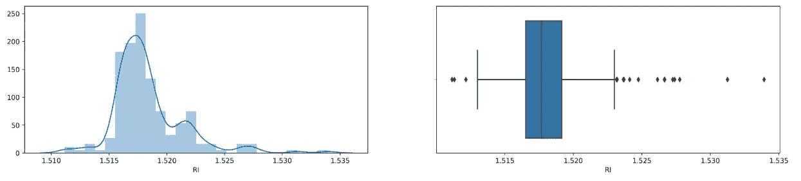**

**Boxplot and Distplot of RI**

*   **从 distplot 可以看出，数据的**密度**位于数字 1.515-1.520 的范围内。**
*   **从箱线图可以看出，数据中有许多异常值**。****

```
**#Univariate analysis Na (Sodium).**f = plt.figure(figsize=(20,4))****f.add_subplot(1,2,1)
sns.distplot(df['Na'], color='green')****f.add_subplot(1,2,2)
sns.boxplot(df['Na'], color='green')****
```

****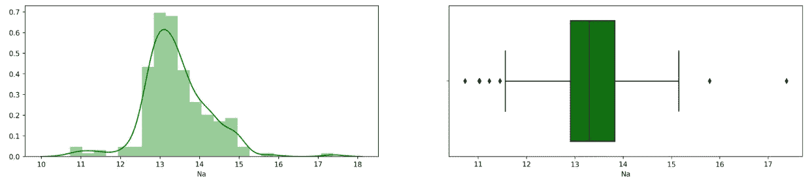****

****Boxplot and Distplot of Na****

*   ****最大的 Na 值在 13 到 14 之间。****
*   ****Na 有几个异常值。****

```
**#Correlation between features
**df.corr().style.background_gradient().set_precision(2)****
```

****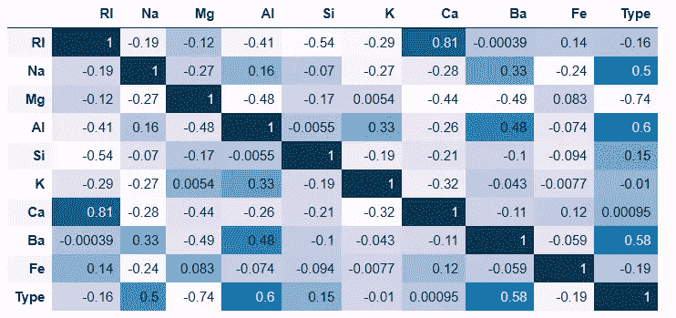****

****Correlation Matrix****

*   ****玻璃**种类**与 **Na** 、 **Al** 、 **Ba** 之间存在较强的正线性关系。****
*   ****至于负线性关系，**目标**与 **Mg** 关系密切。****

****使用来自 Scikit-Learn 的高斯朴素贝叶斯对我们的数据建模。****

```
**# Create a Naive Bayes object
**nb = GaussianNB()**#Create variable x and y.
**x = df.drop(columns=['Type'])
y = df['Type']**#Split data into training and testing data
**x_train, x_test, y_train, y_test = train_test_split(x, y, test_size=0.2, random_state=4)**#Training the model
**nb.fit(x_train, y_train)**#Predict testing set
**y_pred = nb.predict(x_test)**#Check performance of model
**print(accuracy_score(y_test, y_pred))****
```

****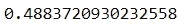****

****Accuracy Score****

*   ****从准确度得分可以看出，该值为 48%,在我看来仍然需要再次提高。****
*   ****根据我的分析，为什么朴素贝叶斯模型的准确度值如此之低是由于不平衡的数据。因此，我将用来提高我的模型的准确性的方法之一是我将在下一篇文章中做的数据平衡。所以请保持关注！****