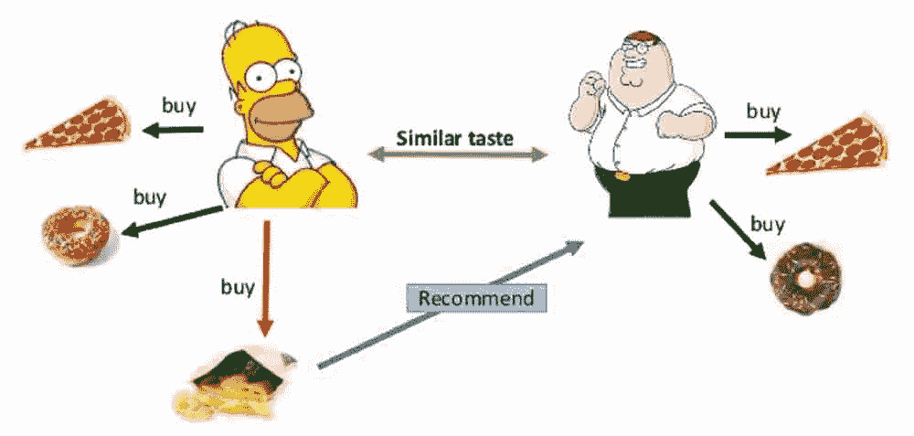
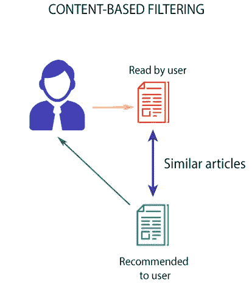

# 推荐系统简介

> 原文：<https://medium.datadriveninvestor.com/a-gentle-introduction-to-recommender-system-d5577e7d6e74?source=collection_archive---------21----------------------->


(Recommendations By Prime Video)

在互联网时代，电子商务网站和电影流媒体网站变得非常受欢迎，因为它们让购物中心和多元化听起来像是老派。然而，随着他们之间的竞争日益激烈，这些网站需要以用户友好的方式推荐他们的产品，否则他们会失去客户，即使他们在后台有一个精心的商业计划。在本文中，我们将概述推荐系统的一个基本算法，即 ***协同过滤*** 和 ***基于内容的过滤。*** 然而，在现实世界中，我们使用两种类型的混合称为 ***混合推荐器。***



(Collaborative Filtering)

## 协作过滤:

上图(pic 鸣谢:Mohamed Ben Ellefi)展示了协同过滤的工作原理。这里的假设是，如果一个人 A 和 B 有相似的品味，那么 A 会喜欢 B 喜欢的东西。这种类型的协同过滤被称为 ***基于用户的*** 协同过滤。在这里我们基本上是基于某个相似的功能形成一个用户社区，并根据其社区的口味向一个用户推荐产品。另一方面，在基于项目的协同过滤的情况下，亚马逊推荐系统的构建者之一 Greg Lindens ( *Linden 等人，“Amazon.com 推荐:项目对项目的协同过滤*)给出了相同的伪代码

```
For each item in product catalog, I 1
   For each customer C who purchased I 1
       For each item I 2 purchased by customer C
           Record that a customer purchased I 1 and I 2
       For each item I 2
           Compute the similarity between I 1 and I 2
```

上述算法将形成一个数据集，我们可以在其中查找当前项目的相似项目。为了计算项目之间的相似性，我们有许多相似性函数，如余弦相似性。(*在另一篇文章中，我们将看到如何使用各种函数计算相似性值。)*

[](https://www.datadriveninvestor.com/2019/01/23/which-is-more-promising-data-science-or-software-engineering/) [## 数据科学和软件工程哪个更有前途？数据驱动的投资者

### 大约一个月前，当我坐在咖啡馆里为一个客户开发网站时，我发现了这个女人…

www.datadriveninvestor.com](https://www.datadriveninvestor.com/2019/01/23/which-is-more-promising-data-science-or-software-engineering/) 

## 基于内容的过滤:

它使用用户喜欢的项目的元数据(例如，电影的类型)。假设我们被赋予一项任务，对电影进行基于内容的过滤。所以基本上我们会试着找出物品的一些品质或描述。例如，在电影的情况下，元数据可以是流派、演员等。所以我们会带着这些信息。并且我们将计算这些项目与用户没有消费的其他可用项目的相似性。我们将向用户推荐那些与用户迄今为止所喜欢的更相似的项目。



上图总结了基于内容的过滤。

## 混合推荐器:

上面描述的两种方法都有各自的局限性。协同过滤在很大程度上依赖于用户的输入，而基于内容的推荐要求项目有适当的描述，而现实世界的问题可能没有。因此，最终的推荐系统通常是这两种模型的混合。

在接下来的文章中，我们将深入挖掘这两种算法的数学原理，并将其应用到真实世界的数据集中。