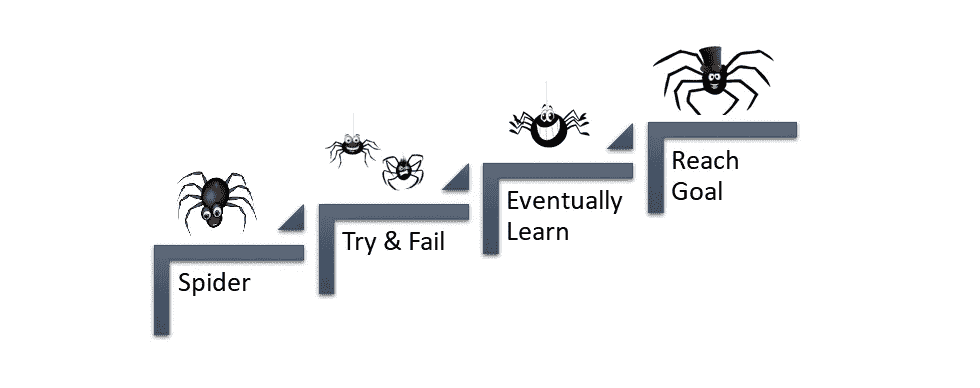
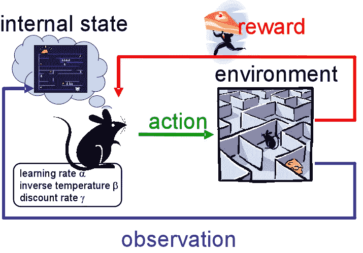
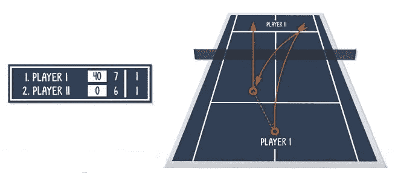
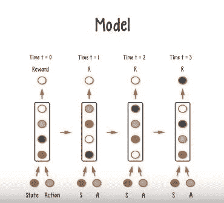
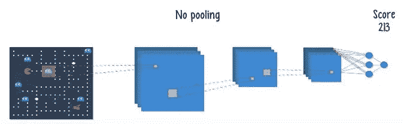
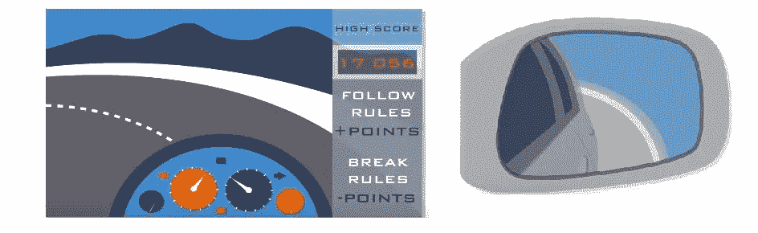

# 强化学习的简明介绍

> 原文：<https://medium.datadriveninvestor.com/a-gentle-introduction-to-reinforcement-learning-53d6c1ad97af?source=collection_archive---------4----------------------->

在本文中，我们将了解强化学习！

**什么是外行人的强化学习？**

强化学习是机器学习的一种重要类型，主要致力于使模型从错误中学习，或通过与世界交互和评估反馈来帮助智能体提高决策能力。就像我们人类在做任何任务或玩游戏时会犯错误一样，我们学习并适应它。简单来说，这就是我们学习所有东西的方式。强化学习使用相同的方法来训练模型。

假设我们被放在一个新的环境中，起初我们会在某些地方犯错误/失败，但我们会从中吸取教训。这样，我们就知道了这个伟大的故事“*国王和蜘蛛*”。

一只小蜘蛛正试图在洞顶上织网，他试图一次又一次地往上爬。这个故事的寓意是“蜘蛛没有放弃”。但我认为他找到了一种“如何攀登”的方法？

托马斯·爱迪生名言…

> *我没有失败。我刚刚发现了一万种行不通的方法。*

最终，他找到了制造电灯泡的正确方法。

## 只是一点背景:

会玩游戏的电脑一直给计算界留下深刻印象。2013 年 12 月，来自伦敦一家名为 deep mind 的公司的一小群人工智能研究人员发布了一篇名为“*用深度强化学习玩雅达利*的开创性论文，仅仅一个多月后，谷歌宣布他们以一大笔钱收购了 DeepMind。从那以后，在人工智能领域有各种各样关于强化学习的讨论。2016 年 1 月，谷歌宣布，名副其实的 AlphaGo 能够击败卫冕世界围棋冠军。我们将揭开强化学习的神秘面纱，这样你就可以看到所有这些惊人的技能是如何实现的。

## 更多强化学习:

强化学习的故事可以一直追溯到人工智能、动物心理学和控制理论。在它的核心，它涉及一个自主的代理人，如人，动物，机器人，或深度网络学习导航一个不确定的环境，目标是最大化数字奖励。

体育就是一个很好的例子。想想看，我们的自主代理在网球比赛中将不得不处理什么。代理将不得不考虑它的行动，如它的发球、回球和截击。这些行为改变了游戏的状态，或者换句话说，改变了当前的设定、主要玩家等等。每一个动作都有一个奖励——赢得一分，以赢得比赛。我们的代理需要遵循一个政策，或者一套规则和策略，以最大化最终得分。

[Tennis court](https://en.wikipedia.org/wiki/Tennis_court)

但是如果你正在构建一个自主代理，你实际上应该如何建模呢？我们知道代理人的行为会改变环境的状态。因此，一个模型需要能够将一个状态和一个动作作为输入，并生成最大的预期回报作为输出。但由于这只能让你进入下一个状态，你需要考虑从当前状态到结束状态的所有行动的总预期回报。这种工作方式对于每个应用程序来说都是不同的，并且当您知道构建一个网球代理不同于构建一个 Atari 代理时，您可能不会感到惊讶。

## 深层雅达利:

DeepMind 的研究人员使用了一系列雅达利截图来构建一个卷积神经网络，并进行了一些调整。输出不是一个类，而是一个最大回报的目标数字，所以它实际上是在处理回归，而不是分类。他们也没有使用池层，因为不像图像识别，游戏对象的个体位置，像玩家，都是重要的，不能减少。也可以使用递归网络，只要输出层是为回归而定制的，并且每个时间步的输入包括动作和环境状态。

## 深度 Q 网:

还有深度 Q 网络，简称 DQN。DQN 也使用预测给予一个国家和行动的最大回报的原则。它实际上是由谷歌申请的专利，它已经看到了很多改进，如体验回放和决斗网络架构。我们将在下一篇文章中讨论，让我们保持联系。

## **监督学习是无状态的:**

强化学习不仅仅是监督学习的一种花哨、听起来聪明的说法。监督学习就是根据历史实例来理解环境。但这并不总是最好的做事方式。想象一下，如果你正试图根据一周前道路畅通时观察到的道路模式在拥挤的交通中驾驶一辆汽车。这和你只看后视镜时开车的效果差不多。另一方面，强化学习是关于奖励的。你会因为你的行为而得到分数——比如在你的车道上限速行驶，在你应该的时候发信号，诸如此类的事情。但是你也可能因为危险的行为被扣分，比如尾随和超速。你的目标是在给定你周围道路的当前交通状况的情况下，获得尽可能多的分数。强化学习强调一个动作导致状态的改变，这是监督学习模型所不关注的。

## **勘探与开发:**

2016 年 4 月，亚马逊创始人杰夫·贝索斯谈到了他的公司是一个失败的好地方，以及大多数公司是如何不愿意通过“*一连串失败的实验*”而遭受痛苦。你可以认为这是一个关于奖励的声明。大多数组织在传统智慧的领域中运作，这是关于利用已知的东西，以已知的几率实现有限的回报。

一些团体冒险进入未知领域，探索新的领域，并有望在很大程度上获得巨额回报。许多这样的组织确实失败了！但是他们中的一些人成功了，并最终改变了世界。通过强化学习，代理可以探索探索和利用之间的权衡，并选择获得最大期望回报的路径。

## 最终想法:

这篇文章是关于深度学习的，所以我们把重点放在了构建深度强化网络的主题上。但是强化学习属于更广泛的人工智能范畴。它涉及目标设定、计划和感知等主题。它甚至可以在人工智能和工程学科之间架起一座桥梁。强化学习简单而强大，鉴于最近的进展，它有可能成为深度学习领域的一大力量。如果你想了解更多关于强化学习的知识，参考下面提到的。

# 参考资料:

1.  [深度强化学习:来自像素的 Pong】](http://karpathy.github.io/2016/05/31/rl/)
2.  [用深度强化学习玩雅达利](https://www.cs.toronto.edu/~vmnih/docs/dqn.pdf)
3.  [https://becoming human . ai/lets-build-an-atari-ai-part-1-dqn-df 57 e 8 ff 3 b 26](https://becominghuman.ai/lets-build-an-atari-ai-part-1-dqn-df57e8ff3b26)