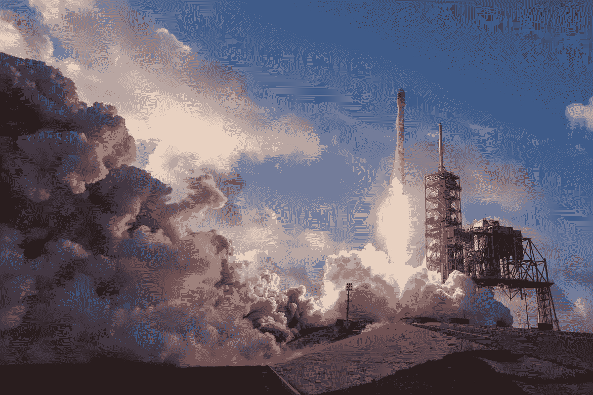

# 一个巨大的飞跃只是一系列的小步

> 原文：<https://medium.datadriveninvestor.com/a-giant-leap-is-just-a-series-of-small-steps-5c0a09de8f8f?source=collection_archive---------42----------------------->

Photo by [SpaceX](https://unsplash.com/photos/yJv97tE7GDM?utm_source=unsplash&utm_medium=referral&utm_content=creditCopyText) on [Unsplash](https://unsplash.com/collections/3449010/steps-blog-post?utm_source=unsplash&utm_medium=referral&utm_content=creditCopyText)

从肯尼迪宣布“我们选择登上月球”开始，直到尼尔·阿姆斯特朗踏上月球，说出那句著名的话“人类的一次巨大飞跃”，一群杰出的、富有献身精神的先驱男女承担了一项不可能的任务:做地球上没有人做过的事情。

这是一个巨大的飞跃。

毫无疑问，这个巨大的飞跃不是从“让我们做吧”到“完成”的单一步骤。相反，这一不朽的成就只不过是一系列精心编排的步骤，每一步都依赖于前一步。

在太空舱带着柔和的尘埃云降落在月球坑坑洼洼的表面，让宇航员走出舱外，实现人类第一次之前，美国宇航局的工程师们必须完成一系列令人眼花缭乱的步骤。他们必须计算着陆轨迹、飞船的重量、月球的引力、大气等等。

但是，在他们能够计算到月球的距离之前，NASA 的聪明头脑必须想出如何简单地将火箭的有效载荷送入稳定的地球轨道并返回。

这还是在他们解决如何制造能够承受太空需求的宇航服之前！

在某些情况下，工程师必须在知道下一步该问什么问题之前解决问题。有时他们不得不发明问题来解决问题。

没有捷径可走。

**在太空旅行中，捷径意味着死亡。**

Photo by [Alex Kotliarskyi](https://unsplash.com/photos/QBpZGqEMsKg?utm_source=unsplash&utm_medium=referral&utm_content=creditCopyText) on [Unsplash](https://unsplash.com/collections/3449010/steps-blog-post?utm_source=unsplash&utm_medium=referral&utm_content=creditCopyText)

# 技术上的巨大飞跃

实现技术上的巨大飞跃需要同样的思维。没有一家公司能够在第一天就兑现承诺，取得成功。

试图一步到位实现巨大飞跃的公司会死掉。他们要么推出太晚(死亡)，推出一个没人要的有缺陷的产品(也是死亡)，要么甚至在试图推出时就没钱了(还是死亡)。

**技术上的巨大飞跃只不过是一小步。**

没有捷径。

以亚马逊为例。第一天，他们开始做以前没有人做过的事情:在网上卖书。

快进到今天，亚马逊对书籍的了解要少于对你想要的任何东西的快速递送，电影、纸巾、衣服，很快甚至是汽车。这只是该公司提供的所有产品的一小部分。

如果亚马逊试图一步到位交付他们目前的所有产品，他们可能已经死了。

巨大的飞跃只不过是一小步。

亚马逊从书开始。

然后他们慢慢开始增加更多的产品类别，如 CD、服装和电脑零件。

最终，他们让其他零售商在亚马逊平台上销售他们的产品，从而增加了集成履行。

在构建内部工具来解决自己的 IT 扩展问题后，他们[推出了 AWS](https://techcrunch.com/2016/07/02/andy-jassys-brief-history-of-the-genesis-of-aws/) 来为其他技术公司提供同样的服务，从而成为世界上最有价值的云基础设施公司。

为了成为我们今天所知的亚马逊，他们必须经历之前的每一步。

你可以在脸书看到同样的模式，它最初是一个大学生社交网络，后来扩展到信使、市场、广告网络、政治宣传工具(приветрусикии)，很快又有了一个[家庭数据收集设备](https://www.recode.net/2018/10/16/17966102/facebook-portal-ad-targeting-data-collection)、*咳嗽*，我指的是视频会议工具。

如果你看看谷歌的历史，你会看到类似的模式。他们的第一步是解决网络爬行和提供相关搜索结果，然后采取措施成为广告平台、电子邮件提供商、基于云的文字处理器等等。

Photo by [Vidar Nordli-Mathisen](https://unsplash.com/photos/LyZO-6jLa8c?utm_source=unsplash&utm_medium=referral&utm_content=creditCopyText) on [Unsplash](https://unsplash.com/collections/3449010/steps-blog-post?utm_source=unsplash&utm_medium=referral&utm_content=creditCopyText)

所有这些公司都有相同的道路:

**一步接一步。**

每一步都依赖于前一步。

冲洗，重复，直到你最后回头看到一个巨大的，全面的飞跃。

每一次巨大的飞跃都不过是一连串的步骤。没有捷径。没有例外。

现在，去把一只脚放在另一只脚的前面，建造一些伟大的东西。

如果你喜欢这个作品，请给我一两个掌声或分享它！

*更多来自我的戏谑，关注我* [*推特*](https://twitter.com/chazthetic) *。*

*原载于***。**