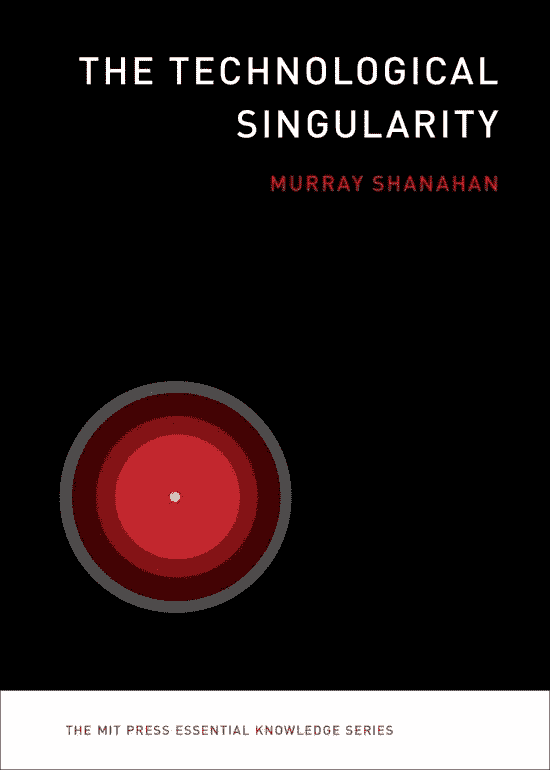

# 面对技术奇点的一本好的老书评

> 原文：<https://medium.datadriveninvestor.com/a-good-old-book-review-in-the-face-of-the-technological-singularity-c7e2b2435b7a?source=collection_archive---------20----------------------->

这篇文章是巴黎政治学院 [*技术革命史课程的作业。*](http://formation.sciences-po.fr/enseignement/2018/KAFP/3315) *该课程是公共政策硕士的政策流数字&新技术的一部分，由*[*laurène Tran*](https://medium.com/u/31b76182111a?source=post_page-----c7e2b2435b7a--------------------------------)*、*[*Besiana Balla*](https://medium.com/u/b57c90a0ecbd?source=post_page-----c7e2b2435b7a--------------------------------)*和*[*Nicolas Colin*](https://medium.com/u/c842401c1ec4?source=post_page-----c7e2b2435b7a--------------------------------)*指导。*

技术奇点是指有一天，人类将被人工智能或认知增强的生物智能超越的想法。虽然我们知道达到这一点的后果将是巨大的，但我们不得不猜测到底会发生什么。这种恐惧和不确定性导致了一种普遍的情绪，即技术奇点是终结的开始。工作会被 R2D2 这样的人霸占；在《她》中，男女关系将更像乔阿金·菲尼克斯和斯嘉丽·约翰逊；整个社会将看起来像皮克斯的反乌托邦《瓦力》,胖胖的路人粘在全息屏幕上，无休止地坐在悬浮椅子上。

如果只是为了消除媒体的不准确性，读一读默里·沙纳汉 2015 年由麻省理工学院出版社出版的《技术奇点》。沙纳汉精心组织的书开始(相对)小，关于如何实现一般人工智能，结束大，关于人类的未来。虽然他出色地阐明了通向技术奇点的可能途径，但这本书结尾过于松散，提出的问题多于提供的答案。他的哲学意味当然是思想的食粮，但他最终让读者失望了。

这本书首先探索了两种实现人工智能的可行方法:受生物学启发或从零开始设计。他提出了全脑仿真，本质上是人工制造的神经元和树突，作为第一条通往通用人工智能的生物学途径。全脑仿真在许多方面与生物学不同。例如，我们可以修补负责高级认知功能的特定区域的大小，如前额皮质。人工智能的第二条途径是从头开始设计。沙纳汉将其归结为两个过程:机器学习和优化。机器学习将构建世界的概率预测模型，而优化将找到使这些模型的回报函数最大化的行动。

这是这本书最技术性的部分。然而，对于普通的非技术观众来说，它仍然是容易理解的，因为 Shanahan 花了大量的时间来拼写那些不透明的概念。他还在整本书中重复了许多更具技术性的概念，让读者有充分的机会最终掌握它们。事实上，沙纳汉成功地平衡了通俗易懂的技术写作，而没有用过于模糊的解释贬低读者。

在他变得越来越投机之前，他提出了关于超智能的最后一个具体观点。实现超级智能的最基本的方法之一是通过并行。沙纳汉认为“与生物大脑不同，数字实现的大脑可以被任意复制多次。与生物大脑不同，数字大脑可以加速。”沙纳汉确信，在实现人工一般智能之后，超级智能几乎会立即出现。他令人信服、表达清晰的观点基于逻辑:复制算法听起来像是通用人工智能壮举之后的一项微小任务。

此后，沙纳汉从基于现有研究和理论的技术主题出发，探索技术奇点的可能分支。他通过不断缩小来组织他的观点。沙纳汉首先提出了个人层面的后果问题，然后阐述了社会层面的后果，并以宇宙论结尾。在这些探索的过程中，他小心翼翼地对技术奇点的反乌托邦和乌托邦结果给予同等的重视。在个人层面的后果这个话题上，他通过询问读者我们是否希望未来的人工智能成为我们的仆人或平等者来探索读者；自我意识和自我保护在一个人工智能中是多么重要，如果我们想让一般的人工智能体验情感和移情。虽然他没有提供这些问题的答案，沙纳汉令人信服地探索了无数种可能的情况。

正是在社会和宇宙学的层面上，沙纳汉忽略了结构化的假设，而倾向于单纯的提问。他指出，人工智能复制的可能性破坏了所有权、公民权、民主和责任等社会概念。他大部分时间都花在《怎么样:离婚怎么样？犯罪呢？投票呢？道德呢？几乎没有时间讨论在技术奇点之后，社会变革将如何发生。解决这些问题不是沙纳汉的责任，但他有责任使我们对社会中一般人工智能的概念复杂化。他对政治和经济诸多方面的表面提问对此没有什么作用。

这本书的字里行间写着一个对读者没有什么安慰的答案:我们不知道会发生什么。对于一本完全基于对未来宏伟构想的书来说，沙纳汉以描绘一幅我们都能轻易想象的画面作为结尾。一只鸟从厨房的窗户爬进山楂丛。瞬间的渺小强调了面对浩瀚的未知，我们知道的是多么的少。对于普通观众来说，这种技术上的独特性是探索这一广阔领域的一个很好的起点。

引用作品:

穆雷·沙纳汉。*技术奇点*。麻省理工学院出版社，2015 年。