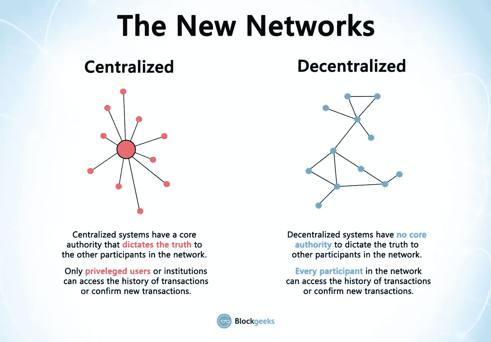

# 密码交易指南

> 原文：<https://medium.datadriveninvestor.com/a-guide-to-crypto-trading-7f37ee7e4c17?source=collection_archive---------5----------------------->

如果你是一个新手或自由式交易者，正在寻找一些建议，这篇文章将指导你成为一个高利润交易者的正确技能。

A guide to crypto trading

# **选择可靠的交易平台**

居心不良的人碰巧无处不在，初学者很容易在没有足够意识的情况下跟风。欺诈案件确实在这个世界上发生，以前也发生过很多次。因此，在让您的资产介入之前，了解提供商及其服务总是至关重要的。对他们的业务概况、合法性、合作关系、项目等进行深入的研究永远不会是一项过度的工作。另一个需要考虑的问题是，你希望与哪种模式的交易所进行互动。

分散交易模式据称是最安全的，因为没有中间人控制资金的流动，并返回点对点的无权限交互。为了解决与中央平台相关的所有问题，特别是对 Mt.Gox 和 Coincheck 的大规模安全攻击，dex 的主机分布在网络的所有节点上，这消除了服务器停机和黑客攻击的风险，因为没有中央控制的服务器。

Key differences between Centralized and Decentralized Model (Image: Blockgeeks)

[HB DEX 是一个 100%分散的交易所](https://www.hb-wallet.com)，它使用户能够直接在彼此之间交易加密资产，而不需要个人数据。分散式交易所完全在 HB Wallet 桌面应用程序上运行，提供了一个比任何基于网络的交易所和钱包更高效、更强大、更安全的平台。

 [## 如何创建自己的加密货币，让您的企业为未来做好准备|数据驱动…

### 加密货币是如何工作的？如何制作加密货币？如何推出我的加密货币？所有这些问题必须…

www.datadriveninvestor.com](https://www.datadriveninvestor.com/2019/03/25/how-to-create-your-own-cryptocurrency-and-make-your-business-ready-for-the-future/) 

所有基本功能都可以在 HB DEX 中找到。该交易所为用户提供了从存储代币、进行交易、支付费用以检查交易状态的无缝加密交易体验。这一过程更快、更便宜，并且解决了任何集中式交换中常见的问题。

HB DEX 支持使用 ERC-20 上的任何[令牌为 ETH 进行实时交易，反之亦然。](https://www.hb-wallet.com/post/2018/12/06/what-everybody-needs-to-know-about-tokens?source=post_page---------------------------)

除了复杂的结构之外，用户还可以在交易后将他们的钱包同步到 HB Wallet 移动版，并从移动设备监控他们的资产。

具体来说，HB DEX 100%免费。用户只需支付少量[以太币费用](https://www.hb-wallet.com/post/a-guide-to-ethereum-gas?source=post_page---------------------------)来验证他们的交易。

关于如何在 HB DEX 上执行交易的详细教程也在平台内进行，以获得完整的支持。

How to trade on HB DEX

# 有一个像样的交易策略

如果你是这个世界的新生，据说学习第一手的市场和重要交易术语是至关重要的。对市场动向有良好的感觉和敏锐的交易策略可以帮助你成为高利润的交易者。然而，交易总是伴随着风险。通过适当的风险管理和良好的交易心态，你也能减少常见的错误和风险，并在牛市中获得丰厚的利润。因此，这篇文章将会给你一些你可能会面临的问题，以及你必须采取的措施。

Having a sharp trading strategy can help you become a high-profit trader

# **保证资金安全是关键**

刚开始交易的时候想到自己能赚多少钱是很平常的事情。

大规模快速增长的市场很吸引人，不幸的是，已经有数百个案例表明，密码交易员有了一个很好的开始，但几乎输掉了所有的钱，并退出了，仅仅是因为他们没有一个合适的资金管理策略。好的信号有时会给你假警报，市场周期会让你长期亏损。

如果你不想这么快结束游戏， ***保护你的资本比急切地寻求大量利润*** 更重要。如果你的目标是长期盈利，那么就需要有效地计划和应用风险管理策略，以增加你成为高利润交易者的可能性，避免悲剧性的陷阱。

# **1%法则**

每个人都至少被告知过一次 ***不要冒险超过你账户余额*** 的 1%。但这背后的原因是什么呢？

答案是保证长期可持续性。

如果你那天醒来心情不好，连续输了 30 笔交易，你仍然会有大约 70%的初始余额。这些损失可以通过几次成功盈利的交易来弥补，你可以很快恢复并再次达到新的高度。因此，如果不幸的是，你不得不经历连败，每笔交易的风险将根据每笔交易的固定风险百分比逐渐降低。这将反过来构建一个反向复合效应。

不要像每个新手那样选择 3000 美元、0.3 BTC 或 15%的筹码，而是要计算你每笔交易能承受多少损失。要做到这一点，只需通过解决这个简单的数学问题来计算你的最大风险:

账户规模/100 =你的最大风险。

例如，如果你的交易筹码是 30，000 美元，你的策略是每笔交易承担 1%的风险，那么每次交易的风险不要超过 30，000 美元/100 = 300 美元。这也意味着，如果你的交易碰到“止损”，你将损失 300 美元。

# **知道你能承受多大的风险(头寸规模)**

在秘密交易中，**目标价格**是特定交易的预计未来价格水平。一个**止损**是在你的交易所下的订单，当它对你不利并达到一定的价格水平时，结束一个特定的交易。止损单是为了你自己的利益而设计的，在某个点之后停止任何损失。在每笔交易中，你必须确定一个止损点来防止自己自由落体。当市场的表现与你的头寸相反时，它只能向下移动到一个设定点，在此之后，交易被迫以小幅亏损平仓。

**风险/回报比率**显示了每笔交易的预期回报与承担的风险的对比。 ***比率越高，你的交易风险越小。***

建议的风险/回报比率:

1:1 及更低=永不交易

1:1 =正常

1:2 =很好

1:3 及更高=理想

当你以 9350 美元的进场价格进场交易时。让我们假设价格决定向下移动，并在 9138 美元处设置止损。为了有效地确定您的头寸规模，您还必须计算最大 pip 风险。Pip 代表“百分比”,或者简单地说是价格变动。当价格从 1000 移动到 1001 时，点是 1。最大点风险可以通过进场价格和止损价格之间的距离来计算。

最大点风险=进场价格-止损价格= 9350 美元-9138 美元= 212 美元

据此，你最多可以损失 212 点。如果你的交易止损，你将损失 212 点。如果你在交易中选择了 300 美元的风险，你的交易必须是 1.41 美元。

交易所需的点值= $风险/点风险= $300/212 = $1.41(每点)

假设你准确地选择了一个交易规模，使你每点只承担 1.41 美元的风险，你最终会损失 300 美元，这只占你 30，000 美元账户总规模的 1%。

# **避免恐惧和贪婪**

当止损被击中时，高利润的密码交易员不会在情绪上急于把钱赢回来。亏损是不可避免的，不要认为这是退出交易的可怕理由，否则，坦然面对亏损，你会走得很远。

为了成为一个高利润的交易者，你必须制定一个交易策略，在亏损时期坚守阵地。残酷的事实是，没有多少交易者有合适的资金管理策略。在你的交易过程中，亏损是不可避免的，为了避免不好的结果，最好耐心和自律地练习这些策略。在一两次成功的交易后，很容易让贪婪爬上你的头，你可能会在下一次交易中冒太大的风险来抓住你的机会。这种行为不仅会让你损失惨重，还会导致无休止的亏损循环，你可能会彻底退出交易。

A high-profit crypto trader doesn’t emotionally rush themselves to win the money back.

长期利润会让你比赌博走得更远，如果你掌握了这些规则和心态，你的交易前景非常光明。