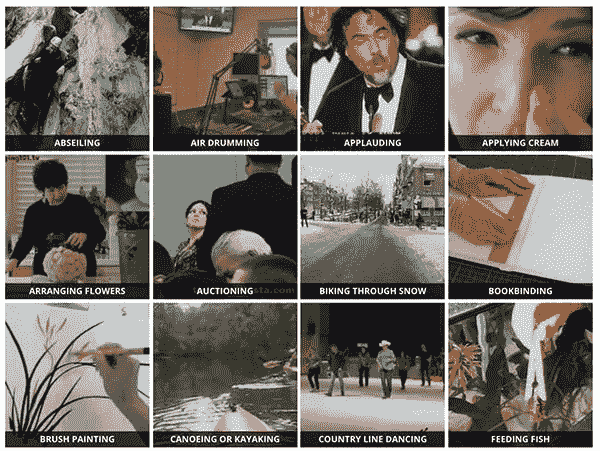

# 人类活动识别指南

> 原文：<https://medium.datadriveninvestor.com/a-guide-to-human-activity-recognition-f11e4637dc4e?source=collection_archive---------0----------------------->


Source : [CRCV](https://www.google.com/url?sa=i&source=images&cd=&cad=rja&uact=8&ved=2ahUKEwiDgaqZjpDmAhVezDgGHVgfDM8QjB16BAgBEAM&url=https%3A%2F%2Fwww.crcv.ucf.edu%2Fdata%2FUCF_Sports_Action.php&psig=AOvVaw1G7kg6RwURLMsHoTkG436W&ust=1575140608990605)

本文旨在为计算机视觉最具标志性和最迷人的应用之一——即人类活动识别——提供一个简单而全面的指南。

我们的人体活动识别模型可以识别超过 400 个活动的**，**78.4–94.5%的准确率**(取决于任务)。**

**活动示例如下:**

1.  **箭术**
2.  **扳手腕**
3.  **烘焙饼干**
4.  **数钱**
5.  **驾驶拖拉机**
6.  **吃热狗**
7.  ***…还有更多！***

**人类活动识别的实际应用包括:**

*   **对磁盘上的视频数据集进行自动分类。**
*   **培训和监督新员工正确执行任务(例如制作比萨饼时的正确步骤和程序，包括擀面团、加热烤箱、放上调味汁、奶酪、浇头等。).**
*   **验证餐饮服务人员在去洗手间或处理可能导致交叉污染的食物后是否洗手(即鸡肉和沙门氏菌)。**
*   **监控酒吧/餐厅的顾客，确保他们不会被过度服务。**

**[](https://www.datadriveninvestor.com/2019/03/03/editors-pick-5-machine-learning-books/) [## DDI 编辑推荐:5 本让你从新手变成专家的机器学习书籍|数据驱动…

### 机器学习行业的蓬勃发展重新引起了人们对人工智能的兴趣

www.datadriveninvestor.com](https://www.datadriveninvestor.com/2019/03/03/editors-pick-5-machine-learning-books/) 

# 入门指南

在本教程的第一部分，我们将讨论动力学数据集，该数据集用于训练我们的人类活动识别模型。

在那里，我们将讨论如何扩展 ResNet，它通常使用 2D 内核，而不是利用 3D 内核，使我们能够包括用于活动识别的时空组件。

然后，我们将使用 OpenCV 库和 Python 编程语言实现两个版本的人类活动识别。

最后，我们将通过查看将人类活动识别应用于几个示例视频的结果来结束本教程。

## 动力学数据集



**Figure 1:** The pre-trained human activity recognition deep learning model used in today’s tutorial was trained on the [Kinetics Dataset](https://arxiv.org/abs/1705.06950)

该数据集包括:

*   400 个人类活动识别类
*   每堂课至少 400 个视频剪辑(通过 YouTube 下载)
*   总共 30 万个视频

你可以在这里查看模型可以识别的类的完整列表[。](https://github.com/opencv/opencv/blob/master/samples/data/dnn/action_recongnition_kinetics.txt)

要了解更多关于数据集的信息，包括它是如何策划的，请务必参考 Kay 等人的 2017 年论文， [*《动力学人体动作视频数据集*](https://arxiv.org/abs/1705.06950) 》。

# 下载人类活动识别模型

[此](https://drive.google.com/drive/folders/1CueHahDSs1PKWAIfw1WqEobte-lX78Bj?usp=sharing)是指向我的驱动器的链接，其中包含以下文件:

*   action _ recognition _ Kinetics . txt:动力学数据集的类标签。
*   resnet-34_kinetics.onx : Hara 等人在 kinetics 数据集上训练的预训练和序列化的人体活动识别卷积神经网络。
*   example_activities.mp4:用于测试人类活动识别的剪辑汇编。

我们将回顾两个 Python 脚本，每个脚本都接受上述三个文件作为输入:

*   human_activity_reco.py:我们的人类活动识别脚本，它一次采样 *N* 帧来进行活动分类预测。
*   py:一个类似的人类活动识别脚本，实现了一个*滚动平均*队列。此脚本运行速度较慢；但是，我提供了实现，以便您可以从中学习和体验。

# 我们开始吧

首先，我们需要确保所有需要的库和包都安装在您的系统中。

```
# import the necessary packages
import numpy as np
import argparse
import imutils
import sys
import cv2# construct the argument parser and parse the arguments
ap = argparse.ArgumentParser()
ap.add_argument(“-m”, “ — model”, required=True,
 help=”path to trained human activity recognition model”)
ap.add_argument(“-c”, “ — classes”, required=True,
 help=”path to class labels file”)
ap.add_argument(“-i”, “ — input”, type=str, default=””,
 help=”optional path to video file”)
args = vars(ap.parse_args())
```

**第 10–16 行**解析我们的论点:

*   —模型:通向经过训练的人类活动识别模型的路径。
*   —类别:活动识别类别标签文件的路径。
*   — input:输入视频文件的可选路径。如果命令行中不包含此参数，将调用您的网络摄像机。

接下来，我们将加载活动识别模型:

```
# load the human activity recognition model
print(“[INFO] loading human activity recognition model…”)
net = cv2.dnn.readNet(args[“model”])# grab a pointer to the input video stream
print(“[INFO] accessing video stream…”)
vs = cv2.VideoCapture(args[“input”] if args[“input”] else 0)
```

**第一行**使用 OpenCV 的 DNN 模块读取 PyTorch *预训练的*人体活动识别模型。在下一行的**中，我们使用视频文件或网络摄像头实例化我们的视频流。**

我们现在准备开始循环帧并执行人体活动识别。

```
# loop until we explicitly break from it
while True:
 # initialize the batch of frames that will be passed through the
 # model
 frames = []# loop over the number of required sample frames
 for i in range(0, SAMPLE_DURATION):
 # read a frame from the video stream
 (grabbed, frame) = vs.read()# if the frame was not grabbed then we’ve reached the end of
 # the video stream so exit the script
 if not grabbed:
 print(“[INFO] no frame read from stream — exiting”)
 sys.exit(0)# otherwise, the frame was read so resize it and add it to
 # our frames list
 frame = imutils.resize(frame, width=400)
 frames.append(frame)
```

然后，我们构建我们的输入帧的 blob，我们将很快通过人类活动识别 CNN。如果你对 blob(二进制大对象)有任何疑问，请参考此[链接](http://what-when-how.com/introduction-to-video-and-image-processing/blob-analysis-introduction-to-video-and-image-processing-part-1/)。

```
# now that our frames array is filled we can construct our blob
 blob = cv2.dnn.blobFromImages(frames, 1.0,
 (SAMPLE_SIZE, SAMPLE_SIZE), (114.7748, 107.7354, 99.4750),
 swapRB=True, crop=True)
 blob = np.transpose(blob, (1, 0, 2, 3))
 blob = np.expand_dims(blob, axis=0)
```

**请注意，我们使用的是** blobFromImages **(即复数)*而不是***blobFromImage**(即单数)函数**——这里的原因是我们正在构建一批*多幅图像*以通过人类活动识别网络，使其能够利用时空信息。

如果要在代码中插入 print(blob.shape)语句，您会注意到 blob 具有以下维度:

(1, 3, 16, 112, 112)

让我们更深入地分析一下这个维度:

*   1:批次维度。这里我们只有一个正在通过网络传递的*单个数据点*(本文中的“数据点”是指将通过网络传递以获得*单个*分类的 *N 个*帧)。
*   3:我们的输入帧中的通道数。
*   16:斑点中的总帧数。
*   112(第一次出现):框架的高度。
*   112(第二次出现):框架的宽度。

此时，我们准备好执行**人类活动识别推理**，然后用预测标签注释帧，并在屏幕上显示预测:

```
# pass the blob through the network to obtain our human activity
 # recognition predictions
 net.setInput(blob)
 outputs = net.forward()
 label = CLASSES[np.argmax(outputs)]# loop over our frames
 for frame in frames:
 # draw the predicted activity on the frame
 cv2.rectangle(frame, (0, 0), (300, 40), (0, 0, 0), -1)
 cv2.putText(frame, label, (10, 25), cv2.FONT_HERSHEY_SIMPLEX,
 0.8, (255, 255, 255), 2)# display the frame to our screen
 cv2.imshow(“Activity Recognition”, frame)
 key = cv2.waitKey(1) & 0xFF# if the `q` key was pressed, break from the loop
 if key == ord(“q”):
 break
```

# **使用 Deque 数据结构的替代方法**

正如我们前面看到的，我们正在使用

```
# loop until we explicitly break from it
while True:
 # initialize the batch of frames that will be passed through the
 # model
 frames = []# loop over the number of required sample frames
 for i in range(0, SAMPLE_DURATION):
 # read a frame from the video stream
 (grabbed, frame) = vs.read()# if the frame was not grabbed then we’ve reached the end of
 # the video stream so exit the script
 if not grabbed:
 print(“[INFO] no frame read from stream — exiting”)
 sys.exit(0)# otherwise, the frame was read so resize it and add it to
 # our frames list
 frame = imutils.resize(frame, width=400)
 frames.append(frame)
```

这种实现意味着:

*   我们从输入视频中读取总共 SAMPLE_DURATION 帧。
*   我们将这些帧通过我们的人类活动识别模型来获得输出。
*   然后我们读取另一个 SAMPLE_DURATION 帧并重复这个过程。

**因此，我们的实现是*而不是*一个滚动预测。**

相反，它只是抓取一个帧样本，对它们进行分类，然后进入下一批——**前一批中的任何帧都将被*丢弃。***

我们这样做的原因是为了 ***速度*** 。

如果我们对每个单独的帧进行分类，那么脚本运行的时间会更长。

也就是说，通过[双队列数据结构](https://docs.python.org/3/library/collections.html#collections.deque) *使用滚动帧预测可以*产生更好的结果，因为它不会丢弃所有先前的帧— **滚动帧预测仅丢弃列表中*最老的*帧，为*最新的*帧腾出空间。**

为了了解这如何导致与推断速度相关的问题，让我们假设一个视频文件中总共有 N 帧:

*   **如果我们*使用*滚动帧预测，**我们执行 N 个分类，每个帧一个分类(当然，一旦填充了 deque 数据结构)
*   **如果我们*不*使用滚动帧预测，**我们只需执行 N / SAMPLE_DURATION 分类，从而显著减少处理视频流*所需的时间。*

但是，要使用 deque 实现滚动预测，我们必须进行以下更改:

```
# loop over frames from the video stream
while True:
 # read a frame from the video stream
 (grabbed, frame) = vs.read()# if the frame was not grabbed then we’ve reached the end of
 # the video stream so break from the loop
 if not grabbed:
 print(“[INFO] no frame read from stream — exiting”)
 break# resize the frame (to ensure faster processing) and add the
 # frame to our queue
 frame = imutils.resize(frame, width=400)
 frames.append(frame)# if our queue is not filled to the sample size, continue back to
 # the top of the loop and continue polling/processing frames
 if len(frames) < SAMPLE_DURATION:
 continue
```

# 结果

在第一个例子中，我们的人类活动识别模型正确地将该视频预测为*“滑板”*:


You can see why the model also predicted *“parkour”* as well — the skater is jumping over a railing which is similar to an action that a parkourist may perform.


If you choose to indulge in *“drinking beer”* you better watch how much you’re drinking — the bartender might cut you off:

正如你所看到的，我们的人类活动识别模型虽然不完美，但考虑到我们技术的简单性(转换 ResNet 以处理 3D 输入，而不是 2D 输入)，仍然表现得相当好。

人类活动识别离解决还很远，但是有了深度学习和卷积神经网络，我们正在大步前进。

# 摘要

为了完成这项任务，我们利用了在 Kinetics 数据集上预先训练的人类活动识别模型，该数据集包括 400–700 个人类活动(取决于您使用的数据集版本)和 300，000 多个视频剪辑。

我们使用的模型是 ResNet，但有所改变——模型架构已被修改为使用 3D 内核而不是标准的 2D 滤波器，使模型能够包括用于活动识别的时间组件。

你可以在 Hara 等人的 2018 年论文 [*中了解更多关于该模型的信息，时空 3D CNNs 能否重走 3D CNNs 和 ImageNet 的历史？*](https://arxiv.org/abs/1711.09577)

最后，我们使用 OpenCV 和 Hara 等人的 [PyTorch 实现](https://github.com/kenshohara/video-classification-3d-cnn-pytorch)实现了人体活动识别，我们通过 OpenCV 的 dnn 模块加载该实现。

基于我们的结果，我们可以看到，虽然不完美，我们的人类活动识别模型表现得相当好！**