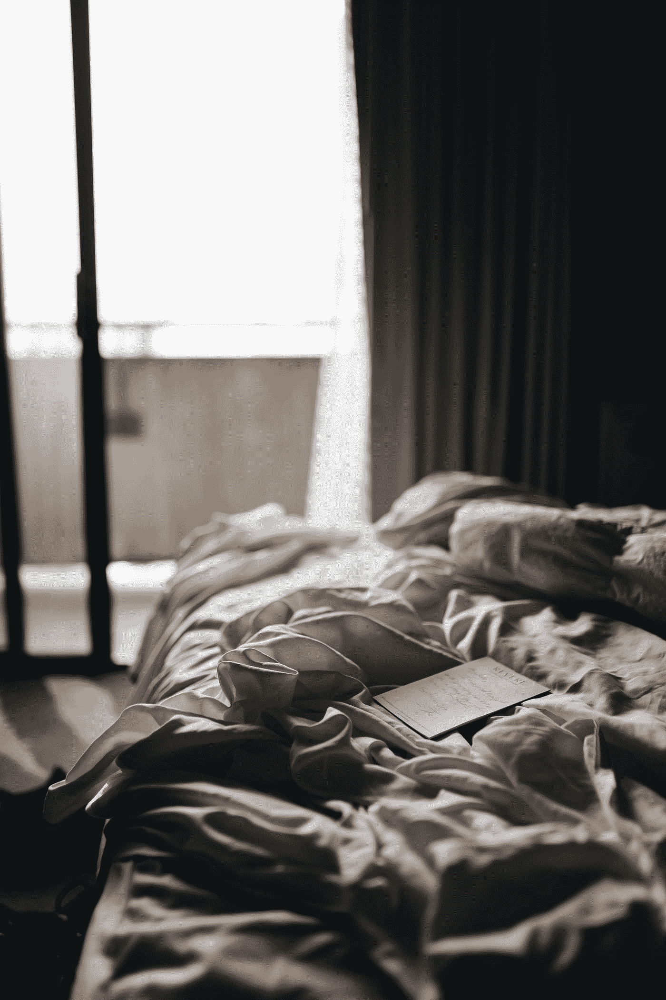
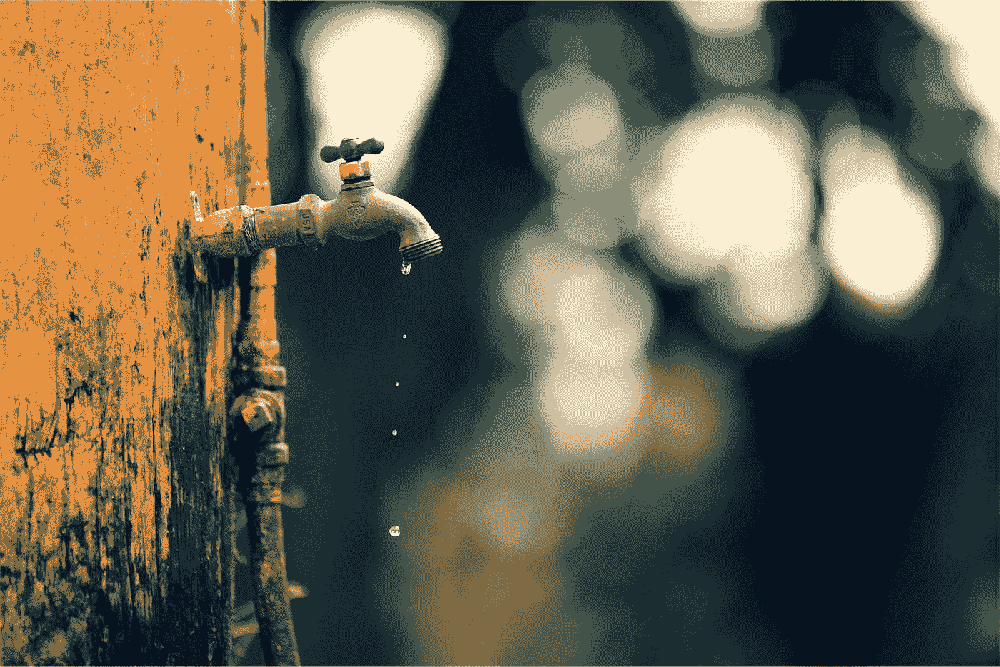
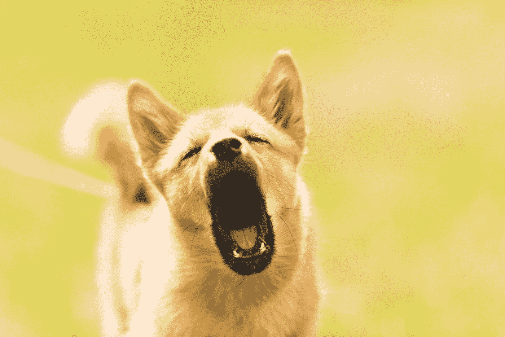

# 好客之道

> 原文：<https://medium.datadriveninvestor.com/a-handle-on-hospitality-65a067e61f35?source=collection_archive---------2----------------------->

Photo by [Matthew Hamilton](https://unsplash.com/@thatsmrbio?utm_source=medium&utm_medium=referral) on [Unsplash](https://unsplash.com?utm_source=medium&utm_medium=referral)

## 酒店地狱的故事，以及在竞争激烈的市场中给酒店经营者上的一课

这家小旅馆位于埃塞俄比亚拉利贝拉的主干道上，以其古老的科普特教堂遗址而闻名。现在是忙碌的时候，因为这个小镇的旅游业正在爆炸式增长，每个人都在争夺那块馅饼。巨大的全新场所正在俯瞰山谷的令人惊叹的悬崖上开放，像红岩拉利贝拉这样的小企业正在努力吸引客户，并把他们留在咖啡馆里。

我理解这种竞争。我喜欢过夜的地方通常是家庭经营的小旅馆或招待所，我会避开大的经营场所。然而，在经历了太多的问题后，我搬到了另一个家庭所有的地方，在镇上度过了最后一夜。

 [## 在创业之旅中，拥抱学习|数据驱动的投资者

### 好像建立一个数百万美元的公司还不够困难，企业家必须额外照顾他们的…

www.datadriveninvestor.com](https://www.datadriveninvestor.com/2018/10/16/on-the-entrepreneurial-trek-embrace-the-learning/) 

因为出现一名白人游客而被当地的朝[吐口水已经够有挑战性了，这并没有让我的访问有一个很好的开始。在覆盖着非常锋利的岩石和土地的陡坡上艰难地头球，在当地医院是一项挑战。](https://medium.com/writerontherun/ruination-of-the-special-places-ef559e3ae39a)

很有趣。

Photo by [carolyn christine](https://unsplash.com/@carolynchristine?utm_source=medium&utm_medium=referral) on [Unsplash](https://unsplash.com?utm_source=medium&utm_medium=referral)

# 自带

任何在非洲旅行过的人都明白，水、电和一些食品等基础设施的供应时好时坏，尤其是当你与较小的经营者打交道时。如何处理与客户如何处理这些问题息息相关。

也就是说:这个地区与水的可获得性作斗争。沟渠上的大量建筑意味着整个城市(它曾经是一个村庄，但现在不是了)经常缺水。尽管如此，人们还是会来的，因为古老的教堂是如此的吸引人。如果我们受到警告，你和我会泰然自若地容忍微小的不便*。*

水、电和各种食物都是有限的。考虑到气候变化、更多的游客和更多的建筑，这种情况会越来越糟。不仅仅是非洲，世界各地都是如此。

也就是说，这些事情本身都不是问题。如果 1)你没有被警告，你不能有准备地出现，2)你的老板和你争论，并尽力让你犯错，他们就会成为一个问题。

*看。如果你警告我，在这里的冒险的一部分是在酒店的有限的水，那么我会把它纳入计划并打包湿巾。用瓶装水在水槽中洗涤的小布。这成为故事的一部分，成为你一路上可以笑着欣赏的东西。这让露营变得更加舒适。这种不便不是主要问题。*

不是每个人都有时间提前调研，有时候这些情况发生在你到了之后。也就是说，这取决于经营者尽力缓解不适，这在某些情况下可能是一个真正的问题。

聪明的酒店经营者为不方便的客人提供简单的便利设施，让他们觉得缺水缺电不是什么大不了的事情。红岩没有这么做。也就是说，当你到达时，房间里有一小篮橘子和香蕉。这类事情会给人留下深刻印象，花费很少，让客人感觉好像管理层知道，当你需要刷牙或洗澡时，不能用自来水是很多人的痛苦。或者，没有网络，没有吵闹的邻居，没有糟糕的管道或者糟糕的服务，所有这些都发生在这家酒店。

如果店内的咖啡馆找不到食物(对于我点的除了米饭或鸡蛋以外的任何食物，最常见的反应是“吃完了”)，那么要么就不要把这些菜单项目放在菜单上。或者在菜单上提供合理的警告，说明它们都取决于市场供应情况。顾客可以应付这种变化，尤其是如果菜单让它变得有趣的话。那些事情确实很搞笑。

Photo by [Peter Bravo de los Rios](https://unsplash.com/@studio754?utm_source=medium&utm_medium=referral) on [Unsplash](https://unsplash.com?utm_source=medium&utm_medium=referral)

也就是说:中等窥视[迈克·亚历山大](https://medium.com/u/7af571ae1567?source=post_page-----65a067e61f35--------------------------------)刚刚写了这个:

*我在马拉维偏远地区的朋友点了披萨。在认真记下订单后，服务员感谢他们，并告诉他们“后天”再来。*

没错。与此同时，去找一个市场，备货，为后天的披萨做好准备。这很有趣。这些事情构成了最好的故事，但如果我们有一些暗示，有人必须先种植西红柿和磨小麦做外壳，他们会更好地管理。它赋予了白手起家全新的含义。

如果我知道咖啡馆靠不住，我会自己去买吃的。但是如果工作人员和我的导游在那里催促我点菜，而且已经很晚了，我累了和/或受伤了(我确实是)，那么让我知道。这不是一个问题，但如果我一直要求提供没有的食物，那么酒店经理就会和我争辩说，“担心食物不是酒店的工作。”

我不仅对这种愚蠢的争论感到震惊，事实上，我经常被逼着从他的咖啡馆点餐，这清楚地表明，他是在向人们施压做生意。当你有一家提供有前景的菜单的咖啡馆时，说保证食物不是酒店的工作，这不是一个好的举动。所以我在 Trip Advisor 上写了一篇坦率而真实的评论。

他到底想要什么，赞美吗？

Photo by [Gabor Monori](https://unsplash.com/@gabor?utm_source=medium&utm_medium=referral) on [Unsplash](https://unsplash.com?utm_source=medium&utm_medium=referral)

# 但是等等，还有更多。

不太贵的旅馆和招待所通常有便宜的设施，比如照明不好和管道不太好。任何去过很多地方的人都很熟悉将用过的卫生纸放入垃圾桶而不是冲水的做法。或者，不得不把水倒进抽水马桶来冲水。当然，两者都有。习惯了长长的户外厕所，或者有时充其量是一个遥远的灌木丛，也不是什么大不了的事。我没有准备好的是，当你坐在马桶上时，马桶会坏掉。毕竟，当你感到迫切的时候，这是一种诱人的舒适，而且在大多数情况下，你有权利期待它会带走你的体重。尤其是因为我个子小，设施是瓷制的，而且肯定足够强壮来管理比我大三倍的人。

如果我昨天没有在下山的时候被坚硬的岩石顶到，那会有趣得多。我的膝盖、一只手和左肩都严重擦伤，这些都需要几天才能恢复。因为我几个小时前刚出院，马桶水箱就在我身体不太舒服的时候坏了。如果说有什么不同的话，那就是在睡觉前解手后，我最想做的就是躺下睡觉。

突然，我不得不跳起来，收拾好所有的东西，让工作人员知道我们有紧急情况。我在这里故意用了“飞跃”这个词，因为我的右膝盖肿得很厉害，我的左手掌也肿得很厉害，呈紫色，我的左肩也是如此。我挣扎着站起来，光着的脚在湿漉漉的瓷砖上打滑。等待发生的事故。尽管如此，我还是得离开那个该死的房间。我看到了泰坦尼克号的景象(尽管有一个排水管，尽管考虑到目前为止的一切，我怀疑它会被堵塞)。

这又引出了另一个问题。头顶上的灯太暗了(可能是 20 瓦，我发现这在像这样的酒店里很常见)，几乎看不见。我快 67 岁了，鉴于我的眼睛已经不是最好的了，这增加了娱乐性。工作人员用一个更大的灯泡替换了以前的灯泡，但它仍然只有 20 瓦，是荧光灯。这就像试图在云层下的月光下寻找东西一样。

最后，我找到了我的小手电筒，这有所帮助，但并不多。作为一个旅行的婴儿潮一代，他们中的大多数人一开始就有不确定的视力，因为 Z 世代发现他们越过 40 岁，拥有最少的光线不仅令人讨厌，而且还可能非常危险。

我终于把我的东西拉在一起，拖拖拉拉，但仍然。然后我伸手去开门。

新问题。*无键*。这些门是用里面的钥匙锁上的，没有门钥匙我出不去。你能看到将要发生什么。我忍不住笑出声来。你不能瞎编。所以现在我被锁在一个迅速被水淹的酒店房间里。

我找不到它。最终，随着水继续涌入地漏(感谢上帝有地漏)，我把所有东西都扔回到床上。把一切都撕碎了。找不到。用我的手电筒，找遍了每一个角落。没有钥匙。反正我看得见。在这种情况下，它很可能在床罩上，仍然看不见。

最终，我不得不敲门，直到楼下的一个工作人员听到我。接下来是一长串对各种钥匙的摸索。大厅像地狱一样黑暗，但没有温暖，所以我听到一个又一个钥匙掉在地板上。她也看不见，这并不令人感到安慰。

最后门开了，三个女人走了进来。我告诉他们这个问题，他们打开手机手电筒，到处寻找我刚才寻找的地方。他们也找不到钥匙。

这时，水箱已经倒空，大部分水都流到地板上了。

女人们把我带到大厅里一个有两张床的房间。现在已经过了我的就寝时间，我从凌晨 3 点就起来了，我筋疲力尽，我的身体受伤了，女人们还在为钥匙的事烦恼。丢失的钥匙显然比客户更重要。然后他们打电话给经理，他刚刚看了我的旅行顾问评论，他想就镇上的水资源状况对我横加指责。

我没有心情。不仅如此，这个男人根本不在乎他那糟糕的水管刚刚坏了，淹没了房间。他想做的只是争论水有斑点怎么不是他的错。疲惫不堪，忍受着巨大的痛苦，被洪水淹没的房间连根拔起，现在又有一个经理对我咆哮，说他的酒店绝对应该得到一份评论，我很生气。我完全有权利这么做。

他终于明白了有一把丢失的钥匙，尽管我一再试图向他解释我把自己锁在酒店房间里了，他还是不停地向我灌输我可能把它放在哪里了。“你把它留在接待处了吗？”他一直在问。为了做到这一点，我不得不把自己锁在里面，从我的阳台上爬下大楼的外面，把钥匙交给接待处，然后爬上大楼的外面，以便保持被锁在里面。由于没有梯子或棚架，我不得不尽我最大的努力模仿攀岩，两个膝盖都不好，手掌严重肿胀淤青，左肩失去功能。

你明白我的意思。

Photo by [Luemen Carlson](https://unsplash.com/@lulusphotography?utm_source=medium&utm_medium=referral) on [Unsplash](https://unsplash.com?utm_source=medium&utm_medium=referral)

与此同时，他仍然在激烈地争论水的情况(我们已经讨论过了，此时评论已经发布，遗憾的是我不能把破裂的厕所添加到故事中)，并表现出明显的听力障碍，尽管他的英语相当好。

我把手机交还给现场经理。*我放弃*，我说。她走过走廊时，我能听到他们两人在争吵。

Photo by [Robert Gramner](https://unsplash.com/@robert_gramner?utm_source=medium&utm_medium=referral) on [Unsplash](https://unsplash.com?utm_source=medium&utm_medium=referral)

# 但是等等，还有更多。

红岩拉利贝拉位于主干道上，但人们的家-基本上是棚屋-紧靠着外墙。到处都是近乎野生的狗。其中一个是不确定年龄的硬毛混合梗。她是一只吠犬，就像猎犬一样。昨晚她汪汪叫个不停。晚安。很长。大约每秒一次，有时嚎叫。大多是尖锐的叫声。就在我的阳台下面。

你会认为这该死的东西会喉咙痛。没有。

在我躺在我的新房间里的所有时间里，我极度渴望有一个治愈的睡眠，这样我的身体就可以开始关键的过程(我三天后要在伯乐山骑 14 天的马，所以是的)我听那只该死的狗说话。有两次她退出了 30 秒。就是这样。

耳塞。我有。我在他们身上花了一大笔钱。它们不起作用。从来没有。因为不管有没有耳塞，耳骨都会将撞击力直接传递到你的头部。我们就是这样被制造出来的。如果有侵入性的噪音，我就睡不着。首先，我睡觉很轻。你加上一只狂吠的狗，就足以让你发疯了。确实如此。

狗不是他们的问题。这不是任何人的，除了她是属于某个人的，而这个人要么是聋子，要么坦率地说是不关心隔壁的客人(我宁愿怀疑后者)。浅睡是我的问题，但这是个大问题，因为如果我睡不着，我就无法工作。看啊。考虑到这些天我的膝盖不稳，当我休息好的时候，我会摔倒。你加上疲惫，我就是一场等待发生的事故。

我想掐死她。我不会，但如果我不承认某种致命的挫败感，那我就是在撒谎。其他人似乎都不在乎。我一放弃，她就闭嘴了，起身冒险进了我的新浴室。凌晨 5 点。

新房间的马桶座是塑料的，已经破损，几乎无法在马桶座上保持平衡。水桶没有勺子，所以我不得不举起整个沉重的容器，这通常不是什么大问题，但它的肩膀和膝盖受伤了。我很幸运没有掉进去。

那天早上我退房的时候，经理要求我支付修理费，就好像是我损坏了一个已经摇摇欲坠的马桶水箱一样。虽然相对来说不多，也许 30 美元，但这是原则。自从有一天晚上管理人员强迫我之后，基本上就是一场空了。一个聪明得多的策略应该是那天晚上向我收费，我会很高兴地支付这笔费用，而不是对我进行投诉，并就管道费用进行大规模的公开讨论，而是悄悄地使用这笔补偿的钱。这样，没有人受伤，没有人发生争执，管道得到赔偿，酒店经理也不会因为他必须是对的而客户是错的而受到伤害。

如果酒店经理想要一个好的评价，他需要更好地对待客人。比如:提前足够的时间警告他们水是一个问题(不稳定的互联网和电力也是一个问题，但这很常见)。出于好意，在房间里放几小碗便宜的水果。提前警告他们你点的菜单上的大部分东西都没有。比如:永远，永远，永远不要和客户争论，下定决心让他们犯错，然后大打出手。你得到了反馈。反馈是一份珍贵的礼物。如果你吐槽它，你不会喜欢结果的。

就像写给他的酒店所属组织的正式的、写得很好的、详细的信。我将要求对他的财产进行审查，并认真考虑将他从他们的供品中除名。如果这对他来说是个问题，我很抱歉。从我的角度来看，我不想让另一个客人经历我所做的。作为一名作家和旅行者，我有责任让人们知道会发生什么。

# 事实就是事实。我没必要美化它们——它们已经够糟了。他们给这位经理带来不便不是我的问题。

因为我从来没有打算回到拉利贝拉，最重要的是不要回到这个设施，在某种程度上，我把整个事件归咎于糟糕的财产、糟糕的管理和吸取的教训。

作为一个在迪士尼长大的人(我是一个终身的演员)，说我理解什么是客户服务是一种保守的说法。也就是说，我很难指望发展中国家也有同样的服务水平。然而，我的寄宿家庭主人提供的热情、感激、友好的欢迎掩盖了人们并不从根本上理解好客是什么样子的观念。我可能会看到一个灰色的泥院子，许多岩石和明显不太吸引人的窗外，但当我晚上 8 点上床睡觉时，那个男人让他的两个女儿安静下来，我睡得像死人一样。他的家人竭尽全力欢迎我们所有人。

我不总是同意客户是国王，因为有时客户是一个正义的滥用混蛋。但是说到住宿还是有一些基础的。如果客户不满意，就应该找出原因，并做出纠正。因为我们写作，我们写的东西会被阅读，而现在被阅读的东西会影响酒店的决定。

在一个蓬勃发展、竞争激烈的市场中，你不能滥用客户。