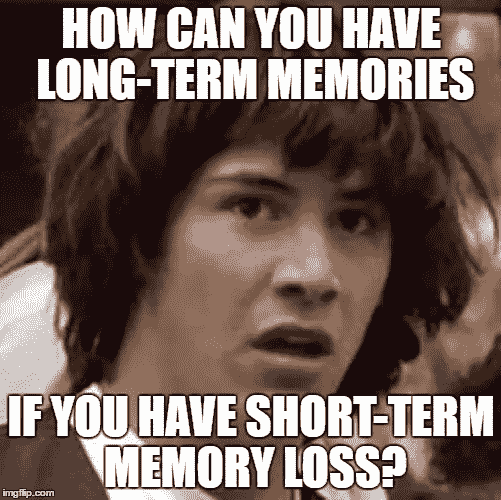
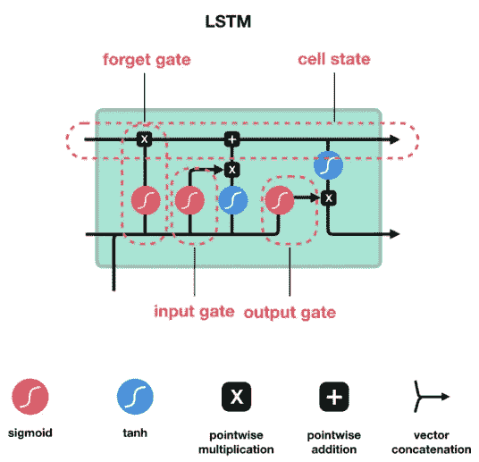

# LSTMs 的高级介绍

> 原文：<https://medium.datadriveninvestor.com/a-high-level-introduction-to-lstms-34f81bfa262d?source=collection_archive---------0----------------------->

# 什么是 LSTMs？

长短期记忆(LSTM)模型是一种递归神经网络(RNNs)，它能够通过使用调节网络信息流的**【门】**来学习和记忆长序列的输入数据。

LSTMs 解决了 rnn 的以下限制。

*   **短时记忆**——当移动到较晚的时间点时，丢弃较早时间点的信息，导致重要信息的丢失。
*   **消失梯度** —梯度是用于更新神经网络中使用的权重的值。如果一个梯度值变得极小，对学习没有太大贡献。在消失梯度问题中，梯度随着时间反向传播而收缩。
*   **爆炸梯度** —当网络不合理地赋予权重过高的重要性时，就会出现这种情况。

 [## DDI 编辑推荐:5 本机器学习书籍，让你从新手变成数据驱动专家…

### 机器学习行业的蓬勃发展重新引起了人们对人工智能的兴趣

www.datadriveninvestor.com](https://www.datadriveninvestor.com/2019/03/03/editors-pick-5-machine-learning-books/) 

# 它们是如何工作的？

当数据向前传播时，rnn 和 LSTMs 都传递数据。然而，与 RNNs 不同的是，LSTMs 利用门来决定是否应该保留或忘记信息。

一个 **LSTM 单元**由一个单元状态和利用几个激活功能的输入、遗忘和输出门组成。

LSTM Cell and its operations (Source: [https://towardsdatascience.com/illustrated-guide-to-lstms-and-gru-s-a-step-by-step-explanation-44e9eb85bf21](https://towardsdatascience.com/illustrated-guide-to-lstms-and-gru-s-a-step-by-step-explanation-44e9eb85bf21))

*   **遗忘门** —决定哪些信息应该保留，哪些应该丢弃。
*   **输入门** —更新单元状态。
*   **输出门** —决定下一个*隐藏状态(*包含先前输入的信息)应该是什么。
*   **单元状态** —充当沿序列链传输相关信息的高速公路。

使用的两个激活函数，

*   **Sigmoid** —挤压 0 和 1 之间的值。
*   **Tanh** —挤压介于-1 和 1 之间的值。

让我们看看信息是如何通过 LSTM 细胞流动的。

# 第一步

首先，来自当前输入的*先前隐藏状态*和*信息通过**遗忘门**，遗忘门具有一个 sigmoid 函数，它挤压 0 和 1 之间的值。如果结果值( ***f*** )接近 0，则表示应该忘记，如果接近 1，则保留。*

# **第二步**

然后，*先前隐藏的状态*和*T3*当前输入*通过**输入门。**该数据通过 **sigmoid** 和 **tanh** 函数并行传递，产生两组值。然后这两个值相乘得到一个输出( ***i*** )。*

# **第三步**

接下来，计算**单元状态**。首先，单元状态乘以 ***f*** (步骤 1 的结果)，然后加到 ***i*** (步骤 2 的结果)，得到**新的单元状态** ( ***c*** )。

# 第四步

在该步骤中，*先前隐藏的状态*和*当前输入*通过**输出门。**在这里，这些值通过一个 **sigmoid** 函数传递。产生的值与通过 ***c*** 通过 **tanh** 函数获得的值相乘。其输出是**隐藏状态**。

然后将**新单元状态**(步骤 3)和**隐藏状态**(步骤 4)带入下一个时间步骤。

这就把我们带到了这篇文章的结尾。我希望通过这篇文章，您对什么是 LSTMs 以及它们是如何工作的有了更高层次的理解。我在下面添加了一些关于这个话题的精彩文章。

*下次见……再见*

**参考文献**

 [## 了解 LSTM 网络——colah 的博客

### 这些循环使得循环神经网络看起来有点神秘。然而，如果你想得更多一点，事实证明…

colah.github.io](http://colah.github.io/posts/2015-08-Understanding-LSTMs/)  [## LSTM 和 GRU 的图解指南:一步一步的解释

### 嗨，欢迎来到长短期记忆(LSTM)和门控循环单位(GRU)的图解指南。我是迈克尔…

towardsdatascience.com](https://towardsdatascience.com/illustrated-guide-to-lstms-and-gru-s-a-step-by-step-explanation-44e9eb85bf21)