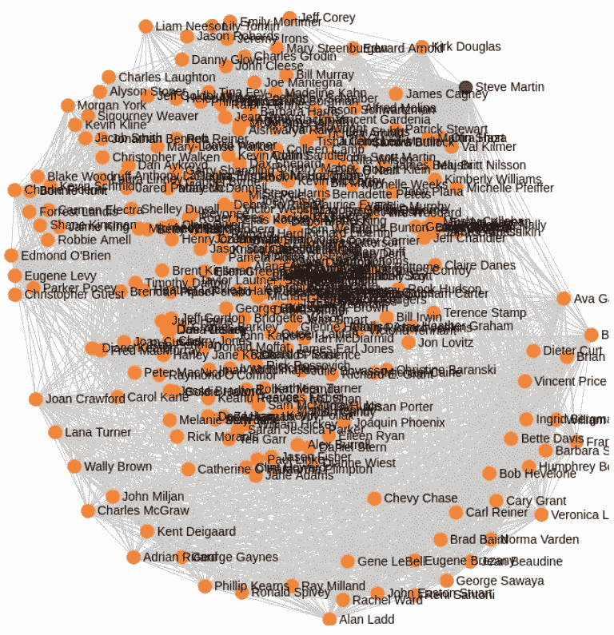
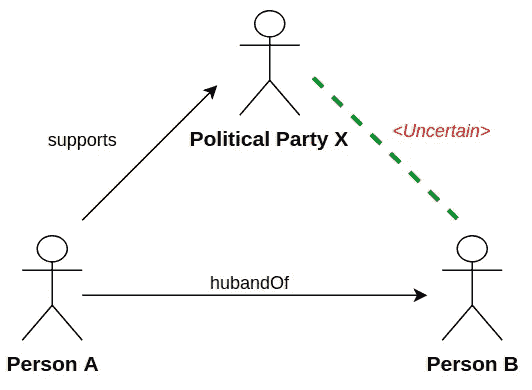
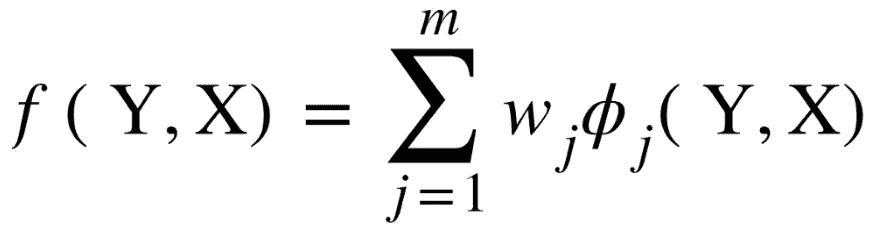
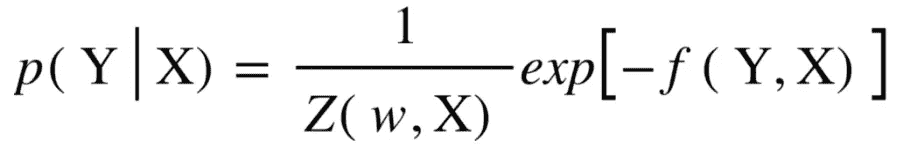
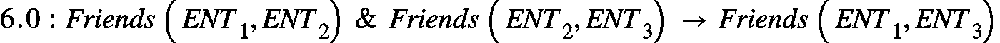
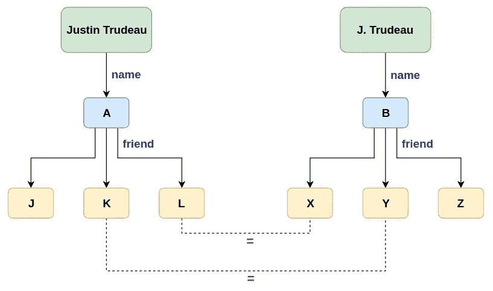

# 概率软逻辑的高级概述

> 原文：<https://medium.datadriveninvestor.com/a-high-level-overview-of-the-probabilistic-soft-logic-fbafad146b69?source=collection_archive---------4----------------------->

从早期开始，数据和信息就已经成为进化的枢纽，无论这些数据是被记录下来还是通过文字流传下来。随着互联网的出现，数据生成不断升级，产生了大量的数据。这种数据的大规模生成使得维护和传递一条信息的所有元素而不丢失其价值或内容元素变得更加困难。因此，为了从数据中理解和提取有价值的信息，机器学习算法被应用于数据分析。

___________________________________________________________________

*鸣谢:本博客基于 PSL 开发者的工作成果，并基于 Jay Pujura、Stephen Bach 和 Matthias Brö cheler 的出版物。*

*查看下一篇关于“* [*概率软逻辑背后的逻辑*](https://medium.com/@nayantara_35472/the-logic-behind-the-probabilistic-soft-logic-80616b425535) *”的帖子，为 PSL 的数学解围。*

___________________________________________________________________

数据可以被可视化为特征空间中的一组点。对这些数据点应用机器学习来完成分类、聚类和回归等各种任务，有助于我们收集有用的信息。

但是这种机器学习算法假设数据彼此之间具有相似性并且是独立的。当我们说数据点是独立的时，这意味着我们不能仅基于我们所拥有的关于另一个数据点的特征或信息来得出关于一个数据点的结论性决定。

事实上，这个世界并不是这样的。数据独立性变得越来越少，使得现实世界的实体和这些实体之间的关系紧密相连。这种相互联系现在可以被想象成一个网络或一个巨大的网。这种连接的数据被称为“关系数据”。

Figure 1\. A graph showing the interaction between a set of entities.

关系数据是一个大型网络，它由通过关系相互链接的相互依赖的实体组成。互联网和社交网站是关系数据的众所周知的例子。很容易观察到用户档案、互动、社交存在和平台如何能够融合在一起，形成一个信息网络。

与此同时，还有其他一些例子虽然没有明确提出“关系数据”，但仍然是关系数据的丰富来源。

例如，自由文本:从自由文本中收集实体和关系可以建立对内容本质的有用理解。

因此，我们需要确定不同实体之间的关系，并研究它们的概率模型以进行数据分析。这就是统计关系学习(SRL)发挥作用的地方。

# *统计关系学习*

因此，顾名思义，“关系学习”仅仅是试图确定两个实体之间是否存在某种类型的关系。除了前面的陈述，“统计关系学习”是了解两个实体之间存在关系的程度或概率。

例如，让我们来看下面的场景，其中 A 和 B 是两个人，X 是一个政党。A 与 B 的*夫*关系表明 B 是 A 的妻子，*支持*关系表明 A 支持政党 x，但没有相关证据表明 B(妻子)对政党 x 的立场

Figure 2\. Relational Dependency.

实际上，就 B 的立场而言，B 和 X 政党之间基本上存在三种关系。

1.  人物 B *支持*政党 x
2.  人 B *反对*政党 X
3.  人物 B *对*政党 x 中立。

考虑到我们没有足够的证据来支持上述任何一个论点，我们取这个图中实体之间的其他关系。因此，可以识别出人 A 支持政党 X。并且由于人 A 是人 B 的丈夫，所以人 B 也是政党 X 的支持者的可能性更高。因此，我们避免解决 B 反对 X 政党的想法，这是最不可能发生的。

这是“关系依赖”的一个简单例子。基于一种关系的存在，我们可以从概率上推断出另一种关系的存在或不存在。并且这些依赖性被用于对相互依赖的、连接的数据进行建模。

## *统计关系模型*

概率模型分为两大类。

1.  生成模型
2.  判别模型

生成模型采用一个可观察变量，并对未知变量进行建模。

例如:概率关系模型[1]，博客[2]，关系主题模型[3]。

判别模型在对不同配置评分时仅考虑未知变量。它们基于以下判别函数工作，其中我们基于观察变量 x 对未知变量 Y 建模。

该判别函数可以被翻译成概率分布，其中概率将与判别函数成对数比例。

判别模型的例子:马尔可夫随机场[4]，最大边际马尔可夫场[5]，结构支持向量机[6]和马尔可夫逻辑网络[7]。

## *PSL 框架*

PSL 是一个 SRL 框架，使用逻辑来定义 SRL 问题[8，9]。问题及其领域以逻辑的形式陈述，并作为模型建立。该框架由以下组件组成。

1.  断言
2.  原子
3.  规则
4.  设置

# 断言

在两个实体之间形成链接的关系称为谓词。

比如朋友(瑞秋，菲比)。如果瑞秋和菲比是朋友，“友谊”将是谓语。

# 原子

当关系被定义时，在一般意义上，就未知的、随机的或观察到的变量而言，它被称为一个原子。简单来说，

> 谓词+论元→原子

当我们将真实世界实体的实际值代入原子时，这就成了基本规则。一个基本规则在某种程度上可以被评估为真或假。

> 例如
> 
> 谓语:朋友
> 
> Atom:朋友(ENT1，ENT2)
> 
> 基本原则:朋友(瑞秋，菲比)

在 PSL，这些是连续的随机变量，除了简单的真或假，规则在某种程度上是真或假。如果我们说瑞秋和菲比做朋友的真值是 0.9，那么就代表了更牢固的友谊。

# 规则

规则以这样一种方式被写下来，使得它们显示实体之间的关系依赖。

例如

上述规则简单地说明了三元闭包的传递性。我朋友的朋友也是我的朋友。这些规则不总是对的，也不总是错的。但是他们总是坚持。因此，将为规则分配一个权重(如上面的原子中所示的 6.0)，以指示这些规则保持的频率或程度。这些权重仍然是相对的，并且可能因域而异。

# 设置

集合是原子的集合。

> *平均【朋友(瑞秋，X)】*

这种对基本规则的汇总有助于了解瑞秋的友谊，比如瑞秋是否保持着牢固的友谊。

这就是关系规则是如何在一个非常高的层次上被编写和评估的。

到目前为止，我们已经看到了关于 PSL 及其组件的简要概述。现在手头的问题是，当涉及到解决现实世界的场景时，我们如何使用这些关系规则。

# *PSL 的申请*

## **1。实体解析**

2 不同的引用可能指同一基础实体。由于两个引用的不同，它们的友谊链接也可能不同，从而导致围绕同一实体构建两个不同的模型。因此，实体解析是识别指向同一实体的引用的过程。

Figure 3\. Entity Resolution.

基于上述内容，我们可以得出以下关系依赖关系。

***如果两个实体同名，那么它们很可能是相同的。***

*   4.0:姓名(A，姓名 _A) &姓名(B，姓名 _B) &相似(姓名 _A，姓名 _B) ->同一个人(A，B)
*   在这种情况下，我们将直观的假设或依赖性转化为计算上合理的形式。

***如果 2 个实体有相似的朋友，那么它们很可能是相同的。***

*   2.5:相似的朋友(A，B) ->同一个人(A，B)
*   这表明，如果两个人有相同的友谊圈或社交网络，那么他们很可能是同一个人。

***如果 A=B and B=C，那么 A 和 C 代表同一个人。***

*   20.0:同一个人(A，B) &同一个人(B，C) ->同一个人(A，C)
*   这条规则基本上就是实践中经常适用的及物性原则。

因此，它将被赋予相对较高的权重。

## **2。链接预测**

在构建关系依赖时，并不是所有的实体都有足够的数据来支持它们之间的关系链接。这与图 6 中所示的场景相同，其中我们没有直接的足够证据来支持妻子与政党 x 的支持关系。但是我们决心根据她丈夫的支持关系来预测她的支持。

我们可以使用一个不同的真实场景来阐述这个应用程序，在这个场景中，我们有一个基于办公室之间交换的电子邮件消息构建的关系依赖网络。此实例的链接预测将呈现以下内容。

***如果电子邮件消息类似于特定类别或类型的电子邮件，则它是该类别或类型的。***

*   1.0:包含(电子邮件，'到期')-> HasType(电子邮件，'截止日期')
*   如果一封电子邮件包含单词 due，比如“due by”，那么它就是一个截止日期。

***如果 ENT1 向 ENT2 发送一封类型为 deadline 的电子邮件，那么 A 就是 b 的主管***

*   2.5:已发送( *ENT1，ENT2* ) & HasType(电子邮件，“截止日期”)- >主管( *ENT1，ENT2* )
*   如果实体 *ENT1* 向 *ENT2* 发送类型为“截止日期”的电子邮件，则 *ENT1* 是*T21【EN的主管。*

***如果 ENT1 是 ENT2 的上司，ENT1 是 ENT3 的上司，那么 ENT2 和 ENT3 就是同事。***

## **3。集体分类**

集体分类在预测公众的政治观点和偏见方面非常有用。这项任务可以在一定程度上使用传统的机器学习来执行，如逻辑回归和朴素贝叶斯。

例如

*   如果我们知道有人从收容所领养了一只小狗，那么可以肯定地认为这个人是一个爱狗人士。

虽然这使得任务看起来像是个人分类决策，但在得出结论时，该决策需要考虑关系信息和社会网络。观点是相互关联的，并且依赖于紧密结合的关系依赖。因此，我们把整个网络放在一起，同时给它贴上标签。这种标记填补了关系依赖的空白，并为轻松预测或分类数据铺平了道路。

# 摘要

综上所述，

*   传统的最大似然算法处理相互独立的数据。
*   例如分类、聚类和回归
*   但是随着互联网和数据的大量产生，数据之间的关系依赖已经被识别。
*   这种关系依赖形成了一个巨大的互联数据网络，可以将其可视化为图形。
*   在图中，有实体和关系在最低层连接两个实体。这种三重关系被称为谓词。
*   谓词可以被映射为原子，作为带有一些通用变量的规则。
*   将实际值代入一般规则被称为“基础”，并产生一组“基本规则”。
*   基本规则将被赋予从 0 到无穷大的权重。这些权重将作为这些规则保持多久的指示。
*   最后，我们研究了如何通过替换文字将直觉假设转化为逻辑规则。

因此，PSL 有助于发现已确定的规则在多大程度上有效，因此本博客提供了 PSL 在更高层次上如何工作的概述。[同一主题的后续文章将阐述这一理论，从数学上处理它所使用的函数和公式](https://medium.com/@nayantara_35472/the-logic-behind-the-probabilistic-soft-logic-80616b425535)。

# 参考

[1]柯勒特区(1999 年 6 月)。概率关系模型。归纳逻辑编程国际会议(第 3-13 页)。斯普林格，柏林，海德堡。

[2] Milch，b .，Marthi，b .，Russell，s .，Sontag，d .，Ong，D. L .，和 Kolobov，A. (2007 年)。1 博客:未知对象的概率模型。统计关系学习，373。

[3]张，j .，，布莱，D. (2009 年 4 月).文献网络的关系主题模型。人工智能和统计学(第 81-88 页)。

[4]罗扎诺夫，Y. A. (1982 年)。马尔可夫随机场。马尔可夫随机场(第 55-102 页)。纽约州纽约市斯普林格。

[5]塔斯卡尔，b .，盖斯特林，c .，和柯勒，D. (2004 年)。最大边际马尔可夫网络。神经信息处理系统进展(第 25-32 页)。

[6]薛，陈，杨，秦(2008 年 9 月).结构支持向量机。国际神经网络研讨会(第 501-511 页)。斯普林格，柏林，海德堡。

[7]m .理查森和多明戈斯，P. (2006 年)。马尔可夫逻辑网络。机器学习，62(1–2)，107–136。

[8] Pujara，j .，Miao，h .，Getoor，l .，和 Cohen，W. (2013 年 10 月)。知识图识别。在*国际语义网会议*(第 542–557 页)。斯普林格，柏林，海德堡。

[9]m .布罗谢勒、米哈尔科娃和格图尔(2012 年)。概率相似逻辑。 *arXiv 预印本 arXiv:1203.3469* 。