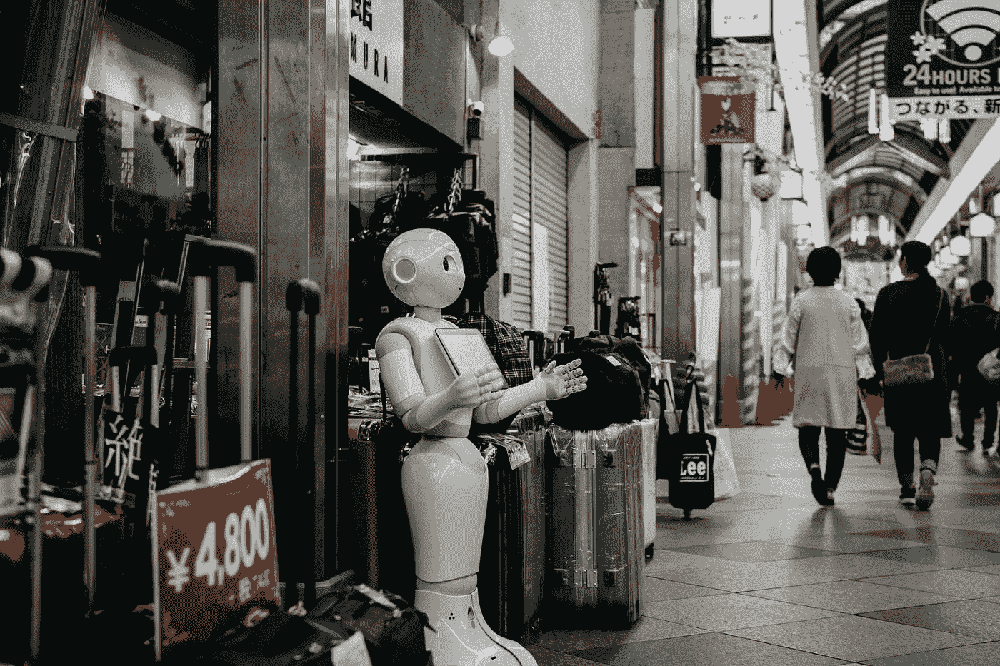

# 人道的明天

> 原文：<https://medium.datadriveninvestor.com/a-humane-tomorrow-4858a5832c91?source=collection_archive---------30----------------------->

在人类历史上，现在从来没有如此短暂过！技术进步以一种不可思议的速度发生，在我们能够理解它之前，机器的普遍存在已经深深扎根于我们的日常生活中，完全改变了我们的生活方式。

虽然智能手机计算器在诞生之初是一个“值得拥有”的功能，但它已经严重影响了全球的计算能力。大约 10 年前，我们可以轻松计算出 27 * 63；现在，几乎我们所有人都会在尝试使用该应用程序之前先使用它。智能手机并没有仅仅杀死闹钟手表、相机、手电筒和台式电话；它们还几乎扼杀了我们集中注意力的能力，使人类的集体注意力下降了三秒钟！客观地看，一个普通美国人一天触摸手机的次数高达 2617 次。随着手机变得越来越智能，我们变得越来越笨。

机器学习和人工智能的进步已经超越了估计，越来越多的智能机器正在连接到*云*以相互交流，并促进我们生活在一个更轻松的世界。虽然所有重复和平凡的工作都由机器完成的世界是一个令人向往的乌托邦，但我们有没有具体考虑过它的后果？让我们对此进行更深入的研究，并确定对人类影响的三个渐进层次:

——***存在危机***——自动化来了，它将取代人类。从流水线工厂工人到车辆司机到农民到招聘人员甚至律师；机器正在匹配，如果不是超越，人类的能力。虽然规模经济是会弥合贫富差距还是会进一步扩大这一问题还没有定论，但迫切的问题是，人类在空闲时间会做些什么有成效的事情，人类是否还有比机器做得更好的途径？

- **认知能力下降**——在一万年的进化过程中，我们越来越少地使用我们的体格，因此，我们的体格比早期人类小。阿尔伯特·爱因斯坦的双手远不如他狩猎采集的祖先灵巧，然而，他在生活中取得的成就却远远超过了祖先们累积的成就。原因是，他那个时代的工具和机器增强了身体，使他能够增强认知，这对他产生了奇迹。但是现在，随着认知的*自动化而产生的问题是，我们会在创造性的层面上进一步进化，还是只是无所事事地变得不如人类？*

- **转移中心**——机器变得更好，人类变得更差。由于贪婪推动的狭隘视角和短期愿景，我们创造了一个选举受社交媒体影响、闪电崩盘吞噬股市、病毒破坏核离心机稳定以及流氓人工智能需要定期关闭的世界。随着集成度的提高和计算能力的增强，机器正有规律地控制着我们的互动，塑造着我们的视角。我们有没有意识到我们不再有手指按在“关”的按钮上？

所有这些都不是新技术的直接结果，但所有这些都是普遍无法察觉个人和企业贪婪的更广泛的网络化影响的产物，这种影响因不透明、技术增强的复杂性而加速。在不久的将来，我们人类仍然处于这个机器驱动的世界的喧嚣中心，尽管不断放松对今天的机器木偶的控制。

需要对我们的集体认知和价值体系进行反思，以确保进步不仅是快速的，而且是丰富和包容的。我们需要优化和培养我们的个人天赋，以创造具有更高价值的智能系统，这些系统不是控制而是授权。

就像抚养一个孩子一样，我们需要集体和有意识地思考我们给予明天的智能机器的道德和价值观，而不是今天！从利润驱动型组织向目标驱动型组织的转变不仅对于创造更好的工作场所至关重要，对于创造更好的机器也是如此。当今世界不能承受其技术变革被狭隘和贪婪的企业前景所驱使。相反，我们需要确定正确的途径，纳入正确的自动化水平，最重要的是，为机器学习*提供一个整体的、道德上合适的环境。*

毕竟，当机器明天真的占据中心舞台时，它们的情感智能几乎和它们的人工智能一样重要。只有到那时，它将是一个由机器驱动而又人性化的明天，人类仍然在中心而不是下面！