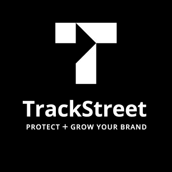
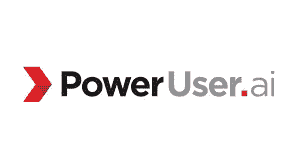

# 人工智能取代土耳其机器人

> 原文：<https://medium.datadriveninvestor.com/a-i-replacing-the-mechanical-turk-330096e3e642?source=collection_archive---------23----------------------->

一些公司引发了我的兴趣，我注意到它们之间的一个共同主题:它们利用人工智能来取代原本需要机械土耳其人的工作。

TrackStreet 搜索电子商务网站，以确保零售价格的完整性。当你的产品卖得太便宜时，会损害你的品牌。这也可能是商品被盗、未经授权的经销商、无效的销售渠道或零售商不遵守您的转售政策的迹象。在 TrackStreet 之前，需要很多员工拜访你所有的零售合作伙伴，并猜测哪些可能在未经你允许的情况下销售你的产品。有了人工智能，它就可以作为软件使用。

 [## 人工智能与创造力:梦想成真——数据驱动的投资者

### 人工智能总是让我着迷。不仅作为一套有用的工具，不断发展，而且作为一个…

www.datadriveninvestor.com](https://www.datadriveninvestor.com/2019/01/28/ai-creativity-deep-dream-comes-true/) 

新知识利用人工智能来监控围绕你的品牌发生的在线对话，在提供可操作的报告和提供反击服务之前识别虚假信息活动(例如，公关代表、分析师、执法介绍)。一个社交媒体团体可能会花时间监控你的提及和谷歌提醒，而人工智能现在会搜索整个互联网来保护你的声誉。

PowerUser 提供了一个自然语言界面来取代 Salesforce 顾问，通常可以为公司节省数百万美元的外包专家费用。只需在 Slack 中与 PowerUser 聊天，过去难以表达和实施的配置现在可以在几分钟内付诸实施。通过 PowerUser，人工智能取代了人员密集型组织，这些组织可以通过增加员工数量来提高吞吐量。

这些公司的替代品是代理机构或内部员工。对于这些机构向客户收取的费用，很难在保持利润的同时提供大量的工时来服务客户；因此，服务质量会受到影响。此外，随着规模的扩大，雇佣、培训和管理员工以保持现有服务水平变得越来越困难。AI 解决了这一切。