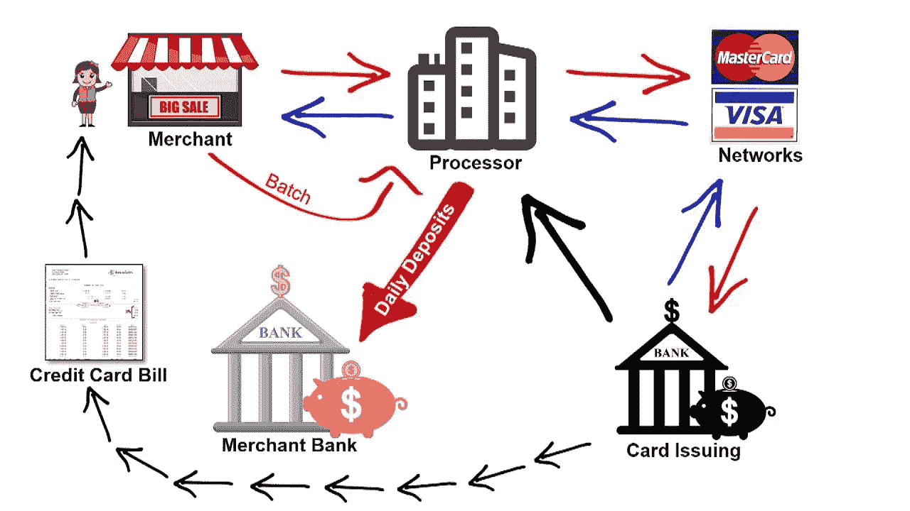

# 金融科技行业之旅

> 原文：<https://medium.datadriveninvestor.com/a-journey-in-fintech-industry-1c92611ae129?source=collection_archive---------6----------------------->

去年，我一直致力于开发支付应用和网关。后来我才知道这叫 FinTech。通过这一年，我对这个行业了解了很多。在这篇博客中，我将与你分享。所以不浪费时间，让我们开始吧。

google images. [source](https://www.cio.co.ke/events-list/fintech-summit-2018/)

# 什么是金融科技..？

它是金融技术的简称，是利用技术和开发来增强支付体验的结合。传统的金融方法有点无聊，有很多计算，有走错一步的风险，会让人沮丧和愤怒。随着技术和软件的发展，人们的生活变得更加轻松，有必要参与支付行业。支付部分总是大多数应用程序开始时试图避免的部分，由于其复杂性，与银行打交道也不是最好的体验。所以我们需要一个解决方案。一个**支付网关**是一个中间人，负责与银行和商户打交道。

 [## 金融科技初创公司正在扰乱世界各地的银行业-数据驱动的投资者

### 传统的实体银行从未真正从金融危机后遭受的重大挫折中恢复过来…

www.datadriveninvestor.com](https://www.datadriveninvestor.com/2018/10/20/fintech-startups-are-disrupting-the-banking-industry-around-the-world/) 

# 什么是支付网关..？

基本上，它是一个商家服务提供商，让商家使用信用卡或直接支付处理电子商务。这里的商家是向普通用户提供服务的电子商务应用程序，通过与支付网关集成，这些商家客户端能够向商家支付和转账。让我们举一个例子。假设你有一家初创公司，通过飞行汽车把人从地球带到火星，票价是 50 美元，你通过信用卡从客户那里获得资金。所以您与接受信用卡支付的网关集成。因此，当有人预订机票时，他会输入他的信用卡信息，然后点击“现在支付”，然后付款成功，钱被转移到你的银行账户。作为一名企业主，你希望你的团队更专注于你的创新想法，而不必处理所有的付款事宜。

这是一个支付网关的角色，它给你一个 API，当用户点击**【立即支付】**时，用户输入的所有支付信息都将在网关级别处理，而在你的应用程序上，你将只等待成功或失败标志。

# 信用卡处理是如何工作的..？

开始之前，您需要了解一些术语:

> **开证行=客户银行**
> 
> **收单行=商户银行**
> 
> **处理器=支付网关公司**
> 
> **网络=维萨、万事达、美国运通……**

1.  顾客出示卡并在 POS(销售点)设备上刷卡。
2.  处理器向支付处理器网络发送授权数据。
3.  开证行根据可用资金批准或拒绝交易。
4.  周期返回一个批准或失败标志
5.  发卡银行把钱寄给加工商，以补偿他们所购买的商品。
6.  然后，商家将其所有交易发送到处理器，将这笔钱存入商家银行账户。
7.  发卡银行将向客户发送一份关于所发生购买的账单。

credit card payment cycle [source](https://www.youtube.com/watch?v=avRkRuQsZ6M&t=401s)

在这个周期之后，在每个人收取他们的费用之后，钱将被存入商家的银行账户。

作为商家，与支付网关集成要容易得多，支付网关提供更新的 API、支持，并热衷于对其服务的持续反馈和开发。这也省去了银行与商户打交道和支持他们的许多麻烦，他们可以更专注于金融业务。

# 作为软件工程师，这些信息对我们有什么用..？

了解你所在的行业是一项非常重要的技能。不要误解我的意思，技术知识非常非常重要，但你需要了解你所在的行业，以及谁会使用你的服务，这样可以帮助你在开发新功能时拥有更广阔、更好的视角。作为一名软件工程师，让更多地了解你所在的行业，尤其是金融科技行业成为一项常规活动，是你工作的一部分。了解它是如何工作的。有哪些可能被用来对付你的后门？具备基本的安全知识，因为这类服务对黑客很有吸引力。最后，你需要明白，你正在做一件非常冒险的事情，一个小小的错误可能会让公司损失惨重，并导致公司名誉扫地。

谢谢你。

如果你有任何问题，欢迎在评论区提问，我会回答你的。