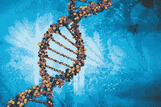
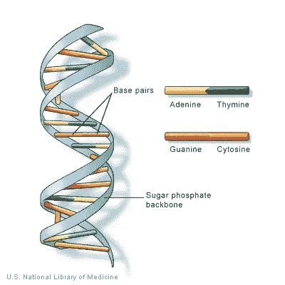
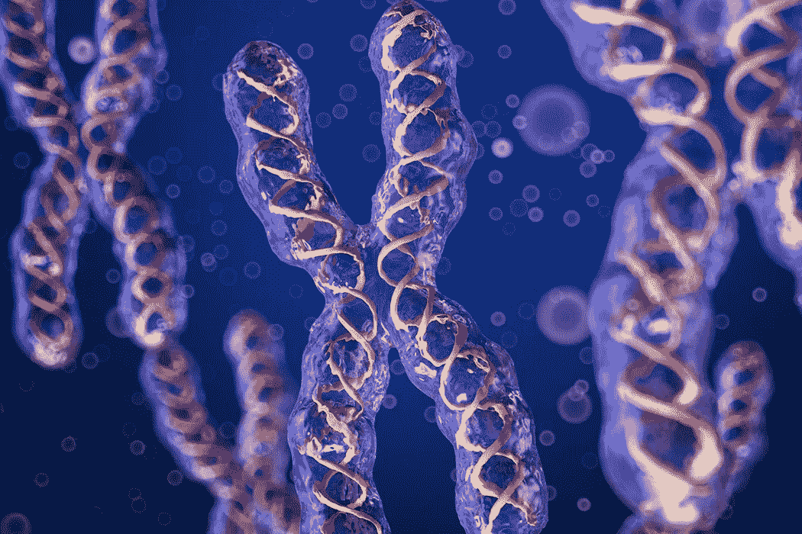
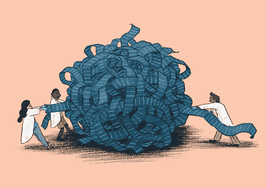
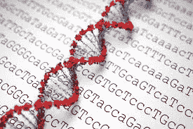
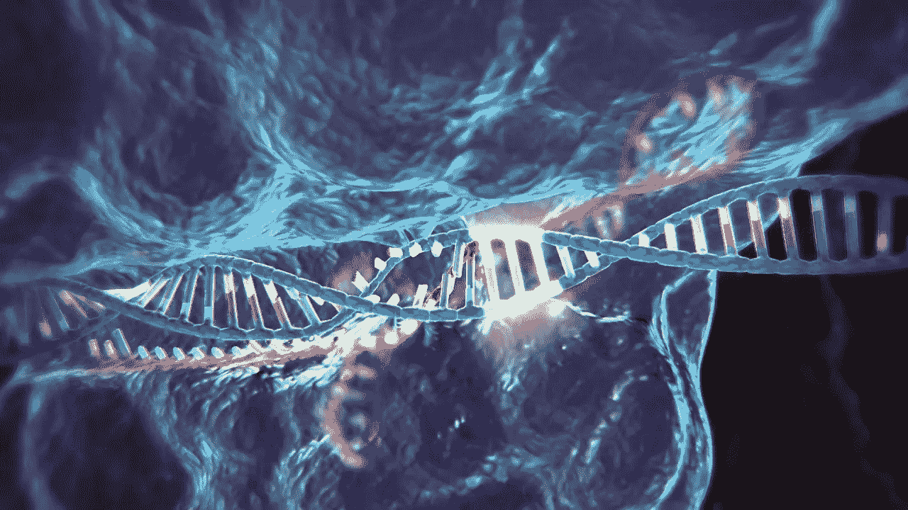
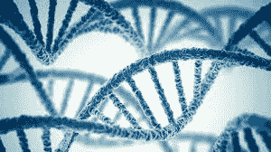

# 基因组之旅

> 原文：<https://medium.datadriveninvestor.com/a-journey-into-the-genome-a6235c8eb81f?source=collection_archive---------3----------------------->

## DNA、等位基因和恐龙。🦕

> 你们的科学家太专注于他们能不能做到，而没有停下来想想他们是否应该做到

这句名言来自我最喜欢的电影之一《侏罗纪公园》。

当我第一次看它的时候，我被一个想法迷住了，那就是有一天我们真的可以让恐龙复活。

这部电影是激发我对科学和基因组学热情的主要因素之一。

 [## 准备在 2019 年改变世界的技术-数据驱动的投资者

### 很难想象一项技术会像去年的区块链一样受到如此多的关注，但是……

www.datadriveninvestor.com](https://www.datadriveninvestor.com/2019/01/17/the-technologies-poised-to-change-the-world-in-2019/) 

今天，我仍然经常问自己，我们能否通过基因编辑让恐龙重新存在。

但是，正如开篇所言，围绕编辑基因组有很多伦理上的争论……所以也许我们现在还不应该开始编辑恐龙🦖

# 什么是基因组？🧬

基因组超级棒。

它**含有一个生物体的全套 DNA** 或**脱氧核糖核酸。**我们基因组的副本和超过**30 亿个 DNA 碱基对**(这是一次从地球到月球的旅行 **6000 次**)**。组成它的物质储存在我们身体每个细胞的细胞核中。**我们少量的 DNA 也储存在**线粒体**(或者你可能记得在科学课上→“细胞的发电站”😉").

The genome.

## 我们的 DNA 基本上就是我们的指导手册。

它是一组指令或代码，决定了生物体的特征。

## 树木、人类、恐龙和草莓都有基因组。

最疯狂的是我们的基因组没有太大差别。我们 99%的 DNA 和世界上其他人一样。正是这最后 1%的独特基因序列和等位基因造就了我们(稍后会详细介绍)。

# 所有的 DNA 都是由四种化学物质或核酸的独特组合构成的:

## **甲** —腺嘌呤

## c-胞嘧啶

## 胸腺嘧啶

## g-鸟嘌呤

a 的和 T 的& C 的和 G 的相互形成**碱基对**。(当这种情况没有发生时**基因突变**发生)。这些碱基中的每一个都与一个磷酸分子和一个糖分子相连。**一个碱基，磷酸盐+糖分子**，形成一种叫做**“核苷酸”**的东西。

**两条核苷酸**排列成**形成螺旋梯**形状，称为“**双螺旋**”，碱基对充当梯级。双螺旋梯紧紧盘绕在一个叫做**“染色体”的结构内**

所有人类都有 **23 对染色体**，总共 **46 对**。我们父母各出一半。这 46 条染色体储存在一个细胞的**细胞核中。**

The magical chromosome.

# 我的基因组是如何造就我的？

你从父母那里继承了你基因组中的基因，父母是你基因组的一部分。

有趣的事实:人体内有超过 20，000 个不同的基因。

基因是 DNA 或 RNA 中的核苷酸序列。编码特定分子，具有功能。

你独特的基因序列给了你造就你的特征。

例如，**OCA 2 基因**是**影响眼睛颜色的八个已知基因序列之一。这是你是否会有棕色眼睛、蓝色眼睛或任何其他变化的决定性因素👀**

我们的基因组中还有一种叫做**“等位基因”的东西**基本上，等位基因是基因的另一种形式或基因的一种**变体形式**，控制着许多造就我们的特征。它们位于我们染色体的特定位置。

举个例子，

拿着这些紫色的花。

They’re super pretty, right?

不是所有的花都是紫色的，如果不是所有的花都是紫色的。此外，薰衣草(^^上图中的花)还有其他不同的特征(气味、形状、大小等)。)相比其他的花、植物、生物。人类看起来与薰衣草非常不同，但我们在基因组上有许多相似之处。

## 那么，薰衣草、人类和其他物种的区别是什么呢？

等位基因！

wp-14 等位基因在浅紫色花中占主导地位，赋予它浅紫色。

在每个基因组内部，显性等位基因控制着区分不同生物的特征。

# 了解基因组

为了理解基因组，我们必须知道基因组是由什么样的 A、T、C 和 G(核酸)组合而成的。

不幸的是，我的眼睛看不到分子尺度的任何东西，所以在那之前，我无法观察基因组并找出其中的模式。(直到我们找到控制我们视力的等位基因或基因+🤔).

Sequencing the genome by hand is really slow.

目前这样做的方法叫做:**“基因组测序”**

这是找出基因组核酸序列的过程。

基因组测序包括可以对核苷酸(DNA 的基本结构成分)进行测序的任何技术或方法。

最有效的测序方法之一是基因组测序，称为**“全基因组测序”**

# 全基因组测序(WGS)是最有效的基因组测序方法。

这是因为 WGS **在一个给定的时间对一个有机体的整个基因组进行测序。**

这包括染色体 DNA 测序，以及储存在植物叶绿体线粒体中的 DNA。

WGS helps you decode the genome.

# WGS 是如何工作的？

简而言之，WGS 包括从染色体、叶绿体或线粒体中提取生物体基因组的副本，并通过机器运行，以获得基因组的**逐碱基视图**。

从本质上说，这意味着你将看到生物体的遗传密码是什么样子的，并了解碱基对的顺序。

像这样的信息对于**识别疾病、跟踪疾病、描述可能导致疾病的突变以及许多其他应用非常有用。**

像 [**Illumina**](https://www.illumina.com/) 这样的公司，做 WGS，可以帮助**分析你的遗传密码**来检测这些疾病，了解你的遗传数据说了你什么。

# 那么，如果我想编辑我的基因组呢？

这叫做:**“基因编辑”**基因编辑是**基因工程**的一种，其中 **DNA 被移除、插入、修改或替换**在活生物体的基因组内部。

听起来有点像在电脑上打字。我们删除、插入、修改和替换字符。只不过，基因工程没那么容易。

CRISPR Cas-9 ✂️

目前，**“CRISPR Cas-9”**这是一种使基因编辑变得容易的 **RNA。**

它是 DNA 序列 CRISPR 家族的一部分。这些序列具有检测和破坏 DNA 的能力。

**Cas-9 使用 CRISPR 序列，并与 Cas-9(一种蛋白质)核酶结合，这意味着它可以切割 DNA。**

研究人员发现，我们可以改造 Cas-9，通过改变其指导方针来匹配目标，从而改造任何 DNA 序列。

在部分 DNA 被 Cas-9 RNA 切割后，一个新的 **DNA 模板**可以取代切割的末端。这取代了原来的 DNA 序列。

CRISPR Cas-9 可以用于婴儿的**干细胞**和**胚胎**(目前对婴儿进行基因编辑，然后对成人进行基因编辑要容易得多)。

Lulu & Nana gene-edited babies

这两个婴儿是由香港的一位科学家使用 CRISPR 进行基因编辑的。他们被编辑成对未来的艾滋病毒感染免疫。😎

现在，这是否道德是一个巨大的争论，在基因编辑社区的其他人中间，就像侏罗纪公园里的基因编辑恐龙一样。

# TL；博士:

*   基因组包含我们的 DNA，它的完整副本储存在我们身体每个细胞的细胞核中。
*   我们的 DNA 是双螺旋结构，包含核酸(A、C、T 和 G)。
*   我们的 DNA 是我们的遗传密码，它造就了我们。
*   **基因+等位基因控制着我们从父母那里继承的不同特征。**
*   **全基因组测序是一次对整个基因组进行测序的过程。**
*   **CRISPR Cas-9 是一种用于编辑基因组的方法。**
*   **了解基因组并使用基因编辑技术将彻底颠覆医疗保健行业。**

**基因组造就了我们**。我们的遗传密码赋予我们从外表到性格的一切。随着基因组测序和 CRISPR Cas-9 等指数级技术用于基因组编辑，我们现在可以进一步探索我们基因组的分子世界。这使我们有可能以更有效的方式检测和预防疾病，并将改变世界。尽管，还有很多伦理上的讨论。我知道基因编辑技术将会颠覆医疗保健行业，在我们根除疾病后，我真的希望有一天我能通过基因编辑让恐龙从灭绝中恢复过来。🦖

The genome is dope!

**如果你喜欢这篇文章:**

*   **与你的网络分享🙏**
*   给它一些掌声，并在评论中给予反馈
*   关注我的媒体博客，获取更多类似的文章。
*   **通过**[**Linkedin**](https://www.linkedin.com/in/adara-hagman-78a563171/)**与我联系，了解我的基因组之旅，并给我发消息(我喜欢结识新朋友)。**
*   **关注我** [**推特**](https://twitter.com/astro_adara) **。**
*   **查看我的 TKS 生活** [**作品集**](https://tks.life/profile/adara.hagman) **，查看我过去所有的时事通讯&项目。**
*   **订阅我的** [**简讯**](https://adara2.typeform.com/to/xbuEok) **，每月更新我正在做的事情！**

**感谢阅读！现在去改变世界吧！❤**