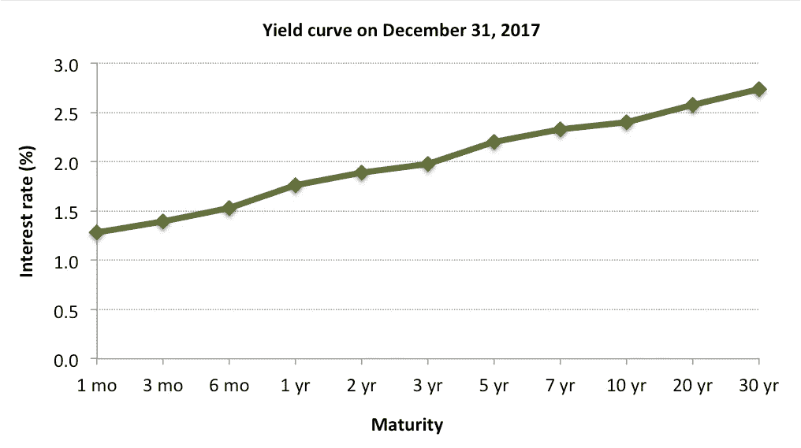
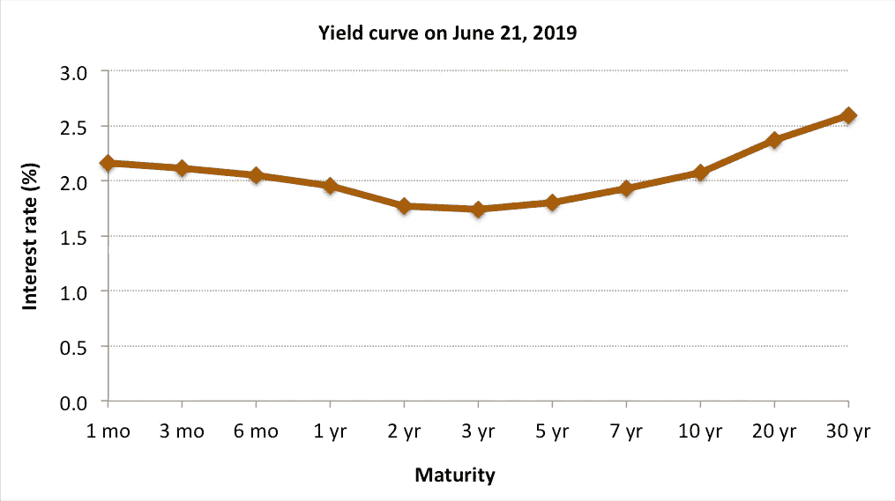
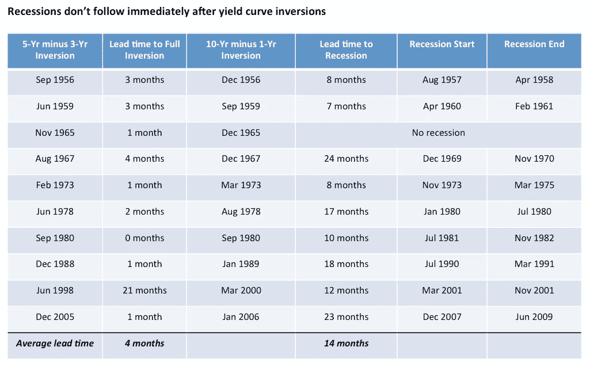
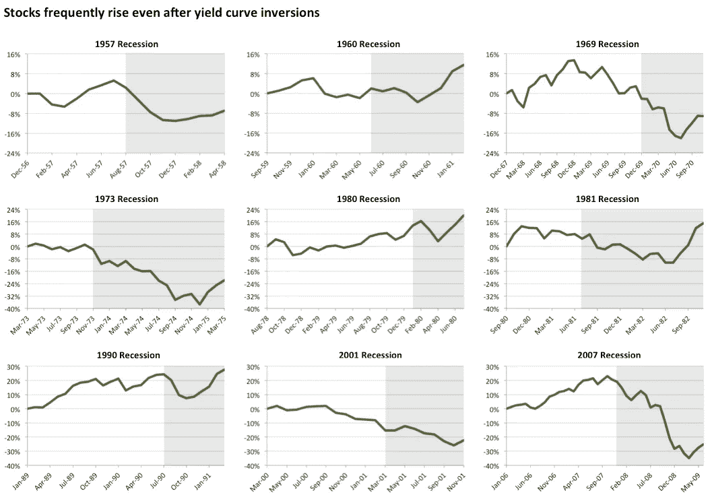

# 一个关键的经济指标指向衰退，但股票却处于历史高点。怎么回事？

> 原文：<https://medium.datadriveninvestor.com/a-key-economic-indicator-points-to-recession-but-stocks-are-at-all-time-highs-what-gives-40fa7a48f90b?source=collection_archive---------1----------------------->

Photo by [Liam Simpson](https://unsplash.com/@liamsimpson?utm_source=unsplash&utm_medium=referral&utm_content=creditCopyText) on [Unsplash](https://unsplash.com/search/photos/thinking?utm_source=unsplash&utm_medium=referral&utm_content=creditCopyText)

如果我必须选择一个单一的经济指标来预测美国经济的走向，那一定是收益率曲线。

但是到底是什么呢？

 [## 算法交易的机器学习-数据驱动的投资者

### 当你的一个朋友在脸书上传你的新海滩照，平台建议给你的脸加上标签，这是…

www.datadriveninvestor.com](https://www.datadriveninvestor.com/2019/01/30/machine-learning-for-stock-market-investing/) 

收益率曲线简单来说就是各种期限(1 个月到 30 年)的美国国债利率图上的曲线。

短期利率(或收益率)，即期限较短的利率，通常会根据美联储(美联储)的表现或未来一两年的预期表现而上下波动。如果经济增长强劲，如果美联储认为存在过热风险，他们就会加息，短期收益率曲线就会上升。另一方面，如果他们认为衰退迫在眉睫，他们倾向于降低利率。

现在，长端(即 5 年期或更长时间)的利率通常高于短端，反映了更广泛的债券市场。如果投资者预期更高的增长和通胀，他们将要求更高的长期利率，扩大短期和长期利率之间的“利差”或差异。

下面你可以看到一个“正常”向上倾斜的收益率曲线的例子；2017 年底，由于国会的减税和刺激支出，经济乐观情绪高涨。

Data source: US Treasury

然而，如果投资者认为未来增长将放缓，长期利率可能会下降。

收益率曲线反转意味着坏消息

在极端情况下，我们甚至可能得到一条“反向”收益率曲线，短期利率高于长期利率。这通常没有任何意义，因为这意味着长期投资者(他们面临更多的不确定性和风险)正在接受比短期投资者更少的补偿。

例如，如果一年期债券将支付 2.5%的利息，你为什么要以每年 2.0%的利息将你的钱锁存 10 年？

这通常发生在美联储加息以防止经济过热(正如他们所认为的那样)的时候，而债券市场投资者则持相反观点:即经济放缓的危险更大，而不是过热。

问题在于，收益率曲线在过去九次衰退之前都出现了反转。只有一次误报，发生在上世纪 60 年代中期，随后是经济放缓。

坏消息是，收益率曲线*在 2018 年 12 月部分反转*，当时 5 年期和 3 年期利率之间的差异(或“利差”)变为负值。从历史上看，部分反转预示着*全面反转*，恰在此时，10 年期利率在 3 月份跌破了 3 个月和 1 年期利率。

下图显示了收益率曲线今天的样子——与你在 2017 年底看到的完全不同。对于美国未来的经济增长，债券市场肯定比美联储更悲观。

Data source: US Treasury

因此，人们都在谈论衰退。

那么，衰退即将来临吗？

在过去的 60 多年里，收益率曲线已经反转了 10 次，在[其中的 9 次，衰退都发生在 7 到 24 个月之后](http://www.convexcm.com/five-questions-for-the-us-economy-in-2019/)。难怪反向收益率曲线是经济预测者的首选指标之一。

然而，如下表所示，经济衰退不会紧随完全反转而来。从完全反转到经济衰退的*平均提前期*超过一年(14 个月)。事实上，收益率曲线上一次反转是在 2006 年 1 月，距离经济衰退还有将近两年的时间。早在 2007 年 12 月衰退开始之前，谨慎的债券市场就感觉到了潜在经济的变化。

Data sources: Federal Reserve Economic Data, author calculations. Spread data prior to 1960 based on monthly averages. Daily data was used post-1960\. Note: “Full inversion” defined as difference between 10-year interest rates and 1-year interest rates turning negative.

但是股票已经接近历史最高水平

这就是明显脱节的地方。收益率曲线或许是预测经济衰退的最佳指标，它指向衰退，但股市(至少在美国)正处于或接近历史高点。怎么回事？

总之，这并不奇怪。

我研究了股票在历史收益率曲线反转(定义为 10 年期减去 1 年期利差的反转)之后的表现。下图显示了在收益率曲线正确预测衰退的九种情况下，标准普尔 500 指数上涨(或下跌)了多少。每个面板显示了标准普尔 500 价格指数从完全反转发生的月份到衰退结束的累积收益。

每个面板中的灰色阴影区域突出显示了衰退时期。我应该指出，衰退的“官方”开始和结束日期是在衰退结束后很久才宣布的。因此，很难实时确定经济收缩的确切时间。

Cumulative gain in the S&P 500 price index from the month (end closing value) in which 10-year minus 1-year treasury interest rate spread went negative through to the end of recession (high values in each month). Data sources: Federal Reserve Economic Data, Yahoo Finance, author calculations.

在 9 个案例中，有 7 个案例中，标准普尔 500 在反转和衰退开始之间的几个月里上涨了 5%或更多。例外情况是 1973 年和 2000 年。

就在 2007 年，我们看到了一个极端的例子:标准普尔 500 在完全反转(发生在 2006 年 1 月)后的几个月里上涨了 23%以上。它最终失去了所有这些收益，然后在衰退中又下跌了-35%。

有趣的是，在九个案例中的四个(1960 年、1980 年、1981 年和 1990 年)，标准普尔 500 价格指数在完全反转和衰退结束之间的整个时期都有所上涨。

因此，在收益率曲线反转后，不存在立即平仓所有股票头寸的现成例子。与任何经济指标一样，包括以收益曲线为跟踪记录的指标，最好可能将它与其他指标结合起来。

**这次不同吗？**

美联储官员和其他人一样清楚收益率曲线反转意味着什么。他们在 2019 年退出了加息，因为他们开始意识到经济可能没有他们认为的那么强劲。在最近的一次会议上(6 月 19 日)，他们甚至暗示 T2 将在今年下半年降息。这也是过去一周股市飙升至新高的原因。

当然，如果美联储有能力的话，它是否能避免经济衰退还有待观察。

另一件事是，此前收益率曲线的反转与政府支出的下降相吻合。今天的情况并非如此。

在最近的历史上，联邦政府第一次通过减税和取消之前的预算削减(自动减支)来增加支出，也就是财政刺激。结果，美国政府赤字迅速增长。

现在，这种类型的财政刺激只有在衰退期间或紧随其后时才是典型的。如此深入的经济扩张并不常见，尤其是持续时间如此之长，而且将成为有史以来最长的扩张。我[去年夏天写过这个](http://www.convexcm.com/how-fiscal-policy-worked-in-the-past-and-whats-different-now/)。

那么，由于非正统的财政政策和更加关注潜在风险的美联储，这一次会有所不同吗——从而将潜在的衰退推至未来更远的地方？

然而，正如明尼阿波利斯联邦储备银行行长尼尔·卡什卡利指出的那样，“这次不同了”可能是经济学中最危险的四个词。