# KISS 风险投资入门— 1

> 原文：<https://medium.datadriveninvestor.com/a-kiss-venture-capital-primer-1-8d578ea527f0?source=collection_archive---------0----------------------->

这是一个三部分系列的第一部分，提供了风险投资的初级读本——它是如何工作的，为什么工作，以及经历风险投资业务增长是什么感觉。这是从一个坐在栅栏两边的人的角度提供的，经历了几次繁荣和萧条。

## 什么是风险投资基金？

通常，风险资本基金由一组“有限合伙人”组成，他们参与基金的结构是有限合伙制。这种有限合伙制企业就是“基金”，他们向基金投入资本(尽管通常是通过投资来提取)。

在澳大利亚，这些合伙企业有特殊的形式，被赋予特殊的税收地位——两种最常见的是早期风险资本有限合伙企业“ ***、ESVCLP*** ”和风险资本有限合伙企业“ ***、VCLP*** ”。

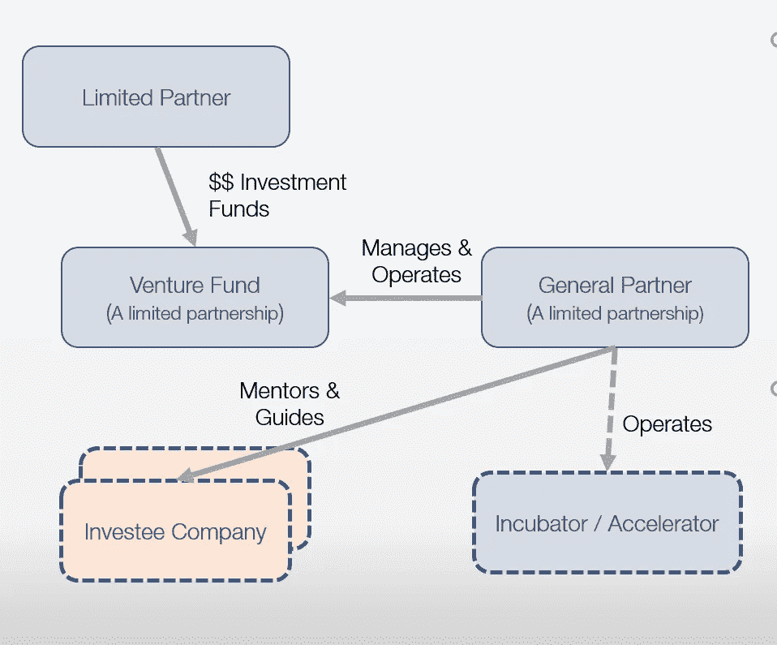

Venture Capital Fund Typical Structure

该基金由“ ***普通合伙人*** ”管理，该合伙人也是有限合伙企业。普通合伙人中的合伙人决定投资，然后指导被投资公司(希望)成功退出。

有时，普通合伙人还经营一个孵化器或加速器，帮助新成立的实体完善他们的战略和商业主张。

有时，风险基金会在投资者和风险基金之间建立一个投资信托，使信托能够从公众那里吸引投资，然后公众向信托认购实际资本，然后信托向风险基金提供资本(实质上充当唯一的有限合伙人或有限合伙人之一)。

一些著名的风险投资公司及其最著名的存在如下图所示:

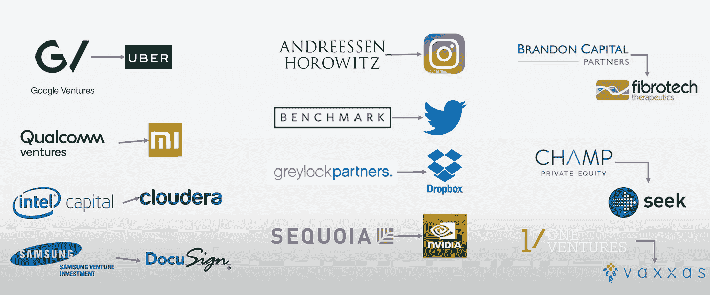

Famous Venture Funds and Their Famous Exits

风险基金生命周期(通常为 7-10 年)内的资金流动方式如下图所示:

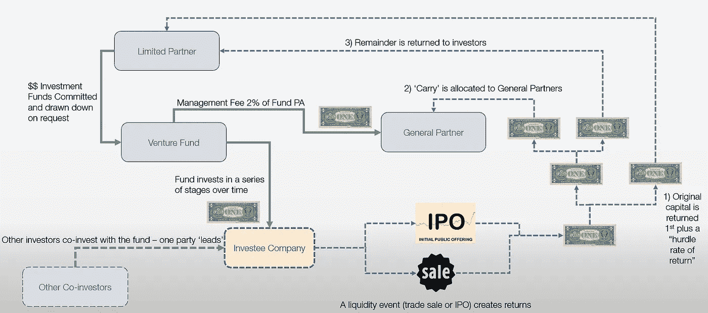

Fund Flows for a Venture Fund

有限合伙人向基金公司“承诺”资本。向普通合伙人提供的营运资金通常为基金公司每年总承诺资本的 2%。这支付了普通合伙人、支持人员的工资以及孵化器和加速器(如果有的话)的运营费用。

当作出投资决定时，基金公司要求有限合伙人按其承诺比例提供资本。通常情况下，风险基金会与其他基金共同投资，由一只基金牵头——并设定交易的条款和价格。

一旦投资完成，普通合伙人将指导并监督被投资公司的扩张，直至其“退出”。退出通常是交易出售给另一家公司或首次公开募股(尽管其他变量也是可能的)。

在退出时(或者在流动性可能的情况下),投资收益流回基金。这是一个聚合流程，通常是这样工作的:

1.  首先，投资回报用于偿还有限合伙人提供的资金；
2.  一旦他们获得资金回报，接下来将向有限合伙人提供回报率(从提款日期按比例计算)。这被称为“*”的最低预期收益率，并在基金契约或招募说明书中设定(尽管它可能参照参考利率设定)。*
3.  *如果有剩余资金，接下来普通合伙人会收到相同的最低预期回报率；*
4.  *接下来，如果有剩余资金，它们将在普通合伙人和基金(有限合伙人)之间分配。适用于普通合伙人的比例被称为“**利差**”，通常为 20%——尽管对于一些溢价基金，这一比例可能会高得多。*

## *风险投资基金的财务回报情况如何？*

*风险资本基金的回报结构与典型的其他投资结构非常不同。它们是高风险、高回报的基金，遵循严重偏斜的分布。*

*当研究人员查看了许多基金的历史表现后，他们通常会发现，基金回报要么遵循对数正态分布，要么遵循幂级数回报分布。下图显示了对数正态回报，取自美国风险投资基金的大量数据。*

*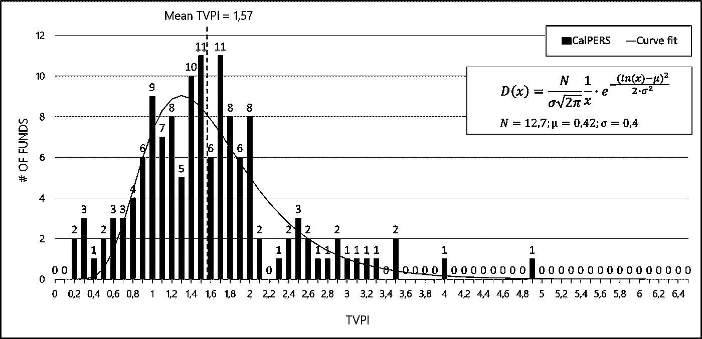*

*Log normal Distribution Fitted to Venture Capital Returns*

*这里显示了相当大比例的投资亏损(回报小于 1 倍)，在 1.3 倍至 1.8 倍附近有一个峰值，然后分布有一个长的右尾，其中少量投资产生高回报。*

*其他研究人员(和一些基金)坚持认为回报的分布遵循幂律(尤其是如果失败被忽略的话)。下图显示了欧洲公司比较幂律和对数正态分布的历史拟合度(参考[此处为](http://www.eif.org/news_centre/publications/eif_wp_41.pdf)):*

*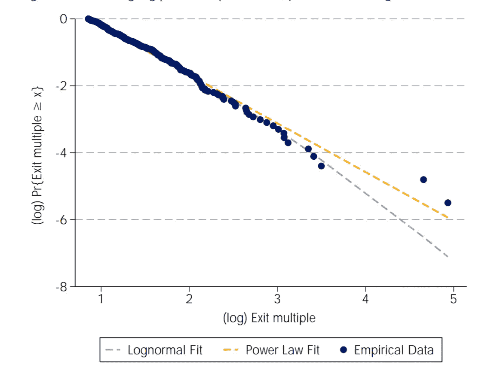*

*Comparison of Return Curve Fit for European Firms*

*从该数据可以看出，对于分布的早期部分，对数正态曲线拟合得很好，但是低估了分布的高端(幂曲线具有更宽的尾部，产生更多的独角兽)。*

*这种分布也可以在美国 1500 多项投资的回报分布中看到:*

*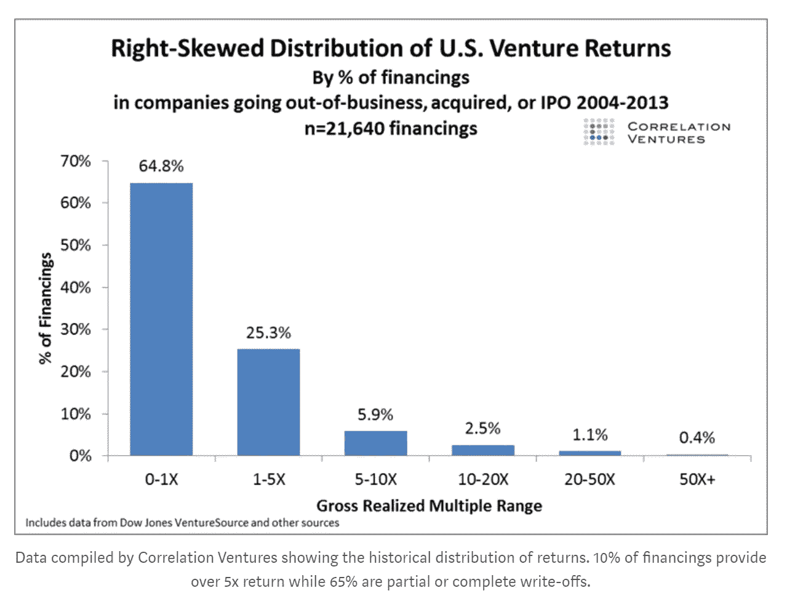*

*Long Fat Tail Distribution for US VC Returns*

*这种分布方式的最终结果是，总体结果受到异常值的严重影响。从下图中可以清楚地看到这一点，该图显示了回报的百分比分割，其中 6%的交易带来了 60%的回报:*

*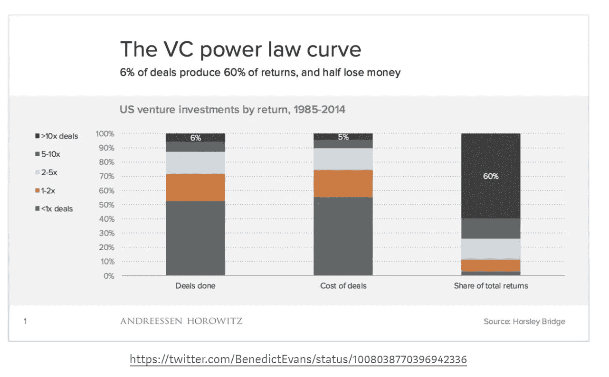*

*Shares of Deals Compared to Outcomes*

*概括地说，风险基金涉及投资大量交易，并确保其中至少有几笔交易是大型交易的机会最大化——用通俗的话说，就是寻找独角兽。*

*投资组合中的失败越多，独角兽必须补偿的金额就越大。基金的风险各不相同，但它们都倾向于寻找一些高回报的投资。*

*一般来说，这往往要求每个被投资公司的潜力必须非常大——就总的潜在市场而言，或就实质性市场的进入壁垒而言，或就两者而言。*

*这也表明，风险基金需要投资许多公司，以分散寻找难以捉摸的独角兽的风险。*

## *如果风险投资基金需要分散投资来寻找独角兽，最佳的基金规模是多少？*

*解决“寻找独角兽”问题的一个方法是投资大量的公司——从而最大化找到一家公司的可能性。尽管一些基金采用这种方法，但还有其他因素影响这种策略——普通合伙人很难对每项投资给予应有的关注和尽职调查，此外，后续融资可能会成为巨大的负担。*

*通过将幂律分布与大量美国数据集(见[此处](http://reactionwheel.net/2017/12/power-laws-in-venture-portfolio-construction.html))进行匹配，并使用蒙特卡罗模拟技术查看超过特定回报的概率，对这一问题进行了分析。结果如下所示:*

*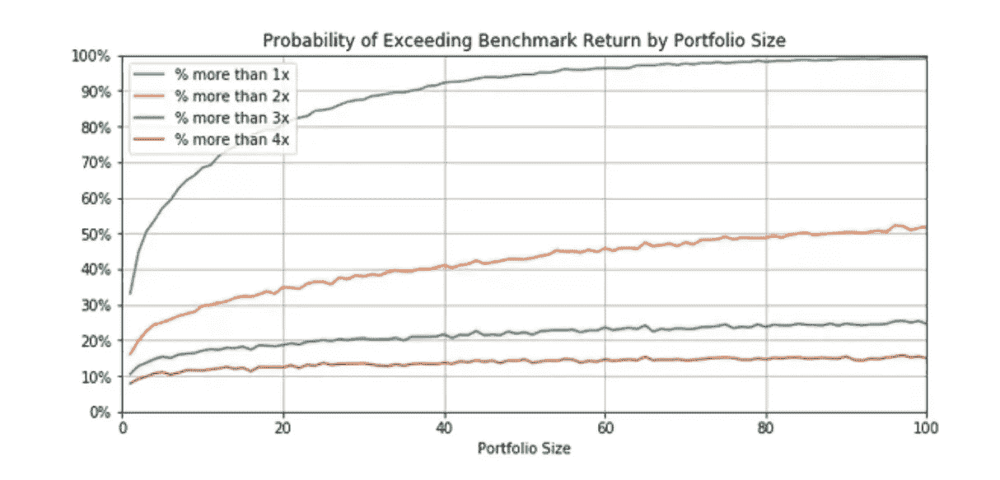*

*Probability of Exceeding a Return for US VC Data Set*

*随着投资组合规模的增加，超过任何给定基准回报的可能性也会增加。然而，它生长非常缓慢。*

*这意味着基金规模的回报率在下降。如果你看看“超过 3 倍”的门槛，那么要从 20%的成功概率上升到 25%的成功概率，你必须从资助 20 家公司上升到 100 家公司。*

*在实践中，还有另一个重要方面在起作用——大多数对风险企业业绩的研究表明，结果的主要(或许是唯一重要的)因素是普通合伙人的技能和经验，以及他们对被投资公司的支持力度。因此，在实践中，上面显示的分布在垂直轴上被普通合伙人的参与强度(和技能)所移动。如果你增加投资的数量，那么如果你保持合伙人的数量不变，投资的强度就会降低。*

*如果你考虑上面显示的概率曲线的斜率，很明显，甜蜜点在每只基金 20 到 40 项投资之间。*

## *基金的最优规模是多少？*

*根据前面的讨论，我们可以确定最佳早期基金的大致规模。我们知道有一条“经验法则”,即有必要保留基金投资部分的 60%到 65%用于后续投资——为什么？以确保早期投资者能够跟进(并双倍下注)他们成功的投资。*

*基金规模的简单公式可通过以下公式计算:*

*n =最初投资的公司数量*

*a =初始投资规模*

*t =基金期限(年)*

*r =管理费百分比*

*z =后续储备百分比*

*基金规模= *(n*a)/((1-z)*(1-t*r))**

*回到我们 20 到 40 次初始投资的最佳结构，如果我们让首轮融资的初始规模为 250 万美元，期限为 8 年，管理费为 2%，准备金率为 63%，投资次数为 25 次，那么*

*基金规模= 2.01 亿美元*

*在这种基金规模下，管理费足以使每个普通合伙人在 3-5 家公司中拥有核心利益，并且有足够的费用来运行孵化器/加速器，并有一些企业家常驻，以向每个被投资公司提供相当密集的资金投入。*

*这就是为什么 2 亿美元的基金规模是一种常见的结构。*

*一些基金的结构要小得多，例如，一只 5000 万美元的基金只能支持 6-7 项投资，这大大增加了较小基金的风险。这也是小基金更容易失败的原因之一。*

## *风险投资回报受经济周期的影响有多大？*

*简短的回答是——一个*批次*。投资周期(和炒作周期)的时机非常重要。历史上，下图使用 CB Insights 精心构建的数据集显示了美国和澳大利亚的历史风险资本回报:*

*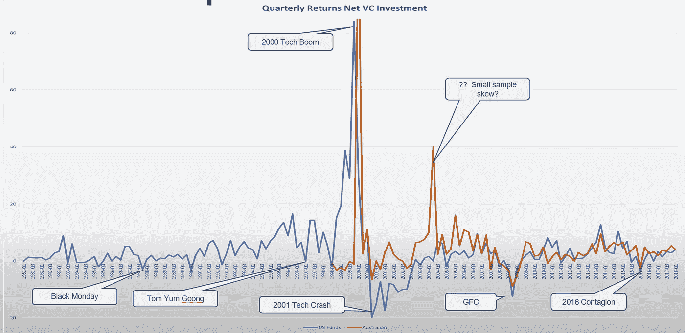*

*Historical Rate of Return On VC Investments*

*你可以清楚地看到重大经济事件的影响——黑色星期一、亚洲金融危机、2001 年的科技繁荣和崩溃、GFC 和 2016 年的危机蔓延。然而，最令人震惊的是科技繁荣和随后的崩溃是多么巨大。作为对比，也显示了澳大利亚的数字，但是它们受到相对较小的样本量的影响。*

*这里的一个教训是——把握好时机！*

## *风险投资公司投了多少钱？*

*进入美国风险资本的投资金额如下图所示:*

*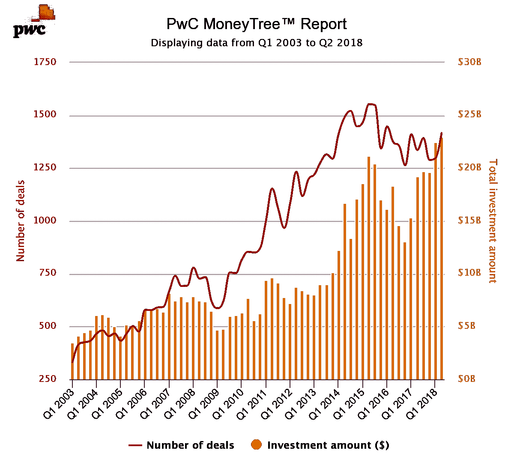*

*US Investment in Venture Capital*

*美国每年向风险行业投资 800 多亿美元，交易超过 5000 笔。这相当于每年人均 245 美元的人均密集度。有趣的是，在过去的三年里，平均交易规模增加到了 1500 万到 1700 万美元。*

*这与澳大利亚形成对比，如下图所示:*

*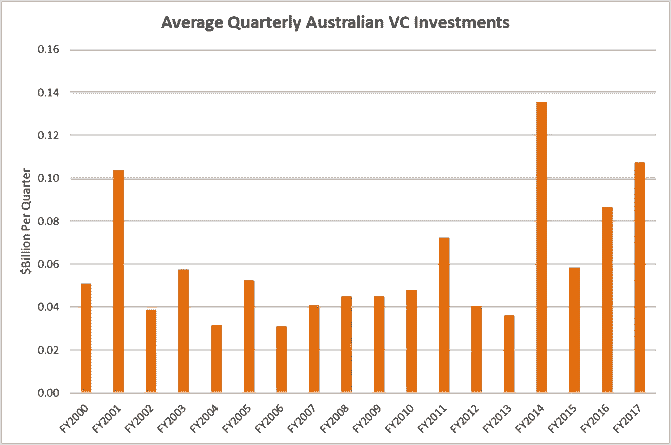*

*Quarterly Investment in Venture Capital In Australia (AUD)*

*如果澳大利亚的投资强度与美国相同，那么它每年将投资 61.25 亿美元，但它每年仅投资 2.4-5 亿美元，人均资本强度不到 20 美元。*

*这是一个惊人的差异。*

****这意味着在过去，美国一直以大约 14:1 的比例超过澳大利亚。****

*有证据表明，过去两年澳大利亚的支出大幅增加，2018 年的投资达到 10 亿美元，这表明该比率翻了一番，达到人均 40 美元，但仍远低于美国。*

*通过查看 2016 年世界舞台风险资本占 GDP 的百分比，这一点得到了强调。*

*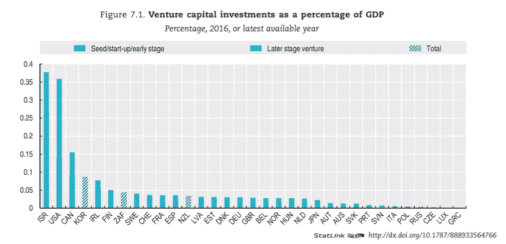*

*Venture Capital Investment % of GDP*

*消费最高的是以色列、美国和加拿大。遗憾的是，澳大利亚在榜单上排名垫底，仅高于斯洛文尼亚和葡萄牙。随着新的投资进入该国，这种情况在 2017 年和 2018 年可能有所改善。*

*另一个有趣的全球统计数据是交易规模，如下图所示:*

*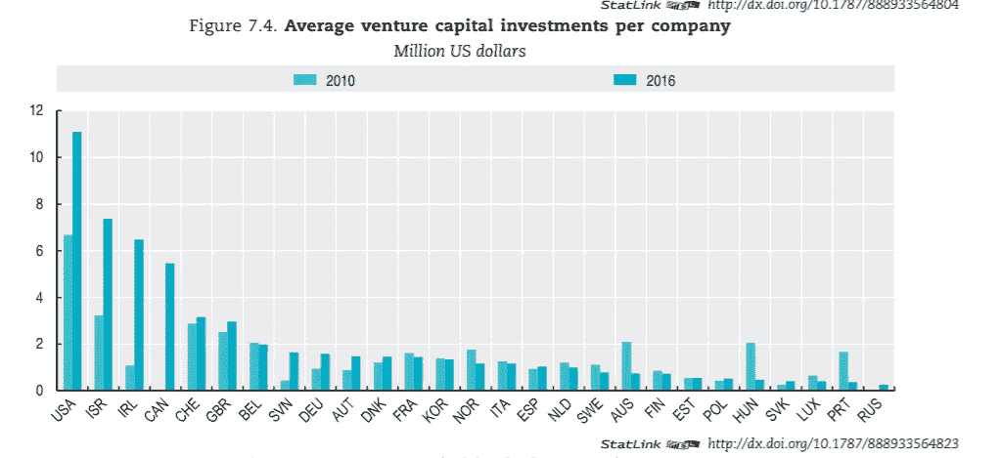*

*Deal Size Per Investment by Country*

*从这个比较中出现了几个事实—*

*   *首先，美国、以色列、爱尔兰和加拿大每笔交易的投资是世界其他国家的 5-10 倍*
*   *其次，这些国家的交易规模一直在大幅增长*
*   *澳大利亚的交易规模属于法国、韩国和瑞典的第二梯队“低集团”，远远小于第一梯队*

*很难一概而论，但除非情况发生了实质性的变化(其他条件相同)，否则在澳大利亚获得资助似乎比在顶级国家要困难得多，而且当他们获得资助时，与世界顶级集团相比，他们的资金严重不足。*

*将这些数据与可获得的最新信息进行比较，并找出强度和方法上的显著差异，将会很有意思。*

## *ICO 替代方案*

*在过去一年左右的时间里，通过在加密货币领域使用“*”的初始硬币发行，出现了一种替代形式的风险投资。这包括在区块链平台(通常是以太坊)上向公众发行加密令牌(通常是 ERC-20)。购买出于各种原因，包括预期代币价值的未来回报和/或对特定服务的访问。由于各种原因，这种形式的融资在去年激增，如下图所示:**

**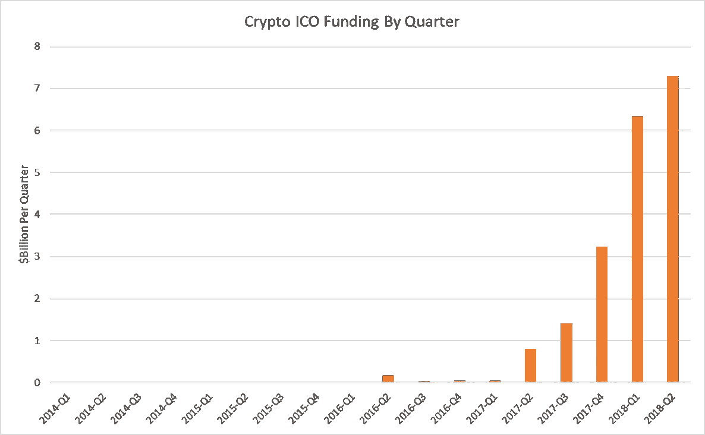**

**ICO Funding USA By Quarter**

**最近一段时间以来，ICO 上市数量急剧下降，部分原因是加密货币市场价值暴跌，但也是对监管机构严厉打击的回应。在监管机构的打击下，这些发行大多被视为非法证券发行，没有市场提供的正常保护。**

## **已实现的风险基金回报**

**风险基金与有限合伙人的已实现净回报也有很大差异，这一细节很难发现。**

**然而，剑桥协会为 2018 年 Q1 奥运会提供了美国的综合数据。它显示了计算出的有效内部收益率，就好像投资发生在提取资金时一样。**

**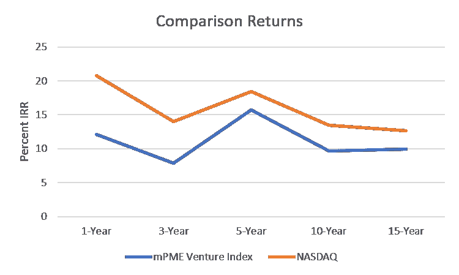**

**Comparison of US Venture Returns for Various Horizons**

**这表明 ***作为一个群体*** 风险行业的表现落后于股票市场指数 300 到 800 个基点。这个结果在整个视界上是相当一致的。这是一个奇怪的结果——风险资产的表现低于指数。**

**美国风险行业的现状是，许多风险公司都失败了。顶级公司往往做得很好，而许多其他公司做得很差(因此风险行业作为一个整体也有幂律回报曲线)。下图清楚地显示了这一点:**

**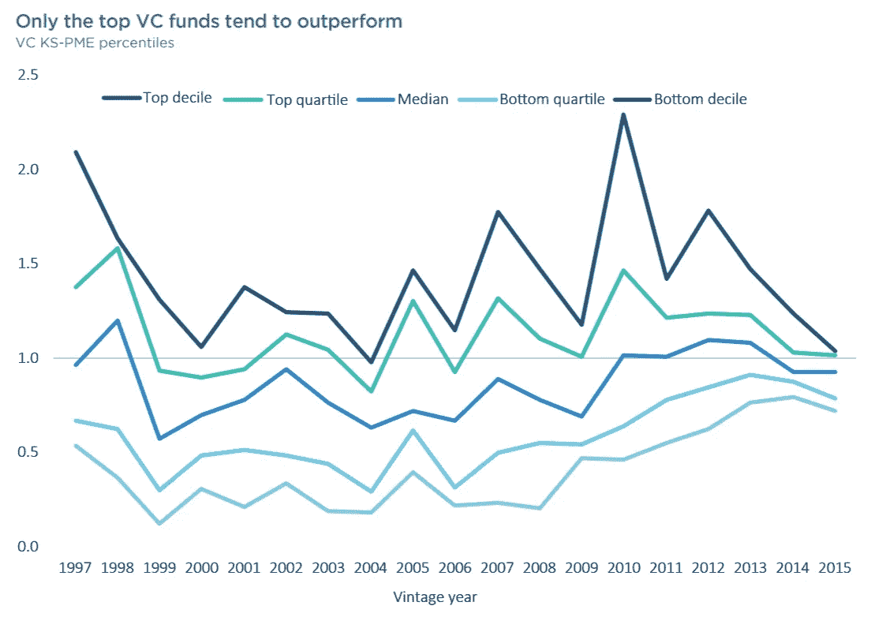**

**Comparison to The Index**

**这张图表比较了美国风险投资基金的各个四分位数与标准普尔 500 指数的表现。可以确定的是，大多数基金的表现低于指数和。第二点是，只有前 10%的风险公司持续跑赢指数，尽管前四分之一的公司在大多数时期都有收益。**

**观察基金的规模及其对回报的影响也很有意思(这可能是之前观察的正反馈循环):**

**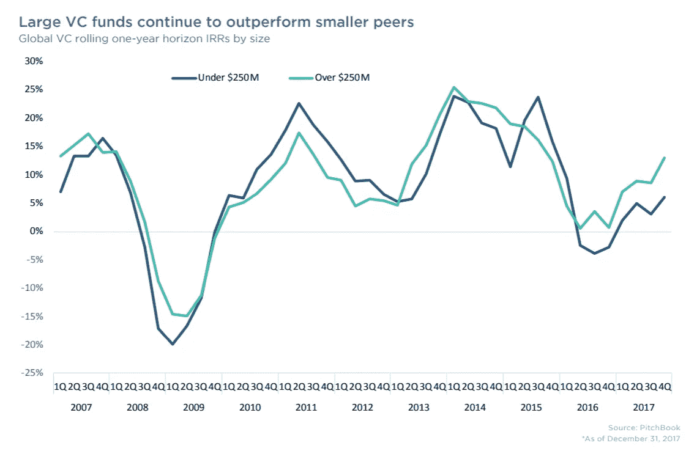**

**Large Verses Smaller Funds**

**尽管这种差异并不显著，但规模较大的基金往往表现优于规模较小的基金，这种趋势在最近几年尤为明显。**

# **下期分期付款**

**在本系列的下一篇文章中，我们将探讨风险投资支持的公司发展的各个阶段，并考虑回报如何展现给创始人和投资者。**