# 向未来的飞跃:生成性对抗网络

> 原文：<https://medium.datadriveninvestor.com/a-leap-into-the-future-generative-adversarial-networks-96a780ed8ee6?source=collection_archive---------0----------------------->

2018 年 12 月 12 日是不是世界永远改变的一天？那个星期三，英伟达的一组研究人员发布了一款令人眼花缭乱的新人工智能设计，名为 StyleGAN。**【1】**style GAN 是一个基于生成对抗网络(GAN)思想的深度学习系统，该模型可以生成人、汽车和家庭的超现实图像。

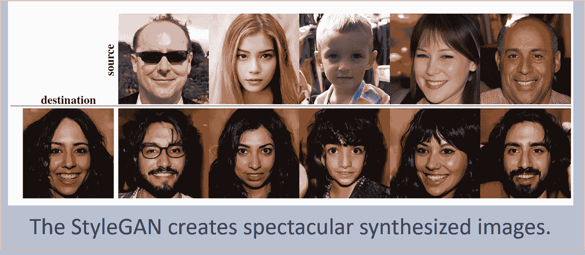

像这样的发明可能会改变人类与几乎所有媒体互动的方式。例如，当人们看到新闻中的图像时，他们的第一反应可能是试图确定他们所看到的是真是假。

gan 是一些更具未来感的 AI 设计，人们对它们有很多疑问:gan 是什么？我能理解他们吗？我可以使用 GANs 进行商业分析吗，或者他们只擅长创建图像吗？

本文将尝试回答其中的一些问题。我们将从对 GANs 的概述开始，然后我们将讨论帮助 GANs 学习的一些挑战。之后，我们将检查两个有前途的 gan:radial gan，**【2】**，它是为数字设计的，以及 StyleGAN，它专注于图像。

> [DDI 编辑推荐 OpenCV 的机器学习:使用 Python 的智能图像处理](https://www.amazon.com/gp/product/1783980281/ref=as_li_tl?ie=UTF8&camp=1789&creative=9325&creativeASIN=1783980281&linkCode=as2&tag=ddi018-20&linkId=0bdfbf13ab843c6990e56d1148df04b0)

# 生成对抗网络

最初的 GAN**【3】**是由 Ian Goodfellow 创建的，他在 2014 年年中发表的一篇论文中描述了 GAN 架构。GAN 由两个相互博弈的神经网络组成。*鉴别器*试图确定信息是真是假。另一个神经网络称为*生成器*，试图创建鉴别器认为真实的数据。

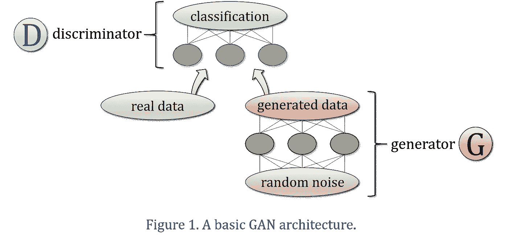

这个概念如图 1 所示。顶部的神经网络是鉴别器，它的任务是区分训练集的真实信息和生成器的创建。在最简单的 GAN 结构中，发生器从随机数据开始，并学习将这种噪声转换为与实际数据分布相匹配的信息。

生成器永远看不到真正的数据；它必须学会通过接收来自鉴别者的反馈来创造真实的信息。这被称为*对抗性损失*，当正确实施时，效果惊人地好。事实上，正则化技术(如丢弃层)经常在 GANs 中使用，因为生成器可以通过这种完全间接的学习过程过度适应训练集。

这两个神经网络玩这个游戏的时间越长，就越能磨砺彼此的技能。鉴别器变得非常善于检测虚假数据，而生成器则学会产生与真实世界中观察到的信息没有区别的信息。

当我们最终得到两个非常擅长它们所做的 GAN 神经网络时，我们如何使用它们呢？一个训练有素的鉴别器可以用来检测异常、异常值和任何异常情况。这在网络安全、放射学、天文学和制造业等领域非常有价值。

一个熟练的发电机被用来创造。一旦生成器学习了训练数据的分布，我们就可以对生成器进行无限次的采样，以获得真实的输出，如图像、语言、[药物、](https://www.news-medical.net/news/20170209/Scientists-apply-generative-neural-network-to-create-new-pharmaceutical-medicines.aspx)、数值模拟以及任何其他可以想象的东西。

# 瓦瑟斯坦甘

最初的 GAN 在首次推出时引起了很多人的兴奋。但有一个问题立即显现出来:如果在 GAN 游戏中，其中一个神经网络开始支配另一个神经网络，那么两个神经网络的学习都将停止。GAN 神经网络被称为对手，但我们希望让其中一方无法获胜，这样它们都可以学习更长的时间。

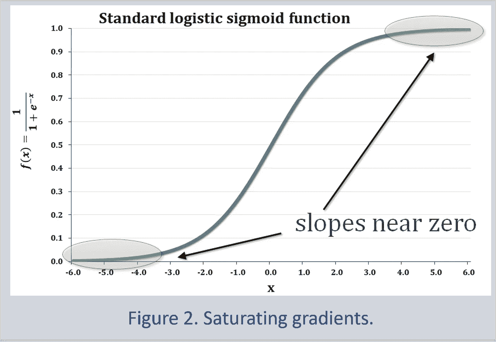

这种训练困境如图 2 所示。标准二元分类器是一种 sigmoid 曲线，更正式的说法是标准逻辑 sigmoid 函数，它将输入值转换为介于 0(负分类)和 1(正分类)之间的结果。sigmoid 曲线的尾端非常平坦，这意味着如果 GAN 游戏在其中一个尾端结束，神经网络就会失去方向感。

例如，如果鉴别器总是能辨别出生成器的作品是假的，那么鉴别器将总是向生成器的训练函数返回 0。如果生成器总是能够欺骗鉴别器，那么鉴别器总是向生成器发送 1。在这两种情况下，两个神经网络的学习都停止了，因为它们都没有收到任何关于如何变得更好的反馈。

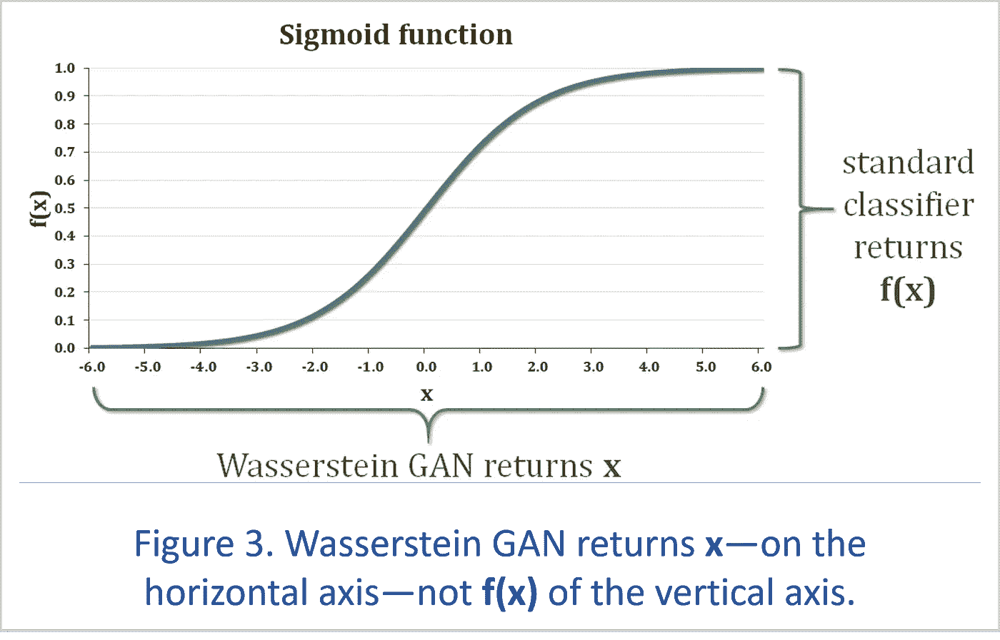

2017 年的一项创新让训练 GANs 稳定了很多。wasser stein GAN**【4】**(WGAN)改变鉴别器发送给发生器的响应类型。WGAN 不是返回纵轴的 sigmoid 值，而是返回横轴的输入值(见图 3)。换句话说，标准神经网络分类器返回 **f(x)** ，而 WGAN 返回 **x** 。

这意味着，即使其中一个神经网络总是获胜，至少发生的微小变化不会被 sigmoid 函数完全消除。例如，如果 GAN 鉴频器总是能够检测到虚假数据，它可能在一次迭代中输出-100 的值，然后在下一次迭代中输出-99 的值。通过一个经典的 sigmoid 函数发送这些数字，使得它们在 40+位小数处无法区分。这就是为什么在最简单的 GAN 中学习很容易停止:发生器可能会停止在一个基本上没有从鉴别器接收到任何方向的位置。

但是 WGAN 使用原始数字(-100 和-99)，这 1%的变化足以给生成器提供改进的途径。这意味着，即使其中一个神经网络压倒了另一个，学习也可以继续。

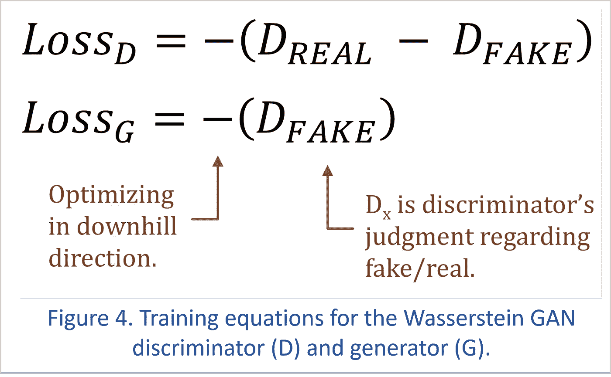

基本 WGAN 训练方程如图 4 所示。括号内的项表示每个神经网络的期望学习方向，这些表达式乘以-1，因为我们通常在下坡方向进行优化。

如果鉴别器工作非常出色，它会为真实样本返回高值，为来自生成器的假信息返回低值。生成器的目标正好相反:它希望鉴别器给生成的信息分配高值，换句话说，就是误报。

# WGAN 细化

# 评论家

WGAN 的作者通过将鉴别器神经网络称为*批评家*来稍微改变 GAN 术语。单词 discriminator 来自*判别分析*，反映了将数据分类的分类器。另一方面，WGAN 返回更丰富的反馈，这有点类似于电影评论家的书面评论。

# 不同的结果

人们在使用 GANs 时可能遇到的一个问题是，神经网络似乎正在正确学习，但最终，生成器只重新创建了有限部分的训练分布。这是因为生成器可能比训练过程更聪明。如果生成器接收到的唯一指令是欺骗鉴别器，则生成器可以通过坚持训练集中最密集的部分来学习最大化其成功机会。

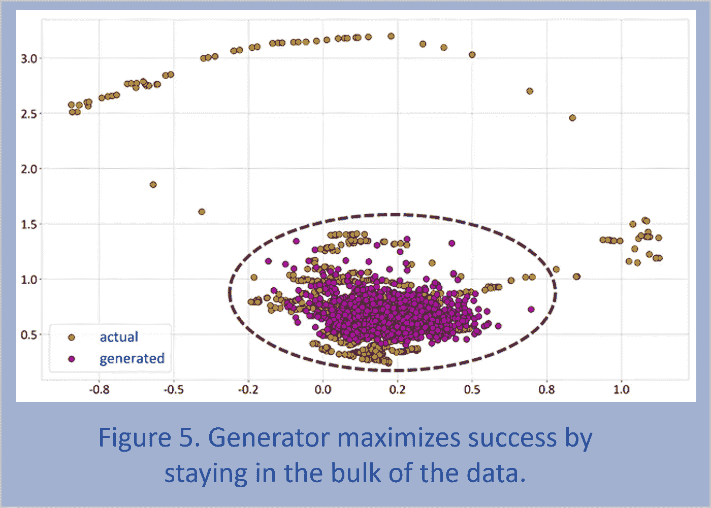

我们通常希望生成器产生广泛的结果，有两种常见的做法有助于实现这一点。

*迷你批次鉴别***【5】**在鉴别器神经网络的一层或多层动态收集一批样本的统计数据——换句话说，来自多个观察值。然后，鉴别器使用这些统计数据作为评估数据集真假的附加信息。如果样本的离差在训练集和生成的数据之间非常不同，则鉴别器可以向生成器发出信号，通知生成器需要增加其结果的范围。

产生多种结果的另一种选择是为生成器和鉴别器提供额外的变量，这些变量充当*条件信息*来告诉神经网络它们正在哪个环境中操作。当我们想要指导一个生成器产生适合特定情况的创作时，这是一个主要的优势。

# 优化者

WGAN 可能需要考虑要使用的最佳优化器。sigmoid 曲线通常被称为“挤压”函数，因为它将其输入平坦化到 0 到 1 的范围内。

但是 WGAN 可以在任何时候返回任何值，因此它的输出是*非平稳的*。对于这种类型的问题，使用没有动量的优化器(如 rms prop**【6】**)或至少调低自适应矩估计(Adam**【7】**)等优化器的动量参数可能会有所帮助。

# 带梯度惩罚的 WGAN(WGAN-GP)

事实证明，实现 Wasserstein GAN 并不像消除鉴频器中的 sigmoid 函数那样简单。WGAN 背后的数学原理要求鉴频器的梯度不能太陡。换句话说，如果我们改变鉴别器神经网络的输入，鉴别器的输出不会变化太大。

为了满足这一条件，一组机器学习研究人员创造了梯度惩罚。**【8】**如果梯度变得过于陡峭，这种技术会在鉴别器的损失函数中增加一个惩罚项，并将鉴别器的学习过程推向更平坦的梯度。

梯度惩罚的一般编程模式如下所示:

1.  对实际数据和发电机的制造输出进行随机加权组合；这是一种尽可能多地采样鉴频器功能范围的方法。
2.  通过测量鉴频器的输出相对于输入的加权混合如何变化来获得梯度。这通常是通过深度学习框架来完成的，比如 TensorFlow 的 [tf.gradients()](https://www.tensorflow.org/api_docs/python/tf/gradients) 函数。
3.  计算渐变的范数(换句话说，长度),并根据它与 1 的距离创建一个罚分。
4.  将#3 的结果加到鉴别器的损失函数中。然后鉴别器知道它需要学习它的工作，而不需要在它的输入和输出之间建立一个陡峭的关系。

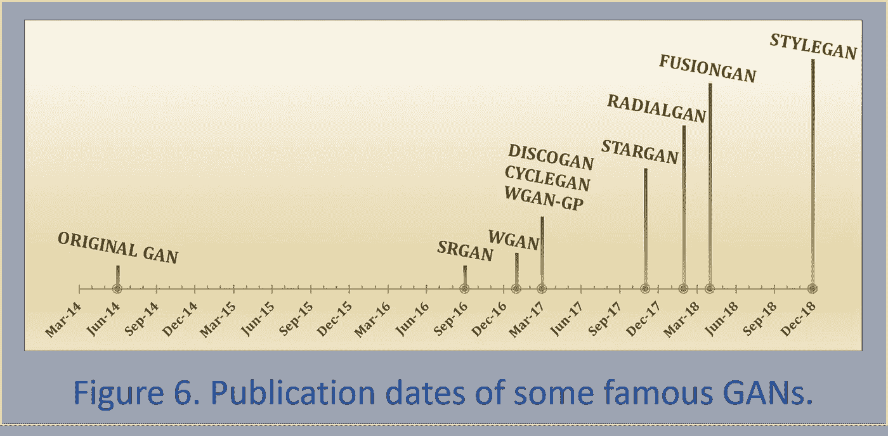

WGAN-GP 方法导致更稳定的 GAN 训练，并可能有助于自 2017 年以来加快 GAN 创新的步伐。例如，图 6 显示了一些最著名的 GANs 是如何在过去几年中创建的。

WGAN-GP 的一个缺点是它的训练时间。每次迭代都需要计算鉴别器的梯度。此外，通常训练鉴别器的频率至少是训练发生器的 5 倍。这是因为一个训练有素的鉴别器给生成器的优秀反馈应该允许生成器以更少的学习迭代变得高效。

关于如何在保持 WGAN-GP 稳定性的同时帮助 GAN 更快地学习，有很多研究正在进行。**【9】**

# 样品甘

既然我们已经介绍了甘的基本要素以及如何训练它们，我们就来看看两种非常有前途的甘。RadialGAN 是为数字分析而设计的，而 StyleGAN 因其令人惊叹的图像创作而获得了全球媒体的报道。

# 辐射状的

假设我们是为一家医院工作的数据科学家，这家医院希望评估一种新医疗方法的疗效。因为这个手术是新的，我们医院没有足够的数据让我们做出可信的判断。然而，我们被允许访问其他医院的数据，这给了我们足够的信息来对新的治疗进行适当的评估。

但是结合不同医院的数据有问题。因为医院服务于非常不同的人群，所以存在*分布不匹配*。还有*特征不匹配*，因为医院收集他们自己的数据集，使用实验室给出稍微不同的结果，并以不同的方式衡量结果。

这就是射线管的用武之地。RadialGAN 首先将每个数据集转换到一个*潜在空间*，该空间以统一的格式保存来自不同来源的所有数据。然后可以提取潜在空间中的数据，并将其转换到每个唯一数据集的特征空间中。

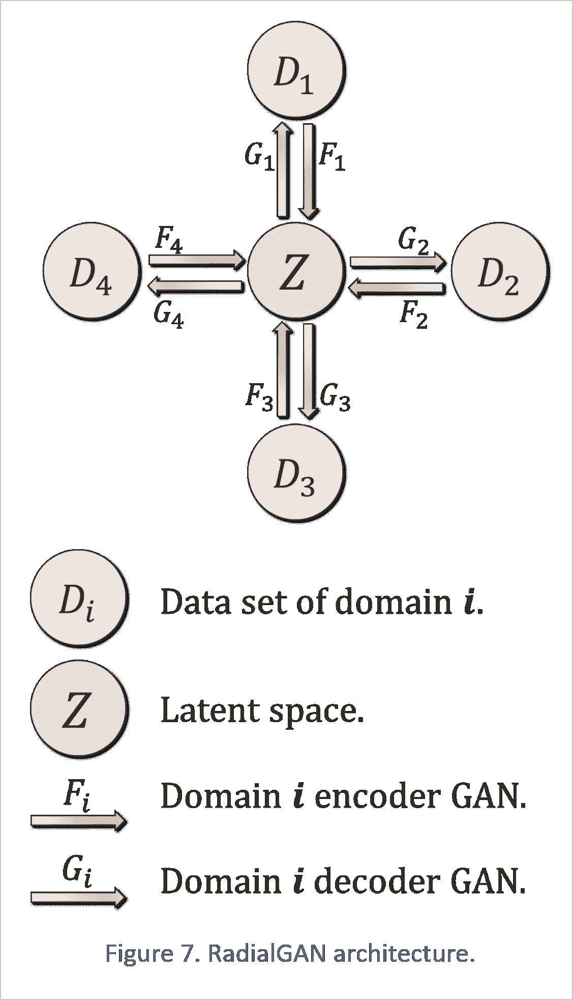

在 GAN 术语中，这些数据转换被称为*域转移*，这是指我们提取一个数据集的基本知识，并将该智能传输到另一个信息集。

在 RadialGAN 中，每个数据集都有一个*编码器*神经网络，将数据转换为潜在空间的同质结构。

每个数据源还有一个*解码器*，它是一个带有生成器的 GAN，将潜在空间的信息转换成与数据集一致的形式。这些解码器 gan 中的每一个都有一个鉴别器，用于确认来自潜在空间的信息与目标数据域的属性相匹配。

这种设置确保了信息的域转移在两个方向上都起作用，并且是可逆的。这个概念叫做*周期一致性*。它起源于 CycleGAN，**【10】**，已经成为许多 GAN 模型的关键部分。

我们同时训练所有这些神经网络，一旦学习过程完成，我们可以使用 RadialGAN 创建一个如图 8 所示的增强数据集。

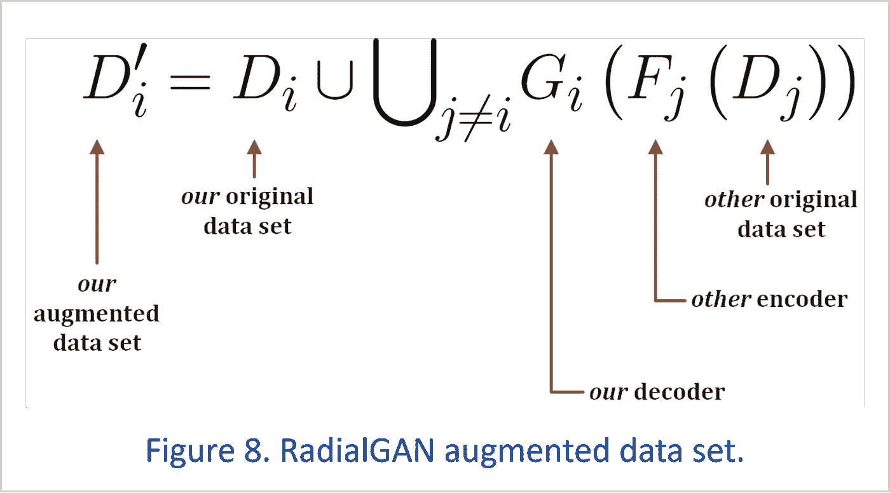

为了构建我们的增强数据集，我们通过编码器运行每个其他数据集，以将该知识转移到潜在空间。然后，我们使用解码器从潜在空间中提取信息，并将转换后的信息添加到原始数据集。

结果是一个新的、更大的数据集，它由来自各种来源的信息支持，但与我们正在工作的领域的特征相匹配。

# StyleGAN

引人注目的新风格结合了两项创新:渐进风格**【11】**(ProGAN)和神经风格转移。**【12】**

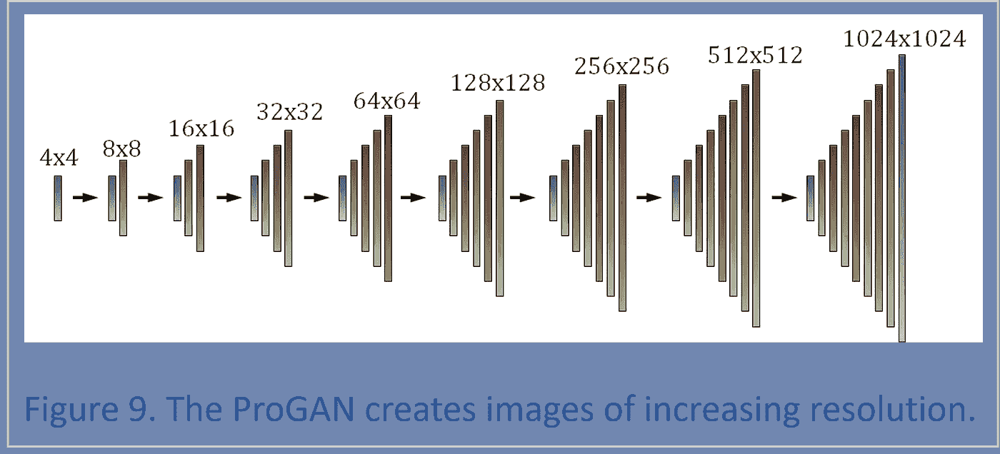

ProGAN 从开发一个 4x4 或 8x8 像素的微小图像开始，直到 ProGAN 鉴别器认为这个图像是真实的。

一旦这种学习完成，ProGAN 就会逐渐增加一个分辨率更高的图层，这个图层也需要训练。这一过程一直持续到 ProGAN 能够以惊人的真实感创建 1024x1024 像素的图像。

StyleGAN 在 ProGAN 的基础上引入了一些最成功的神经风格转移元素。原始样式转移通过将样式图像的神经网络层相关性复制到内容图像上来工作。这需要一个优化过程，该过程耗时太长，在许多实时应用中没有用处。

研究人员对经典的神经风格转移进行了多次改进，StyleGAN 使用了一种更新的风格转移方法，称为自适应实例规范化(AdaIN)。**【13】**

自适应实例规范化不涉及优化，因此它是在图像之间传递样式的一种非常快速的方法。它还非常灵活，可以在任何图像之间转换风格，包括神经网络以前从未见过的图像，因为它们不在任何训练集中。

将 AdaIN 应用于内容图像的卷积神经网络层是一个简单的过程:

1.  通过减去其平均值并除以其标准差来归一化图层。
2.  缩放此规范化图层以匹配样式图层的标准偏差。
3.  通过添加样式层的平均值来移动图层。

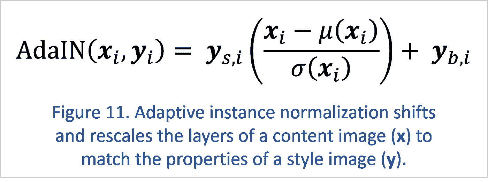

这听起来比实际更复杂。我们所做的只是改变图像的神经网络层的均值和方差，以匹配风格图像(即，我们想要模仿其风格的图像)的均值和方差。

对 StyleGAN 和 AdaIN 的进一步改进可以包括直方图匹配等方法，这将传递更多的样式细节，但计算速度也会非常快。

StyleGAN 是一个有点复杂的架构，它包含了过去几年开发的许多神经网络工具和技巧。但其核心是，StyleGAN 将高效的程序与神经风格转移的成功结合起来，创造出如此逼真的图像，以至于可以从根本上改变人们与新闻和娱乐媒体的关系。

# 结论

StyleGAN 是一个引人注目的例子，说明了生成性敌对网络如何能够改变大部分媒体生产其内容的方式，并改变消费者解释他们所看到和听到的信息的方式。另一方面，RadialGAN 展示了如何利用 GANs 的特性和优势来支持数值数据分析。

这是一个由数百个创新的 gan 组成的繁荣社区的两个例子，这些 gan 可以用于人们可以想象的任何目的。

我们从 GANs 看到的一些结果看起来像是来自不同的世纪，有一点是肯定的:像 GANs 这样的开创性人工智能技术正在迅速改变我们与技术以及彼此之间的关系。

# 参考

**【1】**泰罗·卡拉斯、萨穆利·莱恩和蒂莫·艾拉

一种基于风格的生成对抗网络生成器体系结构

【arxiv.org/abs/1812.04948 号

**【2】**尹金松、詹姆斯·乔丹和米哈埃拉·范德沙尔

RadialGAN:利用多个数据集，使用生成式对抗网络改进特定目标预测模型

[arxiv.org/abs/1802.06403](https://arxiv.org/abs/1802.06403)

伊恩·古德菲勒、让·普热-阿巴迪、迈赫迪·米尔扎、徐炳、戴维·沃德-法利、谢尔吉尔·奥泽尔、亚伦·库维尔和约舒阿·本吉奥

生成对抗网络

[arxiv.org/abs/1406.2661](https://arxiv.org/abs/1406.2661)

**【4】**马丁·阿约夫斯基、苏史密斯·钦塔拉和莱昂·博图

瓦瑟斯坦·甘

[arxiv.org/abs/1701.07875](https://arxiv.org/abs/1701.07875)

蒂姆·萨利曼斯、伊恩·古德菲勒、沃伊切赫·扎伦巴、张维基、亚历克·拉德福德和陈曦

训练 GANs 的改进技术

[arxiv.org/abs/1606.03498](https://arxiv.org/abs/1606.03498)

**【6】**杰弗里·辛顿

机器学习的神经网络，投影片# 27:「r prop:仅使用梯度的符号」

[www . cs . Toronto . edu/% 7 etijmen/CSC 321/slides/lecture _ slides _ le C6 . pdf](http://www.cs.toronto.edu/%7Etijmen/csc321/slides/lecture_slides_lec6.pdf)

迪德里克·p·金马和吉米·巴

Adam:一种随机优化方法

[arxiv.org/abs/1412.6980](https://arxiv.org/abs/1412.6980)

**【8】**伊桑·古尔拉贾尼、法鲁克·艾哈迈德、马丁·阿约夫斯基、文森特·杜穆林和亚伦·库维尔

改善对 Wasserstein GANs 的培训

【arxiv.org/abs/1704.00028 

拉斯·梅斯赫德、安德烈亚斯·盖格和塞巴斯蒂安·诺沃金

gan 的哪些训练方法实际上是趋同的？

[arxiv.org/abs/1801.04406](https://arxiv.org/abs/1801.04406)

**【10】**朱俊彦、朴泰成、菲利普·伊索拉和阿列克谢·埃夫罗斯

使用循环一致对抗网络的不成对图像到图像翻译

[arxiv.org/abs/1703.10593](https://arxiv.org/abs/1703.10593)

**【11】**泰罗·卡拉斯、蒂莫·艾拉、萨穆利·莱内和贾科科·莱蒂宁

为了提高质量、稳定性和多样性而逐步种植甘蔗

[arxiv.org/abs/1710.10196](https://arxiv.org/abs/1710.10196)

莱昂·加蒂斯、亚历山大·埃克尔和马蒂亚斯·贝希

艺术风格的神经算法

[arxiv.org/abs/1508.06576](https://arxiv.org/abs/1508.06576)

黄浚和塞尔日·贝隆吉

具有自适应实例规范化的实时任意样式传输

[arxiv.org/abs/1703.06868](https://arxiv.org/abs/1703.06868)

# 艺术风格形象

*有乌鸦的麦田*

文森特·梵高

# 特征图像

*抽象的未来主义艺术想象*

ID 63836695 哈什瓦尔汉| Dreamstime.com

编辑透露:你点击的一些链接是附属链接。如果你发现有用的东西并购买，我们会赚很多钱。不，我不是说要把我的薯条做大。我说的是超大披萨上的意大利香肠。感谢您一直以来的支持，我们将继续为 p̶e̶p̶p̶e̶r̶o̶n̶i̶出版而努力。