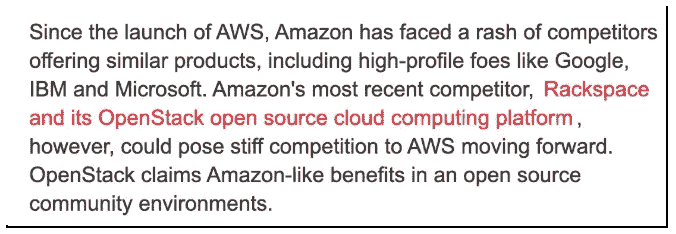

# 2020 年云计算技术趋势展望

> 原文：<https://medium.datadriveninvestor.com/a-look-ahead-at-2020-tech-trends-for-cloud-computing-f12b66210568?source=collection_archive---------26----------------------->

随着年底的临近，我们展望 2020 年的技术趋势将为云带来什么，我们不禁也要反思过去几年的趋势已经预言了什么，给了我们什么。随着我们进入 2020 年，我们不仅进入了新的一年，也进入了新的十年，因此坐下来思考未来的一年和十年可能会发生什么，这是一件加倍有趣(也是有趣)的事情。

在召唤神谕并具体思考云计算管理的未来之前，有必要回顾一下过去十年的总体情况，让我们对未来有所展望。让我们从众所周知的“大猩猩”开始。AWS 成立于 2006 年，截至 2010 年，年收入已达到约 5 亿美元。这是一个不错的增长起点，而且这一增长趋势持续了十年。华尔街预计 2020 年收入约为 500 亿美元，这意味着 100 倍的增长。这简直令人难以置信，去年同比增长 35%，AWS 的增长看起来不会停止..

2010 年云预测

亚马逊云收入在 2010 年可能超过 5 亿美元，CRN (2010)

微软 Azure 和谷歌云平台的增长也不算太差，但 AWS 在过去十年中保持了(并在许多方面加强了)其主导地位。

 [## 信息图:云之旅|数据驱动的投资者

### 聪明的企业领导者了解利用云的价值。随着数据存储需求的增长，他们已经…

www.datadriveninvestor.com](https://www.datadriveninvestor.com/2018/09/22/infographic-journey-to-the-clouds/) 

由于互联网强大的存档功能，只需点击几下鼠标，就能找到十年前关于云未来的白皮书。与其在这里试图总结它们，不如回顾一下你自己——值得一看的是微软的[云经济学(2010)](https://news.microsoft.com/download/archived/presskits/cloud/docs/The-Economics-of-the-Cloud.pdf) 。有些部分是对的，有些是错的，但关键点是: ***“云服务将使 IT 团队更加专注于创新，而将非差异化活动留给可靠且经济高效的提供商”。***

在这一点上，很难说新公司和新商业模式已经以以前无法想象的方式实现了。无论是在共享经济的世界中，优步、Lyft、Airbnb 等，还是过去十年中建立的无数其他云驱动的独角兽，云基础设施都是增长的巨大推动者。

尽管推测云产业到 2030 年可能会走向何方(人工智能云、IOT、区块链、空间云计算等)会很有趣，因此我们会坚定地脚踏实地，但我们 ParkMyCloud 认为有资格评论的趋势更加温和，更加贴近实际。

*   **云管理** —我们在这里看到的是客户对跨其多个云帐户的更整合视图的需求。2019 年，我们看到我们的许多客户正在成为云计算世界的主流，并试图集成云原生和第三方工具的组合，以提供可操作的见解和更重要的行动。构建云管理技术的公司在过去十年中有所增长，但在许多方面，它仍然很小，还没有出现独角兽。我们认为这将在未来十年内发生变化，因为云基础架构的各个方面(技术、经济等)的管理已经达到了需要非人类干预和协调的规模。
*   **多重云** —多重云在 2019 年真正到来，我们相信它将在 2020 年增长。大多数组织现在使用多种云，在我们的客户群中，似乎不太担心供应商锁定。我们也越来越多地看到特定的云用于特定的目的，例如，数据分析工作负载利用一个特定的云提供商，而开发和生产则位于完全不同的云上。
*   **自动化** —基于我们在云管理领域看到的情况，技术和经济管理领域对自动化的需求正在增长。公司越来越适应半自动模式，在某些情况下转向全面自动化。许多人用自动驾驶汽车领域使用的 1 到 5 级进行了比较，我们喜欢这种类比。随着许多现在在 2 级(部分)或 3 级(有条件)运行，我们看到这继续向与云管理活动相关的 4 级(高)和 5 级(完全)自动化靠拢。
*   **更高层次的抽象** —在 2020 年及以后，它将继续变得越来越抽象。无服务器、容器、软件定义的硬件等的增长意味着工程师/开发人员越来越少考虑基础设施。从运营到结果的关注是另一个明显的趋势，可能会持续一段时间。
*   **容器成为主流**——[应用容器化](https://www.parkmycloud.com/blog/future-trends-in-cloud-computing/?utm_medium=referral&utm_source=medium&utm_campaign=medium blogs&utm_content=future-trends-in-cloud-computing)不仅仅是云计算中的一个新名词；它正在改变资源部署到云中的方式。越来越多的公司在 2019 年利用容器，我们已经看到估计表明，2020 年三分之一的混合云工作负载将利用容器(ESG Research)。在过去的几年里，Kubernetes 已经成为容器编排平台的首选。451 研究预测应用程序容器技术的市场规模到 2022 年将达到 43 亿美元。更多的企业将把容器视为其 IT 战略的基础部分。

我们一直很喜欢这句名言“永远不要做预测，尤其是对未来的预测。”然而，进入新的一年和新的十年，很难不这样做。我们认为上面的预测是相当安全的赌注，但同样，我们确信变化的速度和规模可能会比我们预测的更快。

**后记**

在这项研究中，我们 2010 年最喜欢的标题是“ [Airbnb 创始人吃自己的狗粮，几个月‘无家可归’”](https://techcrunch.com/2010/06/21/airbnb-brian-chesky/)。享受吧。献上节日的问候，2020 快乐。

*原载于 2019 年 12 月 10 日*[*www.parkmycloud.com*](https://www.parkmycloud.com/blog/2020-tech-trends/?utm_medium=referral&utm_source=medium&utm_campaign=medium blogs&utm_content=2020-tech-trends)*。*