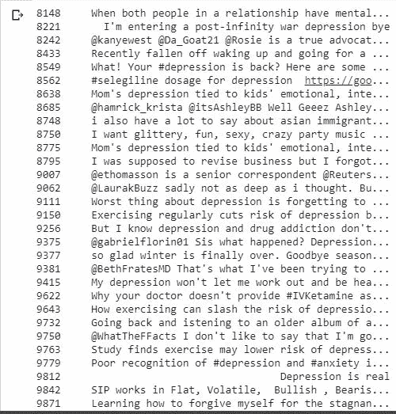
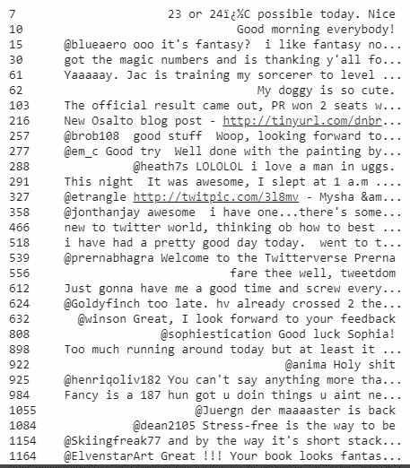
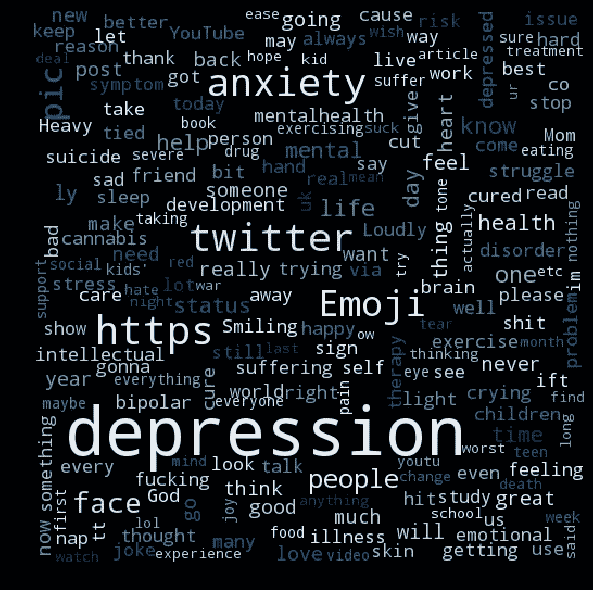
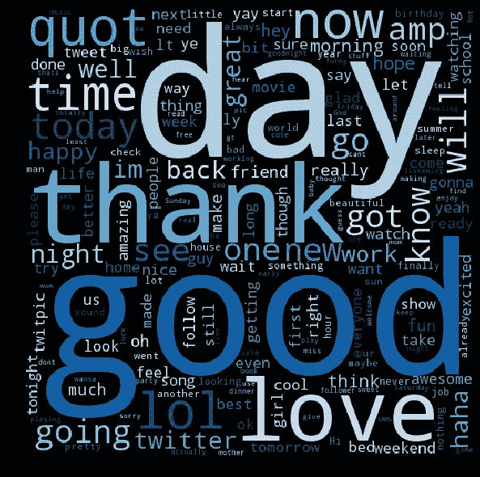

# 一种用于检测 Twitter 中抑郁症和精神疾病的机器学习方法

> 原文：<https://medium.datadriveninvestor.com/a-machine-learning-approach-for-detection-of-depression-and-mental-illness-in-twitter-3f3a32a4df60?source=collection_archive---------0----------------------->

[](http://www.track.datadriveninvestor.com/1B9E)

抑郁症是一种精神疾病，在一些国家不被重视。我在墨西哥长大，从来没有在学校或家里接触过精神疾病教育。作为一个孩子，我有时会感到悲伤，我知道人们会因为困难时期而悲伤，甚至会抑郁，但我从未想过人们会寻求专业帮助来克服抑郁。有些人被诊断患有抑郁症，却不服药来克服它。他们只是继续他们的生活，没有药物治疗，病情恶化。

有许多经历会导致我们抑郁，例如失去亲人、失去工作、离婚和其他艰难的情况会导致一个人感到沮丧、孤独和不知所措。当我们感到压力时，产生这些感觉是正常的。每个人都曾体验过悲伤。但是，抑郁症与此大相径庭。抑郁症是一种精神疾病，需要药物治疗。

# 抑郁症的定义

根据数据网站的*我们的世界，抑郁症的发生有不同的严重程度。世卫组织的国际疾病分类(ICD-10)定义了从轻度到中度到重度的一系列疾病。健康度量和评估研究所(IHME)采用这种定义，将其分为轻度、持续性抑郁症(心境恶劣)和重度抑郁症(重度)。*

所有形式的抑郁症都有以下一些症状:

*   注意力不集中
*   (二)自尊心和自信心下降
*   内疚和无价值的想法(即使是在温和的情节中)
*   (d)对未来的悲观看法
*   (e)自残或自杀的想法或行为
*   睡眠受到干扰
*   食欲下降

# 全球统计

> *全球有 3.22 亿人患有抑郁症。*

抑郁症是全球残疾的主要原因。在发展中国家，近 75%的精神障碍患者没有得到治疗，每年有近 100 万人自杀。此外，根据世界卫生组织(世卫组织)的数据，全球有 1/13 的人患有焦虑症。世卫组织报道，焦虑症是世界范围内最常见的精神障碍，其中特定恐惧症、重性抑郁障碍和社交恐惧症是最常见的焦虑症。

# 社交媒体上的抑郁症

社交媒体平台正在成为人们生活中不可或缺的一部分。它们反映了用户的个人生活。人们喜欢在社交媒体上分享快乐、喜悦和悲伤。这些平台用于研究人员识别抑郁症的原因并检测它。

我在时代新闻网站上读了一篇旧文章，内容是关于 Twitter 如何知道你何时抑郁，以及创建一个人工智能模型的可能性，该模型可以扫描你的 Twitter 订阅，并告诉你是否有抑郁的风险，或者收到来自第三方的通知，例如，警告你可能想要寻求帮助，只是基于对你的推文的自动扫描。我想，那一天终于来了。有很多方法可以检测推文中的情绪。

检测早期抑郁症可以是解决精神疾病的一个巨大步骤，并为患有这种可怕精神疾病的人提供支持。

# 创建一个模型来检测推文中的抑郁

在机器学习中，有许多方法用于情感分析，如:基于决策的系统、贝叶斯分类器、支持向量机、神经网络和基于样本的方法。

在看了一些关于使用不同的机器学习和人工智能技术来检测社交媒体上的抑郁症的论文后，我决定通过概率论中一个强大的定理(称为贝耶定理)来应用情绪分析。该模型将用 python 编写，它将判断给定的推文是否抑郁。

# 数据集

**感知 140**

*感知 140* 数据集包含使用 Twitter API 提取的 1，600，000 条推文。推文已经被标注(0 =负面，2 =中性，4 =正面)，它们可以用来检测情绪。它包含以下 6 个字段:

1.  **目标**:推文的极性( *0* =负， *2* =中性， *4* =正)
2.  **id**:推文的 id(*2087*)
3.  **日期**:推文的日期(*世界协调时 2009 年 5 月 16 日星期六 23:58:44*)
4.  **标志**:查询( *lyx* )。如果没有查询，那么这个值就是 NO_QUERY。
5.  **用户**:发微博的用户( *robotickilldozr* )
6.  **文字**:推文文字( *Lyx 很酷*)

您可以在此处找到数据集:

[](https://www.kaggle.com/kazanova/sentiment140) [## 包含 160 万条推文的 Sentiment140 数据集

### 使用推文进行情感分析

www.kaggle.com](https://www.kaggle.com/kazanova/sentiment140) 

在我的实验中，我只是选取了 8000 条极性为 4 的推文样本，即积极的推文。

**用 TWINT 抓取抑郁推文**

我没有发现高质量的和被标记的包含抑郁推文的数据集，并且由于隐私问题，一些使用良好数据集的项目没有共享链接。

幸运的我找到了 **Twint** ，这是一个用 Python 编写的高级 Twitter 抓取工具，不使用 Twitter 的 API，允许你抓取用户的关注者、关注、推文等，同时规避大多数 API 限制。

您可以在此处找到该工具:

[](https://github.com/twintproject/twint) [## twintproject/twint

### 一个用 Python 写的高级 Twitter 抓取工具，不使用 Twitter 的 API，允许你抓取一个…

github.com](https://github.com/twintproject/twint) 

我还找到了一个用这个工具创建的数据集，其中包含了我在实验中使用的 2314 条推文。

# 分析数据

在清理了数据并连接了抑郁和积极的推文之后，为了生成一个单独的 CVS，我决定用我最喜欢的可视化工具 wordcloud 来分析这些数据。



Depressive Tweets



Positive Tweets

我生成了一个词云，包含了抑郁推文中最常用的关键词。在这些推文中引起我注意的词是:焦虑、抑郁、帮助、治疗、症状、痛苦、艰难、问题、躁郁症、痛苦、睡眠、悲伤、自杀、挣扎、抑郁、障碍、严重、压力、感觉、哭泣、大麻、战争、毒品、死亡、情感、食物、疾病、仇恨、需要、问题、进食。推文中的这些词都是抑郁症的特征。

你可以对他们发布的包含这些词的推文做出结论。例如“大麻”，有人说大麻有助于他们摆脱抑郁。那“吃”和“食”呢？众所周知，当你与抑郁症作斗争时，你的饮食习惯往往会受到影响。另一方面，自杀是一个令人担忧的词，因为抑郁症和自杀之间的联系是真实的，一件事导致另一件事。你可以自己分析信息。



在正面推文中最常用的关键词是:日、快乐、朋友、早上、高兴、更好、开始、生日、好、爱、激动、希望、伟大、最好、棒极了、漂亮、可爱、享受、星期五、耶、漂亮、玩、哈哈、酷、好、家、有趣、惊人、欢迎。



# 培训和测试数据

我将数据集划分如下:98 %用于训练数据，2%用于测试数据，其中极性“0”表示正，极性“1”表示负。我用这些抑郁和积极的推文来填充我的模型，以了解它们并做出预测。

```
Training Data:Label Values
 0     7808 
 1     2274 Testing Data:Label Values
 0     160
 1     41
```

# 结果

对模型进行训练后，结果是:

**精度:** 0.9

**召回:**0 . 49660 . 48686868661

**F 值:**0。48660 . 68686868661

精确度:0。46860 . 68868886861

正如你所看到的，我们可以通过输入更多的数据来提高模型的准确性。我将在未来收集更多的推文，以获得更好的结果。

# 抑郁推特上的预测

在收集了一些使用标签如**#抑郁、#情绪低落、#抑郁#焦虑**的推文后，使用该模型进行了一些预测。True 表示推文是压抑的，False 表示推文是积极的。

> ***pm =****process _ message('最近我一直感觉不确定自己是不是一个人&一个艺人)* ***sc _ TF _ IDF . classify****(pm)* ***真实***
> 
> pm = process_message('极度悲伤，缺乏活力，绝望')
> sc _ TF _ IDF . classify(pm)
> True
> 
> pm = process_message(嗨你好抑郁和焦虑是最糟糕的')
> sc_tf_idf.classify(pm)
> 真
> 
> pm = process_message('情绪低落…')
> sc _ TF _ IDF . classify(pm)
> True
> 
> pm = process_message('我的抑郁症让我无法健身')
> sc _ TF _ IDF . classify(pm)
> True

# 对正面推文的预测

> pm = process_message('让我微笑的是那些小事。今天收到了我们的新车，这辆车也一起到了))
> sc _ TF _ IDF . classify(pm)
> False
> 
> pm = process_message('大家周四快乐。以为今天是周三所以超级开心明天是周五 yayyyyy’)
> sc _ TF _ IDF . classify(pm)
> 假
> 
> pm = process_message('当患者拥抱你并告诉你他们在改变饮食和日常习惯后感觉很棒时，非常有意义')
> sc _ TF _ IDF . classify(pm)
> False
> 
> pm = process _ message(‘好激动！刚刚凭借这张照片赢得了我的第一次摄影比赛…’)
> sc _ TF _ IDF . classify(pm)
> False
> 
> pm = process_message('喜欢我和我可爱的伴侣谈论我们想要的东西。)
> sc _ TF _ IDF . classify(pm)
> False

# **结论和未来工作**

正如你所见，该模型在预测一些推文情绪方面效果很好，但如果有更多的数据，它会变得更好。困难的部分是找到一个带注释的数据集。清理数据以备分析花了我一些时间。

在未来的帖子中，我想分享我在相同数据集上的工作，但使用深度学习技术。我还想分析整个数据集。抑郁症可以通过其他特征检测出来，比如一个人发推特的时间。抑郁症患者通常会在深夜发布推文。为了做出更好的结论，我们可以分析许多因素。

请让我知道你对此的想法！

您可以在此找到包含完整代码的笔记本:

[](https://github.com/viritaromero/Detecting-Depression-in-Tweets) [## viritaromero/检测推特中的抑郁

### 使用贝耶定理检测推文中的抑郁

github.com](https://github.com/viritaromero/Detecting-Depression-in-Tweets) 

# 来源

**深度学习用于 Twitter 用户的抑郁检测**

一篇在 Twitter 上实现深度学习检测抑郁症的论文:

**推特如何知道你何时抑郁**

关于这个实验的一篇有趣的文章:

[](http://time.com/1915/how-twitter-knows-when-youre-depressed/) [## Twitter 如何知道你何时抑郁

### 一组研究人员开发了一种方法来扫描你的推文，并确定你是否患有抑郁症

time.com](http://time.com/1915/how-twitter-knows-when-youre-depressed/) 

## 来自 DDI 的相关故事:

[](https://medium.com/datadriveninvestor/which-is-more-promising-data-science-or-software-engineering-7e425e9ec4f4) [## 数据科学和软件工程哪个更有前途？

### 大约一个月前，当我坐在咖啡馆里为一个客户开发网站时，我发现了这个女人…

medium.com](https://medium.com/datadriveninvestor/which-is-more-promising-data-science-or-software-engineering-7e425e9ec4f4) [](https://medium.com/datadriveninvestor/deep-learning-explained-in-7-steps-9ae09471721a) [## 用 7 个步骤解释深度学习

### 和猫一起

medium.com](https://medium.com/datadriveninvestor/deep-learning-explained-in-7-steps-9ae09471721a)