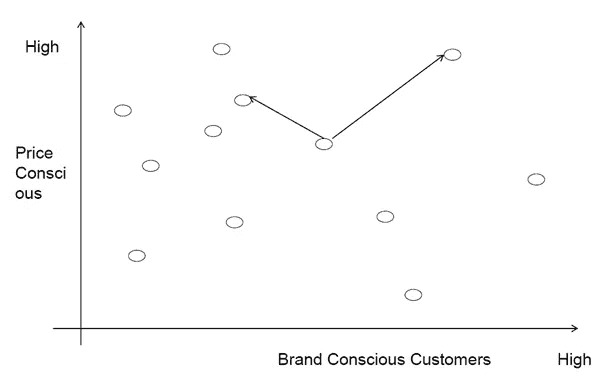
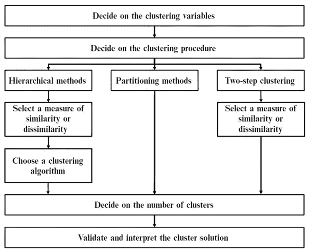
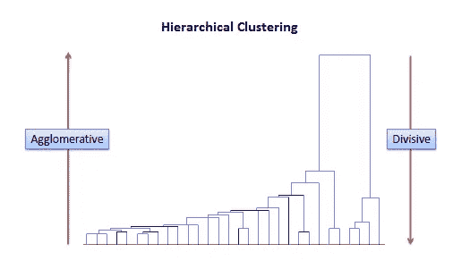
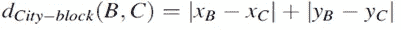
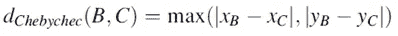
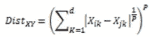
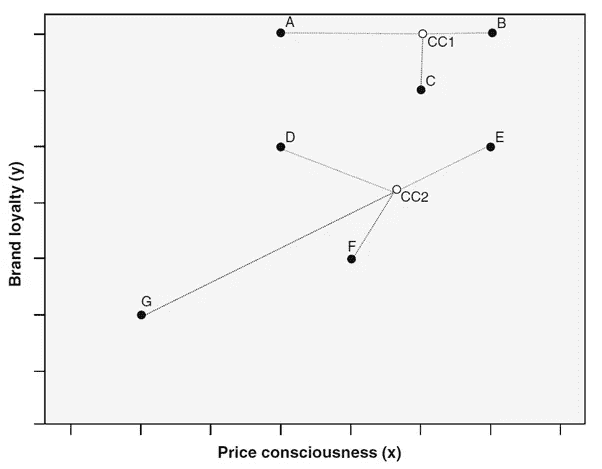

# 战略市场研究和细分的机器学习方法

> 原文：<https://medium.datadriveninvestor.com/a-machine-learning-approach-to-strategic-market-research-and-segmentation-6e9fb5cf7d4?source=collection_archive---------1----------------------->

> **聚类是一种目标未知的无监督机器学习算法。**通过将不可区分的观察值分组到单个群中，同时隔离那些完全不同的观察值，来估计目标。聚类包括将 n 个观察值划分成 p 型聚类。例如，在市场营销分析中，分析师需要评估其他几个指标来统计细分客户群，如年龄、收入、性别、地理位置等。基于给定的参数，人们必须通过识别不同的和可感知的人群子群来进行市场细分，这些子群可能更容易接受某种形式的广告或更有可能购买某种产品。一个细分市场通常是一组客户观察结果，以便根据用户的需求做出如何追加销售和交叉销售实体的战略决策。

现在，我们为什么需要客户细分或聚类？聚类的目的是在营销活动中对相似的客户和产品进行分组时进行细分的基础。这些公司不能瞄准每个客户，而是根据他们的偏好来分配客户，通过将自己定位在一个独特的细分市场来瞄准各个集群。例如，一家公司可能希望根据客户价格敏感度、产品质量和品牌忠诚度来区分客户。通过李克特量表测量的结果变量，较高的值表明更倾向于价格敏感性、产品质量和品牌忠诚度，而低值则赋予较低的强度。

戴尔在其市场战略中主要使用客户细分和产品细分，针对几个细分市场，为它们设计单独的产品或服务。一方面，在地理上，戴尔将市场划分为美国/美洲、EMEA 和亚太地区，每个地区都有不同的定价和营销策略。另一方面，从人口统计学的角度来看，没有年龄、性别或种族偏见，但是收入、职业和教育在决定客户需求以及产品供应方面起着重要作用。

品牌和细分有助于企业创建客户驱动的市场战略，从客户偏好中获得洞察力，以开发有价值的客户。举个例子，像戴尔这样的公司，世界上最大的计算机系统公司之一，基于关系型客户和交易型客户，瞄准了两类客户。基于关系的客户是分享大部分利润的公司、政府和教育部门。另一方面，传统客户对价格敏感，寻求低成本、更可靠、优质服务和附加值产品。

此外，有几种划分成组的方法。这些方法是层次方法、划分方法(更准确地说是 k-means)和两步聚类，两步聚类主要是前两种方法的组合。聚类分析应用中的一个重要难题是决定应该从数据中获得多少个聚类。在选择多个聚类以识别众多细分市场和细分市场之间的巨大细微差异之间总是存在权衡，而不是尽可能选择几个聚类以使其易于理解和操作。

# **分层方法**

该方法遵循典型的基于树的方法来聚类元素。聚类是基于相似度和相异度的。这可以通过计算给定对象对之间的距离来评估。通常，具有较短距离的对象被聚类到相同的组中，否则它们被认为是不相似的。

**凝聚聚类**是一种自下而上的聚类方法，其中聚类有子聚类，从将数据集划分为单个节点开始，逐步将当前一对相互最近的节点合并为一个新节点，直到剩下最后一个节点，这包括整个数据集。基础技术包括各种聚类方案，这些聚类方案的不同之处在于在每一步之后更新聚类间不相似性的度量的方式。七种最常见的方法被称为单一、完全、平均(UPGMA)、加权(WPGMA)、沃德、质心(UPGMC)和中间(WPGMC)连锁。

**分裂式层次聚类，**一种自上而下的聚类方法，不太常用。它的工作方式类似于聚集聚类，但方向相反。该方法从包含所有对象的单个聚类开始，然后连续分割得到的聚类，直到只剩下单个对象的聚类。

**距离度量:**

欧几里得距离——通常使用的距离度量，欧几里得距离计算一对对象的坐标之间的平方差的根。

城市街区或曼哈顿距离-曼哈顿距离计算一对对象的坐标之间的绝对差异

切比雪夫距离-切比雪夫距离也称为最大值距离，计算为一对对象坐标之间差异的绝对大小。当观察是有序的时应用的度量。

闵可夫斯基距离-这个距离可用于序数和数量变量

另一组重要的聚类程序是 K-means 划分方法，这是市场研究中最强大的技术之一，与前面讨论的算法完全不同。该算法要求计算 k 个形心，然后将每个项目分配到最近的形心，并且该过程迭代重复，直到每个观察值被聚类到组中。

# k 均值聚类

另一组重要的聚类程序是 K-means 划分方法，这是市场研究中最强大的技术之一，与前面讨论的算法完全不同。该算法要求计算 k 个质心，然后将每个项目分配到最近的质心，并且该过程迭代重复，直到每个观察值被聚类成组。

第一步是确定 k 个划分质心的数量

基于上述参数，元素内的特征将是同质的，同时最大化组之间的差异。

# 两步聚类

该方法解决了在不同尺度水平上测量的混合变量的分析问题。该算法基于两阶段方法:在第一阶段，该算法进行类似于 k-means 算法的过程。基于来自前一步骤的输出，两步过程进行修改的分层凝聚聚类过程，该过程顺序地组合对象以形成同类聚类。这是通过构建所谓的聚类特征树来实现的，该树的叶子表示数据集中的不同对象。该程序可以通过计算拟合度同时处理分类变量和连续变量，如赤池信息准则(AIC)或贝叶斯信息准则(BIC)。

此外，一个好的营销策略不仅需要细分客户群，还需要根据**客户概况**锁定和定位客户群，企业将不同的客户群划分为不同的类别，以在销售和营销方面做出明智的决策，从而提高投资回报率。最终，这有助于企业提供更好的客户服务，提高客户满意度。