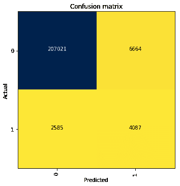
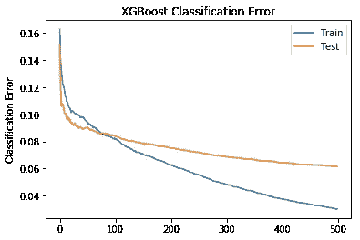
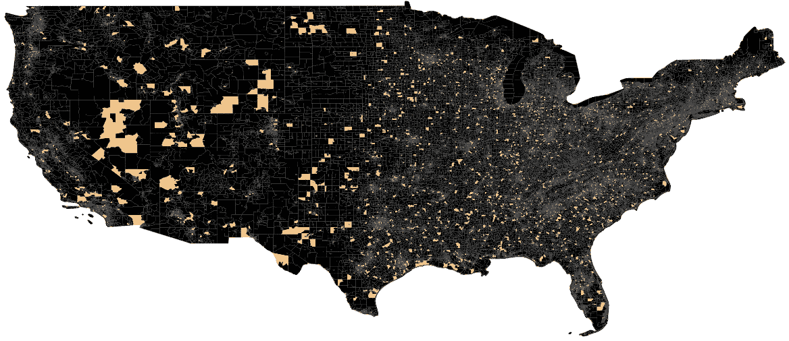
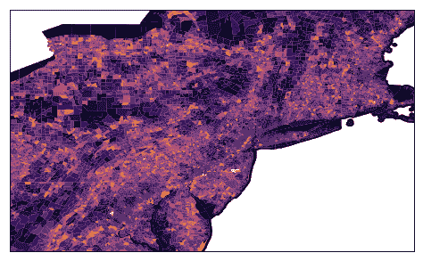
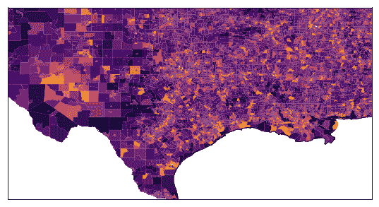
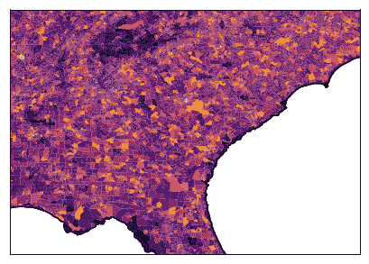

# 可以识别有害垃圾站点的机器学习模型

> 原文：<https://medium.datadriveninvestor.com/a-machine-learning-model-that-can-identify-harmful-waste-sites-92147dc064f1?source=collection_archive---------7----------------------->

该项目的代码可在此处访问[:](https://github.com/TimMango/.Project-DSFellowship_Final_Project)

【https://github.com/TimMango/. 项目-DSFellowship_Final_Project

项目目的的简要说明:寻找一个能准确预测危险废物场地位置的模型。预测概率可用于可视化和识别可能含有危险废物的未报告场地。一旦确定了高风险位置，就可以对其进行调查和清理。

## 训练机器学习模型:

这个项目是一个概念验证，目标是可视化整个美国。该模型的解释变量来自 2010 年人口普查和 2013-2017 年美国社区调查。大约 6600/220000 个人口普查区块组实际上包含 2017 年有毒物质释放清单中报告的危险废物场地。

 [## 机器学习的外汇交易挑战|数据驱动的投资者

### 机器学习是人工智能的一个分支，之前占据了很多头条。人们是…

www.datadriveninvestor.com](https://www.datadriveninvestor.com/2019/02/18/the-challenge-of-forex-trading-for-machine-learning/) 

最终的模型达到了大约 96%的准确率，但是灵敏度可能是一个更相关的指标。在这种情况下，敏感度是指被正确确定为含有危险废物的场所的数量除以危险废物场所的总数。61%的包含危险废物场地的普查区块组被正确识别，但这一数字可能会显著提高(见下一节)。

Confusion Matrix Explained

下面显示的混淆矩阵代表了最佳模型的预测性能。该模型正确地将 207，021 个人口普查区块组识别为干净的。该模型还正确地将大约 6600 个人口普查区块组中的 4087 个识别为不干净。该模型确定了另外 6664 个不清洁的场所，但这些场所实际上没有危险废物。模型遗漏的实际危险废物场地数量显示在左下方。

Accuracy : 0.9580 | Sensitivity 0.6126

## 关于机器学习模型:

这个项目中表现最好的机器学习模型是 XGBoost。XGBoost，在这里描述为，是一种基于弱学习集成的方法，在处理庞大而杂乱的数据集时非常有效。数据被分成 50%的训练数据和 50%的测试数据，并被提升 500 次迭代。这个模型被训练了大约 12 个小时。然而，测试集的分类错误，用橙色显示，在最后一次迭代中仍然在减少。这意味着该模型尚未达到最大预测能力。通过更多的提升迭代或使用更深的树来训练模型可以提高模型性能。此外，选择数据分割是为了创建良好的可视化效果，而不是最大化预测性能。更多的训练数据或更高的训练/测试分割将提高性能。

Model Error over Boosting Iterations

## 将最终结果投影到图像中

人口普查区块组是包含 1，000-4，000 人的陆地区域。6600 个人口普查区块组实际上包含至少一个来自 2017 年有毒物质释放清单的危险废物场地。更大的彩色区域并不一定意味着更危险的废物场地，它可能只是意味着一个街区群有更大的土地面积(见美国西部)。以下是 2017 年有毒物质释放清单中的实际废物场地地图。

Map of actual waste sites

下面是美国大陆的预测概率图。XGBoost 模型用于创建概率。概率由人口普查信息决定，预测是人口普查区块组是否包含至少一个 2017 TRI 站点。

**越亮的颜色代表概率越高。**

Map of hazardous waste site probabilities

东北预测概率图

Interesting observation: Try to find Interstate 95

西南预测概率图

东南预测概率图

May need some investigation…

## 外卖食品

东南部看起来需要一些调查！如果有兴趣，可以重复进行更有针对性的分析。然后，资源可用于调查和清理高风险人口普查区块组，重点是工业区。

## **最重要的功能**

最终模型中使用了大约 200 个变量，但以下是一些最重要的特征:

**1。**区块组用地面积， **2。平均。家值， **3。**空置房百分比， **4。**男性人口百分比， **5。**教育程度， **6。**人口年龄， **7。**暂住人口百分比， **8。**健康保险百分比。**集体住房人口百分比

Github 上的 Jupyter 笔记本列出了所有变量的特性重要性。以下是我对最重要功能的一些主观推理:

男性人口的比例被证明是重要的。我认为原因是有毒物质释放清单报告了工业废物和工业劳动人口往往是男性。人口年龄是另一个有趣的变量，特定的年龄组在模型的决策树中被大量使用。一般来说，有儿童和老年人的人口普查区群体接触危险废物的风险较小。从我的角度来看，健康保险的百分比是最有趣的特征，它表明低收入，低个人健康支出，和/或低健康意识。

## 失败，我学到的东西，解决问题

三件事使得这个项目相当困难。

1.  第一个问题是人口统计数据本身是否能提供足够的解释力来预测危险废物的位置。我有一些直觉，这可能会工作，但我并不完全确定，直到我在这个项目中腰深。
2.  第二个挑战是目标变量的不平衡类。通常，当与所有观察值(中性位置)相比，正面观察值(危险废物位置)非常少时，模型可能没有足够的信息来正确学习。用于解决这个问题的方法是 SMOTE(合成少数过采样技术),它工作得不是很好，以及决策树的类加权。决策树权重提高了模型性能，并且在处理不平衡类时，基于树的方法通常比其他模型表现得更好。还测试了具有类权重的神经网络，但 XGBoost 似乎是解决该问题的最有前途的模型。
3.  选择代表危险废物的目标变量。目标变量一般应代表危险废物，结果表明解释变量(普查信息)可能能够预测某些类型的危险废物场地，但不能预测其他类型的危险废物场地。

这个项目失败了几次才成功。最终的可视化是一个很好的产品，但项目冰山的主体是花时间清理数据，测试模型，试图找到额外的数据，合并新的数据和变量，并丢弃无用的变量。

**奖励提示:**

我有一个数据集，在人口普查区块组级别有 7000 多个变量，而规划数据库在人口普查区域级别有 500 多个变量。这使得阅读变量描述非常具有挑战性。在我的第一次尝试中，我通读了. pdf 文档中对人口普查区块组的 300 多个变量的描述。

在经历了第一轮清理人口普查区块组数据和变量的痛苦之后，我变得聪明了一点。我使用 [Tabula](https://tabula.technology/) 来抓取元数据。pdf 页面至。csv 文件。然后。csv 文件被上传到 Python，变量基于关键字被删除。关键字可以在变量名称中，也可以在变量描述中。在花费大量时间阅读人口普查区块组级别的变量后，我对人口统计数据感兴趣的关键字有了一个相当好的想法。

## 结论

感谢您的阅读！如果你认为这很有趣，请留下掌声或评论，如果你对扩展这个项目感兴趣，可以在 [LinkedIn](https://www.linkedin.com/in/tim-mango/) 上给我发消息，我很乐意帮忙。

**项目灵感:什么是地球挑战 2020？**
2020 年 4 月 22 日是地球日 50 周年。为了表彰这一里程碑式的地球日网络，伍德罗·威尔逊国际学者中心和美国国务院生态资本论坛发起了地球挑战 2020，作为世界上最大的协调公民科学运动。

“地球挑战 2020”将吸引数百万全球公民参与，在空气质量、水质、生物多样性、污染和人类健康等领域聚集和收集超过 10 亿个数据点。通过 2020 年地球挑战，公民科学志愿者将了解他们的当地条件，并利用信息来激励合作行动和影响政策决定。