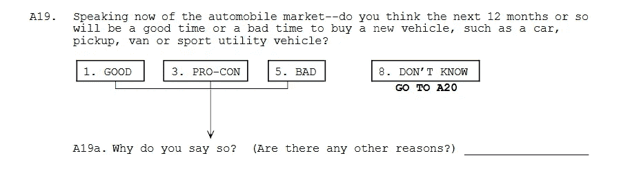

# 无聊金融体系的宣言

> 原文：<https://medium.datadriveninvestor.com/a-manifesto-for-a-boring-financial-system-596223ef6e81?source=collection_archive---------4----------------------->

Photo by [rawpixel.com](https://www.pexels.com/@rawpixel?utm_content=attributionCopyText&utm_medium=referral&utm_source=pexels) from [Pexels](https://www.pexels.com/photo/selective-focus-photography-of-gasoline-nozzle-1537172/?utm_content=attributionCopyText&utm_medium=referral&utm_source=pexels)

今天，我坐下来思考金融市场在经济中的作用。股票市场、债券市场和银行到底在做什么？它们是如何运作的，会带来什么样的风险？我们如何阻止这些风险？当然，我不会站起来离开电脑，你也不会在充分了解这些复杂问题的情况下读完这篇文章。如果我们作为一个学科对这些机构的作用以及如何控制它们有一个完整的理解，我们仍然会有埃尔文·费雪在 1929 年股灾前不合时宜的评论“股票价格已经达到了看起来像是永久的高位”，巩固了他作为反先知的历史地位。当然，他还做了其他的事情，但是如果他被普通人记住，那也是因为那次演讲。

但也许你可以说他很早，他声音中的骄傲在那里只是因为这个学科很年轻，从业者认为他们有所有的答案。唉，还有其他名字，更容易被今天的读者认出来，做出类似的声明，但不会在历史上出现。在另一个例子中，伟大的大萧条历史学家、后来的美联储主席本·伯南克在米尔顿·弗里德曼的生日上发表讲话，向这位老经济学家告别:“让我稍微滥用一下我作为美联储官方代表的身份来结束我的讲话。我想对弥尔顿和安娜说:关于大萧条。你说得对，我们做到了。我们非常抱歉。但多亏了你，我们不会再这样了”(《生日》)。在我的教育中，我曾无数次在精神上回圈到这一刻，让它从我手中弹过，像沙子一样落到地上。这让我很惊讶，也是对费希尔评论的完美终结。前一句话的过分热情是后一句话的傲慢的另一面。“看，”圣贤们说，“没有必要担心，因为我们已经把这一切都搞清楚了”。当然，这些言论只是回想起来讲的。

 [## 分散金融的出现——数据驱动的投资者

### 当前的全球金融体系为拥有资源、知识和财富的人创造了巨大的财富

www.datadriveninvestor.com](https://www.datadriveninvestor.com/2019/03/14/the-emergence-of-decentralized-finance/) 

如果股票停留在高位，只有经济学家会知道费舍尔的名字。如果不是因为美联储在 2000 年代保持低而稳定的利率而导致的房地产崩盘，格林斯潘仍将是“大师”，我们将继续敬畏地说，而不是我说“大师”时使用的讽刺暗示，他也不会被拖到国会面前解释“在我看来是定义世界如何运作的关键功能结构中存在缺陷”(奈洛尔)。有一个缺陷，某种弱点，可能会将不稳定从一个机构传递到另一个机构，并导致整个金融系统和更大的经济崩溃，即使在注入数万亿美元的现金并承诺支持银行和投资银行后，这导致了缓慢的复苏，并为各种令人讨厌的角色提供了政治空间。对我来说，从 2008 年的崩盘到唐纳德·特朗普(Donald Trump)的崛起有一条直线，这不是一件好事。

我想暂时从金融危机中抽身出来，思考一下我们所说的“经济”是什么意思。在宏观层面上，我们可以谈论对 GDP 的贡献，C + G + I + (X-M ),并询问每一部分都发生了什么。会说话的人会说，美国经济的 70%是由消费驱动的。但 GDP 是由最终产品驱动的，有太多的东西没有计入 GDP(以及所有计入其中的坏事情)，以至于从自上而下的宏观层面看并不能捕捉到经济的真实情况，或者即使捕捉到了，也抽象了太多，以至于普通人无法很好地理解正在发生的事情。我这样说是因为经济的本质是人们在不确定的情况下做出经济决策。你辞职了吗，如果你辞职了，你会很容易找到新工作吗？你会搬家，寻找更好的机会吗？你是否应该开始存钱，认为可能会出现经济低迷？有些组织试图量化这些问题。美国经济咨询局和密歇根大学都调查了美国人对经济的看法，以及他们认为经济将很快采取行动的看法，并提出了密歇根调查第九页下图中的问题。

当然，调查数据存在各种各样的问题，因为它捕捉的是人们的想法，而不是他们的实际行为，但我们在这里寻找领先指标，当前的领先指标显示，他们两人的情绪都很高。总体而言，美国消费者正在火上浇油。不过，你和我并不一起做这些决定。我们自己做这些决定。我去年对我的抵押贷款进行了再融资，认为利率会继续上升，尽管我一直在跟踪美联储，但总统和经济给利率设定委员会施加了足够的压力，他们决定不再继续加息。现在，市场表示，加息至少会暂停，联邦基金利率可能会下调整整一个百分点。这意味着我的抵押贷款被锁定在一个较高的利率，如果我现在再融资，我将能够得到，如果我想支付更多的费用，并重置我的摊销表，我仍然可以。我可能会在一年内搬家，所以我认为我现在不会做出这个决定，从历史角度来看，这是 4.5%，很低。经济是人，在不确定性下运作，做出这些经济决策。他们扮演着消费者、工人和政府成员的角色。

我想从现在的“经济”转移到崩溃前的“经济”上来。我曾在其他地方写过，直到金融危机爆发，我才开始关注整体经济。我意识到自己作为一名工人的角色，但实体经济中发生的这么多事情似乎对我每天生活的实体经济没有任何影响。我做出的选择就好像基线没什么好担心的。当我读大学的时候，我觉得主修英语应该没问题。我知道网络时代的繁荣和萧条，但这并没有影响到我。反思这一点让我试图思考金融经济是如何渗入实体经济的。有消费者信心的民意调查，他们确实试图将这些情绪量化成一个很小的数字，但是这些情绪是如何产生的呢？要真正思考这个问题，我需要把现在的我和十多年前的我分开。如果一个人不关注金融新闻，他能获得什么样的信息？他们如何解读经济现状和未来的道路？本周，在与人们的非正式交谈中，有几个重要指标，其中之一就是通货膨胀。天然气的价格是一个大问题。虽然我们大多数人都亲自或在网上购物，但只有一个真正的价格是你每天开车经过的，那就是汽油价格。如果油价上涨，晚间新闻会报道新的油价将如何伤害消费者，因为这是他们支出中足够大的一部分，而且可能会有一些波动。在 2008 年危机爆发前，天然气价格几乎翻了一番。我记得汽油价格超过每加仑 4.5 美元。这很重要，因为我开的是一辆 1998 年的道奇公羊皮卡。那辆车有一个巨大的耗油引擎，一加仑只能跑 12 英里。加满油箱需要 30 或更多加仑，所以一次加满就要花费将近 150 美元。我没有那么多闲钱，所以我试着把卡车处理掉。当我试图卖掉它时，我发现人们没有兴趣为这辆卡车付太多钱，所以我把它捐了出去，因为否则我会因为把它停在城市街道上而被罚款。在危机爆发前，作为一个并不真正关注经济的人，另一个可以得到的数字是股票市场的水平，但即使是这样，我也没有意识到。查看 2007 年至 2008 年 DJIA 的水平，我惊讶地发现，在春季出现了明显的疲软，这大概是贝尔斯登破产并被出售给大通银行(“历史道指”)的时间。道琼斯指数随后有所回升，尽管我尽了最大努力，但我想不起那个夏天有任何担忧。我失业了。2007-08 学年，我在一所天主教学校教书，没有人邀请我续约，我有点无精打采地不知道该怎么办。我喜欢教书，但我需要离开一会儿，重新考虑我的人生道路。2008 年夏天，我认为从事销售是个好主意。我做了一些调查，其中一个比较容易进入的行业是汽车销售。所以，我联系了不同的经销商，开始研究一些将在秋季上市的最新车型。我还记得看到一篇文章，说汽车销售经历了很长一段时间以来最糟糕的夏天。坚持，没有让这困扰我，我受雇于雪佛兰经销商。

然后那年秋天，金融经济向实体经济的泄漏变成了海啸。

有些时候，你不能认为经济的运行是理所当然的，因为无论你如何试图忽视它，它都会让你知道。尽管 NBER 后来认为衰退开始于 2007 年末，但我仍然认为汽车销售是快速赚钱的好方法，尽管销量有所下降。在九月中旬，人们无法忽视这样一个事实:某些东西突然断裂了。我们被要求每周在经销店工作 50 个小时，这是最长的一天，花 10 或 12 个小时无所事事，或者经历经理们想象出来的一些训练游戏的动作，或者打电话给我们数据库中的每个人，看看他们有多愿意下来看看新车型。这不是转行的好时机，经销店的客流量很低，这意味着对于走进经销店的少数人来说，销售人员之间竞争激烈。

但是我们已经能够理所当然地看待经济。当伯南克就美联储在大萧条中的角色向弗里德曼道歉时，他承认，在那个时候，经济问题已经解决了。上一次衰退规模较小，而且集中在股票市场。它没有渗透到实体经济的一个原因是股票所有权的扩散，其中最富有的 10%拥有超过 80%的金融资产(“duets che”42)。六年后崩盘的不同之处在于，它与人们的住房联系在一起，因此存在一种反馈效应，即人们的收入不足以支付他们的付款，这意味着风险水平被低估，住房支持的资产价格被高估，因此它们与可怕的负面反馈效应相一致。有趣的是，这真的不应该发生。1929 年股灾之后，以及新政期间，监管开始到位，以确保银行业令人厌烦。这种方法的问题在于，公司积累的政治权力与其金融权力密切相关。此外，人们忘记了制定这些规定的最初理由，破坏为防止下一次崩溃而设置的隔离墙也变得很好——奇怪的是，该体系的稳定性，即它正在发挥作用的事实，被用作削弱保护的理由。正如被重新发现的经济学家海曼明斯基(Hyman Minsky)所言，稳定制造了自身的不稳定。值得注意的一点是，这些机构的金融实力非常强大。根据一项指标，在危机爆发前，超过 40%的公司利润是由银行和其他金融机构创造的。下跌之后，他们在几年内又回到了 30%以上(“华尔街”)。当然，所有这一切都值得注意，因为在许多经济学家的模型中，直到危机爆发，银行和金融机构都不在模型中。货物的买方和卖方在市场上相遇，没有中间人。

经济学家的模型中没有这些金融机构，因为金融机构应该很无聊。他们处理大量的资金，即使他们只是从中获利百分之一或百分之二，他们也不认为你会错过这些资金，但你会。除了我们允许这些机构通过权力收取租金之外，在曼哈顿中城建造巨大的玻璃塔没有任何正当理由。他们通过在理论上至少会发生的交易中扮演中间人的角色，从无聊变成了公司利润的巨大来源。你可以去找一本教科书，看看一个枯燥的金融体系应该是什么样子。金融体系应该满足实体经济的需求，而不是实体经济的驱动者。有哪些需求？公司需要钱。他们可能有新产品要推出，或者正在将他们的模式投资于一个新的市场，但他们没有即时的流动性。公司不喜欢不确定性。他们可能想对冲他们的头寸。投资者有钱，他们可能想要有保证的回报。或者，他们可能觉得可以让自己承担一些风险来获得更大的回报。金融产品的存在就是为了让这一切发生。

如果一家公司需要流动资金，有两种方法可以解决。他们可以发行股票，这通常是对公司利润百分比的要求权，以及对公司经营方式的投票权。这一基本模式在最近几年被颠覆了，因为一些公司发行了对利润有不同要求或有不同投票权的股票。该公司放弃了一些未来现金流的权利，稀释了所有其他股票的整体价值。这种股票发行对投资者是有益的，因为作为对他们预先支付的现金的回报，只要公司还在经营并且股东拥有股票，他们就有权要求公司向其股东支付的所有未来股息、回购和一次性现金支出。另一种获得所需资金的方法是发行债券。债券是定期投资，在发行时有固定的回报。这些证券的购买者被保证在债券到期日获得债券票面利率的名义回报以及初始投资(球 58)。这两种工具都在二级市场上交易，基于不断变化的利率和对未来现金流水平的看法，它们的价格将不同于最初的报价。

消费者现在或将来也可能需要钱，所以他们可以将当前的资金投资到这些证券中的一种。或者他们可以去银行。银行是接受存款和发放贷款的机构。在美国，有很多不同种类的银行，但如果它们从事期限转换业务，我们可以泛泛而谈。这些机构必须有自己的资金可以借出。银行的投资者提供初始资本，这是他们所做的一切的后盾。然后他们可以吸收存款和贷款。他们也可以从其他机构或美联储借钱，让自己有能力发放更多贷款。银行通过收费以及贷款利率和借款利率之间的差异来赚钱。如果贷款很好，利差足够大，那么维持这个系统应该没有问题。

金融体系应该能够做的最后一件无聊的事情是消除风险。这是不完全可能的，所以也许它应该被框定为降低风险。不同的金融产品可供机构和商业客户买卖，给予客户以某一价格买卖证券的权利。还有一些金融机构将股票打包成共同基金，这样客户就可以分散投资，跟踪一个指数，而不必买入和卖出不同的证券。问题是，这一切都变得不再无聊，这是金融体系中的参与者设计的。他们尽其所能增加风险和回报，却忽略了一个简单的事实:如果你用抵押贷款支持证券制造衍生品，如果全国范围内的房价变化有很大的相关性，你就会有麻烦。机构忽略了一个教训:如果你借了太多的钱，那么你的资本基础就会被稀释。到 2007 年，雷曼兄弟的杠杆率超过了 30:1，这意味着他们只有 3%的自有资本支持(“雷曼”)。这意味着，如果市场上涨，你作为一个机构可以赚钱。你可以把它交出去。这也意味着，如果市场仅下跌 3%，你的整个机构不仅流动性不足，而且资不抵债。

那你怎么让金融系统变得更无聊呢？简单的答案是抓起魔杖，颁布法令，要求银行提高资本金水平，奇异的衍生品不再合法，所有贷款都需要更多的承销。你挥舞一下魔杖，就能把银行和金融机构的薪酬限制在中位数的某个百分比。你挥舞着魔杖，宣布私人股本公司的商业模式为非法。私人股本公司收购公司，让它们负债累累，并剥离它们的资产。创造理想的古典世界，一个劳伦斯·鲍尔说是“坠毁难以解释”(71)的地方。你以欺诈罪把人送进监狱。

你挥舞着希望之手，让这些法规全球化，因为资本擅长的是寻找短期赚钱的最佳地点。如果你提高在一个管辖区做生意的成本，资本家会找到下一个最好的做生意的地方。

最终，你想要这样做，因为只要我们有资本主义在，我们就需要尽最大努力让它为实体经济中的人们服务。实体经济和金融经济越是分离，实体经济外生的破坏性大崩溃的风险就越大。你最终会面临这样一种局面:选项变成了两种选择之一，要么清算系统，要么支撑失败的系统，让它重现崩盘的情形。唉，我们都没有那根魔杖，但通过国家监管机构和国际协议，资本要求已经提高，大银行持有更多干粉，但这还不够。下一次崩溃的种子已经播下。一些经济学家或评论员发出了警报，但他们被忽视了，因为没有人喜欢听到坏消息，而且这次不同了。但除非我们让银行业变得无聊，否则每一次都会不同，但它肯定会押韵。

作品引用
波尔，L. M. (2012)。货币、银行和金融市场。纽约州纽约市:沃思。伯南克(2002 年 11 月 8 日)。米尔顿·弗里德曼九十大寿之际。检索 2019 年 6 月 30 日，来自[https://www . federal reserve . gov/board docs/speechs/2002/2002 11 08/](https://www.federalreserve.gov/BOARDDOCS/SPEECHES/2002/20021108/)
消费者数据。(未注明)。从[https://www.conference-board.org/data/consumerdata.cfm](https://www.conference-board.org/data/consumerdata.cfm)取回
德意志银行的资本头寸。(未注明)。检索自[https://www.db.com/company/index.htm](https://www.db.com/company/index.htm)
道琼斯工业平均指数历史价格，2007-2019。(2019 年 4 月 17 日)。检索自[https://knoema . com/jhxfibc/Dow-Jones-industrial-average-historical-prices-2007-2019](https://knoema.com/jhxfibc/dow-jones-industrial-average-historical-prices-2007-2019)
奈洛尔，B. (2008 年 10 月 24 日)。格林斯潘承认自由市场意识形态有缺陷。从[https://www.npr.org/templates/story/story.php?取回 storyId=96070766](https://www.npr.org/templates/story/story.php?storyId=96070766)
斯图尔特·h .(2010 年 9 月 19 日)。消费者支出和经济。检索自[https://fivethirtyeight . blogs . nytimes . com/2010/09/19/消费者支出与经济/](https://fivethirtyeight.blogs.nytimes.com/2010/09/19/consumer-spending-and-the-economy/)
消费者调查。(未注明)。检索自[http://www.sca.isr.umich.edu/](http://www.sca.isr.umich.edu/)威斯曼律师事务所(2013 年 5 月 11 日)。华尔街如何吞噬美国企业？检索自[https://www . theatlantic . com/business/archive/2013/03/how-wall-street-suggested-corporate-America/273732/](https://www.theatlantic.com/business/archive/2013/03/how-wall-street-devoured-corporate-america/273732/)

*最初发表于*[*http://econautodidactic.blogspot.com*](https://econautodidactic.blogspot.com/2019/07/a-manifesto-for-boring-financial-system.html)*。*