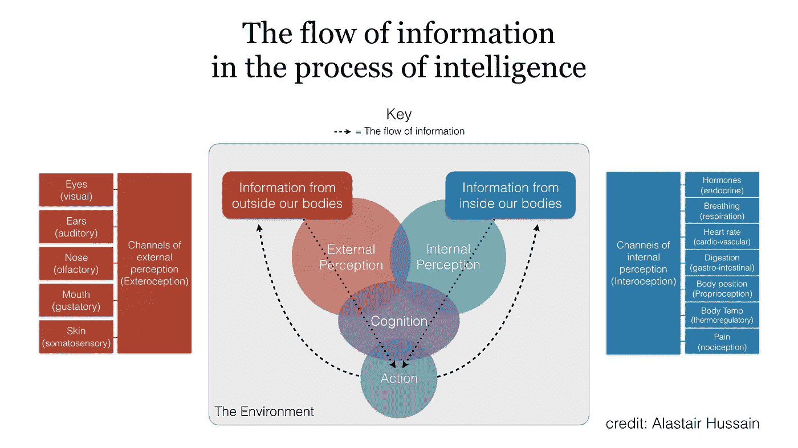
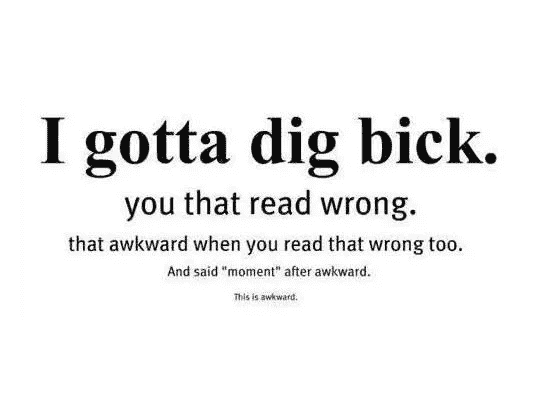

# 马萨的地图

> 原文：<https://medium.datadriveninvestor.com/a-map-for-masa-d90c9ff0cd6d?source=collection_archive---------34----------------------->

如果你有 1000 亿美元投资奇点，你会怎么做？*【1】*

我会这么做。

*TL；DR——人工通用智能(AGI)不仅仅是算法。很多投资者和企业家认为解决智能问题意味着解决大脑如何工作的问题。这是一个错误，因为大脑只是智力拼图的一部分。环境背景、物理世界以及外部和内部感知所涉及的机制，对于一般智力来说，与发生在大脑皮层区域的认知过程一样重要。如果 Masayoshi-Son 想要加速奇点并在此过程中创造商业价值，他需要投资一系列能够——一起——模仿人类一般智能过程的公司。*

## 智能是如何工作的

人们很容易认为智力是发生在大脑或计算机中的东西。

但是我们需要缩小来获得更完整的智力图像，因为**智力不仅仅是在大脑中产生的。***【2】*

如果你对智力的定义包括在“真实”世界中获取信息、建立联系、应用知识和实现目标——这是应该的——那么智力需要一种物理存在才能存在。它必须被具体化。*【3】*

让我们从基本原则来看:

从根本上说，智能是信息处理的一种形式。以下是信息如何在我们体内流动的概述:

正如你所看到的，它需要大量不同的内部和外部信息来源(渠道)来产生我们人类水平的一般智能。

这些来源的大部分信息(眼睛、耳朵、荷尔蒙、心率等。)通过神经通路流入大脑。所以，是的，大脑扮演着重要的角色。但这并不意味着它是“做”智能的部分——在每个阶段都有重要的处理步骤。

例如，大脑不会接收外部世界的数字副本。我们的感觉器官在信息到达大脑之前过滤信息。将会有一些生物压缩，例如，光波在我们的身体中被转化为电刺激，通过晶状体和视网膜中的细胞聚焦。(可以说，'[视网膜实际上是长到眼睛里的大脑的一部分。](https://www.eurekalert.org/pub_releases/2006-07/uops-prc072606.php))

当我们达到上图中所谓的“认知”时，信息已经发生了实质性的改变。已经做了很多处理。简单地寻求复制大脑的算法无法解释这一关键步骤。

复制信息进入大脑的方式很重要，因为大脑最有影响力的学习算法是“时间关联”。

原因很简单:随着神经元更频繁地一起放电，它们之间的连接变得更强。把它想象成一个电路——每次两个神经元同时放电，就会降低它们之间路径的电阻。这意味着当一个神经元被触发时，它会产生电流，因此另一个神经元也更有可能被触发。(注意，大多数时候，尤其是当我们的大脑正在发育时，这些联想是由时间和空间驱动的，而不是逻辑。同样，至关重要的是，这种关联过程不仅发生在外部刺激上，也发生在内部刺激上。这就是[我们如何构建‘情绪’](https://www.ted.com/talks/lisa_feldman_barrett_you_aren_t_at_the_mercy_of_your_emotions_your_brain_creates_them?language=en)。)

想想这个过程在多个神经元之间发生多次，你会发现，最终，一个单一的刺激可以触发一种神经元模式，远远超出接受原始刺激的神经元。这种触发模式实际上是对接下来发生的事情的一种预测(或多种可能的预测)。*【4】*结果，[大脑变成了一个预测装置](https://www.newscientist.com/article/mg23030681-300-do-our-dynamic-brains-predict-the-world/)，一个单一的刺激就触发了对当前环境中可能不存在的事物的感知。

**为什么这对我们如何构建智能模型很重要？**

首先，我们的行动(智力过程的可观察结果)和感知是基于我们认为将要发生的事情，而不是实际发生的事情。

第二，这种联想式的学习方法让我们能够将我们的学习从一个场景转移到另一个场景。*【5】*如果我们不对这种多模态的时间关联过程进行建模，那么我们就会限制自己传递所学知识的能力——这是 AGI 的一个关键组成部分。我们的预测是由我们经历事情的方式形成的。信息在你出生之前就进入了你的大脑，而且这些信息是通过许多不同的渠道同时进入大脑的。*【6】*

第三，这种预测行为依赖于物理世界的约束，以便将输入转化为行动。物理世界的约束意味着我们的认知预测不必是完美的计算——它们只需“足够正确”就能实现预期的结果。为了拿起一杯咖啡，我的大脑不必计算我身体的每个可能运动的每个可能结果。我移动手臂、手和手指，我要么拿起杯子，要么不拿。在整个过程中，我不断地进行小的调整，因为每个手指都感觉到发生了什么。换句话说，来自物理世界的反馈使行动成为可能。这加速了学习:孩子们在学习如何不洒饮料的时候洒了很多，但他们洒的次数相对较少，不是几百万次。

因此，在实践中，这些现实世界的物理约束节省了我们的智力在无限空间中蹒跚前行的无数时间。这些限制是我们智力结构的组成部分；物质世界构成了我们智力结构的一部分。*【7】*

## 所有这些对于我们如何分配 1000 亿美元意味着什么？

如果您同意我上面概述的观点，您会发现我们需要投资 5 个领域:

*   (真实/模拟)环境
*   外部感知
*   内感受
*   认识
*   行动。*【第八期】*

因此，1 万亿美元的问题是:

> 在这 5 个领域，谁最有可能胜出？

我将在下一篇文章中更详细地讨论这个问题。**如果你有任何建议，请在下面的评论中告诉我。**

目前，以下是这些领域的一些启发性想法:

*   真实/模拟环境:想想像[不可能的](https://medium.com/u/a1c0470dc7a4?source=post_page-----d90c9ff0cd6d--------------------------------)这样的视频游戏引擎，VR/AR 开发者和像 [Mapfit](https://www.mapfit.com/) 这样的地图初创公司。
*   外部感知:我们这里说的是传感器。想想物联网创业公司和激光雷达公司，还有相机和镜头。触摸传感器，甚至嗅觉(嗅觉)传感器也有市场可开拓(参见 [Aryballe technologies](http://aryballe-technologies.com/) 和 [Aromyx](https://www.aromyx.com/) )。
*   Interoception:制药公司与其他生物技术初创公司一起，执行与该领域最相关的 R&D。
*   认知:每个大型科技公司都有人从事机器学习算法的研究(例如 Alphabet 的 DeepMind、IBM 的 Watson、脸书的 FAIR)，但其中许多公司的员工都在相同的地方接受过教育，并使用类似的技术(例如深度学习)。我们开始看到当前方法的局限性。有人在探索新的方法，比如杰夫·霍金斯和他在 Numenta 的团队。随着许多当前的算法方法成为开源和 api-ed，这些新方法将变得更有价值。
*   动作:你好机器人。波士顿动力公司在这个领域是一个响当当的名字，但像 Ocado 这样的公司也可能是相关的。

你确信加速奇点意味着投资的不仅仅是算法认知吗？如果你不是，让我知道为什么，我很乐意回应下面的任何评论。

# AGI #远见基金#软银#奇点#体现认知

## 脚注

*背景故事:*

*2016 年末，软银背后的亿万富翁孙正义(Masayoshi Son，简称“Masa”)与王储穆罕默德本萨勒曼阿勒沙特(Mohammad bin Salman Al-Saud)进行了会谈。45 分钟后，马萨口袋里有了 450 亿美元。*

*正是这项投资启动了他的“愿景”基金，并使其成为头条新闻。该基金的公开目的是“[开启下一个创新时代”](https://softbank-ia.com/vision-fund)。但是在[良知基金会](http://www.prnewswire.com/news-releases/appeal-of-conscience-foundation-honors-corporate-global-leaders-from-united-states-europe-and-asia-brian-moynihan-chairman-and-ceo-of-bank-of-america-paul-polman-chief-executive-officer-of-unilever-and-masayoshi-son-chairman-300522005.html)的呼吁会上，[孙正义简单地说了一句](https://www.nytimes.com/2017/09/20/business/dealbook/masayoshi-son-softbank-artificial-intelligence.html):*

> *“我对这项投资的信念和愿景是什么？我只有一个信念——奇点。”*

*是的，软银已经投资了大约 400 亿美元，根据 Recode 的统计还在继续，包括在优步的 93 亿美元。但是 Masa 已经谈到每三年创建类似的基金，所以为了简单起见，我把这个数字四舍五入到 1000 亿美元，因为精确的财务数字不是本文的灵魂。*

**【2】*让我们回到 1929 年。那一年，哈佛大学的心理学家卡尔·拉施里对那些试图在迷宫中奔跑的老鼠的大脑皮层进行了一些蓄意的严重损伤。他发现损伤的皮层越多，老鼠的表现越差。*

*不出所料。*

*但是在这样的实验中，很容易忽略明显的一点。这一点显而易见，拉什利甚至觉得没有必要去研究它。事实上，如果他有，那么也许我们现在就不会有这种狭隘的智慧观。想象一下，如果他损伤了身体的不同部位——不同的肢体，不同的器官，不同的血管。(我承认，这不是一张值得留恋的照片。)我认为公平地说，他切除的身体部位越多，老鼠的表现就越差。*

**【3】*在虚拟世界中模拟现实是可能的，但这涉及到对现实世界的建模，所以我们现在就把它放在一边。*

**【4】*这方面的一个著名例证是巴甫洛夫的《狗》。每次喂完一群狗，他先按一个铃。这食物让狗流口水。几天后，仅仅是铃声就会让他们对即将收到的食物垂涎三尺，不管他们是否真的收到了。*

*这里有一些粗俗但有效的证据，你可以自己尝试一下:*

**

*这也对注意力的概念产生了有趣的影响。如果我们正在关注某件事，我们很可能会从中获取更多信息，因此会参与更多层的皮层路径，并“产生更多电流”。反过来，这更有可能会有足够的“电”刺激来创造新的，或者至少不太可能的模式。*

*…你知道婴儿倾向于关注新奇的刺激吗？有些人认为这是对新奇刺激的“吸引”。但是可能有一个更简单的机械解释。如果没有任何神经通路将对这种刺激的感知与行动联系起来，那么婴儿不知道移动头部，直到有了神经通路。因此，任何实际的动作都不太可能产生，婴儿也不太可能将她的眼睛或头从焦点区域移开，直到那些路径被创建。*

*另见[http://www . MRC-cbu . cam . AC . uk/blog/2013/07/your-brain-the-advanced-prediction-machine/](http://www.mrc-cbu.cam.ac.uk/blog/2013/07/your-brain-the-advanced-prediction-machine/)*

**【5】*关于这如何影响语言的更多细节，以及它应该如何影响自然语言处理(NLP)技术的发展，请阅读我的文章 [M=EC](https://medium.com/@AlHussain/m-ec-b02b7cc69ad6) 。*

*在分析我们如何思考时，另一个常见的错误是，大脑以线性方式处理“时间”，就像我们在外部世界中概念化它一样。事实上，大脑中的关联模式是向前、向后、向上、向下、向左、向右、一圈又一圈。不像时间，我们把它描述为单向的。([)尽管这一方向因文化而异。这意味着后来的事件会影响我们对早期事件的看法。](http://lera.ucsd.edu/papers/language-time.pdf)*

**关于这一观点的有趣的形而上学观点，请参见安迪·克拉克关于“扩展思维”的论文:[https://www . new Yorker . com/magazine/2018/04/02/安迪·克拉克的思维扩展观点](https://www.newyorker.com/magazine/2018/04/02/the-mind-expanding-ideas-of-andy-clark)**

***【8】*当前风险投资的趋势是狭隘地关注认知算法:[https://Quid . com/feed/Quid-special-report-The-new-wave-of-artificial-intelligence](https://quid.com/feed/quid-special-report-the-new-wave-of-artificial-intelligence)来自 [Quid，Inc.](https://medium.com/u/5c6c5a950589?source=post_page-----d90c9ff0cd6d--------------------------------)**