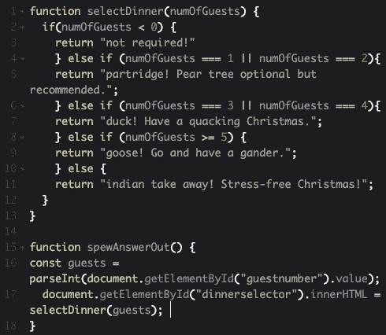
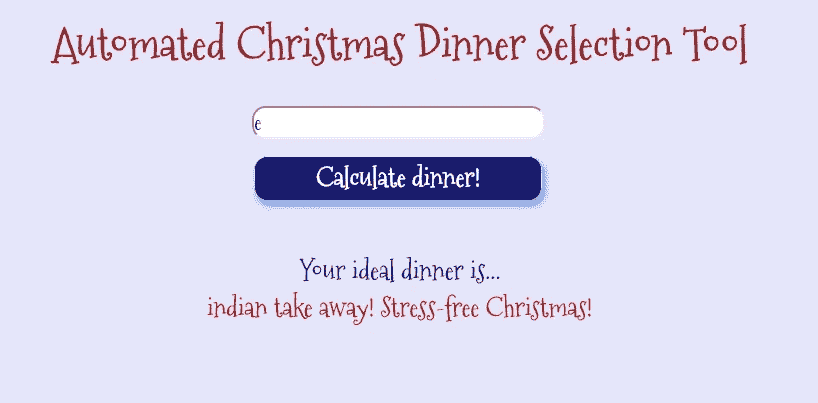
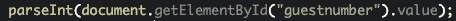
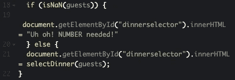

# 快乐的圣诞节

> 原文：<https://medium.datadriveninvestor.com/a-merry-js-mas-ad5d1358520c?source=collection_archive---------16----------------------->

上次，我提到了我是如何钻研[韦斯·博斯](https://medium.com/u/86a55cd7983b?source=post_page-----ad5d1358520c--------------------------------)的 JS30 课程，并且很享受学习 JS 的不同用途。虽然该课程让我对使用 JS 的可能性有了很好的了解，但它假定了一个基本的知识水平，坦率地说，这是我所缺乏的。

所以是时候回归基础了。我报名参加了 Codecademy 的 Javascript 入门课程。

对我来说幸运的是，该课程假设零知识，并遵循“展示-解释-现在轮到你了”的形式，我发现这非常有利于学习。在我完成了涵盖条件和函数的第 1-3 课之后，我将我新发现的知识用于测试，并创建了我的第一个以 JS 为中心的项目，'*自动化圣诞晚餐选择工具'*:

选择工具的工作原理是通过一个`<input>`标签接收一个数字，并使用一个`if...else` 语句返回最适合聚会规模的节日晚餐，或者通知用户，如果去的客人人数为负数，就不需要晚餐了(毕竟，有些人会被圣诞计划搞得不知所措)。

起初，这一切似乎相对简单。然而，在测试过程中，我意识到有一种边缘情况会产生意想不到的结果。尽管我将`<input>`标签的数据类型定义为‘number ’,但仍然可以输入`e`,它返回零客人的节日晚餐选项。

Bug detected in system.

在与我的个人 JS 导师 [Michael Rybintsev](https://medium.com/u/6dae95d0f26d?source=post_page-----ad5d1358520c--------------------------------) 协商后，我们意识到这种情况的发生是因为 [e 或多或少是一个数字](https://en.wikipedia.org/wiki/Scientific_notation)(或者至少是一种能力的文本表示，很明显)。谁知道呢？

My reaction to the ‘e is a number’ revelation

最终发现，即使我已经将输入标签的数据类型定义为`number`，函数`selectDinner`仍然将输入作为文本读取。(将`<input>`标签的数据类型定义为数字可以防止用户输入非数字，但不会将文本数字转换为实际数字)。为了将文本数字转换成实际数字，我们使用了`parseInt`:

问题是，`<input>`标签允许用户输入`e`，因为它可以用在科学记数法中，`parseInt`把单独使用的`e`当作字符串文本，因为在这种情况下它不是科学记数法的一部分。`spewAnswerOut`函数随后将`parseInt`函数的结果评估为`NaN`(不是数字)，并在`selectDinner`函数的逻辑中默认为`else`，因为它不匹配任何其他条件。因此，它返回值`“indian take away! Stress-free Christmas!”`

解决方案是将以下`if…else`语句添加到`spewAnswerOut`函数中:

这将检查输入的输入是否是一个数字，如果是，则运行`selectDinner`，如果不是，则告诉用户关闭并要求输入一个数字。

经过思考，一个理想的解决方案应该是首先找到一种方法来阻止用户输入`e`，但是因为离圣诞节只有两天了，所以我认为这种变通方法已经足够了。嘿，如果在酒吧测验中出现了如何在数学中表示某物的能力的问题，那我就完了！