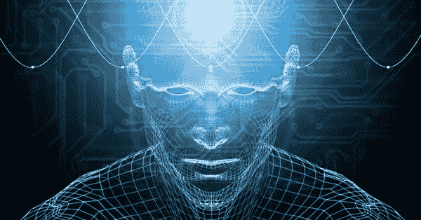

# 会读心术的人工智能。

> 原文：<https://medium.datadriveninvestor.com/a-mind-reading-a-i-83e781ce927b?source=collection_archive---------1----------------------->

机器人研究公司神经机器人实验室的俄罗斯工程师团队开发的一种读心术工具，完全依靠参与者的脑电波实时制作了一段人类思维视频。

该团队使用不同主题的剪辑来训练人工智能，从自然场景到体育活动到人类表情，然后链接到参与者观看视频的脑电波记录。

 [## 挑战你对人工智能和社会看法的 4 本书|数据驱动的投资者

### 深度学习、像人类一样思考的机器人、人工智能、神经网络——这些技术引发了…

www.datadriveninvestor.com](https://www.datadriveninvestor.com/2019/02/28/4-books-on-ai/) 

随着人类测试对象连接到与神经网络相连的脑电图或脑电图帽，人工智能从信号中重建了自己的视频，在 234 次尝试中，它成功地对 210 次进行了分类。

根据研究人员的说法，尽管颜色和大形状表现得更好，但人脸的重建在许多扭曲方面造成了最大的困难。

在这一点上，重要的是要意识到人工智能无法重建参与者所看到的精确图像，只能重建同一类别中的一些相关图像。

虽然 EEG 具有更困难、因此更不可靠的信号，但是它更容易利用，使得它在真实世界的 BCI(脑-机接口)应用中更实用。

亚利桑那大学的维克多·夏尔马斯对视频评论说；我们仍然只看到人类思想的表面。

我们目前看到的是一幅人类经验的漫画，但一点也不像精确的再现。

未来学家、前控制论工程师伊恩·皮尔逊博士说:“我认为，在实验室里，我们可能还需要 10 年或 15 年才能实现这一技术。

“我不认为过不了多久，警察就会在审讯中使用它，让一些人接受审讯。

“警察不会问问题，他们会给你戴上头盔，判断你在想什么。

然而，这项技术被认为对寻求恢复认知能力的中风患者有更好的效果，通过脑电图接口效果更好。

它作为一个训练系统，受试者使用重建的图像作为反馈来产生心理命令，使其成为进步的良好指标。

虽然这是此类项目的第一个，但这个技术工程师团队并不是第一个探索人工智能驱动的读心技术的人。

不同的是，过去的研究侧重于 fMRI 分析，而不是 EEG。

虽然 fMRI 信号包含更多关于大脑过程的信息，但缺点是它需要只有在诊所才能找到的大型昂贵设备，因此困难在于确保实时结果。

因此，虽然这项技术看起来很有前景，但人工智能专家认为，它的完善和最佳使用至少还需要十年。