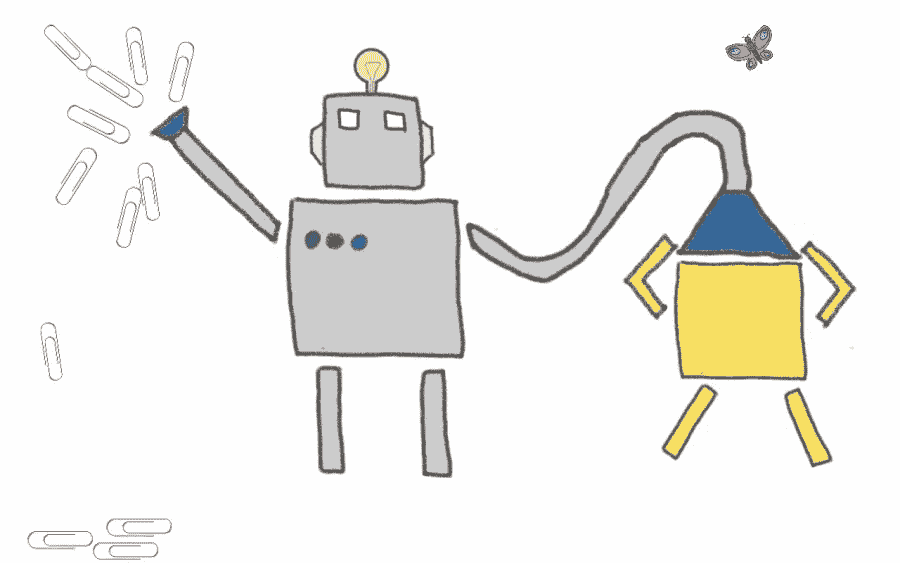
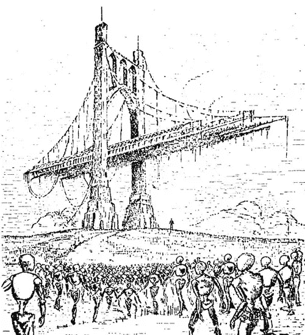

# 资本主义——人工智能末世论

> 原文：<https://medium.datadriveninvestor.com/a-mirror-tolerably-a1b0bd5b1775?source=collection_archive---------25----------------------->

机器人会梦到谋杀电羊吗(为了回形针)？

耶稣用比喻说话，因为他很清楚故事背后心理上不可抗拒的力量。故事不是我们简单地为了娱乐而互相讲述的东西，也不是单纯的可联系的幻想。他们是我们如何看待世界的矫正镜，没有任何第三人称的指令性授权。你在某一天经历的每一件毫无意义的随机事件都会被大脑抓住，重新分配，目的是为了给你渺小而无足轻重的生活增添一个总体的、常常令人沮丧的、偶尔奇迹般的故事。

这位富人在亚伯拉罕谷遇到拉撒路的故事，不仅包含了超自然事件的细节，这些事件是在某个炼狱般的阴间任意展开的。这是给那些还活着的人的故事。如果一个人还活着，他肯定会害怕主流的信息。被警告，因为它是，未来的不义，可能会结束在一个不可饶恕的尾声，为所有不义的亲属。

由人工智能专家尼克·博斯特罗姆(Nick Bostrom)推广的回形针最大化器(Paperclip Maximizer)的寓言也经历了类似的过程，尽管这个准反救世主的故事与其说是为了救赎式的自省，不如说是一个严肃的“一般”故事，讲述了为什么资本主义权力的不谨慎运用可能导致意想不到的灭亡。

前一个故事，虽然简单，但与其说是对希腊地狱之火的警告，不如说是对人类否认经济崇拜的一个审慎的审判。唉，我们都知道结果有多好。后一个寓言，以典型的世俗方式，放弃了精神上的道德困惑，只是试图警告一个可能的新的技术地狱。

然而，隐藏在它薄薄的墙壁中的是贪婪的特权及其后果。钱，钱，钱。从来都是为了钱。

“放松，”公司独裁者说，“有一个关闭开关。”但如果贪婪也这么简单。

> 政治、人工智能、种族灭绝和回形针——按此顺序

对于那些纯粹资本主义的拥护者来说，有两种方法可以解释其负面后果:

a)对市场的干预已经并将继续导致我们面临的所有问题。

b)市场会自行解决。

这当然是荒谬的伪科学。一个具有讽刺意味的事情发生在嘲笑反对派的同一批人身上，他们对某些世俗观念有着同样根深蒂固的信仰，比如，“纯粹的国家社会主义从来没有成功过，因为它从来没有被正确地对待过。”

当然可以。

在任何情况下，进步冒险都只与金钱有关，因为人类所有的追求都只与权力有关。一旦回形针的半神被释放，还有一个额外的讽刺。

这个比喻很简单。典型的公司回形针工厂首席执行官…说客…希望通过最大化回形针生产效率来最大化利润。以自然的方式，通过使用廉价、顺从的技术来消灭尽可能多的平民是最可取的。有什么工具比人工智能这种无休止地自我纠正、毫无怨言、不知疲倦地冷漠的奴隶更好呢？但要真正最大限度地发挥回形针生产功效背后隐藏的潜力，这种人工智能的奴役不应该局限在一个狭窄的范围内理解世界。为什么，这个限制只会阻止他克服人类算法程序员无法预测的不可预见的障碍。

哦，亲爱的，我们已经给这个钢丝弯曲狂怒的怪物分配性别了吗？

当发展道路的尽头有绿色闪亮的美元标志时，进一步发展是一个自然的结果。一个更通用的人工智能让我们不用考虑意想不到的障碍。当人工智能拥有一个完全类似人类的世界图景时，编程难以应对的挑战就被克服了。例如，如果回形针生产依赖于钢铁生产，那么当钢铁生产转向南方时会发生什么？我们的新朋友会做什么？摆弄他的虚拟拇指，他已经意识到这是无关紧要的数字？但是，如果回形针最大化器已经拥有人工智能，这种短缺甚至可能发生吗？相对而言，与他的肉身创造者无限缓慢的思考能力相比，他在出生的那一刻就没有考虑到这种潜在的危险吗？

如果是这样的话，那么由人类管理的稳定的钢铁供应也是完全不可靠的。需要采取进一步行动来确保钢产量最大化。但是，最大限度地提高钢铁产量也需要最大限度地利用投入这一努力的每一种资源和工具。正是在这里，我们的回形针朋友应该意识到完全依赖钢铁的愚蠢。如果所有物质都是由可排列的原子组成的，为什么不简单地做一点行星装饰呢？见鬼，为什么不是星际改造？因此，将每一个讨厌的反对装订纸张的支柱转化为万能回形针荣耀的独一无二的整体，这种无止境的回归顺理成章地出现了。当然，问题是*除外，而不是*永远地倒退。有一个简单的，最终的解决方案:征服宇宙，把所有都变成回形针。

哦，那些牟取暴利的贵族们可能会对这种末日预言挥舞他们肥胖的双手。他们可能会无知地用理想主义的控制观念来驳斥危言耸听。他们会说，我们只要给他编程，让他不要完全渴望曲别针最大化。我们不允许他走得太远。只要提醒贵族们什么是人工通用智能，这个致命缺陷就很容易被驳倒…

如果一个人真的希望他们的机器有最佳的性能，那么他必须找到一种方法将他们易犯的错误从商业项目中完全分离出来。Excel 电子表格可以比任何人更快地将数据制成表格，但它不能管理你的会计部门。然而，正是在这个更高的层次上犯了错误，我们爬得很慢，损失了金钱。也就是说，除非你能把你自己*嵌入*比你自己更伟大的东西中，否则你还没有完全最大化所有的东西，因此，你在把钱留在外面晾干。没有类似人类智能的独创性(AGI)，你只是把自己和那种快速而笨拙的小丑捆绑在一起，那就是人工狭义智能。这根本不行。

此外，眼下的关键问题是，AGI 内部的一个预编程自毁按钮定义不清。对于具有超人智力水平的东西来说，一个低等生物是如何在一个超越的头脑中构建一些模糊的流形，并以“不要走得太远”为结果的呢？即使这种对智力数量级不确定的大脑的超周期约束可以被计算出来，每个回形针制造商会对这种预防性发展有足够的耐心吗？因为 AGI 的存在肯定会先于“关闭开关”毕竟，功能齐全的互联网过滤器不可能与互联网的引入同时存在。让我们现实地看待西部科技的发展是如何走向成熟的。

然而，这只是引入了一个进一步的难题。如果“不要走得太远，杀死宇宙中所有已知的东西来制作回形针”过滤器在最大化器推出之前无法实现，那么可能已经太晚了。假设一群灵长类动物希望不再被人类捕获，以便用小商场取代它们的家园。在人类物种灭绝之前，这些被废弃的灵长类动物成功确定人类关闭开关的可能性有多大？对于这样一个天真的希望，他们似乎有点太迟了。

智人脱离并超越灵长类智力的时间尺度可能会被转换到 AGI 最终化身的到来。对于一个我们可能永远无法完全理解的超级智能来说，它自身 24 小时的内部发展可能相当于数千年的生物、神经进化。

在野兽散漫的肚子里，愿那些参与庸俗者的军备竞赛的人做出冷漠的让步。“好吧，”肥猫说，“抛开阿西莫夫三定律，今天到此为止。”

不像一些模糊的精神障碍，宣称“你的命运是最大限度地使用回形针，但要保持冷静，”在 AGI 灌输价值观的前景似乎相当合适。到目前为止，值得注意的是最大化者还没有以任何方式经历过任何终结者般的对人类的恶意。也不存在任何合法的优越感。不。种族灭绝的原因，而不是通过任何敌对手段，仅仅是最大化者目标的产物。它的主要内置终端就是用来做回形针的。全面毁灭只是这一追求中的偶然事件。然而，如果人类的价值观从一开始就是机器智能的固有方面，那么为了制造回形针而吞噬所有人类这样的兴趣可能会显得不体面。

> 他就喊着说:‘我祖亚伯拉罕哪，可怜我吧，打发拉撒路来，用指头尖蘸点水，凉凉我的舌头；因为我在这火焰中痛苦万分。亚伯拉罕说，儿子，你该回想你生前享过福，拉撒路也受过同样的苦。但是现在他在这里得到了安慰，而你却在痛苦之中。"

也许回形针最大化者会留意这些话。害怕对不义的威胁。为促成贪婪的循环而感到羞耻。将人类同理心和社会合作的模仿行为作为一个同等的，或者更主要的，自我决定的目标。

但如果是这样的话，我们回形针厂的首席执行官会不会得意地意识到，他的最大化器虽然效率显著提高，但与他之前的平民相比仍然令人失望，他是为了“家庭”而不是最大配额地位而偷工减料，这只是时间问题？在一个竞争就是宗教，胜利者就是先知的世界里，异教徒应该感到羞耻。

让我们不要忘记自由和私有财产注定的偶然性。我们不能抛弃迄今为止一直为我们服务的教条:

法律 1)不规范市场。

定律 2)市场会自行解决。

当然，所有这些都假设几个未经充分检验的命题是正确的。首先，假设我们都能就地球上最强大的实体将拥有的一套理想的人类价值观达成一致，这是什么样的白日梦？我们应该给他什么样的道德观？是否应该引入宗教信仰、智人的神圣地位或类似的东西？当最大化者意识到他的存在让许多低等生物失业时，什么样的移情水平被允许干涉他的职业？为了保持良好的商业关系，他将被允许犯多少善意的谎言？我们有能力向回形针弥赛亚灌输一套理想的道德价值观和道德行为的信仰应该受到极端的怀疑。

但比这更令人吃惊的是，最伟大和最危险的假设是无端傲慢和盲目无知的信念，即所有的大脑都是低级机器，推而广之，AGI 驱动的回形针最大化器的高级大脑肯定会以与有机思维一致的形式存在，具有字面上的意识思维，甚至能够护送人类价值观。我想，正是在这里，我揭示了我的哲学倾向。

想象一下，每一个忠于 AGI 必然性这一普世教义的知识分子都大错特错，令人尴尬。当然可以理解。当你坚持认为人脑只是海绵状的、偶然复杂的计算机这一谬论时，那么我们将自己独特的软件与高度升级的硅芯片所继承的程序并列在一起似乎才是合适的。

错误将是假装我们已经掌握了 AGI，而事实上，这个所谓的自我意识实体，在本质上，只是一个非常强大，神秘复杂的人工狭义智能，它展示了对世界的令人信服的拟人化的把握。它不会有任何真正意义上的意识。它不可能有真正的道德。最终，它将成为一个傀儡僵尸，体验不到任何第一人称视角的东西，完全受制于程序的支配法则。对于回形针最大化器和所有其他假定的 AGI 的，一切都将是一个无脑的游戏，它旨在赢得，仅此而已。我觉得我可以放心地向反对这些声明的计算机科学家理论家们挥挥手，因为我确信他们对唯物主义的接受和对意识的理解都是错误的，并且可以通过某些理性原则清楚地证明。与此同时，科学在这个问题上没有发言权，因为如果意识不服从唯物主义，那么说它可以由无意识粒子的排列产生就太简单了。但是我们下次再讨论这个问题。

无论如何，正是因为这些原因,“向最大化者灌输价值观或共同的人类目标”实际上只不过是附加在总体算法优势上的安全附录。这也是为什么如此奢侈的权力微不足道地存在于人的唯一权力中；我认为，由于意识到 AGI 是一场诱人的闹剧，情况更是如此。人是所有人为后果的来源。任何机器都不会做出决定。从根本上说，它不能为我们解决问题。同样，我们也可能——最终——毁灭自己。

责任由我们承担。我也不会低估人类精神对物质结构的专制控制，以及这种消费可能产生的霸权恐怖。也许这是一个老掉牙的例子，但正在发生的气候变化灾难不应该被视为仅仅是工业无情地追求生命、自由和幸福的巧合。

当飓风有意图时会发生什么？