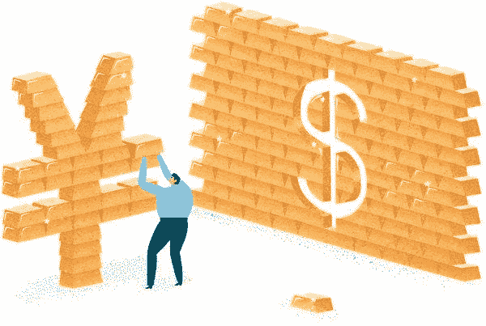

# 你在其中发挥作用的货币体系。

> 原文：<https://medium.datadriveninvestor.com/a-monetary-system-where-you-play-a-role-4e459ff80ca2?source=collection_archive---------15----------------------->

> 最新的[加密货币新闻](https://www.coincurb.com/news/)、[空投清单](https://www.coincurb.com/airdrop/?status=active)、[赏金清单](https://www.coincurb.com/bountyc/?cat_id=188)、 [IEO 清单](https://www.coincurb.com/category/active-ico/)，请访问 CoinCurb.com。

转移价值的手段是日常生活的重要组成部分。自然，任何促进价值转移的交易渠道都要收费；支付卡就是一个很好的例子。像支付卡一样，所有其他促进资金转移的渠道通常都有利于少数人，这是当今货币体系的一个既定方面。

然而，事情不必如此。

从最大的实物黄金在线交易平台 ABX.com(Alibaba)剥离出来的金融科技初创公司 Kinesis 正在建立一个新的区块链支持的交易渠道，不仅重建了黄金标准，还创建了一个包容性的价值转移渠道，任何人都可以在其中发挥重要作用。

 [## 区块链会引发全球金融体系的动摇吗？-数据驱动型投资者

### 2008 年的金融危机表明(对一些人来说),大型金融机构需要被密切关注和…

www.datadriveninvestor.com](https://www.datadriveninvestor.com/2019/01/11/will-blockchain-trigger-a-shakedown-of-the-global-financial-system/) 

# 以你在货币体系中的角色为例

Kinesis 的基本目标是建立一个新的黄金标准，与数字时代的货币功能保持一致。通过其区块链核心，该协议允许任何人对黄金进行令牌化，只要黄金存放在一个可信的金库网络中。

Kinesis 只是启动黄金令牌化所需的协议和生态系统；生态系统中的所有功能都由大众处理，从而创建了一个开放的、分散的运营商网络，这些运营商创造了令牌化的黄金并将其投入运行。

# 该过程

Kinesis 货币体系的第一步是创造代币化的黄金。没有政府或中央集权的实体会控制这一点；相反，人们将能够使用法定货币或加密货币直接从 Kinesis 生态系统内的供应商那里购买实物黄金。由于 ABX.com 是最大的实物黄金在线交易平台，Kinesis 能够轻松整合供应网络，满足几乎任何实物黄金需求。

购买实物黄金的铸币商将能够将金条存入金库。沉积的金会导致金背 KCoins 的发射。然后，这些 KCoins 可以被 Kinesis 生态系统中的其他人购买，或者可以由铸币商存入 Kinesis 钱包。

Kinesis 生态系统将在一个恒星分叉上运行，一部分收集的网络费用将给予储户和铸币商。因此，Kinesis 协议不仅分散了金色背景 KCoins 的发射，而且还确保了任何人都可以成为该过程的一部分，并因他/她的工作而获得奖励。KCoins 将通过 Kinesis 支付卡进行交易，该卡可在世界上任何销售点系统使用。然而，由于网络的恒星区块链骨干，费用将大大低于与支付卡相关的费用。收取的费用将作为奖励进入生态系统，奖励那些铸造 KCoins，将它们存入系统，甚至花掉它们的人。

> 最新的[加密货币新闻](https://www.coincurb.com/news/)、[空投清单](https://www.coincurb.com/airdrop/?status=active)、[赏金清单](https://www.coincurb.com/bountyc/?cat_id=188)、 [IEO 清单](https://www.coincurb.com/category/active-ico/)，请访问 CoinCurb.com。

# 创造速度

随着过去金本位制的废除，人们已经习惯于持有黄金。这导致黄金成为价值储存手段，而不是价值转移手段。因此，为了确保心态的转变，Kinesis 协议集成了 Kinesis 速度令牌(kvt)。

Velocity token 的存在是为了鼓励人们将 tokenized 黄金用作货币，而不是价值储存手段。网费的很大一部分回馈给了 KVT 持有者；由于费用是通过消费 KCoins 产生的，因此 Velocity 令牌确保开发社区和网络能够立即将令牌化黄金作为货币使用。像这样的早期势头对于一项颠覆性技术的成功至关重要。

> *kine sis 支付卡是同类产品中的第一张，是一种在全球范围内使用代币化黄金进行交易的方式。*

为了确保 KCoin 用户能够轻松使用他们的货币，KCoin 持有者可以轻松使用 Kinesis 卡。此外，该项目一直忙于与大型商业网络和企业集团建立强有力的伙伴关系；自然，一个比支付卡收费更低的支付渠道是深受商家欢迎的。总的来说，商家的欢迎和通过 Kinesis 卡消费的便利将成为推出现代金本位的动力。

这个金本位制将是一个任何人都可以参与其中的货币体系。

> 最新的[加密货币新闻](https://www.coincurb.com/news/)、[空投清单](https://www.coincurb.com/airdrop/?status=active)、[赏金清单](https://www.coincurb.com/bountyc/?cat_id=188)、 [IEO 清单](https://www.coincurb.com/category/active-ico/)，请访问 CoinCurb.com。