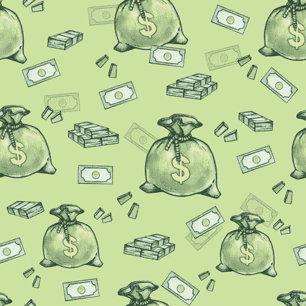

# 成本减半的货币系统

> 原文：<https://medium.datadriveninvestor.com/a-money-system-for-half-the-cost-babee8920890?source=collection_archive---------37----------------------->

政府以现金形式创造货币，但在现代社会，银行在发放贷款时创造了大部分货币。货币是一种价值储存手段，当银行创造货币时，甚至在有人用它来创造有价值的商品和服务之前，它就有了直接价值。这带来了不劳而获的诱惑和机会，而社会无法控制这些诱惑和机会，无论它花费多少努力来监管它。法规越多，一些人似乎就越容易钻漏洞，而那些遵守规则的人就越难做生意。

该体系不可避免地导致财富不平等、资源分配不公、商业周期、地方性通胀、金融危机、失业、浪费和不可持续的自然资源开采。也许更具破坏性的是，许多最优秀的人才努力赚钱，而不是帮助创造更多的商品和服务的实际价值。

我们需要更好的方法来运行货币系统，消除这些诱惑和成本，同时仍然奖励储户和冒险者。

解决这个问题的一个方法是让货币体系保持原样，但提供更好的方法来为大多数人需要和使用的公共商品和服务融资。能源、住房、水、交通、教育、卫生都是主要的候选项目。

# 怎么做

货币系统的工作原理是，在不生产任何商品和服务的情况下，通过贷款创造更多的货币。它通过出租资金来实现这一点。在贷款提供商品和服务之前，利息、资本收益、股息都是创造额外收入的方法。宏观经济学通常会忽略这一成本，因为一个人的货币租金是另一个人的收入。虽然这可能是真的，但它将资金从一个人转移到另一个人，对于企业或个人来说，这是一项真实的成本。对于社会来说，也是实实在在的成本，因为租钱是不费吹灰之力就能盈利的。

通过改变我们发放和偿还贷款的方式，它变成了一种不必要的成本。我们可以用现有的钱来贷款，只有当贷款产生商品和服务时，我们才向贷款人归还同样数量的钱。我们给贷款人更多的商品和服务，作为给他们投资回报的一种方式。使用这种方法意味着贷款不创造额外的钱，所以与传统贷款相比，偿还贷款消除了租赁资金的成本。

在财务方面，我们用同样多的钱生产更多的商品和服务。对于大多数长期投资来说，租借资金的成本和投资的价值差不多。因此，这种方法使货币的生产率提高了 100%，是一种比使用货币市场的昂贵的现有系统更好的分配投资资金的方式。

# 一个示例系统

要了解其工作原理，请访问 [Pre Power One 合作网站](https://www.one.prepower.com.au/)。在堪培拉，购买 Pre Power One Co-op 电力的客户，如果他们按用电量支付，则每千瓦时支付 15 美分，如果他们预付 5 年的电费，则每千瓦时支付 13.12 美分，如果他们支付 20 年的电费，则每千瓦时支付 7.5 美分。

堪培拉的规定电价是每千瓦时 21 美分。这意味着该方法为社区成员节省了 30%到 65%的当前电费。

提供贷款但用电量不足的成员从用电并支付 15 美分电费的成员那里获得相同的现金回报。

任何使用预付费方法的社区都会因为商品和服务变得更便宜而立即增加社区的实际财富。对于一个社区来说，这是提高生产力和变得更加富裕的一种快速而有保证的方式。