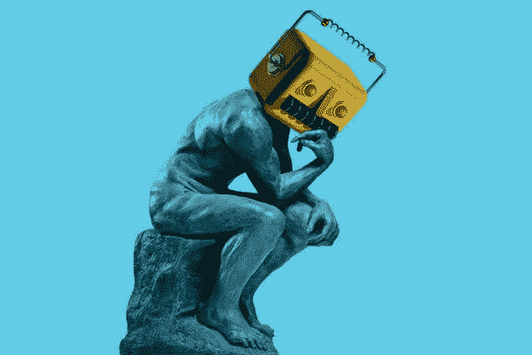

# 对我们亲爱的技术人员的道德清算

> 原文：<https://medium.datadriveninvestor.com/a-moral-reckoning-for-our-beloved-techies-34597353d255?source=collection_archive---------33----------------------->

Mr. Philosopher Robot

我打算写一篇文章，讨论在科技行业中加强对道德的重视的必要性。当我开始研究这个话题时，并没有出现真正的关注目标，因为在重新定义我们未来的可能性时，科技行业面临着太多的问题。在未知的领域，科技行业在很大程度上被放任自流，自行监管。

这将会改变，而且很快。英特尔发布了一份美国联邦隐私法草案。[脸书、谷歌和微软](https://iapp.org/news/a/us-federal-privacy-law-apple-google-facebook-microsoft-all-hope-so/?mkt_tok=eyJpIjoiWWpJd1pXTTBOVFU0WkRWbCIsInQiOiJNSGVtdkR3VGthRm4xaUhIVElFTVBURXBzRHdkVmE2aTJDWHp5OHFYc3BZSjFha2E3UXFUd1RjNnk3XC9aUUJOZzRzQk40ZERHV3ZmRUxkWUVVM2k2bXhieU4yNDdTclZBVThaMW13eGxRXC8xck9sNXlKTEd4RzlBWThUbEpBZG9GIn0%3D)都支持一项联邦法律，微软副总法律顾问 Julie Brill 甚至主张美国法律监管特定技术的使用，如面部识别软件，中国正在开发这些软件作为其[社会控制制度的一部分](https://www.nytimes.com/2018/07/08/business/china-surveillance-technology.html)。最后，虽然实际上更像领导者，但苹果公司首席执行官蒂姆·库克在数据保护和隐私专员国际会议上的主题演讲中表示，苹果公司“完全支持美国全面的联邦隐私法。”

大型科技公司支持隐私法案，理由很充分。鉴于最近许多数据泄露和不道德的数据使用重塑了美国的民主并侵蚀了用户的信任，将他们的支持抛在隐私后面是一种良好的公关。通过支持一项法案，他们也在法律的实际面貌上扮演了重要角色。此外，作为跨国巨头，他们已经做出调整，以遵守欧洲的一般数据保护法规。

欧洲处于这一运动的最前沿，其法规于 5 月生效。这项法律是全面的，尽管有缺点，但它试图让个人对他们的数据的使用有更多的控制权，同时寻求创造一个关于人工智能和机器学习在分析数据中的作用以及数据收集目的的透明环境。

然而，问题的核心是用户和个人在定义和创造美好生活中的批判性探索。今天，我们睡觉和醒来时，手机平均每天要查看 150 次。

特里斯坦·哈里斯(Tristan Harris)是前谷歌设计伦理学家和技术内幕人士，后来成为哲学家/活动家，他一直站在鼓励科技行业自我改革的前沿，并强调它对上瘾和屏幕时间的重视。他发起了“花好时间”运动，是人道设计中心(Center for Humane Design)的创始人，该中心“旨在通过公共宣传、道德设计标准的制定、设计教育和政策建议来促进科技公司之间快速、协调的变化，以保护人们的思想免受邪恶的操纵。”

哈里斯设想了一个“权利法案”,概述了设计标准，迫使我们的技术设备从上瘾变为授权工具。他认为，重点不在于分散注意力的装置，而在于完成你的预期活动，而不是向你展示一张分散注意力的图片，你已经被标记在浪费时间的地方。他想象了一个选择可用性不是标准的世界。相反，他鼓励制定标准来衡量实施我们的选择的难度。例如，考虑这篇中型文章和这篇文章顶部列出的预计阅读时间。这样，在开始阅读之前，你就知道你将在这项活动上花多少时间，并能确定“时间花得是否值得”

正如我提到的，技术中的伦理有许多考虑因素。从改革开始，关注个人对技术的使用，强调技术的使用是对生活的有益补充，而不是对时间的过度消耗，这是一个良好的开端。这将是我关于这个主题的一系列文章的第一篇。我希望你喜欢。

楚斯。