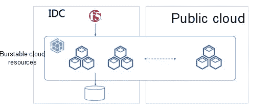
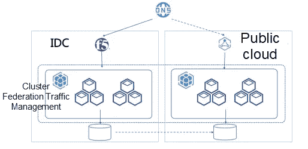
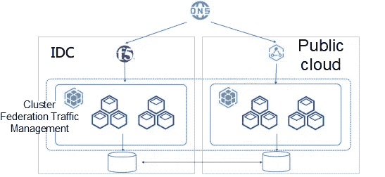
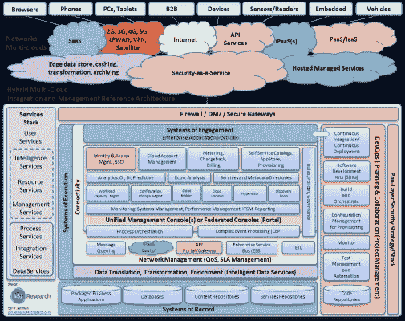
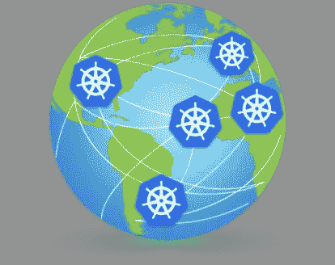
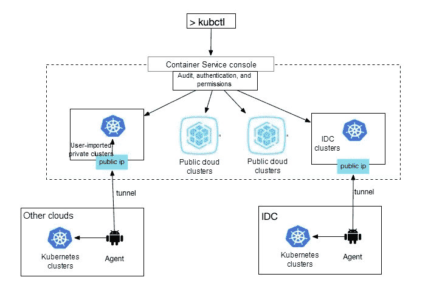
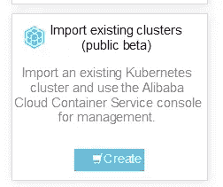
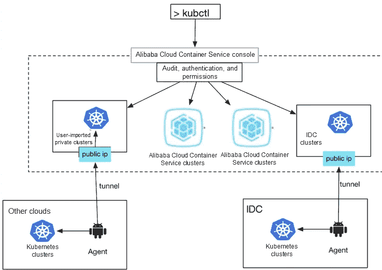

# 采用 Kubernetes 的多云和多集群架构

> 原文：<https://medium.datadriveninvestor.com/a-multi-cloud-and-multi-cluster-architecture-with-kubernetes-cb3abe554948?source=collection_archive---------0----------------------->

*田原和舒慧。*

近年来，人们一直在谈论[云](https://www.zdnet.com/article/multicloud-everything-you-need-to-know-about-the-biggest-trend-in-cloud-computing/?spm=a2c41.13705838.0.0)和混合云。多云和多集群架构可以提供高可用性和多区域分区等优势。与此同时，这两种类型的体系结构还可以减少对供应商的依赖，这反过来又提供了一系列优势，例如降低成本，减少向单一供应商存储数据的需求，以及利用每个供应商提供的最佳功能的能力，例如人工智能和 GPU 功能，而不会局限于某个特定的云供应商。

讨论最多和实施最多的多云使用情形可以分为以下几个场景:

 [## 信息图:云之旅|数据驱动的投资者

### 聪明的企业领导者了解利用云的价值。随着数据存储需求的增长，他们已经…

www.datadriveninvestor.com](https://www.datadriveninvestor.com/2018/09/22/infographic-journey-to-the-clouds/) 

第一种处理突然爆发的资源需求，使用多云设置作为备份资源池，如图 1 中的示例所示。服务的日常运营在用户的内部数据中心(IDC)进行。然而，当流量突然激增时，该服务可以快速扩展到公共云(如阿里云)上的集群，以满足流量激增的需求。这种设置通常适用于 CPU 和内存密集型的无状态服务，例如搜索、查询和计算服务。这些服务可以快速扩展，以满足资源需求的激增。

Figure 1\. Burstable cloud resources with multi-cloud

第二个场景处理[灾难恢复](https://www.drj.com/myblog/4-benefits-of-disaster-recovery-in-cloud-computing.html?spm=a2c41.13705838.0.0)，如图 2 所示。通常，一个群集运行主要服务，另一个用于定期备份。或者，一个集群负责读写，其他备份集群只读。如果主集群出现问题，服务可以快速切换到备份集群，以避免服务中断。这适用于具有大数据量的存储服务。

Figure 2\. Disaster recovery with multi-cloud

第三种是为多站点主动-主动场景设计的，如图 3 所示。这与前面的场景类似，主要区别在于所有集群都是读写的，并且数据是实时同步的。这种情况最适合于关键数据，如全局用户凭证。

Figure 3\. Multi-site active-active scenario

然而，多重云确实有它的挑战。其中，跨整个设置部署应用以及如何在多云和混合云之间无缝切换是最主要的两个问题。此外，迁移传统应用程序也是一项艰巨的任务。这就是为什么在多云多集群环境中交付和管理应用程序的成熟方法至关重要。

# 多云和混合云的最后一英里

早在 2013 年，老牌云计算厂商已经开始谈论[多云](https://www.infoworld.com/article/2611544/why-you-should-care-about-multicloud.html?spm=a2c41.13705838.0.0)，并认为它是[的下一个大事件](https://goinglongblog.com/multi-cloud-next-big-thing-technology/?spm=a2c41.13705838.0.0)。

然而，可悲的现实是，每个云平台和每个数据中心都有自己的一套 API 和设计语言。因此，这些所谓的“多云”架构只不过是将云 A 和云 B 放在一起，由一个复杂的访问层充当转换器。这些种类的多云和混合云以其复杂的架构而闻名。没有比来自不同供应商的令人困惑的解决方案插图更好的证明了，如图 4 中的例子所示。

Figure 4 Architecture of a traditional enterprise multi-cloud solution

这些只是名义上的多云或混合云，实际上只是供应商的专有产品。不同的云平台有不同的 API 和能力。基于这些产品构建的多云或混合云解决方案非常复杂、令人困惑，而且花费在这些产品上的大部分时间和金钱都用于适应和集成不同的产品。对于用户来说，结果只是另一种形式的锁定。因此，一个适用于多种云的生态系统是不可能的，一种被广泛接受的交付和实施真正的多种云的方法也从未实现。

# Kubernetes:面向全球数据中心的行业标准 API

随着[云原生](https://www.infoworld.com/article/3281046/what-is-cloud-native-the-modern-way-to-develop-software.html)概念的迅速普及，情况有所好转，真多云已经到了紧要关头。

Figure 5\. Dawn of cloud-nativeness

有了标准 API，多云和混合云现在能够展示它们的真正潜力。

Kubernetes 及其声明式容器编排和管理系统使得应用交付日益标准化，并与底层基础设施完全分离。云原生技术在公有云和数据中心的实现，使得应用“一次定义，随处部署”成为可能。

Kubernetes APIs 在全球数据中心的普及，终于为多云和混合云架构打下了坚实的基础。随着软件行业对生产力和成本削减的需求不断增长，由云原生技术驱动的云计算即将席卷全球。

# 多云时代的平台平台

Kubernetes 是平台的平台。与容器管理平台如 [Apache Mesos](http://mesos.apache.org/) 和 Docker 的 [Swarm](https://github.com/docker/swarm) 相比，Kubernetes 最大的优势是专注于帮助用户快速方便地使用声明式 API 构建健壮的分布式应用。同时，Kubernetes 使用统一的模型，即容器设计模型和控制器机制，来收敛到理想状态。

凭借这一优势，再加上多云技术，Kubernetes 用户可以在多云环境中构建标准的平台级服务。

[kubeCDN](https://blog.insightdatascience.com/how-to-build-your-own-cdn-with-kubernetes-5cab00d5c258) ，一个基于 Kubernetes 构建自托管内容交付网络的项目，就是一个完美的例子。凭借云原生技术，它巧妙地解决了传统 [CDN](https://www.cloudflare.com/learning/cdn/what-is-a-cdn/) 产品的许多痛点，如安全问题、服务质量取决于外部因素、服务并不总是非常经济高效，以及潜在的商业秘密泄露。在实现方面， [kubeCDN](https://github.com/ilhaan/kubeCDN) 在不同区域构建 Kubernetes 集群，使用 Route53 根据延迟将用户请求路由到最优集群。作为构建 cdn 的基础，Kubernetes 帮助用户集成基础设施，而其 API 则允许用户快速分发内容和部署应用。

Figure 6\. CDNs built on multi-cloud Kubernetes

Multi-cloud Kubernetes 为 kubeCDN 提供了灾难恢复和使用来自多个集群的资源的能力。同时，Kubernetes APIs 将构建全球规模 CDN 的工作量减少到了几百行代码。基于 Kubernetes 的多云和混合云正在为不同的行业带来健壮性和想象力。

# 多重云的未来:应用交付

如果说多云是云计算的未来，那么多云的未来是什么？

云原生技术的目标是实现我们称之为事实应用的持续交付。这些应用程序应该解决我们面临的三个最大的问题:弹性、可用性和可移植性。

弹性意味着服务的可靠性以及探索和创新的灵活性。这是客户最看重的。应用弹性的另一个重点是在云上快速部署、交付和扩展的能力。这需要一个成熟的应用交付系统和云原生开发框架的支持。

应用程序的弹性也依赖于良好的可用性。随着[微服务](https://microservices.io/)架构成为主流，应用的不同部分需要一种更好的方法来控制它们如何共享数据，以优化性能。这就是[服务网](https://www.nginx.com/blog/what-is-a-service-mesh/)大放异彩的地方。

弹性、可用性，再加上可移植性，使得多云和混合云无与伦比，势不可挡。

虽然 Kubernetes 是云时代的操作系统，但在这个操作系统上构建的应用程序仍然需要一系列的开发、交付和管理工具。云计算的价值归结为应用本身的价值。如何更好地服务这些应用将决定谁将在云供应商的新一轮较量中胜出。

在通往云圣杯的道路上，云原生应用程序定义和标准、使用服务网格管理跨云应用程序的能力以及基于 Kubernetes 的多云应用程序交付和管理系统将被证明是非常有用的。

# 了解多云和多集群 Kubernetes 项目

针对多集群的 Kubernetes 项目有很多，比如[联邦 V2](https://github.com/kubernetes-sigs/kubefed) 、[集群注册表](https://github.com/kubernetes/cluster-registry)和 [kubemci](https://github.com/GoogleCloudPlatform/k8s-multicluster-ingress) 。在所有这些之前，还有 V1 联邦，Kubernetes 多集群项目的前身，但后来被弃用了。主要原因是 V1 设计了一个联邦 API 层来代替广泛接受的 Kubernetes API，这违背了云原生社区的开发哲学。

由 Red Hat 领导的联邦 V2 项目以插件的形式集成到 Kubernetes APIs 中，这就是众所周知的 CRD。它提供了一种将任何 Kubernetes API 类型转换为多集群联邦类型的方法，以及一个相应的控制器来推送这些联邦对象。它不像 V1 那样关心复杂的推送策略(V1 的联邦调度程序)，而只是将这些对象分发到预先定义的集群中。

请注意，推送到这些集群的对象来自同一个模板，具有不同的元数据。此外，被推的对象必须从原始类型转换为相应的联邦类型，这只有在类型数量有限时才很方便。

这意味着联合 V2 主要用于将集群配置信息，如[基于角色的访问控制](https://digitalguardian.com/blog/what-role-based-access-control-rbac-examples-benefits-and-more) (RBAC)策略和其他策略推送到多个集群。这些类型的资源是固定的，每个集群的配置策略格式都是相似的。

因此，到目前为止，联邦 V2 是一种多集群配置推送机制。

然而，在一个多云交付系统的背后，往往有一个更复杂的决策逻辑。例如，如果集群 A 的工作负载较低，那么应该将更多的应用程序推送给它。另一个例子是，如果一个用户有数百甚至数千个第二方和第三方应用程序(都是 CRD +运营商)用于多云交付。在当前的联邦 V2 系统中，维护这些 CRD 联邦类型的成本非常高。

# 面向应用的多云端 Kubernetes 架构

一个多云多集群应用交付管理系统应该具备什么样的能力？有三个技术点值得考虑:

1.  Kubernetes 集群可能没有公共 IP 地址，或者位于专用网络中。无论 Kubernetes 集群是如何部署的，多重云服务都应该能够访问它，并在不做任何修改的情况下公开完整的 Kubernetes APIs。这是应用程序交付的重要基础。
2.  由 [GitOps](https://www.weave.works/technologies/gitops/) 支持的多云配置管理。所有集群的配置管理，即同步和推送配置信息，应该是集中的。更重要的是，这些配置信息应该通过 GitOps 以完全开放、透明和可审计的方式进行管理，使用 Git 协议作为多云管理和用户交互的标准接口。
3.  托管而不是接手。无论您是在公共云还是私有数据中心集群上使用 Kubernetes，用于认证对这些集群的访问的证书都应该由可信机构颁发。云提供商不应存储任何凭据。相反，应该提供一个集中的授权管理系统，以允许用户管理其集群的凭证。

# 多重云架构的基石:Kubernetes API 隧道

要通过 Kubernetes API 托管将 Kubernetes 集群连接到一个多云管理系统，主要的技术挑战在于建立“集群隧道”。

集群隧道在私有网络上的 Kubernetes 集群中安装一个代理，这样就可以从公共网络进行访问。有了这个隧道，用户可以像运行在公共云上一样访问您的 Kubernetes 集群，而不需要公共 IP 地址，并随时随地使用、管理和监控您的集群。无论有多少个集群，身份验证、授权、日志记录、审计和控制台等功能都是从一个点控制的。

集群隧道的架构很简单，如图 7 所示。有两层。下层是托管集群，每个集群有一个代理。代理有两个主要功能。它们在托管集群中运行，并且能够访问集群所在的专用网络上的资源。他们还负责通过使用存根(接入节点)建立将私有网络连接到公共云的隧道。上层由公共网络上的云组成，负责集中认证、授权和审计。专用 Kubernetes 集群的命令通过隧道传递给代理。

Figure 7\. Multi-cloud Kubernetes tunnel architecture

通过使用这种机制，用户可以从一个集中的位置访问托管集群，同时，公共云不会存储私有集群用户凭据。要实施集群隧道，多云架构必须克服两大挑战:

1.  针对用户和 API 对公共云的访问以及身份验证、访问控制和授权等任务，集中进行认证管理。
2.  在将用户请求转发给代理时，将它们转换为本地 Kubernetes 集群请求，以便在托管集群中执行请求身份验证。

现有的开源隧道库或本地第 4 层和第 7 层转发不能完全应对这两个挑战。以下是一些例子:

*   [ngrok](https://github.com/inconshreveable/ngrok) :曾经众所周知，但已被弃用的项目。GitHub 上的 Readme 明确声明:“不要在生产环境中使用它。”
*   [go-http-tunnel](https://github.com/mmatczuk/go-http-tunnel) :一个非常简洁的项目，但是它是在 AGPL 3.0 下获得许可的，这使得它无法商业化。此外，通过使用 kubectl 执行 exec 等命令需要连接劫持，这不能使用 HTTP2 隧道来完成。
*   [凿子](https://github.com/jpillora/chisel):非常精美的作品。它建立了一个 TCP 连接，并巧妙地使用 SSH 来实现 TCP 会话管理和多路复用。然而，它仍然没有解决在一端(存根)验证证书和在另一端(代理)使用 Kubernetes 令牌发起新请求的问题。
*   [牧场主/远程拨号器](https://github.com/rancher/remotedialer):牧场主也有类似的问题。它的代理向服务器发送一个 Kubernetes 令牌，服务器存储该令牌用于身份验证。这不符合我们的要求。
*   [frp](https://github.com/fatedier/frp) :一个具有 UI 和仪表盘等功能的综合性项目，但它仍然存在同样的问题，即无法在存根端验证证书并在代理端使用令牌发起请求。
*   [API server-network-proxy](https://github.com/kubernetes-sigs/apiserver-network-proxy):非常类似于凿子，但基于 grpc。apiserver-network-proxy 是一个新项目，它和其他项目一样有同样的问题。

# 阿里巴巴云库本内斯的多云多集群架构

Kubernetes 容器服务(ACK)遵循上述面向应用的多云和多集群架构。它从导入现有集群开始，如下图所示:

Figure 8\. Import existing clusters from Alibaba Cloud Container Service for Kubernetes

## 集群隧道

Figure 9\. Architecture of the Alibaba Cloud cluster tunnel

如图 9 所示，这种多云体系结构与上一节中描述的几乎相同。确认在用户的群集上安装代理。只要代理被授权访问公共网络，您就可以在 ACK 上使用您的集群，并使用 ACK 来验证和体验本机 Kubernetes APIs。

## 持久连接和长响应

`kubectl exec`、`kubectl port-forward`等命令使用非 HTTP 持久连接，而`kubectl logs-f`则发送持续很长时间的响应。这种类型的连接阻止了`HTTP/2`多路复用的运行，并且官方 Go 库的`HTTP/1.1`不支持协议升级，因此本机第 7 层 HTTP 转发也是不可能的。

为了解决这两个问题，ACK 隧道采用以下策略。

*   使用本地第 7 层转发并检查数据包中的证书数据。然后，注入一个 Kubernetes 过程来认证证书。
*   对于协议升级请求，第 7 层连接被劫持，第 4 层连接用于本机不经意转发，以解决持久连接问题。
*   仅对请求使用多路复用。为防止拥塞，为每个响应建立一个新的连接。这就解决了响应时间长的问题。

## 隧道高可用性

按照设计，代理和存根之间的连接对用户是透明的。只要目标集群的客户端和 API 服务器运行正常，这个连接的问题应该不会妨碍整个系统的运行。因此，ACK 隧道内置了高可用性功能，以提供容错能力并减少停机时间。

**代理高可用性**

多个代理可以同时连接到存根，以提供容错和负载平衡。

*   代理负载平衡:代理定期向存根发送它们的状态，存根使用随机循环来选择一个可用的代理转发数据包。
*   多集群抗干扰和集群切换:现在有多个代理，来自不同 Kubernetes 集群的代理可能会相互干扰。因此，为每个集群分配一个唯一的 ID，并将该 ID 添加到代理 ID 中。当与原始群集的所有连接都断开时，该群集将被切换。

**存根高可用性**

客户端请求被发送到同一个 IP 地址，即同一个存根进行处理。如果同一个 IP 地址后面有多个存根，系统将不得不使用负载平衡来适应这种情况。但是，负载平衡会导致一个主要问题，因为使用了持久连接，并且来自客户端的请求可能是上下文相关的。TCP 第 4 层转发会导致此类数据出错。因此，只有一个存根可以同时工作。

为了在只有一个存根运行时提供高可用性，ACK 隧道使用高可用性功能，例如 Kubernetes 本地租约 API。尽管存根高可用性不像代理那样提供负载平衡，但它确实提供了滚动升级和其他功能。

阿里云集群隧道为多云管理提供了坚实的基础。

# 结论

云计算的边界正在被技术和开源迅速重新划定。越来越多的应用程序和框架在设计上不再直接绑定到任何云。毕竟，你无法阻止用户对竞争的担忧和恐惧，你当然也无法阻止用户将 Kubernetes 部署到世界各地的云和数据中心。Kubernetes 将成为连接云和应用的高速公路，它将以高效和标准化的方式将应用交付到世界上的任何地方。交付目标可以是最终用户或平台即服务(PaaS)或[无服务器](https://serverless-stack.com/chapters/what-is-serverless.html)，甚至是一些我们还无法想象的其他应用托管方法。云的价值将归结于应用程序本身。

多云和混合云时代已经到来。面向应用的多云和多集群架构是云计算的必然趋势。您的云可以在任何地方运行，我们将随时帮助您管理它。让我们一起拥抱面向应用的云、云原生计算和应用的价值。

# 原始资料

 [## 采用 Kubernetes 的多云和多集群架构

### 阿里巴巴集装箱服务 2019 年 11 月 13 日 1，950 由田原和舒慧。最近几年，有很多谈论…

www.alibabacloud.com](https://www.alibabacloud.com/blog/a-multi-cloud-and-multi-cluster-architecture-with-kubernetes_595541?spm=a2c41.13705838.0.0)