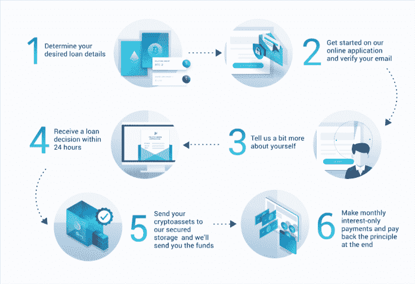
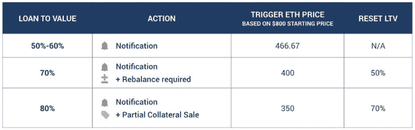
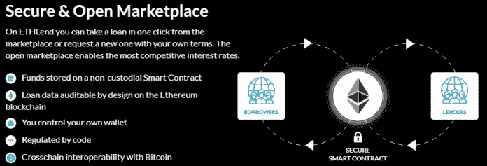

# 借贷的新时代:基于区块链的贷款

> 原文：<https://medium.datadriveninvestor.com/a-new-era-of-lending-blockchain-based-loans-ef8c7e7671e9?source=collection_archive---------12----------------------->

# 即期

没有信用记录，从传统金融机构获得贷款几乎是不可能的。银行通常在评估是否发放贷款和计算所述贷款的潜在利率时会重点考虑某人的信用评分。如果一个人没有信用记录，那么他增加个人资本的选择就很少。贷款允许人们购买房屋、汽车、开办企业和许多其他提高人们生活水平的功能。

> 他的文章探讨了加密公司如何引入一种提供贷款和银行服务的新方式；一种包罗万象的方法。

# 传统方法与点对点贷款

获得贷款的传统方法可能是密集和漫长的；银行通过一系列步骤来评估某人偿还贷款的可能性。有了[的点对点](https://www.datadriveninvestor.com/glossary/peer-to-peer/)网络，个人可以更快、更容易地获得贷款，而且不需要任何中介。

[点对点贷款](https://www.datadriveninvestor.com/glossary/peer-to-peer-lending/)是一种让每个人都有能力获得贷款的方法。典型的 crypto/[P2P 贷款](https://www.datadriveninvestor.com/glossary/peer-to-peer-lending/)公司接受不同类型的[加密货币](https://www.datadriveninvestor.com/glossary/cryptocurrency/)作为抵押品，并以现金或加密货币作为回报借给客户。

虽然 BlockFi 和 ETHLend 等不同公司处理和实施贷款的方式不同，但最终产品相对相似。

# 加密借贷平台的结构

并非所有贷款平台的结构都一样。区分不同类型贷款平台的一个简单方法是考虑它们是通过第三方还是智能合同持有抵押品。例如，BlockFi 和 Celsius Network 都使用第三方服务来持有抵押品，而 ETHLend 使用智能合同在贷款期间持有抵押品。使用托管服务创建了一个更集中的贷款平台，因为所有抵押品都将由公司持有，而智能合同的使用类似于贷款人和借款人之间的单独协议。

# 利息计算方式的不同

传统银行贷款和加密贷款平台的一个主要区别是利息是如何计算的。加密贷款公司不是使用 [FICO](https://medium.com/coinmonks/the-future-of-credit-blockchain-and-reputation-based-scores-bc2aa98c7d8b) 分数，而是根据客户可以用作抵押品的加密货币数量来计算贷款价值比。比率是本金除以抵押品的价值。获得贷款的最大决定因素是申请人能够拿出多少密码作为抵押。不同的平台根据每笔贷款的 LTV 计算不同的利率。评价中不涉及信用评分。

# 借贷平台的法律问题

为了符合美国现行法律，所有贷款平台都应该遵循几个方面。例如，贷款平台应遵循金融犯罪执法网络(FinCEN)的规则，如[了解你的客户](https://www.datadriveninvestor.com/glossary/know-your-customer/)和[反洗钱](https://www.datadriveninvestor.com/glossary/anti-money-laundering/)规定。这些要求确保公司在与客户进行商业交易之前进行尽职调查。

从本质上来说，具备金融机构资格的区块链公司在向任何客户提供贷款之前，都必须对他们进行调查，以确保他们不是恐怖分子或与某些国家有业务往来。大多数交易所在采用 FinCEN 规则方面没有明确的政策，但那些希望获得 BitLicense 的交易所需要采用这些政策。

# 加密借贷平台的示例

*BLOCKFI*

BlockFi 是向客户发放贷款的中央实体的一个例子。为了获得贷款，潜在客户可以使用比特币、双子星币或以太币作为抵押。文书工作相对较快，需要一些个人信息，如社会安全号码、[钱包](https://www.datadriveninvestor.com/glossary/wallet/)公钥和银行信息。用户被承诺在 24 小时内得到贷款的答复。如果客户接受报价，他们必须将抵押品发送给 BlockFi，然后 BlockFi 将现金转移到该人的银行账户。在期末，人们可以再融资或者还清贷款。整个 12 个月期间的支付都只收取利息，客户可以用比特币、以太币或美元偿还利息。

如果比特币或以太网的价格大幅下跌，LTV 比率上升到风险过高的百分比，BlockFi 可以采取行动，部分清算抵押品，以偿还部分贷款。在 70%的 LTV 比率下，客户需要增加他们的抵押品或偿还足够的贷款，以使贷款达到 50%的 LTV。如果 LTV 比率增加到 80%,那么 BlockFi 有权清算足够多的客户抵押品，使其 LTV 降至 70%。BlockFi 有一个通信系统，允许客户在 72 小时内偿还部分贷款或为贷款增加更多抵押品。

部分清偿贷款的目的是防止违约。如果贷款自动部分清算，并且这些资产用于立即偿还部分贷款，那么客户理论上永远不会因加密货币的价格波动而违约。这在任何特定加密货币的价格急剧下降的情况下为公司提供了安全性。

BlockFi 使用 Gemini 持有其抵押品和资产。BlockFi 的贷款结构相当集中，但允许从非传统来源进行无缝和安全的贷款。

*摄氏网络*

摄氏网是另一个集中借贷平台。Celsius 使用 BitGo 作为其合格的托管人。Celsius 试图扮演一个典型的银行角色，客户可以在这里进行存款和取款。需要注意的是，Celsius 不会将加密资金冷藏起来。该基金能够赚取利息，并用于支付贷款给其他客户和投资(类似于实际的银行)。

为了给他们的客户提供额外的安全保障和保护他们的网络，Celsius 从他们的费用中拿出一个资产池来支付任何在违约贷款中损失的潜在资产。这个资金池在发生损失时起保险作用。

此外，摄氏有自己稳定的[硬币](https://www.datadriveninvestor.com/glossary/coin/)。他们的[稳定币](https://www.datadriveninvestor.com/glossary/stablecoin/)不能用作抵押品，但可以作为每月利息支付。如果出现波动，当 LTV 达到 65%或更高时，Celsius 将联系客户。然后，客户有 12 个小时的时间要么增加更多的抵押品，偿还贷款，要么部分清算。如果 LTV 增加到 80%，Celsius 保留自动部分清算客户的权利，直到其恢复到 70%。

ETHLEND

构建加密贷款平台的另一种方式是充当借款人和贷款人之间的中介，并且对贷款没有所有权。ETHLend 采用了这种更加分散的平台。ETHLend 是一个平台，允许借贷双方通过智能合同找到对方并执行贷款。寻求贷款的人可以在申请中描述他们需要多少钱、利率、分期付款的次数以及贷款期限。一旦他们的愿望被提交，愿意为贷款融资的人就能够执行一个智能合同。*ETHLend 的业务结构与上述其他业务的主要区别在于，没有合格的托管人在贷款期间持有资产。*在这里，这些贷款非常灵活，但不能保证任何人都会愿意为拟议的贷款融资。

# 概述

基于区块链的借贷平台为每个人提供了获得贷款的机会。这些平台为个人获得贷款提供了多种途径和多种选择。此外，这些贷款可以通过法定货币或加密货币获得。

世界上有很大一部分人无法获得传统的金融服务；这些贷款平台为那些没有这些服务的人提供了获得这些服务的途径。

【datadriveninvestor.com】原载于