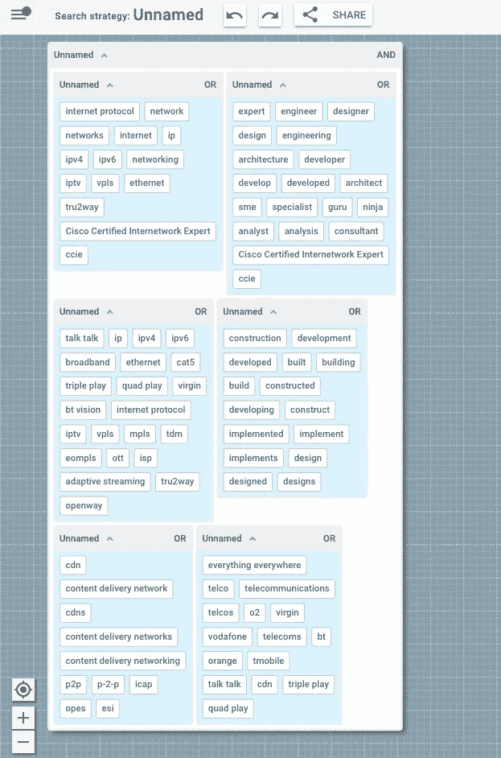
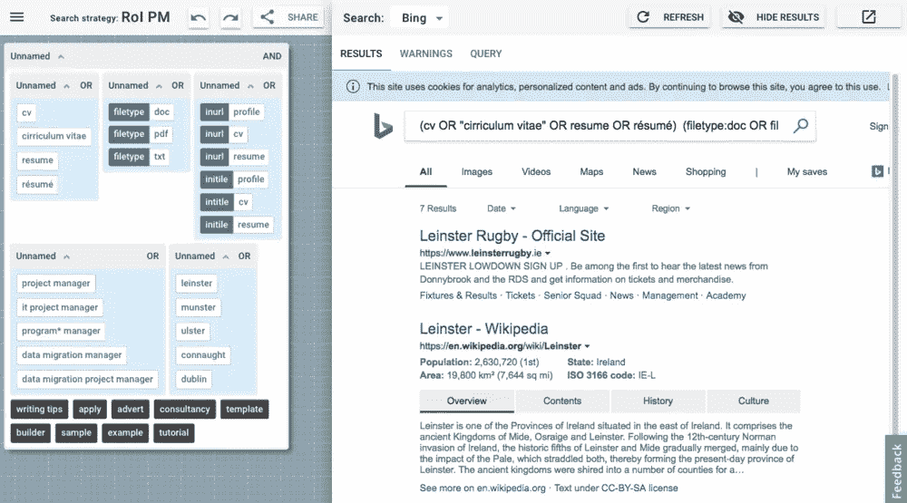

# 查看旧搜索的新方法

> 原文：<https://medium.datadriveninvestor.com/a-new-way-to-view-your-old-searches-9bac0b2b0ff?source=collection_archive---------7----------------------->

在我们最近的几篇文章中，我们回顾了数据可视化领域的一些想法可以用来*重新想象*高级搜索的世界。例如，我们已经探索了视觉表示如何在搜索的底层语义和它的物理外观之间提供一个[更直接的映射。同样，我们已经展示了如何使用自动查询建议来](https://www.2dsearch.com/news/2018/7/11/this-is-whats-possible-when-you-rethink-advanced-search)[促进关键字生成的任务](https://www.2dsearch.com/news/2018/7/26/a-smarter-way-to-search-using-query-suggestions)。我们已经展示了字段标签如何为搜索策略的通用表示提供一个小但重要的步骤。

这些发展为创建、共享和优化复杂搜索任务的新解决方案提供了前所未有的机会。但并不是所有的搜索任务都是新的。事实上，许多搜索问题是现有主题的变体，在这些情况下，从以前的解决方案开始更有意义。例如，在采购中，招聘专业人员利用诸如[布尔搜索字符串库](https://booleanstrings.ning.com/forum/topics/boolean-search-strings-repository)和[布尔字符串库](https://scoperac.com/booleanstringbank/)等库作为灵感来源和复杂搜索问题的解决方案。

然而，尽管这些资源的价值毋庸置疑，它们的内容仍然以原始文本的形式存储。这意味着它不仅有许多固有的缺点，而且这些内容作为灵感、实验和学习来源的真正价值可能永远不会被充分实现。这就是为什么我们很高兴在本周宣布发布对*布尔字符串解析*的支持。这意味着你可以(几乎)获得任何一个布尔字符串，并以一种适合交互式探索和实验的形式呈现它。

例如，以下是发布到布尔搜索字符串存储库中的一个字符串，供网络工程师使用:

> *(网络或联网或网络或互联网或 ip 或 ipv4 或 ipv6 或“互联网协议”或 iptv 或 vpls 或以太网或 tru2way 或“思科认证互联网专家”或 ccie)(工程师或建筑师或设计师或设计或工程或架构或开发人员或开发人员或开发人员或专家或 sme 或专家或权威人士或忍者或分析师或顾问或“思科认证互联网专家”或 ccie) (ip 或“互联网协议”或 ipv4 或 ipv6 或宽带或以太网或 cat5 或“三网合一”或“四网合一”或 virgin 或“bt vision”或“talk talk”或 iptv 或 vpls 或 mpls 或 tdm 或 eompls 或 ott 或 isp 或“自适应流式传输”或 tru2way 或 openway)(开发或开发或构建或构建或构建或构建或构建或实施或实施或实施或设计或设计) (cdn 或“内容交付网络”或“cdns”或“内容交付网络”或“内容交付网络”或 p2p 或“P2P”或 icap 或“opes”或 esi)(电信公司或电信公司或电信公司或 o2 或维珍或沃达丰或“无处不在”或 bt 或 orange 或 tmobile 或“talk talk”或 cdn 或“三网合一”或“四网合一”)*

在这种形式下，它看起来非常难以理解，但当我们进入 [2dSearch](https://www.2dsearch.com/) 时，我们开始只见树木不见森林:

正如我们所见，它是 6 个析取项的合取项。现在我们了解了它的结构，我们可以进一步优化它，例如:

*   尝试使用搜索建议来细化每个分离项(或组)
*   命名或组，并单独保存它们(就像我们可以重复使用的乐高积木)。

在每种情况下，我们当然会密切关注搜索结果窗格，注意它们是如何随着每次变化而动态更新的。

这是另一个例子，这次是针对都柏林的数据迁移项目经理:

> *(cv 或“简历”或 resume 或“履历表”)(filetype:doc 或 filetype:pdf 或 filetype:txt) (inurl:profile 或 inurl:cv 或 inurl:resume 或 initile:profile 或 intitle:cv 或 initile:resume)(“项目经理”或“it 项目经理”或“程序*经理”或“数据迁移经理”或“数据迁移项目经理”)(leinster 或 munster 或 ulster 或 connaught 或 Dublin)-模板-示例-教程-构建器-“写作技巧”-模板*

现在是它的视觉形式:

同样，OR 子句的连接词(浅蓝色块)，但这一次带有少量的字段标记(深蓝色)和各种被否定的术语(黑底白字)。此外，在本例中，我们可以看到搜索结果似乎并不特别相关，因此我们可以通过以下方式开始试验和优化:

*   修复关键字和[字段标签](https://www.2dsearch.com/news/2018/8/6/field-tags-for-smarter-searching)中的错别字
*   启用/禁用位置组(了解该子句对整体表达式的影响，即无论位置如何，是否存在任何相关结果)
*   使用自动查询建议试验不同的位置关键字
*   将技能关键字分成两组，例如，一组用于工作角色，另一组用于技术技能

诸如此类。

希望上面的例子传达了数据可视化技术在帮助理解和探索搜索策略和布尔字符串方面的价值。在接下来的几周里，我们将密切关注上述社区，并在这里分享任何值得注意的例子，以及我们自己的见解和评论。然而，如果我们没有说服你，并且布尔字符串仍然是你的事情，那也没关系——你仍然可以使用 2dSearch 进行实验和改进，然后简单地将你的工作导出为传统的布尔字符串(只需点击查询选项卡上的“复制”按钮)。

与此同时，如果你有任何自己的可怕的字符串要分享，把它们发送进来，我们会看看我们是否能帮助理解它们。或者直接去 [2dSearch](https://www.2dsearch.com/) 亲自尝试一下！

*最初发表于*[T5【www.2dsearch.com】](https://www.2dsearch.com/news/2018/9/11/a-new-way-to-view-your-old-searches)*。*