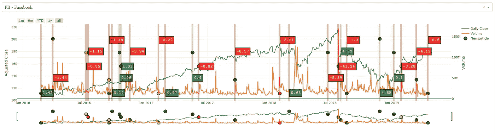
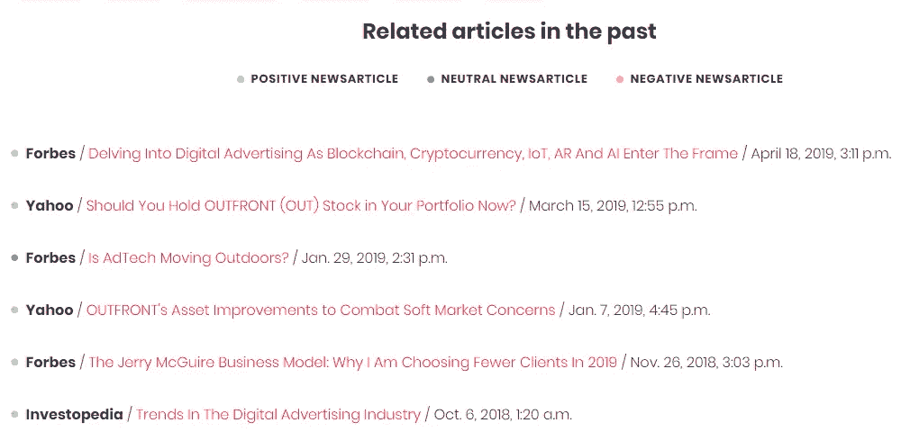
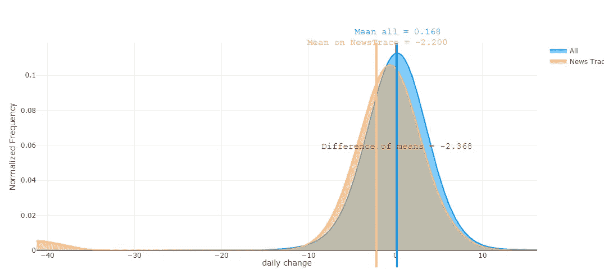
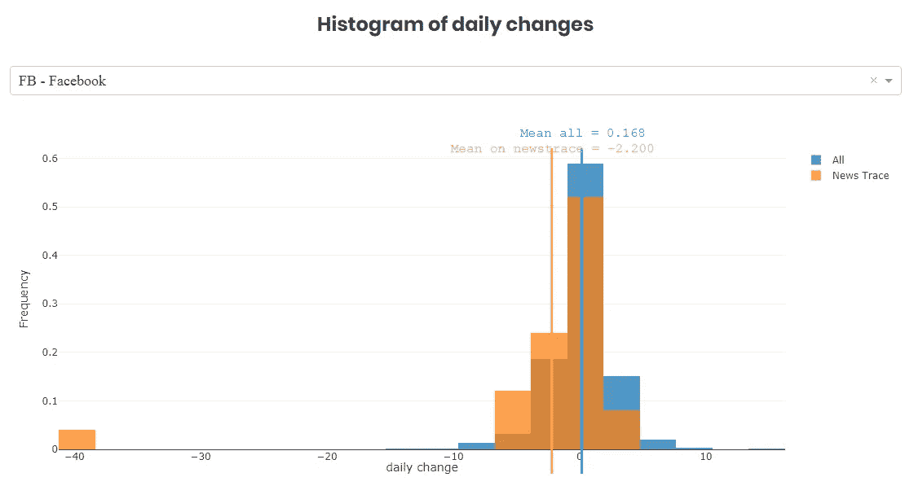
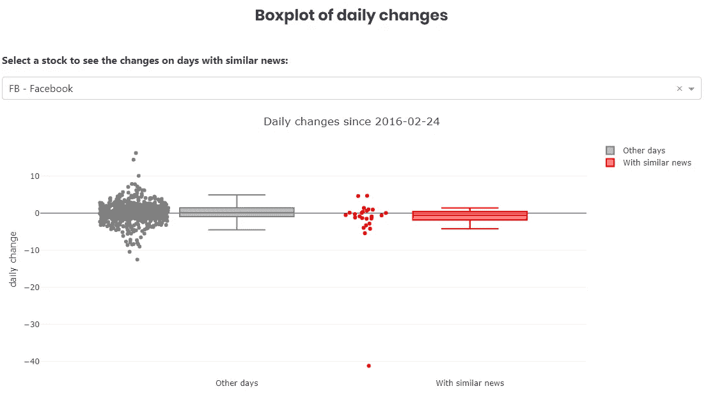
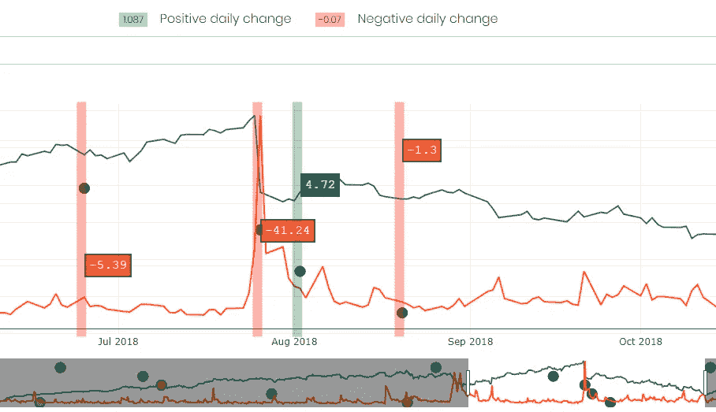

# pinalyze.com“新闻追踪”分析实例

> 原文：<https://medium.datadriveninvestor.com/a-newstrace-analysis-example-with-pinalyze-com-7272c18193f8?source=collection_archive---------8----------------------->

在以前的帖子中，我描述了一种在在线新闻文章中寻找交易信号的方法，称为“ [Newstrace](https://medium.com/datadriveninvestor/newstrace-a-method-to-analyze-the-impact-of-news-articles-on-stock-prices-2e866c16a9f) ”，使用了一些工具和 Python 脚本以及一个我称为“ [Pinalyze](https://www.pinalyze.com) 的新服务，它有助于应用这种方法。在《[股票预测新闻史](https://medium.com/@andreasstckl/1bda5c51a0ff?source=your_stories_page---------------------------)》一文中，我展示了 Pinalyze 的特色。

在本文中，我以一篇新闻文章为例，展示了如何应用该方法和系统。4 月 22 日。2019 年《金融快报》发表文章:

 [## 广告牌得到了数字化的推动

### 在监管障碍和库存有限的情况下，营销人员开始采用智能数字广告牌。

www.financialexpress.com](https://www.financialexpress.com/industry/billboards-get-a-digital-push/1555018/) 

这篇文章是关于广告牌，这些广告牌变得越来越智能，越来越能传递动态和互动的内容。

 [## 机器学习对外汇交易的挑战——数据驱动的投资者

### 机器学习是人工智能的一个分支，之前占据了很多头条。人们是…

www.datadriveninvestor.com](https://www.datadriveninvestor.com/2019/02/18/the-challenge-of-forex-trading-for-machine-learning/) 

Pinalyze 发现类似的文章发表在 **29** 不同的日子，直到**2016–02–24**

Similar news in the past

《福布斯》、《路透社》、《雅虎》等也发布了类似的新闻，都是关于数字户外广告的。例如:

 [## 数字广告行业的趋势

### 互联网广告已经从一个不确定的赌注变成了大多数公司营销的主要平台…

www.investopedia.com](https://www.investopedia.com/articles/investing/050815/trends-and-growth-digital-advertising-industry.asp)  [## 你现在应该持有投资组合中的股票吗？

### OUTFRONT Media Inc .在高交通流量区域的广告牌、交通和数字显示器的出色组合…

news.yahoo.com](https://news.yahoo.com/hold-outfront-stock-portfolio-now-120712263.html)  [## AdTech 在向户外转移吗？

### 广告技术支出在 2018 年激增，预计将继续以每年 10%以上的速度增长…

www.forbes.com](https://www.forbes.com/sites/geraldfenech/2019/01/29/is-adtech-moving-outdoors/) 

诸如此类。

Pinalyze 发现，在 209 家被分析的公司中，脸书是唯一一家在 29 个发布日的股票价格变化与同一时间段的其他日子相比有显著差异的公司。

“新闻追踪”上和“新闻追踪”外的 FB /脸书每日变化的平均值之差为 **-2.327** 。这表明了 Facebooks 价格的下降。

## 但是这个差异大到足以显示一个信号吗？

这种差异可能是随机的，没有系统的影响。Pinalyze 用统计测试来检验这个结果仅仅来自选择的概率，并发现这个概率为 **4.9%** 。在统计学中，如果该值低于 5%,通常会拒绝这只是随机效应的假设。这就是我们例子中的情况，因此误差概率低于 5%，我们可以预期一些非随机效应。

似乎在过去有这种消息的日子里，Facebooks 股票会有一个**的小规模系统性运动**。

Pinalyze 显示了“新闻轨迹”相对于其他轨迹的变化的估计概率分布。由于一些变化约为-40°的异常值，分布略微向左移动，平均值的移动量大于整个分布。

Density estimate for daily changes

让我们通过检查直方图来进一步了解这一点:

Histogram of daily changes in Facebook stock

我们看到有一个异常值，它在箱线图中也是可见的:

Boxplot of the daily changes

查看 Pinalyze 的“Newstrace”折线图可以看到，大约 40 点的下跌是在 7 月 26 日。在高交易量的 2018 年。

这一天《福布斯》的文章

 [## 从交易角度来看，都是数字媒体:为程序化接管做准备的四种方式

### 当您想到“媒体购买”这一术语时，您会想到什么？过去打电话讨论细节的日子…

www.forbes.com](https://www.forbes.com/sites/forbesagencycouncil/2018/07/26/transactionally-its-all-digital-media-four-ways-to-prepare-for-the-programmatic-takeover) 

被出版了。

*   会不会对空投有影响？
*   还是有其他一些原因？

如果我们从统计分析中排除这一消息，显著性水平上升到 5%水平以上，我们不会假设一个信号。

在以后的文章中，我将展示信号和分析的另一个例子。