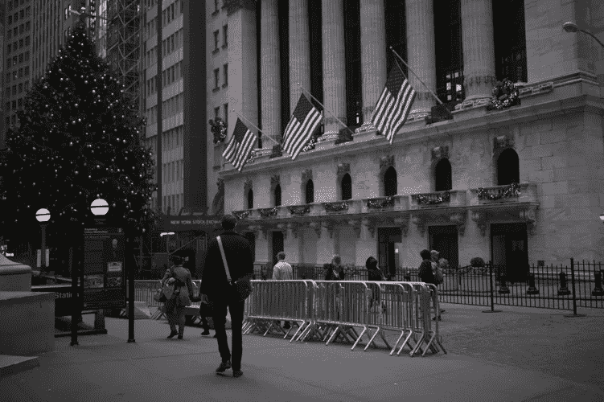

# 平安夜的痛苦点滴

> 原文：<https://medium.datadriveninvestor.com/a-painful-stock-selloff-pursued-on-christmas-eve-deleting-more-than-650-points-from-the-dow-90f2f4178549?source=collection_archive---------11----------------------->

Photographer: Jordan Sirek/Bloomberg

平安夜遭遇痛苦的股票抛售，道琼斯指数下跌超过 650 点。

道琼斯指数下跌 2.9%，至 21792.20 点，创下 2015 年以来最大的四个交易日跌幅。标准普尔 500 股市下跌 2.7%，至 2351.10 点。纳斯达克综合指数下跌 2.2%，至 6192.92 点。

同样发生在周五，标准普尔 500 所有 11 个主要部门关闭情人。可以看出，风险较高的股票，如突然增长的科技公司，导致投资者进入更安全的市场角落，如支付股息的公用事业公司。

油价周一继续下跌，打击了股市。原油价格下跌逾 4%，至每桶 43.71 美元。与此同时，能源公司的价格下跌了 4%左右。

## 货币

欧元上涨 0.07%，至 1 欧元兑 1.1414 美元

日元下跌 0.23%，至 1 美元兑 110.2 日元

英镑上涨 0.02%，至每磅 1.2709 美元

韩元兑美元汇率上涨 0.13%，至 1，126.55