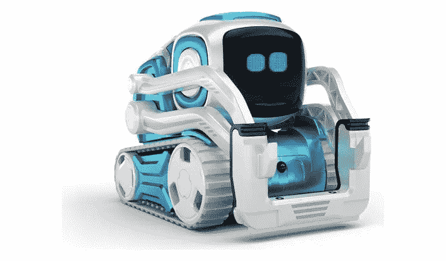
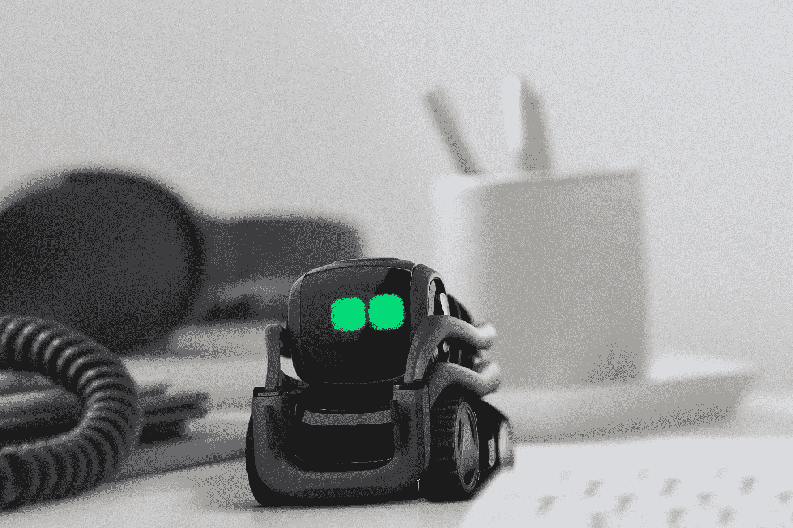
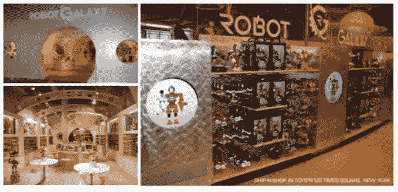
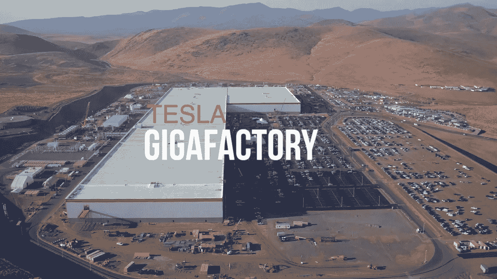
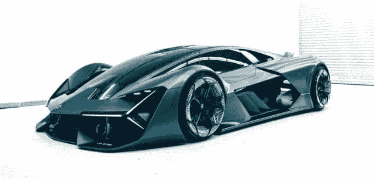

# 理解硬件市场机会的个人传奇

> 原文：<https://medium.datadriveninvestor.com/a-personal-saga-to-understanding-hardware-market-opportunities-dcce61093e74?source=collection_archive---------11----------------------->

震惊席卷了整个行业，几乎每个社交媒体平台上的技术人员都在哀叹失去了 [Anki](https://anki.com/) 。作为一名前机器人玩具制造商，我在几个月前阅读了拉拉·索罗卡尼奇的中型帖子标题中的墓志铭，“[安奇的人工智能机器人是一个令人愉快的(也是昂贵的)桌面玩具](https://www.popularmechanics.com/technology/a24433070/anki-vector-ai-robot-toy/)当本周被要求发表评论时，我只能依靠我创建并最终关闭 RobotGalaxy 的经历。

我的创业公司成立于 2006 年，旨在解决我们认为服务不足的零售市场——男孩。“打造你自己的机器人”的概念在几乎每一个新闻广播和早间节目中都受到了热烈的评论，推动了极高的开盘销售。

 [## 在自动驾驶汽车发生事故的情况下，谁应该承担法律责任？-数据驱动型投资者

### 我仍然认为自动驾驶汽车是一种奢侈品，而不是必需品…

www.datadriveninvestor.com](https://www.datadriveninvestor.com/2018/11/02/who-is-legally-accountable-in-the-case-of-an-autonomous-vehicle-accident/) 

这种体验结合了许多不同的教育媒体，如科学、技术、工程和数学(STEM ),因为孩子们在虚拟世界和丰富的漫画背景故事的支持下，在构建、编程和启动他们自己的机械伙伴方面转变为星系探险家。那么，是什么导致了它在 2012 年的关闭呢？

2008 年经济衰退后，我们不得不面对机器人玩具在马斯洛的“需求层次”中排名靠后的现实这一实现揭示了适用于 Anki 的最重要的经验教训。在没有市场营销的情况下创业几乎是不可能的(最终会浪费很多钱)。虽然 Anki 很聪明(主要针对成年人)，但它最终被商业化，并被视为一个没有电影的非常昂贵的未知小工具。在《漫威复仇者联盟》的世界里，几乎每一个动作人物和玩具都与媒体资产有关。甚至 [LittleBits](https://littlebits.com/products/droid-inventor-kit?utm_medium=ppc&utm_term=&utm_campaign=Consumer_Shopping_Brand_Names&utm_source=adwords&hsa_net=adwords&hsa_kw=&hsa_ad=346556488550&hsa_tgt=pla-484371199896&hsa_ver=3&hsa_grp=73798047510&hsa_cam=1850243484&hsa_acc=8321851481&hsa_src=g&hsa_mt=&gclid=CjwKCAjwiN_mBRBBEiwA9N-e_lAt2NY09nHK_V5JENnTBbXLfvp4fw5_ObMianaGYicnfFVQ2qSv1hoC7QkQAvD_BwE) 和 [Sphero](https://www.bestbuy.com/site/sphero-bb-8-app-enabled-droid-by-sphero-white/4316601.p?skuId=4316601&ref=212&loc=1&ref=212&loc=1&ds_rl=1266837&ds_rl=1269132&ds_rl=1269135&ds_rl=1266837&gclid=CjwKCAjwiN_mBRBBEiwA9N-e_uAXC0zRAeJy_GVzbNN7xWhyDQzVinzPrxsSAyJFm2bE7oL-dQe4WBoCZDYQAvD_BwE&gclsrc=aw.ds) 也授权《星球大战》角色来增加收入。回想起来，Anki 的 2 亿美元本可以更好地用于在库存之前开发 Cozmo 和 Vector 背后的娱乐产业。虽然我上学的代价较小，但在《机器人银河》之后，我对自己发誓，我的下一次冒险将像空气一样重要。

想到关键技术，当我写这篇文章时，我的 iPhone 电池闪着红光。今天，从机器人到无人机到自动驾驶汽车，许多无人驾驶系统都依赖锂离子电池。这推动了对开采更多矿产的巨大需求，对环境产生了负面影响，并耗尽了自然资源。根据 2015 年美国地质调查局(US Geological Survey)的数据，“世界上已知的(锂)储量足以满足目前全球每年约 37，000 吨的产量约 365 年的需求。”然而，这一数字是基于四年前的使用量，当时只有三分之一的锂用于电池。该报告重新估计了这一数字，以包括电动汽车的未来预测，特别是随着埃隆马斯克的巨型工厂上线，该报告称，“如果这些革命真的发生，当前的需求将大幅上升。100 个千兆工厂的场景可能会成为现实。如果出现这种情况，365 年的供应量将少于 17 年的供应量。”除了环保主义者的观点，锂离子电池效率低下。例如，在超级充电站给特斯拉充一次电需要 40 分钟，相比之下，在内燃机加油站给特斯拉充一次电需要 5 分钟。

然而，今天我们正处于拯救地球的重大发现的尖端。从 2004 年开始，在曼彻斯特大学，一种突破性的新能源在普通铅笔中被发现。石墨烯的强度是钢的 200 倍，比任何其他已知的碳基材料都更导电。直到最近，它还被包裹在石墨中，无法被隔离成单层。然后，安德烈·海姆博士和他的团队能够将它拆开，并通过它传导电流。“几十年来，石墨被研究人员用作一种‘魔法石’,可以传递所有可能和不可能的现象，包括室温超导。我们的工作表明，原则上，这种材料是可能的，至少在其最纯净的形式下是可能的，”海姆博士惊叹道。

12 年后，阿肯色大学的研究人员将海姆博士的工作推向了一个新的高度，他们创造了一种电池方法，将石墨烯转化为无限供应的清洁能源。Paul Thibado 博士和他的实验室开始从石墨烯中获取能量，将这种材料放入一个铜制的脚手架网格中，产生电流波纹。在解释这项创新时，Thibado 博士说，“这是利用 2D 材料的运动作为可收获能源的关键。与液体中的原子随机移动不同，连接在一片石墨烯中的原子一起移动。这意味着可以使用现有的纳米技术来收集它们的能量。”Thibado 的技术非常小，因为演示的石墨烯只有 10 微米宽，能够在一个针头上安装 20，000 片石墨烯(因此，开采更少)。这意味着一个微小的石墨烯薄膜可以永远为苹果手表供电，而无需充电。Thibado 称他的技术为“振动能量采集器”,未来的自我充电电源。这位教授的目标是将他的创新带到医疗保健领域，因为“自供电使智能生物植入物成为可能，这将对社会产生深远的影响。”

尽管石墨烯电池仍处于开发早期，但它已开始被集成到下一代电子产品和汽车中。最近，中国制造商徐东光电推出了其“石墨烯超级电容器”，大小相当于一个笔记本电脑电池，可以将数小时的充电时间转换为几分钟。西班牙初创公司 [Earthdas](http://earthdas.com/) 计划在今年晚些时候推出自己的电动自行车和摩托车电池，号称充电时间比目前的锂离子电池快 12 倍。这项创新最令人兴奋的用例之一是将石墨烯融入汽车车身。一家名为 [NAWATechologies](http://www.nawatechnologies.com/en/home-english/) 的法国公司已经开始致力于开发可直接嵌入汽车底盘的柔性聚合物或涂层。正如该公司首席执行官 Ulrik Grape 吹嘘的那样，“在某种程度上，这就像拥有一辆不用电池的汽车。”进一步证实 Grape 的声明，兰博基尼与[麻省理工学院](https://www.graphene-info.com/mit-and-lamborghini-develop-graphene-enhanced-supercar)合作开发了一种石墨烯增强型超级电容器，直接内置于车身中。

Anki 和 RobotGalaxy 的消亡应该被视为该行业自然成熟的一部分，使开创性的发明能够进一步推动整个生态系统。谁知道呢，也许今天研究石墨烯的博士生是受到了他们年轻时的机器人玩具的启发？话说回来，可能是托尼·斯塔克首先给了他们替代能源的想法？

*机器人玩具、替代能源等等——来听听 HuggieBot 的发明者 Alexis Block 和 Mobility Impact Partners 的合伙人 Andrew Flett 于 5 月 16 日在 Robot lab @位于纽约的 SOSA 全球网络中心举办的“社会 2.0:理解人类与机器人的联系以改善世界”——*[*RSVP Today*](https://www.meetup.com/RobotLab/events/260222838/)*！*