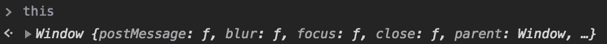
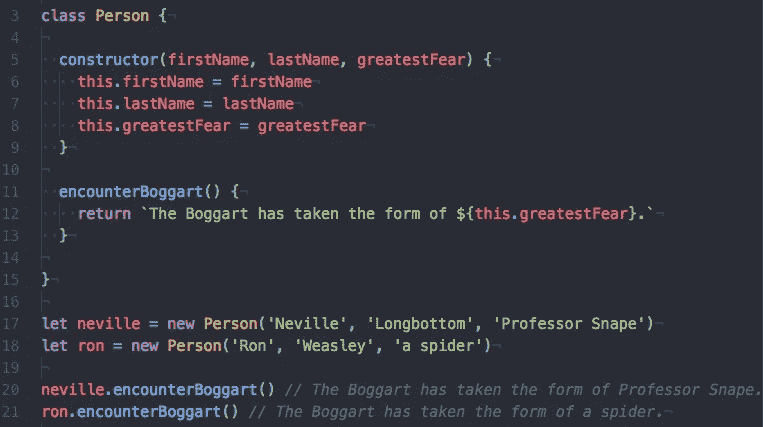
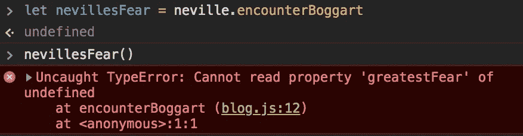
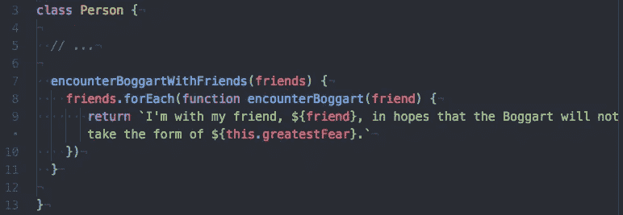
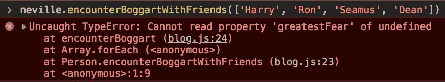
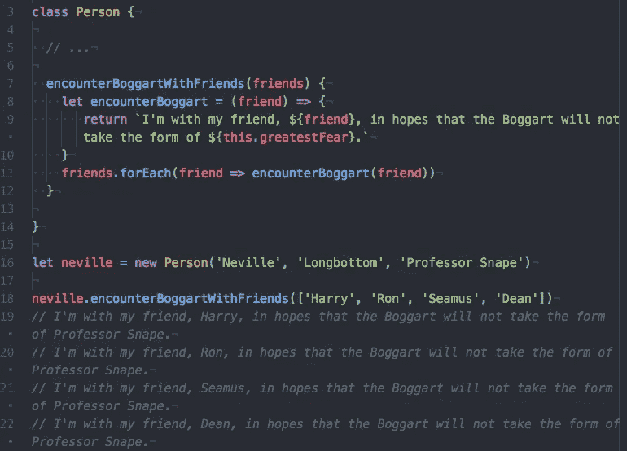

# JavaScript 的“this”关键字入门指南

> 原文：<https://medium.datadriveninvestor.com/a-potterheads-guide-to-javascript-s-this-keyword-7908399d0e93?source=collection_archive---------3----------------------->

对于像我这样的开发新手来说，JavaScript 关键字“`this`”可能会令人难以置信。误判`this`的值会严重影响面向对象的 JavaScript 应用程序的功能。你可能会问，为什么掌握这一点如此具有挑战性？因为每次`this`从它隐藏的黑暗、封闭的空间——比如衣柜——出现时，它都会呈现出不同的形式。

你可能会发现藏在衣柜里的另一种东西是幻形怪，一种会变形的生物，它会根据遇到的人而改变自己的形态，最终变成那个特定的人最害怕的形态。`this`是 JavaScript 的 Boggart，因为**`**this**`**的值根据其执行上下文**而变化。**

****以外的任何功能，** `**this**` **指的是** `**global object**` **，或者 web 浏览器中的** `**window**` **。**就像一个被隐藏起来的博格特，呈现出它的默认形式(碰巧是未知的)，`this`的值就是`global object`，因为它在全局执行上下文中。**

****

****在实例方法内部，** `**this**` **会取接受方法调用**的对象的值，就像博格特遇到人一样。在下面的例子中，您可以看到，因为`encounterBoggart`是在`Person`类中定义的，也就是说，作为一个实例方法，`this`将采用调用该方法的`Person`实例的值。**

****

**但是现在让我们假设斯内普决定，当`neville.encounterBoggart`被调用时，他想通过声明一个指向相同函数的变量来抑制纳威内心的恐惧，以备后用。**

****

****当一个变量被定义为指向一个实例方法的函数时，那个函数就失去了** `**this**` **的值。** `this`变成了`undefined`,因为函数不再在实例上被调用；它的执行上下文现在是全局的。但是斯内普没有被吓住——他知道有一个咒语可以在将`neville.encounterBoggart`保存到一个新变量以在其他地方执行时保持它的执行上下文。那个咒语就是`bind`。`**bind**` **允许您给函数附加一个** `**this**` **值。****

****

**使用`bind`就像在博格特上铸造 *Riddikulus* 。你在强迫幻形怪采用某种形式，就像你在强迫`this`采用你绑定的函数的形式一样。**

****另一个场景是** `**this**` **的值变成** `**undefined**` **的情况是在** `**callback**` **函数内部。****

****

**在上面的例子中，`encounterBoggartWithFriends`的执行上下文将是调用该方法的任何实例。但是**`**callback**`**函数** `**encounterBoggart**` **会根据自己的执行上下文**定义自己的 `**this**` **。`callback`的执行上下文不是`Person`的实例，因为它本身不是一个实例方法，它只是一个函数。所以`this`变成了`undefined`，整个方法在被调用时都会抛出一个错误:******

********

****`this`每次它的执行上下文改变时都会继续改变，使得它的值有时不可预测。类似地，当遇到不止一个人(或执行上下文)时，博格特会感到困惑，不知道采取什么形式，也就是说，变得不确定！****

****但是，**可以防止** `**callback**` **定义它自己的** `**this**` **，而是使用它外部函数的** `**this**` **，将其定义为** `**arrow function**`。`**Arrow functions**` **不定义自己的** `**this**` **，他们用** `**this**` **定义自己的外部范围。******

********

****正如我们所见，`this`可能非常棘手，相当"*迷惑"*、*、*，但我希望这个指南对麻瓜、女巫和男巫都有帮助。当有疑问时，作为一般规则，在使用`this`的地方插入`debugger`。在继续编写任何代码之前，总是要检查以确保`this`是您所想的。开怀大笑。我听说笑能帮助你成为更好的开发者，也能打败博格特。****