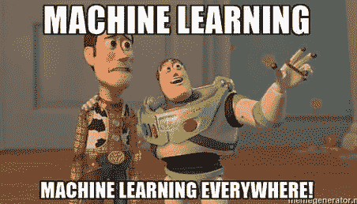
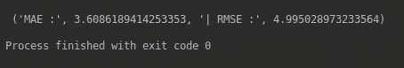

# 机器学习入门实用指南

> 原文：<https://medium.datadriveninvestor.com/a-practical-guide-to-getting-started-with-machine-learning-3a6fcc0f95aa?source=collection_archive---------0----------------------->

[](http://www.track.datadriveninvestor.com/1126A)

机器学习(ML)对我来说是一个非常可怕的概念，尤其是作为一个数学知识非常有限的人。在花了无数时间阅读文档、观看教程、对栈溢出投了几次反对票以及几次精神错乱之后，我才能够让一个简单的 ML 模型工作。在本文中，我将向您展示如何使用 python 开始学习 ML，并使用支持向量回归(SVR)解决一个简单的回归问题。

你需要开始做的第一件事是数据集。获得准确预测的关键是使用良好的数据集和模型超参数的适当调整。对于这个例子，我们将使用[波士顿房价数据集](https://raw.githubusercontent.com/jbrownlee/Datasets/master/housing.data)，它有 506 条记录、13 个特征和一个输出(关于这个数据集的更多信息可以在[这里](https://machinelearningmastery.com/standard-machine-learning-datasets/)找到)。

让我们开门见山吧。首先，我们需要导入一些库。

```
import math
import pandas
from sklearn.preprocessing import MinMaxScaler
from sklearn.svm import SVR
from sklearn.model_selection import GridSearchCV, cross_validate
from sklearn.utils import shuffle
```

我们将使用 [scikit-learn](https://scikit-learn.org/stable/index.html) ，这是一个 python 的机器学习库，来实现我们的模型。我们将使用同一个库来完成交叉验证和预处理等功能。我们导入的 [*math*](https://docs.python.org/3.2/library/math.html) 库允许我们轻松地执行数学函数，而 [*pandas*](https://pandas.pydata.org/) 库允许我们更轻松地操作数据结构。

现在，让我们加载数据集，并指定特性和因变量。

```
dataset = pandas.read_csv('Dataset.csv')
X = dataset.iloc[:, [0, 12]]
y = dataset.iloc[:, 13]
```

这里，我们将数据集加载到一个 *pandas* 数据框中，并将数据集的前 13 列(特征)分配给 **X** ，将因变量分配给 **y** 。我们正在使用预处理技术**最小最大缩放**，以便标准化数据集。我们的数据集中的数据分布在很大的值范围内，这可能会导致各种特性对最终结果的影响比其他特性更大。*最小最大缩放*通过将数据重新缩放到指定的值范围(本例中为 0-1)来减少这种影响。

```
scaler = MinMaxScaler(feature_range=(0, 1))
X = scaler.fit_transform(X)
```

在向模型提供数据之前，对数据进行洗牌是很重要的。假设数据集的前 400 条记录在 200–1500 的范围内，其余的在 0–100 的范围内。如果我们使用一个**简单的 train_test_split()** 并将数据集分成训练集和测试集，这样 80%的数据用作训练集，20%的数据用作测试集，模型将使用前 448 条记录进行训练。由于训练集中的大多数记录都在 200-1500 的值范围内，模型将使用这些值建立某些模式，当您使用测试集测试模型时，如果大多数数据记录都在 0-100 的值范围内，模型的性能将会很差，因为它是使用完全不同的值范围内的记录进行训练的。

```
seed = 42
X, y = shuffle(X, y, random_state=seed)
```

将种子设置为常数值可以确保每次运行脚本时都获得相同的结果。现在，让我们实现一个简单的 ML 模型。我们将实现的模型是 SVR 模型(使用 RBF 内核)。这是代码，

```
def svr_model(X, y):
    gsc = GridSearchCV(
        estimator=SVR(kernel='rbf'),
        param_grid={
            'C': [0.1, 1, 100, 1000],
            'epsilon': [0.0001, 0.0005, 0.001, 0.005, 0.01, 0.05, 0.1, 0.5, 1, 5, 10],
            'gamma': [0.0001, 0.001, 0.005, 0.1, 1, 3, 5]
        },
        cv=5, scoring='neg_mean_squared_error', verbose=0, n_jobs=-1)

    grid_result = gsc.fit(X, y)
    best_params = grid_result.best_params_ best_svr = SVR(kernel='rbf', C=best_params["C"], epsilon=best_params["epsilon"], gamma=best_params["gamma"],
                   coef0=0.1, shrinking=True,
                   tol=0.001, cache_size=200, verbose=False, max_iter=-1)

    scoring = {
               'abs_error': 'neg_mean_absolute_error',
               'squared_error': 'neg_mean_squared_error'}

    scores = cross_validate(best_svr, X, y, cv=10, scoring=scoring, return_train_score=True)return "MAE :", abs(scores['test_abs_error'].mean()), "| RMSE :", math.sqrt(abs(scores['test_squared_error'].mean()))
```

首先，我们将特性和因变量(X 和 y)传递给模型。然后，我们执行网格搜索，以获得在我们的模型中使用的最佳超参数。我们已经使用了三个超参数； **C、ε**和**γ**，待优化(更多关于 SVR 模型及其超参数的信息可在[这里](https://scikit-learn.org/stable/modules/generated/sklearn.svm.SVR.html)找到)。在这里，我们获得了两个误差度量*平均绝对误差*和*均方根误差(RMSE)* 来确定我们模型的准确性。这是通过定义一个自定义记分员来完成的。该计分器被传递给 sklearn 的 cross_validate()函数，该函数执行 10 重交叉验证(参见本文的[以获得关于 K 重交叉验证的更多信息)并返回我们模型的平均 MAE 和 RMSE 分数。](https://medium.com/datadriveninvestor/k-fold-cross-validation-6b8518070833)

现在，让我们运行我们的脚本。

```
print(svr_model(X,y))
```

这是我们模型的误差度量结果。



通过查看我们得到的误差度量值，我们可以说我们的模型表现良好，并且能够在给定一组新记录的情况下给出准确的预测。您可以更改我们在网格搜索中使用的值范围，并进一步优化模型，以检查模型准确性是否提高。

我希望这篇文章能帮助你开始使用 ML。感谢你的阅读，如果你觉得这有用，请鼓掌！

**如果你有兴趣阅读更多内容**，请查看我列表中的文章，

*   [机器学习文章](https://medium.com/@krishnihw/list/machine-learning-5db3a9d0dc83)
*   [权力匕篇](https://medium.com/@krishnihw/list/power-bi-2e19d2237f90)

保持理智！再见！

## **参考文献**

[](https://scikit-learn.org/stable/modules/generated/sklearn.svm.SVR.html) [## sk learn . SVM . SVR-sci kit-learn 0 . 20 . 1 文档

### 指定要在算法中使用的内核类型。它必须是“线性”、“多边形”、“rbf”、“sigmoid”中的一个…

scikit-learn.org](https://scikit-learn.org/stable/modules/generated/sklearn.svm.SVR.html) [](https://machinelearningmastery.com/standard-machine-learning-datasets/) [## 实践应用机器学习的 10 个标准数据集

### 擅长应用机器学习的关键是在大量不同的数据集上练习。这是因为每个…

machinelearningmastery.com](https://machinelearningmastery.com/standard-machine-learning-datasets/)