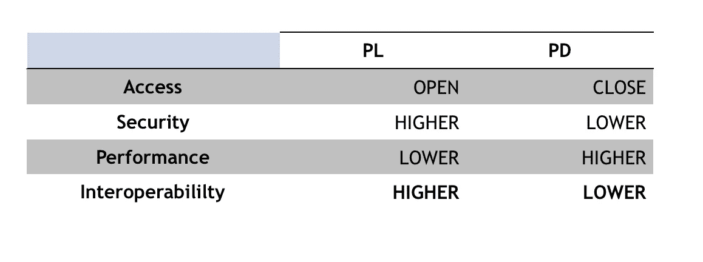

# 关于无许可和许可分布式分类账的特征、限制和实际考虑的实用观点

> 原文：<https://medium.datadriveninvestor.com/a-pragmatic-perspective-on-the-features-and-limitations-of-permissionless-and-permissioned-dlts-e86a2de37133?source=collection_archive---------2----------------------->

所有区块链都是分布式总账；针对您的使用案例评估正确网络选择的指南。

Coubert — The artist’s studio, 1854\. This painting highlights the dichotomy between the ruling class (on the left) and the artists (on the right).

# **许可还是不许可？**

这就是困境。

我们这些在该部门工作的人非常熟悉这种二分法。我们也知道，太多时候，话语是由意识形态信仰或语义问题引导的，而不是由技术或商业观点引导的**。**

这篇文章抛开了所有这些，采用了一种**实用主义的视角。** 也就是说，**许可的分布式账本技术(PD)网络不会剥夺无许可的分布式账本技术(PL)系统的有用性**，也不会提供更好的替代方案。然而，它们能够以 PL 无法实现的方式满足特定的业务需求。相反，一些**安全性**和**开放性**需要优先的用例需要 PL。

鉴于大量的案例研究，一种类型的网络不太可能胜过另一种；相反，更有可能的是多个链的出现，不同的设计元素*(共识，智能合约语言)*根据需要组合在一起。**尽管经常被描绘成彼此对立的事物，但随着时间的推移，PL 和 PD 网络将能够共存和通信，这取决于并根据手边用例的特定业务需求。**

企业决策过程的一部分是**评估 PL 和 PD 系统之间的权衡**，以确保选择最适合其用例的解决方案。

下一部分提供了对这两个类别的**介绍**，强调了它们的特点和局限性。此外，这些文章将关注企业在考虑这两个系统时应该权衡的四个方面。

# 1.无权限 DLTs

PL 最鲜明的[特征](https://medium.com/coinmonks/swimming-through-the-bullshit-the-5-pillars-of-blockchains-39be95d0839d)是它们是**开放的**网络，在这里**任何人都可以加入。**这种基础设施的名声主要是因为最著名的无许可网络:*比特币*和*以太坊*。在没有许可的环境中，任何人都可以加入网络，在链中读写，并可以成为矿工来服务网络和验证交易。源于它们的第一个特征，PL 是**无国界的**，也就是说，它们在一个国家**没有**实体存在**，也不能被限制在国界之内**。PL 也是 **public** 和 **neutral** :所有的交易都是经过验证和可验证的，对整个网络都是可见的。这极大地促成了 PL 提供的无与伦比的**安全性**，因为公共系统也是**透明的**并且完全**可听的**。PL 也是**中立**和**抗审查**。中立是因为 PL 不介入交易之间:中立网络不服务于任何组织的目标，不关心谁在参与交易，也不关心它的目的是什么。它只关心**的** **事务******是否有效，基于之前已经定义好的协议规则**。最后但同样重要的是，为了捍卫这些属性，PL 是**抗审查**，使得任何行为者都不可能审查交易。因此，在 PL 中，**不可能回滚交易**也不可能**阻止任何参与者进行交易。** PL 的特征在于存在一种**本地加密货币**和一种**分布式共识算法**，这两种算法都有助于创造博弈理论情境**来协调网络中所有参与者的利益**，即:确保网络中参与者的自身利益趋同，并被引导以使网络以尽可能最好的方式工作。PL 在**安全性**和**互操作性**方面提供优势，代价是**性能**。然而，重要的是要提到不是所有的 PL 都保证相同的安全级别。一般来说，PL 网络越大，就越难妥协— **这是一个一般的说法，实际上，事情要复杂一点，因为它取决于所使用的挖掘算法、节点数量，以及在证明有效的情况下，取决于为网络提供动力的** [**总哈希速率**](https://www.crypto51.app) **。****

**由于这种必要的权衡，有几个固有的缺点可能会限制它们在某些领域或某些业务中的应用:**

1.  ****无法控制事务处理器:**PL 的第一个限制(也是一个特性)是**无法控制事务处理器。**每个人都可以建立一个节点或成为一个矿工，验证事务。**
2.  ****性能:**共识机制的冗余导致 PL 以牺牲性能为代价优先考虑其他特性。比特币的平均[输出为每秒 5.4 次交易](https://www.blockchain.com/charts/transactions-per-second)，而[以太坊每秒处理约 12–15 次交易](https://www.investinblockchain.com/vitalik-ethereum-needs-100k-transactions-per-second/)。**
3.  ****顺序执行:** [PL 达成一致后顺序执行交易，确保**没有不一致，所有交易有效。**](https://arxiv.org/pdf/1801.10228) 在这种方法中，对应用程序的请求被一致地排序，然后以相同的顺序依次执行，一次一个请求，到达所有节点。这种执行方式有几个限制，因为它受限于可以实现的有效吞吐量，并使系统容易受到恶意参与者的攻击(T21)(例如，在以太坊中，这可以通过引入需要很长时间执行的智能合同来实现)(T23)**
4.  ****公共环境中的客户保密性:**在 PL 环境中，所有节点共享每笔交易，每个节点维护一份相同的分类帐副本。在**信息不公开的情况下，这**不太方便**，并且不应该在网络的每个成员之间共享**。**
5.  ****硬编码一致性:**在 PL 中，一致性算法是硬编码的。如果不认真重写代码，改变共识协议是非常困难的。这种设计选择**在不同的使用案例和部署场景中**不能很好地扩展。**

**PL 没有涵盖对大多数企业应用程序至关重要的方面，如**受控数据隐私、交易量可扩展性、系统响应性和协议升级的便利性、**和。结果，PL 经常被 PD 的支持者认为是缓慢和无效的。虽然这在理论上可能是正确的，但它们是**特定的设计权衡**，已经过仔细权衡**，以确保其他功能，如安全性和互操作性得到优先考虑。****

# **2.许可的 DLT**

****

**企业会权衡实施 PD 的可能性，因为他们可能需要引入与 PL 不兼容的功能，例如**回滚事务的能力、了解客户的必要性 *(KYC)* 以遵守隐私法规**或者可能需要对性能、共识或架构的特定**要求。****

1.  ****访问和隐私:**它们的特点是多级访问，其中一个**中央机构可以授予数字证书，允许不同的参与者根据其角色读取、提议或验证交易。**因此，只有授权的行动者才被允许加入或离开网络。中央机构扮演着看门人的角色，将那些可以加入网络的人列入白名单。**
2.  ****缺乏本地加密货币:** PD 不依赖本地代币作为博弈论和利益协调的工具。**
3.  ****可伸缩性和性能:** PD 采用更易于计算的一致协议。因此，与 PD 相比，它们能够具有更好的可伸缩性和性能。**
4.  ****可定制性:**PD 的框架可以调整，以反映需求，并根据需要容纳尽可能多的用户。共识机制可以根据用例的特定需求进行修改；此外，不同的用户可以有不同的权限，以保护竞争对手的秘密，但同时允许监管者和验证者访问所有相关信息。**

**PD 也有一些限制。首先，与 PL 交易对手相比，他们**更加集中** **。因此，**系统并不是不可信的**，因为网络参与者仍然需要对管理网络**的集中式实体给予高度信任**。其次，系统**失去了**PL 典型的**互操作性**的程度，因为它们通常是为单个(或有限的)用例创建的，而不是在不同的垂直领域中推广。
最后但并非最不重要的一点是，就固定成本而言，目前引入这些网络的成本非常昂贵**:建立这样的网络仍然非常昂贵，而且员工需要接受培训。这可能只对大公司可行，而中小型企业可能无法承担这样的成本。******

*******2.1 联合体 DLTs*******

****PD 的一个子类是**财团****DLT**。
它们本质上类似于项目开发，主要区别在于治理方案和基础设施。在 DLTs 联盟中，权力不仅仅集中在一家公司，而是由组成联盟的几个行为者分享。在基础设施方面，它们以**分散的方式部署在由不同公司管理的多个硬件**上，这是对具有更集中结构的 PD 的一种替代*(例如，单个参与者充当看门人)*。这种设置对于组织协作特别有意义，因此，可能与需要大量验证者和参与者来保证大量节点存在的用例相关。****

# ****3.实际问题****

********

****为了彻底了解最佳选择，公司从四个方面评估他们的首选:
**访问/安全性/性能/互操作性******

******1。访问:**选择的 DLT 是否会对任何人开放，或者演员是否必须被授权的(或者更多，如果是联盟的话)实体列入白名单。前者更像是一个 PL，而后者是 PD 的一个特性。我们来举个例子。企业可能需要定制网络的基础设施，以引入不同程度的访问，并确保只有拥有相关数字证书(由一个或多个验证者颁发)的合格参与者才能加入。此外，可能需要在验证者和相关参与者之间建立私人渠道，以便**共享私人信息，而没有将它们暴露给竞争对手的风险**。****

******2。安全性:** PL 交易是公开的，每个人——*知道交易者的公钥，或者交易 id*——都可以查看它们。如果一个企业对透明度和问责制感兴趣，这是一个很好的 T4 特征，而在竞争激烈的环境中，参与者可能不愿意公开他们的交易。此外，PL 的去中心化性质所提供的**安全性**比其 PD 交易对手的安全性高得多— **比特币和以太坊尤其如此，而如上所述，其他小型 PL 可能无法提供足够的安全性。**这是由于它们固有的特性。让我们以节点数为例:PL 比 PD 有更多的节点。截至目前，[比特币拥有 9627 个节点](https://bitnodes.earn.com/dashboard/)，而一个普通的 PD 拥有的节点要少得多，即使是在财团背景下也是如此——*获取数据需要大量时间，但很难想象一个 PD 拥有数千个节点。*这使得 **PD 网络对攻击的弹性**更小，因为存在**更多的故障点**，给定相对较少的**节点数量**。一个恶意的参与者只需关闭 5 个、10 个甚至 20 个节点，就可以使整个 PD 网络离线。此外，一些参与者可能决定结盟并劫持网络。****

******3。性能:**如果我们设想我们的项目在很短的时间内执行数千个事务，那么我们可能希望选择具有更高事务吞吐量的 PD。此外，建立在 PD(比特币或以太坊)之上将意味着公司将不得不**承担巨大的交易费用成本**，并且还将依赖于基础网络*(例如，在拥塞的情况下可能会遇到问题，并且还将暴露于系统的波动性，因为网络中的参与者将不得不持有本国货币来转移资金)。*****

******4。互操作性:**如果我们设想我们的系统**需要集成、API，并且仅仅是可互操作的，那么 PL 就是最好的。**使用比特币或以太坊意味着获得围绕它们的所有服务。**另一方面，如果****我们正在构建一个用例特定的应用程序，那么我们将不需要与其他应用程序互操作。******

********

****企业将根据**这四个方面**之间的必要权衡**做出最终决定。******

**这是关键所在:**两个选择中没有一个比另一个更好。**然而，根据所需的规格，其中一个可能优于另一个。您的企业需要高水平的安全性和互操作性吗？去散步吧。是否需要一个**只有经过认证的用户才能加入的封闭网络？使用 PD。****

**企业将相应地做出他们的最终决定，**强调他们手头用例的必要特性。**最后，真正重要的不是你拥有什么类型的网络，而是你的业务或项目能够增加价值并解决手头问题的事实。**

## **如果你喜欢这个故事，请点击👏按钮并分享出来，帮助别人找到！欢迎在下方留言评论。**

**点击此处订阅 DIntel [。](https://ddintel.datadriveninvestor.com/)**

**请访问我们的网站:[https://www.datadriveninvestor.com](https://www.datadriveninvestor.com/)**

**在这里加入我们的网络:[https://datadriveninvestor.com/collaborate](https://datadriveninvestor.com/collaborate)**