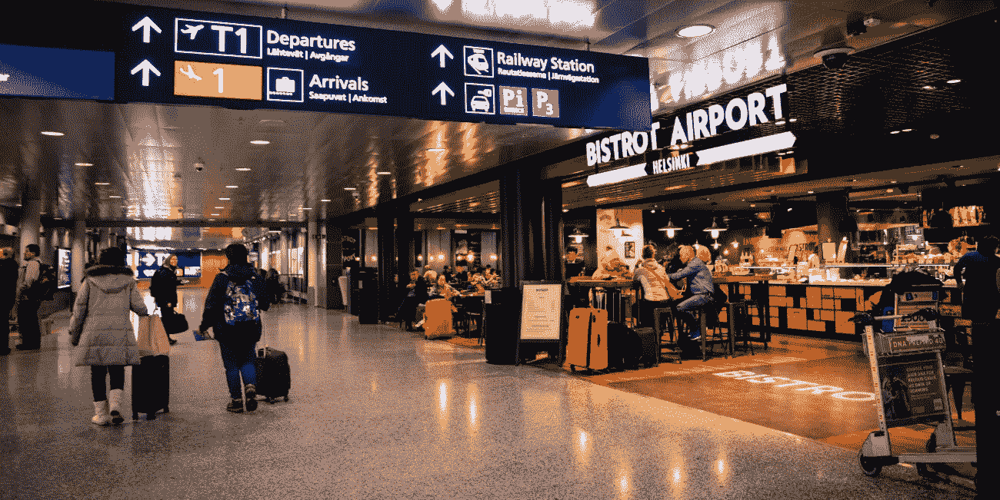

# 一个非常棒的机场 Wifi 黑客

> 原文：<https://medium.datadriveninvestor.com/a-pretty-great-airport-wifi-hack-e0dc17182e11?source=collection_archive---------33----------------------->

## 如果你旅行是为了休闲或工作，那么你可能会在机场花很多时间，但机场公共 wifi 可能相当危险..

*最初发表于*[*【millennialmoderator.com】*](https://millennialmoderator.com/a-pretty-great-airport-wifi-hack)*。*

一般来说，连接到开放的公共 wifi 不是一个好主意，尤其是在像机场这样拥挤的地方。但有时你会中途停留很长时间，而**需要**上线。但你不想耗尽手机电池的所有网络连接。(顺便说一下，[你应该尽快更换你的 iphone 电池](https://millennialmoderator.com/replace-your-iphone-battery-before-december-2018))。

更不用说，如果你在国外旅行，你可能连网络连接都没有，所以你别无选择，只能使用 wifi。事实证明，有一个完全免费的开源机场 wifi 列表，用户可以在这里分享世界各地机场各种安全网络的密码。继续阅读，了解更多信息..

很疯狂的概念，对吧？基本上，航空公司 sky 的会员，或者可以访问休息室 wifi 网络的人，已经进入并共享了这些专用网络的**登录**凭证。这有点像和别人分享你的网飞账户。最精彩的部分？这些用户正在积极地**更新**，所以你可能会成功地使用它。

这里有一个链接，您可以在这里查看无线网络。

要使用它，您只需选择左上角附近的搜索图标(放大镜),然后搜索您要去的机场。当它加载时，它会告诉你所有不同的网络，你可以连接，以及最佳做法的指示。

这里有几个更有用的生活小窍门！

这个 wifi 黑客对你有用吗？点击下面的**社交媒体**链接与您的朋友分享，或者您可以在 [Twitter](https://twitter.com/alekseyweyman) 上与我分享您的想法！

标记于:[生活小贴士](https://millennialmoderator.com/a-pretty-great-airport-wifi-hack#)

*最初发表于*[*【millennialmoderator.com】*](https://millennialmoderator.com/a-pretty-great-airport-wifi-hack)*。*