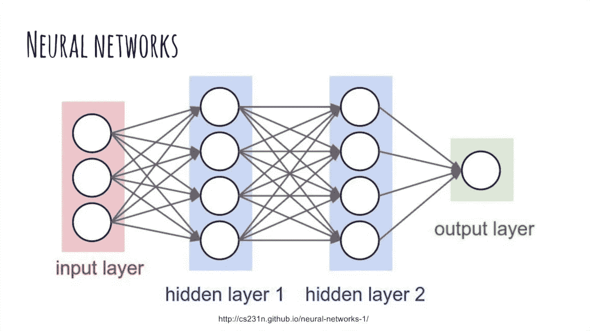
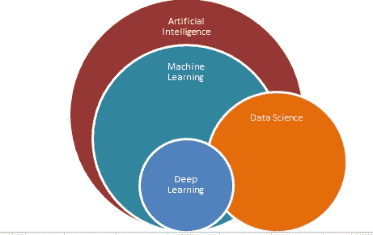
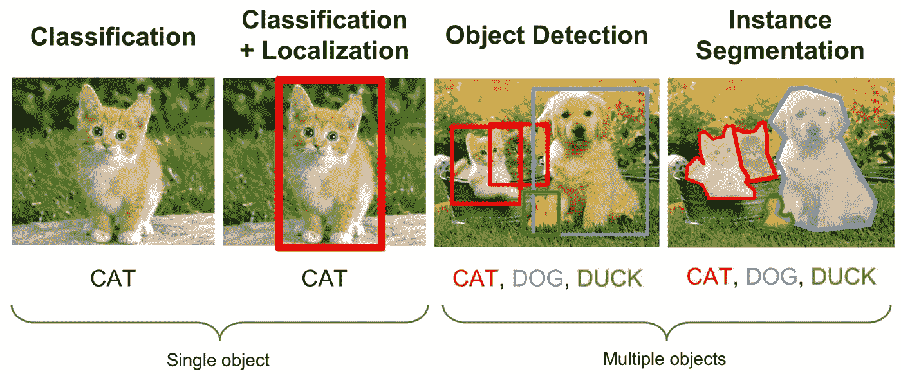
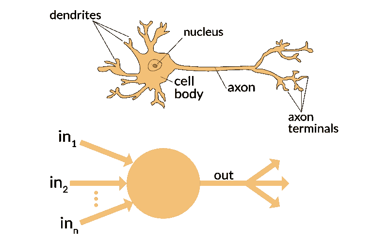
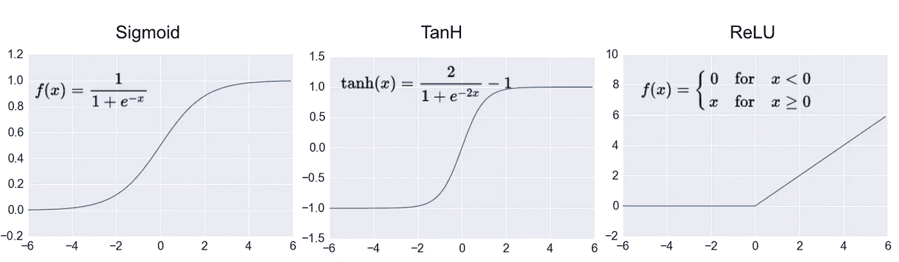
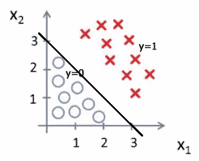
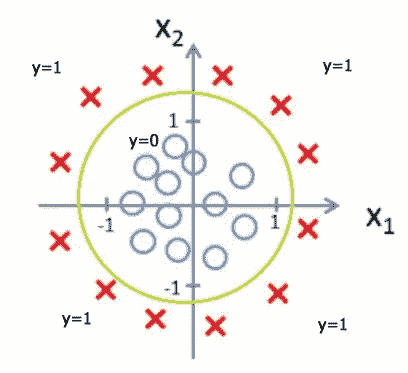
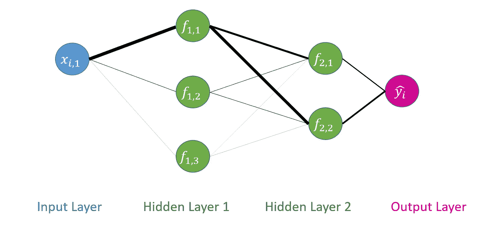
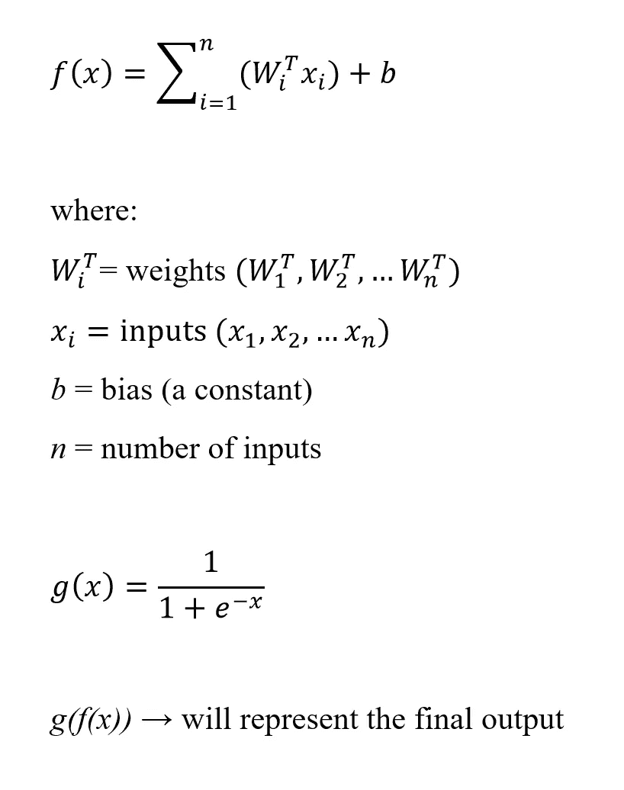

# 神经网络入门

> 原文：<https://medium.datadriveninvestor.com/a-primer-into-neural-networks-a0bc02d8513b?source=collection_archive---------3----------------------->

# 简介和背景

这是对神经网络的介绍，我试图将高级人工智能概念提炼成简单的英语和日常类比。

本指南旨在为那些对深度学习的子领域没有了解并希望获得广泛概述的人提供帮助。 ***本指南并非面面俱到！***

Source: [https://www.quora.com/What-is-difference-between-a-Data-Scientist-and-a-Machine-Learning-Engineer-Which-is-better-in-terms-of-salary-and-long-term-growth-and-why-How-are-they-correlated](https://www.quora.com/What-is-difference-between-a-Data-Scientist-and-a-Machine-Learning-Engineer-Which-is-better-in-terms-of-salary-and-long-term-growth-and-why-How-are-they-correlated)

在我们开始之前，我们需要看到人工智能(AI)的更大图景，并看看神经网络适合在哪里。神经网络属于深度学习(DL)的范畴，是机器学习(ML)的子集，也是人工智能的子集。数据科学(DS)与人工智能、ML 和 DL 的一些领域重叠。左边的图像说明了重叠。

# 我们将涵盖的内容

非技术内容

1.  为什么使用人工神经网络(ann)
2.  神经网络在深度学习中的广泛应用
3.  流行的神经网络

技术内容

1.  生物神经元，人工神经网络，感知器
2.  输入、权重、激活函数、输出
3.  权重初始化、训练和偏差
4.  简单的数学表示
5.  机器学习概念:分类、回归、超参数优化、决策边界、一键编码、整数编码

# 我们不会涵盖的内容

1.  优化、梯度下降、反向传播
2.  爆炸和消失渐变

# 为什么要使用人工神经网络？

是因为安的很酷吗？是的，安的很酷，但这不是我们使用它们的原因。我们可以使用许多不同的机器学习建模方法来代替神经网络启发的模型。请注意，在许多情况下，使用传统的机器学习模型(如逻辑回归或决策树)可能更有益，因为这些模型能够解释特征(输入)以及每个特征的重要性(或无用性)。

Source: [http://cs224d.stanford.edu/index.html](http://cs224d.stanford.edu/index.html) [https://mathematica.stackexchange.com/questions/141598/object-detection-and-localization-using-neural-network](https://mathematica.stackexchange.com/questions/141598/object-detection-and-localization-using-neural-network)

所以通常使用人工神经网络的一个原因是，它们通常比传统建模方法提供更高的性能结果，特别是在*复杂任务*中，如*图像识别*(也称为对象/图像分类)——识别猫和狗(单个对象)。这不要与*对象检测*混淆，后者的目标是找到图像中可能存在的多个对象的位置，并在其周围放置一个边界框。在被识别的对象周围放置一个边界框被称为*对象定位*。

*复杂任务*的意思是——明确表达特征的能力本身就很困难(即嵌套的 if-else 条件和逻辑)。这就是安的闪光点。人工神经网络无需创建成千上万个人类标记的特征，就能找到隐藏在*中的*特征，并自动确定哪些特征是重要的。默认情况下，神经网络会自动执行*特征工程*——一种很大程度上需要人类智能和一点行业知识的机器学习形式。在许多方面，ANN 的行为就像黑盒，所以很难解释发生的特征工程。

# 神经网络的普遍用途(2018 年)

如上所述，神经网络广泛用于图像识别任务。神经网络的其他流行用途包括:

1.  语音识别
2.  自然语言处理(NLP):情感分析、文本分类、机器翻译等。
3.  艺术/音乐一代

# 流行的神经网络

1.  卷积神经网络(ConvNet，CNN) →广泛用于图像识别任务。
2.  递归神经网络(RNN) →广泛用于序列预测。可用于预测时间序列数据中的下一个值或预测 NLP 任务中的下一个单词。缺点是不能保持输入和输出之间的长期相关性(或记忆)。在数据序列非常大的情况下，存在爆炸和消失渐变的问题。
3.  长短期记忆(LSTM) →一种 RNN，使用称为细胞状态的概念保持长期依赖性。也克服了爆炸和消失梯度。
4.  门控循环单元(GRU) →基于 LSTM 的循环网络，但训练速度更快。

# 神经元(技术内容从这里开始)

[https://appliedgo.net/perceptron/](https://appliedgo.net/perceptron/)

在我们详细讨论神经网络之前，我们需要从神经网络中最基本的单元**神经元**开始。请注意，生物神经元有一张向各个方向延伸的触须(树突)网。更重要的是，有*信息*进入神经元(in)和*信息*离开神经元(out)。我在这里用斜体显示*信息*是为了强调*信息*是一种抽象，可以表示生物信号或数字信号。感知机的灵感来自生物神经元。下面，我们将看到感知器是如何工作的。

Source: [https://cdn-images-1.medium.com/max/1600/0*v4f4-nMoRMNrtUZG.png](https://cdn-images-1.medium.com/max/1600/0*v4f4-nMoRMNrtUZG.png)

# 感知器

[http://ataspinar.com/2016/12/22/the-perceptron/](http://ataspinar.com/2016/12/22/the-perceptron/)

接下来，我们需要了解感知器。感知器建立在生物神经元的概念上。首先，**感知器**是一种以数学方式表示神经元生物网络的方法。它试图模仿神经元如何放电并与其他神经元连接。感知器的主要思想是它接收信息，它要么激发(1)，要么不激发(0)。我们很快就会明白为什么这很重要。

**输入**仅仅是传递给神经元的任何一种特征。可能是 1 也可能是 0，可能是狗也可能是猫(我们可以用 1 代表狗，用 0 代表猫)。输入可以是任何东西，然而，在许多情况下，数字是最合适的，尤其是在神经网络中。

我觉得有必要解释一下猫和狗是如何用数字来表示的，比如 0 和 1。这部分很重要，所以请注意。类别特征(如猫或狗)可以用数字表示，例如:[0，1]可以表示猫的特征，而[1，0]表示狗的特征。通过将分类特征表示成数字项，这允许神经网络执行数字计算，即向量/矩阵乘法。这样的数据转换被称为**一键式编码。*数据转换的另一种形式是将分类特征转换成整数值，如 1、2、3 等等。例如:用 1、2、3 等表示一周中的几天，即星期一、星期二、星期三。这就是所谓的*整数编码*。独热编码和整数编码之间的主要区别在于，整数编码假设每个特征之间存在某种自然关系，而独热编码则没有。在我们的狗和猫的例子中，这两个特征之间没有自然的顺序。另一方面，在一周中的日子的例子中，在一周中的每一天之间存在一些自然的排序和关系。在这种情况下，整数编码可能是表示一周中各天的更好方式。类似地，输出可以以这种方式编码。我们将在下面讨论更多的输出。*

*什么是**重量**？权重可以理解为特定的*信息*(神经元)与另一个神经元的连接强度。权重可以是任何实数:0，1，2.5，-0.0003——你明白了。有些信息，其实很多信息是没用的！我们可以简单地为输入分配相应的 0 值权重。这样，任何乘以 0 的东西都将是 0。该值离零越远，对最终加权和的影响就越大。如果一个输入很重要，那么我们可以将它的值乘以权重 1，而不是 0。同样，在感知器的情况下，权重本身将采用 0 或 1 值。*

*什么是**加权和**？加权和是所有输入乘以相应权重的总和。换句话说，输入乘以各自的权重，然后相加。这意味着每个输入都乘以基于信息重要性的*的个性化权重值。我们将在下面更详细地介绍数学。**

*什么是**激活功能**？简单地说，我们已经收集了所有有用和无用的信息，现在我们被迫做出某种决定、判断或*决定*。我们要不要带着这个信息前进？是还是不是？1 或 0。上图所示的阶跃函数是一种激活函数，它采用二进制值 0 或 1。参见下面关于决策边界的讨论，以更深入地理解激活函数。*

*有几种不同类型的激活功能。最常用的激活函数有:Sigmoid、TanH(双曲正切)和 ReLU(校正线性单位)。*

***Sigmoid 函数**:通过 Sigmoid 激活函数的信息范围可以从 0 到 1。*

***双曲正切函数**:通过双曲正切激活函数传递的信息范围为-1 到 1。*

***ReLU 函数**:通过 ReLU 激活函数传递的信息将产生 0 或 x，其中 x 是大于或等于 0 的某个值。*

**

*source: [http://adilmoujahid.com/images/activation.png](http://adilmoujahid.com/images/activation.png)*

*目前 2018 年，使用最广泛的激活函数是 ReLU。与 Sigmoid 或 TanH 相比，使用 ReLU 的一个主要优点是，ReLU 克服了渐变消失和爆炸的问题(这超出了本文的范围)。使用 ReLU 的一个缺点是死激活单元，你可以在这里阅读更多关于[的内容。由于这个关于死激活单元的讨论需要对梯度的理解，我将简单地说它*类似于*当权重乘以 0。](https://datascience.stackexchange.com/questions/5706/what-is-the-dying-relu-problem-in-neural-networks)*

*我们使用 Sigmoid、TanH 和 ReLU 函数的原因是因为它们是可微的。这将被证明是有用的，主要是因为我们想要一个函数，我们可以找到导数。这允许我们找到损失/成本(误差)函数的最小值。(这是梯度下降和优化的主题，超出了本文的范围)*

*我需要简单解释一下为什么使用 Sigmoid、TanH 和 ReLU 激活函数。激活功能的主要目的是特定于任务的。换句话说，如果手头的任务是分类，那么神经网络的整个目标就是产生一些信号，告诉我们图像是猫还是狗。为了让我们的网络决定信息在决定图像是猫还是狗时是否重要，它需要一个**决定边界**。*这是一个重要而有用的概念，因为我们需要一个函数来决定不同类别的数据可以在哪里被一条线、一个平面或一个表面分隔开。*在 Sigmoid 函数的情况下，我们可以将 0 指定为一个类别，将 1 指定为另一个类别。类似地，在 TanH 的情况下，我们可以将-1 指定为一个类别，将 1 指定为另一个类别。在任一函数中，我们都试图找到尽可能精确地分隔数据点的决策边界。*

***

Source: [https://www.coursera.org/lecture/machine-learning/decision-boundary-WuL1H](https://www.coursera.org/lecture/machine-learning/decision-boundary-WuL1H), [https://towardsdatascience.com/understanding-logistic-regression-9b02c2aec102](https://towardsdatascience.com/understanding-logistic-regression-9b02c2aec102)* 

*注意如何画一条线把蓝色的圆圈和红色的十字分开？这就是所谓的决策边界。给定足够的信息，神经网络可以以很高的准确度和成功率学习决策边界。*

# *神经网络*

**

*好吧，那么什么是**神经网络**？让我们看看上面的图片。我们看到一个输入层、一个隐藏层和一个输出层。神经网络只是神经元(输入、隐藏层、输出等)的互联网络。)向其他神经元发送信号。这种信号被表示为权重以及神经元之间的连接有多重要。如果*一层中的所有神经元都连接到下一层中的每一个神经元*，则称一个神经网络是全连接的(FC)，如上图所示。*

***隐藏层**本质上是一层神经元，帮助将信息从输入层传递到输出层。每个隐藏的神经元层都包含一个激活功能，将它与下一层联系起来。这种架构被称为*前馈网络*，因为它们在到达输出层之前会对之前的层进行反馈。*

*上图也被称为**多层感知器** (MLP)，在输入和输出层之间至少有一个单独的隐藏层。*

**

*[https://imgur.com/gallery/UXaJN](https://imgur.com/gallery/UXaJN)*

*通过类比，我们将使用城市、道路和桥梁。一个重要的大城市将有大量的道路和桥梁将它与其他城市连接起来。这些城市中的每一个都将与其他城市、桥梁等相连。有些路不可避免的会多走一些，有些会少走一些。一条路走得越多，路上的车越多，道路就会变得越宽。也就是说，重要道路的重量可能会大于较少人走过的道路的重量。只要看看左边的图片，就能知道这条路有多重要。*

*类似地，大的重量就像连接两个神经元的粗大轴突。*

**

*看到 Xi 1 和 f1,1 之间的联系有多紧密了吗？当与另外两个连接 xi，1 与 f1，2 和 f1，3 相比时，这样的厚连接将具有更高的重要性(和更大的权重)。我们可以看到，所有的输入都与两个隐藏层中的每个神经元完全连接，并最终连接到输出层。我们可以开发任意数量的隐藏层，每层都有不同的神经元。所有这些都是说*在输入和输出之间存在一些我们可以找到的神经元和层的最佳架构！*这个机器学习过程被称为**超参数调整**。通过将 MLP 中的神经元数量和层数视为参数，我们可以寻找产生最佳性能和最小化误差的最佳参数。*

*“xi”表示信息的输入。“f”表示激活功能。上面带帽子的“yi”表示我们的网络基于每个连接的神经元的权重产生的预测输出。下标“I”表示信息向量(列表)中的每个值。输入可以是以下值[汽车，红色，1997，3500 磅]，输出可以是本田思域。该输入可以是第一值 x1、第二值 x2 或第 I 值 xi。再次，汽车，红色和本田思域将编码数字。*

*我省略了每个连接之间的权重符号，因为这样做很容易变得混乱。*

# *权重初始化、更新和偏差*

*这是我提到**权重初始化**的好时机。权重初始化有点像第一印象。当我们第一次见到其他人时，我们会产生一种印象，之后每当我们获得关于其他人(以及我们周围的世界)的新信息*时，我们就会更新这种印象。当我们训练神经网络时，我们希望逐步更新我们的权重。**

*当我们遇到一个衣着光鲜的人时，我们可能会认为这个人很富有，并赋予他很高的初始权重。随着时间的推移，我们了解到更多的信息。如果新的信息与我们对个人的初步评估/判断一致，我们就在原来的方向上增加初始权重。或者，如果我们发现这个人穿得很好，但却挥霍了他们挣来的一切，我们会以相反的方向更新我们对他们的最初印象，降低我们最初赋予他们的权重。这是神经网络中神经元的行为方式。每个连接的神经元都存储着信息，随着神经网络通过训练学习到更多信息，这些信息会不断更新。这个**更新**/训练过程通常被称为*反向传播*，并且使用了*梯度下降*算法的变体。我将在下面留下一个链接，以便更深入地了解这个主题。*

*如你所见，对给定信息形成观点和结论可能会有某种形式的**偏差**。例如，如果猫或狗的图像包含更多橙色像素，神经网络可能会更倾向于狗，如果它看到更多橙色着色的狗。在现实中，猫或狗的橙色像素可能无法提供图像是猫还是狗的更多信息。该偏差也将在反向传播期间递增更新。*

*权重初始化实际上比最初解释的要复杂一些。权重初始化的类似行为更像这样。继续第一印象的例子，假设美国的每个人代表一个神经元。每个人对总统候选人都有自己的看法和观点。我们将它表示为第一个隐藏层。第二个隐藏层可以表示为众议院。第三个隐藏层可以由参议院表示，最后，输出可以在总统选举中选择最终的总统候选人。你看，如果第一层神经元是这个国家的每个人，那么每个人都不可能就他们认为谁最适合担任最高职位达成一致。此外，如果美国的每一个人都同意同一个候选人，那就太糟糕了。同样，如果众议院和参议院的每个人都属于同一个政党，那就太可怕了。这正是神经网络中权重初始化试图实现的目标——确保有足够的随机性，并且所有神经元的初始值都不相同。用数学和统计学的术语来说，我们想要可变性。但是为什么呢？还记得我们讨论过死亡激活单位吗？如果所有的神经元都是 0，那么网络中就没有要学习的信息。类似地，如果所有的神经元都是 1，也没有信息可以学习。为了充分理解它的重要性，需要讨论一下梯度下降。在梯度下降的上下文中，这种将人类作为神经网络中的神经元的类比是站不住脚的，但是我们还没有讨论长度上的梯度下降，所以这不是问题。*

*总之，权重初始化有点像第一印象，但在神经网络中，它们应该具有高度的可变性，否则网络在更新过程中不会学到任何东西。*

**

# *数学*

*回想一下，权重(Wi)乘以输入(xi)。然后，加权和被加到偏项(b)，一个常数值。注意这个函数 f(x)如何类似于 y = mx + b？很好奇不是吗。偏置项只是在一个固定的方向上调整加权和。这里的 f(x)简单地表示权重乘以输入加上一个偏置项的总和。*

*让我们把迄今为止所学的一切都用一个简单的数学表达式来表示输入、权重和偏差。*

*左边的 *f(x)* 方程通过一个激活函数(如上所述)。例如，我们可以使用 Sigmoid 函数作为 *g(x)* 并将上面的方程用代数方法连接起来作为 g(f(x))。*

# *终极游戏*

*我们为什么要训练神经网络或者更新权重呢？嗯，在很大程度上，我们希望对信息做出决定。例如，如果我们想知道图像是猫还是狗，我们的神经网络应该能够接受一些特征(输入)，并告诉我们图像是猫还是狗(**输出**)。此外，我们应该能够从数学上量化我们的神经网络模型有多精确(性能指标:精确度、均方误差等。).此外，我们希望通过学习和更新网络的权重来最小化误差(损失)，这是梯度下降的一个主题。我们的模型越精确，误差就越小，我们的神经网络模型就越好。当我们的神经网络模型从一类输出中生成一个输出时，我们称之为分类。当我们的神经网络模型在实数空间中生成输出时，我们称之为回归。回归模型的一个例子是，如果我们想要预测给定月份的单位销售额，或者预测用户订阅量。线性回归模型寻求在多维空间中找到最适合(最小化均方误差)所有数据点的直线。*

***输出**(输出层)也可以使用上面提到的激活功能。输出函数和激活函数之间的主要区别在于，输出是神经网络的最后一层，它告诉我们预测的输入信息是什么。然而，输入和输出之间的所有激活功能(隐藏层)本质上只是一个黑盒。*

*通常情况下，输出不是二进制的(0 或 1)。在有多类输出的情况下，使用 softmax 或逻辑损失(基于概率的指标)。*

*例如，以下示例演示了具有二进制输出的单类分类(一与其余):*

*橙色:**是**/否*

*苹果是/ **否***

*梨子:是/ **否***

*柠檬:是/ **否***

*仙人掌:是/ **否***

*以下示例展示了带有 **softmax** 输出的多类分类:*

*橙色:0.81*

*苹果:0.01*

*梨:0.01*

*柠檬:0.16*

*仙人掌:0.01*

*在第一个例子中，在 5 个类中，输入只能有一个类。如果输入是橙色的，它就不可能是别的。如果输入是一个苹果，它就不能是其他任何东西，依此类推。在第二个示例中，在 5 个类中，输入是橙色的概率为 81%。softmax 中的所有输出总和为 1，即 100%概率。*

# *关闭*

*所以你有它！很好地完成了这篇文章的结尾。如果你想知道如何找到权重和偏差，那么你就在正确的轨道上。这样的解释值得单独写一篇关于梯度下降的文章，我特意从这篇文章中省略了它。我在下面留下了一个更全面的梯度下降概述的链接，但我怀疑它对一些人来说太数学化了。*

*由于我目前没有打算进入梯度下降的杂草，我将结束快速概述它做了什么。梯度下降是一种混合使用编程、微积分和一些线性代数来寻找神经网络的权重和偏差的方法。用最简单的术语来说，梯度下降试图找到误差/成本函数的最小值，例如上面讨论的激活函数。这就是差异化发挥作用的地方。但问题是找到一个方程的解并不容易。梯度下降法通过迭代(使用循环函数编程)使用梯度更新权重和偏差(这是一个多变量微积分概念，因此称为梯度下降法)来近似解，从而解决了这个寻找解的挑战性问题。在每个时间步长之后，分别使用学习速率(alpha)以及权重和偏差的梯度来递增地更新权重和偏差。这是我停下来的地方，因为梯度下降确实值得自己写出来，以涵盖所有的细微差别，特别是数学。*

*最后，这篇文章介绍了许多广泛使用的概念，包括输入、权重、激活函数和入门数学，它们将为将来理解更复杂的神经网络架构奠定基础。*

# *资源*

*我在这篇博文中留下了很多空白，特别是涉及对数学的深刻理解的领域。这包括优化和梯度，需要了解多变量微积分和线性代数。*

*我意识到，不先打好基础，解释很多概念是多么困难。我只能给我的读者指出在我自己的旅程中帮助我进步的内容。如果你真的想深入人工智能的世界，我强烈建议你查看以下资源，为自己打下基础。请点击下面的链接。*

***线性代数:***

* [## 线性代数

### 这是 2200 多门开放式课程中的一门。在链接的页面中找到本课程的材料…

ocw.mit.edu](https://ocw.mit.edu/courses/mathematics/18-06-linear-algebra-spring-2010/video-lectures/)  [## 线性代数|可汗学院

### 免费学习数学、艺术、计算机编程、经济学、物理学、化学、生物学、医学、金融…

www.khanacademy.org](https://www.khanacademy.org/math/linear-algebra) 

**微积分:**

 [## 多变量微积分|可汗学院

### 免费学习数学、艺术、计算机编程、经济学、物理学、化学、生物学、医学、金融…

www.khanacademy.org](https://www.khanacademy.org/math/multivariable-calculus) 

**概率&统计:**

 [## 概率导论-不确定性的科学

### 概率模型的介绍，包括随机过程和统计推断的基本要素。

www.edx.org](https://www.edx.org/course/introduction-probability-science-mitx-6-041x-2) 

**算法&数据结构:**

 [## 算法设计和分析

### 了解计算机科学的核心原理:算法思维和计算问题解决。

www.edx.org](https://www.edx.org/course/algorithm-design-analysis-pennx-sd3x) 

**AI 最全的小抄:**

 [## 人工智能、神经网络、机器学习、深度学习和大数据的备忘单

### 最佳人工智能备忘单的最完整列表

becominghuman.ai](https://becominghuman.ai/cheat-sheets-for-ai-neural-networks-machine-learning-deep-learning-big-data-678c51b4b463) 

**机器学习&深度学习:**

 [## 在线人工智能/机器学习课程

### 应用人工智能课程试图教授学生/课程参与者一些机器学习/数据…

www.appliedaicourse.com](https://www.appliedaicourse.com/course/applied-ai-course-online/)  [## 机器学习简介|机器学习速成班|谷歌开发者

developers.google.com](https://developers.google.com/machine-learning/crash-course/ml-intro) 

**梯度下降:**

 [## 梯度下降- ML 备忘单文档

### 梯度下降是一种优化算法，用于通过沿…方向迭代移动来最小化某个函数

ml-cheatsheet.readthedocs.io](https://ml-cheatsheet.readthedocs.io/en/latest/gradient_descent.html) 

[http://ruder.io/optimizing-gradient-descent/](http://ruder.io/optimizing-gradient-descent/)

**CNN 的:**

 [## 用于视觉识别的 CS231n 卷积神经网络

### 斯坦福 CS231n 课程材料和笔记:视觉识别的卷积神经网络。

cs231n.github.io](https://cs231n.github.io/convolutional-networks/#pool) 

**rnn 和 lstm:**

 [## 递归神经网络的不合理有效性

### 一位计算机科学家的思考。

karpathy.github.io](https://karpathy.github.io/2015/05/21/rnn-effectiveness/)  [## 了解 LSTM 网络——colah 的博客

### 这些循环使得循环神经网络看起来有点神秘。然而，如果你想得更多一点，事实证明…

colah.github.io](https://colah.github.io/posts/2015-08-Understanding-LSTMs/) 

如果你学到了什么，请留下掌声，分享给其他对 AI 领域感兴趣的人。如果你有任何问题或者发现这篇博文令人困惑，请在下面留下评论。感谢阅读。

**特别感谢**Brandon Tong 对我之前的草稿提供了宝贵的反馈，并敦促我做出更深入的解释，我认为这是理所当然的。

**特别感谢**Srikanth Varma Chekuri 和 AppliedAICourse 团队帮助我学习了许多这些困难的概念。没有他们的教导和指导，我今天认识的 ML 和 DL，90%都不会认识。此外，他们要求我通过教授我所学到的东西(通过这篇博文)来更深入地挖掘。这帮助我巩固了自己对深度学习的理解。

# **杂项**

这篇博文是作为应用人工智能课程博客竞赛的一部分提交的，我获得了第二名。请参考下面的链接:*