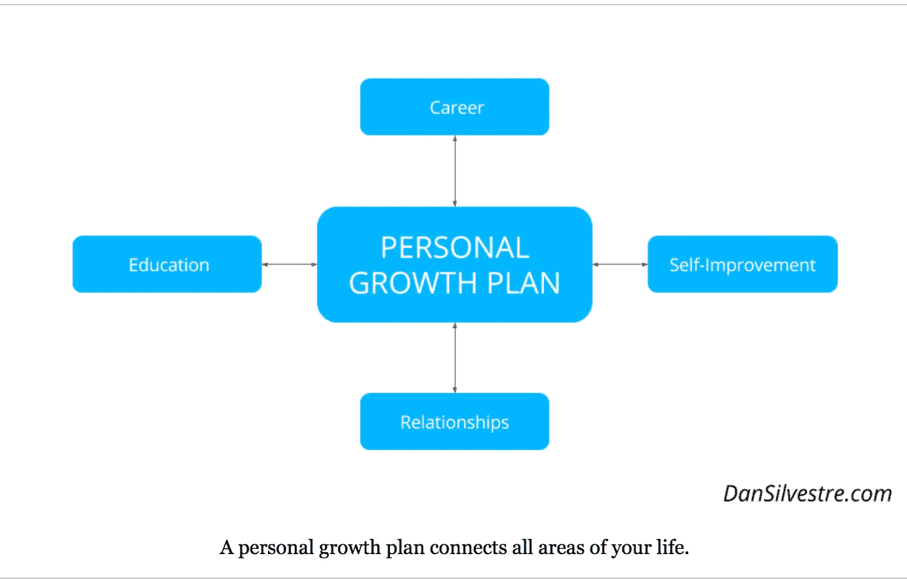

# 世界最佳个人成长计划的 6 个原则

> 原文：<https://medium.datadriveninvestor.com/a-pro-athletes-secret-personal-growth-plan-4c6ed4e7ff97?source=collection_archive---------5----------------------->

## 我是如何通过创建“世界上最好的个人成长计划”进入职业体育 1%俱乐部的

Photo by [John Arano](https://unsplash.com/@johnarano?utm_source=medium&utm_medium=referral) on [Unsplash](https://unsplash.com?utm_source=medium&utm_medium=referral)

> *“要改变一个人，必须要改变他对自己的认知。*
> 
> *如果你计划做你力所不能及的事情，你可能一辈子都不会快乐。”—马斯洛*

W 什么是世界上[最好的个人成长计划](https://blog.mindvalley.com/personal-development-plan/)它包括什么？选择阻力最大还是最小的道路？游戏规划，阅读自助书籍，琢磨细节，或者每年去托尼罗宾斯静修，这些都重要吗？

让我们来一次真正的对话，谈谈你对个人成长和自我发展计划的最佳想法，什么对你和我都有效，——*和* *是的*，我的成长计划有哪些内部秘密，这些秘密创造了足够的技能，让我能够作为一名矮小、白人、相当缓慢(而且丑陋)的控球后卫进入职业体育世界。

 [## 摔倒不是失败。数据驱动的投资者

### 你只有在放弃的时候才会失败。每个英雄都会倒下，我们活着就是为了失败者出现的时刻；上升到…

www.datadriveninvestor.com](https://www.datadriveninvestor.com/2019/01/17/falling-isnt-failing/) 

好吧，我知道，我没有留在 NBA，但 20 年的欧洲职业联赛，或 D1 大学篮球教会了我一些东西，对不对？

当我反思我所做的事情时，我看到了一些适用于任何生活情况的重要原则。如果我不沉迷于计划、细节、职业道德和“在月球上拍星星”的心态，我永远也不会登上我的第一座山峰。

## 这六种品质(或美德)必须是世界上最好的个人成长计划的一部分:

> 1.越来越多的承诺(承诺是一个我们都知道的词，但很少活在现实中)，
> 
> 2.以行动形式的日常纪律行为(不能说——要说)，
> 
> 3.精神韧性(比竞争对手更坚韧、更坚韧——完成你开始的事情)，
> 
> 4.个人责任(比如照照镜子——承认你的缺陷、弱点、糟糕的事情)，
> 
> 5.目的(为什么要爬这座山，什么山都可以爬，为什么是这座？),
> 
> 还有…

## 6.复利！

> 什么？复利？

Photo by [Annie Spratt](https://unsplash.com/@anniespratt?utm_source=medium&utm_medium=referral) on [Unsplash](https://unsplash.com?utm_source=medium&utm_medium=referral)

*是*！

就像爱因斯坦说的，它是世界第八大奇迹。如果这些原则一起付诸行动，它们会对你选择的技能、手艺、工作、关系、职业和激情产生复利。

这就是你的个人成长计划如此重要的原因:因为它在你生活中最重要的领域创造了越来越多的复合利益。

# 这些是我的自我发展计划问题:

为什么这么做？

为了什么？

还有谁会这么做？

它产生的压力是多了还是少了？

去他妈的增长计划，我对他们来说太聪明了，我听到一个声音说。

或者肯定自我，(我听到了)，但是回答这些问题很重要。但对我来说，自我发展和个人成长计划应该创造一个行动蓝图。为了成长。建造了一件杰作。建筑工人不仅仅是带着木材、钉子、锯子和锤子出现在*来制作他们的杰作。他们制定了一个计划。一份蓝图。这是他们工作的基础。*

> 个人成长计划必须为[创造一个切实的伟大愿景](https://medium.com/datadriveninvestor/are-you-losing-your-greatness-5163de3d282)； ***你想在 12 周内成为什么样的人*** 或者 3 年内，或者你在地球下 6 英尺的时候(像死了一样，哥们)想留下什么遗产。

如果做得好，个人成长计划可以增强我们所有人的内在价值、技能、心理韧性、纪律、意识、知识和信心。

> 你的个人成长计划必须与你的目标处于同一水平——因为正如詹姆斯·克莱尔所说，“我们不会上升到我们目标的水平，我们会下降到我们系统的水平。”

## 你的个人成长计划就是这个系统。

无论是成为顶级运动员、职业主教练、初创公司的首席执行官、成为“年度教师”、世界级健身教练、你认识的最健康的 40 岁老人，还是下一个[托尼·罗宾斯](https://www.tonyrobbins.com/productivity-performance/how-to-create-personal-growth-plan/)，如果你每天都专注于通过复利增加你的内在价值*——在你的手艺、爱好、梦想、健身制度、工作、[关系](https://medium.com/@Trevor_Huffman/5-ways-to-find-and-keep-relationships-thriving-with-a-growth-mindset-14c7dfc2117a)等方面。—你的个人价值会继续上升。

## 在日常生活中反复使用这些成长计划原则，是实现我们个人成长潜力的唯一途径。

Photo credit: [https://www.dansilvestre.com/personal-growth-plan/](https://www.dansilvestre.com/personal-growth-plan/)

我写下这个“世界上最好的个人成长计划”主要是因为我知道在我自己的生活中我需要更多的这种“内心反思”。听着。我不是大师。我是一名职业运动员，作为一名身材矮小、不擅长运动的白人控球后卫，进入了一家利基百分之一俱乐部。我不会走来走去，掏出智慧的金块，用镶有钻石的卫生纸擦屁股(实际上，哎哟)。

> 但我知道，毫无疑问，我的个人发展体系、我的篮球蓝图和成长计划帮助我到达了一个我不属于的地方。

我明白了，如果没有自我发展计划的规划、修改和一遍又一遍的检查，没有自我发展计划的完善和定义是不够的。如果你的技能和价值观不够好，你将永远得不到你应得的——我不是指低劣的方式——我是指一旦你足够好，你就会因为你的才能、工作技能、智慧、工艺和知识而得到认可。

不尽最大努力运用这六条原则来制定我们的个人成长计划，就是欺骗我们自己，让我们错过了唯一值得开始的旅程。

## 阅读更多[应用于生活、商业、人际关系和个人成长的运动动机](http://www.medium.com/@trevor_huffman)。

*   [世界上最好的增长计划是我热爱爱因斯坦的部分原因](https://einvestingforbeginners.com/compounding-interest/)