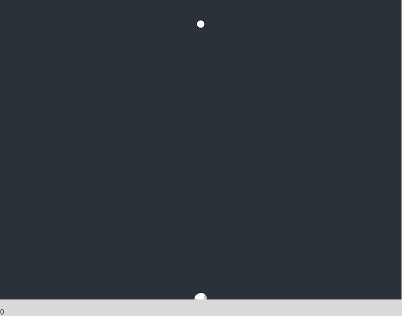
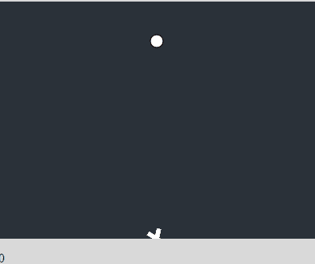
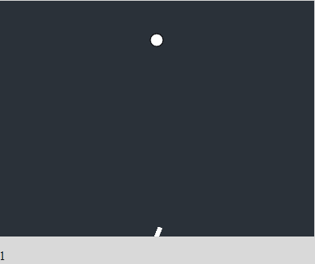
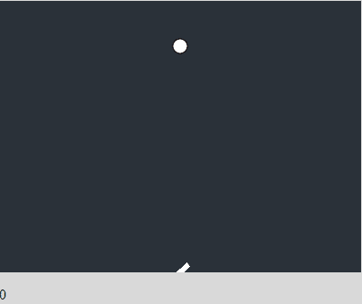

# JavaScript 中基因进化的一个简单例子:让我们生个孩子吧。

> 原文：<https://medium.datadriveninvestor.com/a-quick-example-of-genetic-evolution-in-javascript-lets-make-a-baby-5a6f20d5de84?source=collection_archive---------0----------------------->


> 突变过程是遗传变异新材料的唯一已知来源，因此也是进化的唯一来源—多勃赞斯基，1957 年。

遗传进化算法真的让我着迷。对虚拟 DNA 编程的能力是计算机科学的一个非凡成就。用代码编写达尔文进化论的能力，以及实际看到适者生存模型运行的能力是令人震惊的。

我以前从未真正接触过遗传算法，现在决定是时候开始了。还有什么比实际更好的地方开始，*开始*，对不对？在本教程中，我将创建一个'*棒'*，而那个*棒*想要到达一个'*圆'*。从这一点上推断你将会做什么，但是我写了家庭友好的教程，它将会保持这种方式。

我从*《编码列车:编码挑战#29* 中获得了难以置信的巨大影响，并以此为灵感。[链接到这里](https://www.youtube.com/watch?v=bGz7mv2vD6g)。他受到了智能火箭的启发，所以虽然我没有做出任何新的或原创的东西，但我希望它能成为遗传进化算法的一个例子。我在用 P5。JS 库，我将其概括为一个可视化的 JavaScript 库。

在我创建任何类型的遗传算法之前，我首先需要设置实际的设置。首先，我创建了一个非常简单的 HTML 页面。

我有两个 P5 的库。 *Main* 处理屏幕绘图、变量实例化等。一个*棒*是将进化的线，*群体*是棒的集合， *dna* 是我认为的遗传算法的核心。让我们来看看棍子的代码:

所以棍子有一些基本特征。它必须能够移动，所以在速度、加速度和位置变量方面，它有一个*运动“引擎”*(因为没有更好的术语)。此刻所有的运动都由神秘的 DNA 功能控制。在讨论 DNA 之前，我们先来看看人口:

人口真的没那么有趣。它创造了 25 根棍子，我相信对一个群体来说足够了，然后在屏幕上移动它们。用这个功能打破任何障碍！DNA:

在这一点上，DNA 基本上什么都不做。一根棍子得到一个 DNA，一个 DNA 有一组 200 个基因，这是我的小棍子一生的长度。不要担心，更多将在适当的时候添加。主文件:

所以 Main 在这里做了一些事情。首先，我们需要创造新一代的棍子，这是人口的一个实例，然后我们创造我们的圈子，棍子将在以后瞄准这个圈子。然后我们把一切都画到屏幕上，增加了杀死和创造新一代的能力，每次他们的生命周期结束。

因此，如果我们照现在的样子运行，我们会得到这样的结果:



The confused little sticks

现在，在这一点上，它实际上根本不是一个遗传算法。相反，它是一组以随机选择的向量移动的棍子，在屏幕上画一个点。所以我们再加上*遗传*部分。

所以我们想让离圆圈最远、最近的那根棍子，成为把基因传递给后代的棍子。这基本上是适者生存:谁生存的时间最长，谁就能把自己的基因传递下去。

因此，我们可以通过给每根棍子一个新的变量来实现这一点:适应性。

```
var fitness = 0
```

适应度将通过相对于圆圈(目标)位置的操纵杆的当前位置来计算。我们可以实现这个功能，让*计算每根棍子上的适合度*。

```
this.calculateFitness = function() {var distance = dist(this.pos.x, this.pos.y, target.x, target.y)this.fitness = 1 / distance}
```

现在，我们有了有健康等级的棍子——也就是说，它们有更好的基因，因为它们存活的时间更长。所以现在我们需要一种方法来复制那些带有顶级基因的棍子。进入，*池:*

所以，这个游泳池在概念上是相对简单的。我们在上面已经指出，最成功的基因是那些最接近圆圈的基因。棍子越近，那么它的基因组进入基因库的次数就越多，繁殖的可能性就越大。一根完成了 5%路程的棍子有 5%的机会繁殖，而一根完成了 70%路程的棍子有 70%的机会繁殖。我希望我解释得够清楚了。更成功的棍子=作为新棍子的一部分重生的机会更大。

以上是两个新功能。顾名思义，选择就是从基因库中选择亲本基因。这些基因然后在交叉中结合形成一个新的 DNA，然后再分配给新的棒！差不多就是这样，因为我们希望保持相对简单和基本的。

很酷，我们的棍子现在可以吸取前人的能力，并用它们来寻找秘社！如果我们现在来看看它的运行情况:



The still confused but slightly smarter sticks.

经过几十次迭代后，看起来它们开始消失，因为只有几行是可见的。但事实并非如此:棍子越轻，意味着多根棍子正沿着完全相同的路径前进。这是意料之中的，因为我们的基因库相对有限。



The very smart, alpha sticks.

它运行的时间越长，屏幕上只会出现一根棍子。这根棍子代表最优的棍子！*选择的棍子*。这是我们遗传算法的顶点:



Genius stick(s)!

所以这是一个遗传进化算法，完全在浏览器中编写！当然，这不是基因进化的完美例子，但这是一个很好的例子。我们的小棍子现在可以继续绕圈了，接下来会发生什么，不是今天的话题。

正如开头提到的这是受 [*编码火车*](https://www.youtube.com/watch?v=bGz7mv2vD6g) *影响很大。* [*链接到自己的回购*](https://github.com/CodingTrain/website/tree/master/CodingChallenges/CC_029_SmartRockets) *。*

[我的完整代码](https://gist.github.com/fauliath/5f509011e7327ebbc04b2c1cb4ab80e2)。